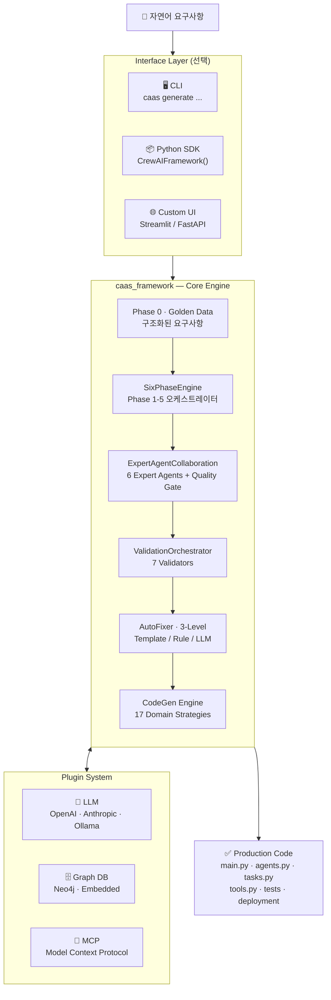
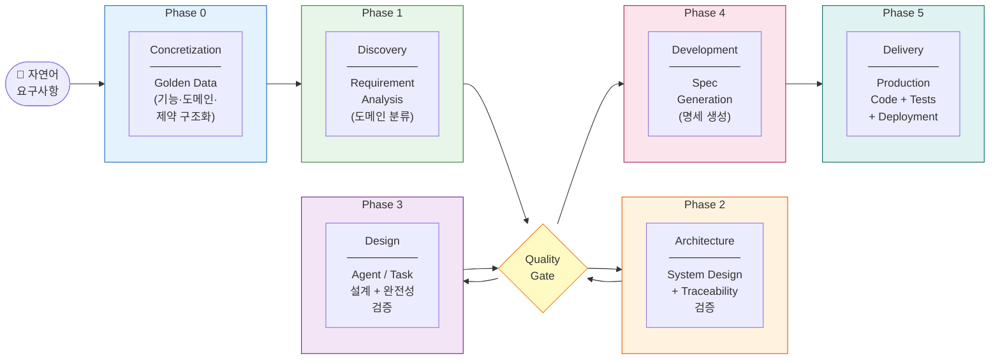
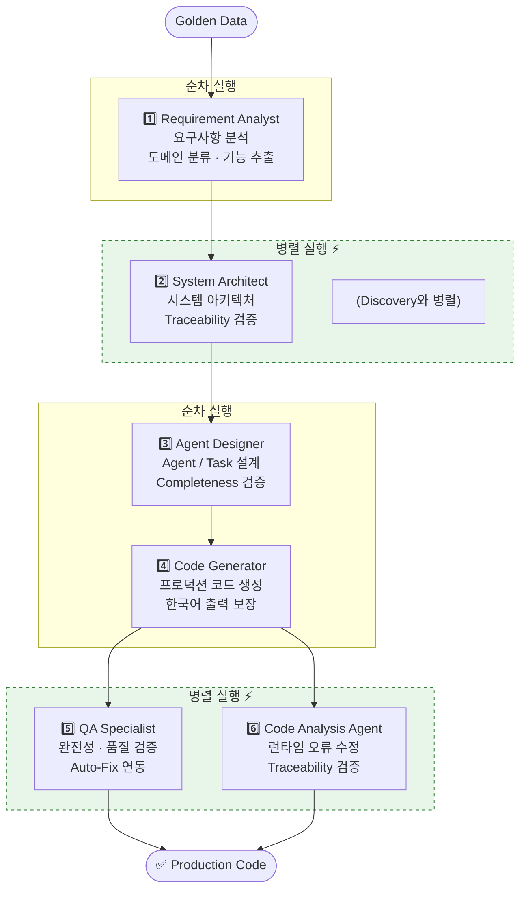
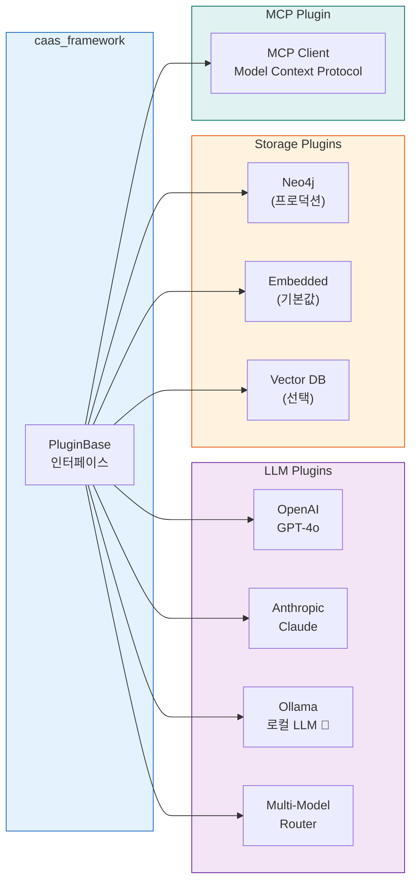
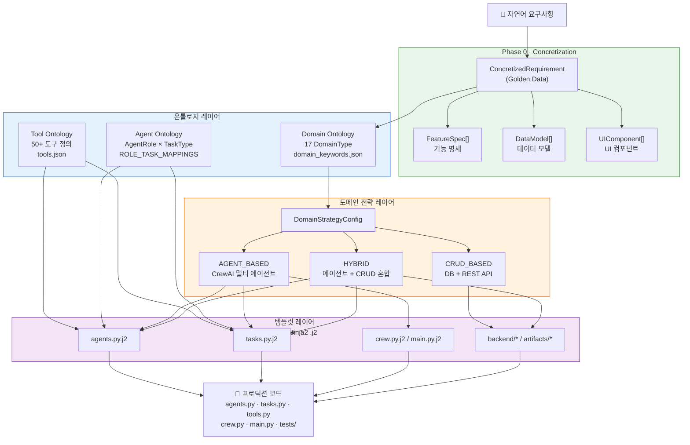
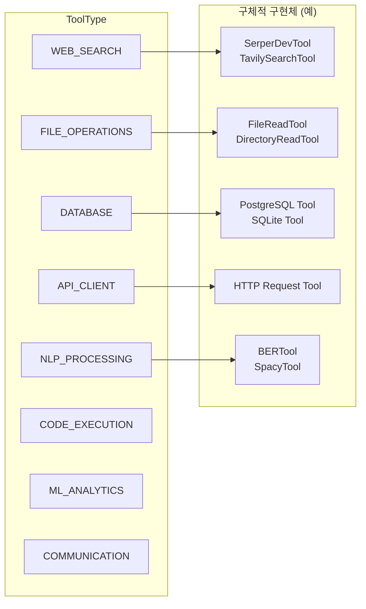
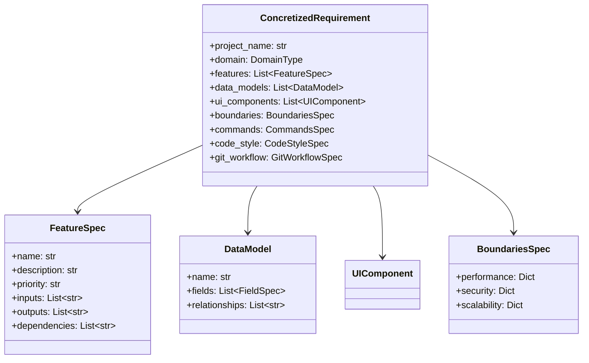

# 🤖 CAAS - CrewAI Agent Auto-generation System

**Production-Ready Multi-Agent System Generator from Natural Language Requirements**

자연어 요구사항을 입력하면 CAAS 6-Phase Methodology와 Expert Agents를 활용하여 프로덕션 레디 코드를 자동으로 생성하는 통합 패키지입니다. CLI 도구와 Python 라이브러리로 모두 사용 가능합니다.


---

## ✨ 주요 기능

### 🏗️ Framework-First Architecture
- **UI-독립적인 코어 프레임워크** (`caas_framework/`)
- **필수 CLI + 라이브러리**: CLI 도구 + Python 라이브러리로 사용 가능
- **다양한 UI 지원**: Streamlit, FastAPI, React, VSCode Extension 등
- **플러그인 기반 확장성**: LLM (OpenAI, Anthropic, Ollama 🦙), Vector DB, Graph DB
- **세션 관리**: 다중 프로젝트 동시 작업

### 🔄 CAAS 6-Phase Methodology
```
Phase 0: Concretization     → Golden Data (구조화된 요구사항)
Phase 1: Discovery          → Requirement Analysis
Phase 2: Architecture       → System Design + Traceability 검증
Phase 3: Design             → Agents & Tasks 설계 + Completeness 검증
Phase 4: Development        → Spec Generation
Phase 5: Delivery           → Production Code + Tests + Deployment
```

### 🤖 Expert Agent Collaboration
6개 전문가 에이전트가 협업하여 설계와 코드를 생성:
- **Requirement Analyst**: 요구사항 분석 및 Golden Data 생성
- **System Architect**: 시스템 아키텍처 설계
- **Agent Designer**: Agent/Task 설계 및 최적화
- **QA Engineer**: 검증 및 완전성 체크
- **Code Generator**: 프로덕션 코드 생성
- **Code Analysis Agent**: 런타임 오류 수정 및 추적성 검증 ✨ NEW in v0.4.0

### 🎨 UI 자동 생성 (Streamlit) ✨ v0.5.1 검증 완료
**Golden Data 기반 자동 감지 & 생성**:
- ✅ **자동 감지**: Golden Data에서 UI 컴포넌트 요구사항 자동 발견
- ✅ **완전한 Streamlit UI**: Input, Button, Error Handling, Success/Error 메시지 포함
- ✅ **한국어 100% 지원**: UI 문자열 (제목, 버튼, 에러 메시지) 완벽 한국어 출력
- ✅ **Frontend-Backend 통합**: 자동 검증 및 Integration 이슈 자동 수정
- ✅ **테스트 검증 (2026-02-13)**: 3,226자 app.py 생성, 품질 8.38/10.0

**사용 방법**:
```bash
# 방법 1: 자동 감지 (UI 미명시)
caas generate "할일 관리 시스템" --output ./todo
# → Golden Data 분석 → UI 요구사항 발견 → Streamlit app.py 자동 생성 ✅

# 방법 2: 명시적 활성화
caas generate "블로그 시스템" --enable-frontend --frontend-framework streamlit
# → Frontend Specialist Agent → 완전한 Streamlit UI 생성 ✅
```

### ✅ 3-Level Auto-Fixing System
- **Level 1**: Template-based (빠름, 결정론적)
- **Level 2**: Rule-based (중간, 패턴 매칭)
- **Level 3**: LLM-based (느림, 지능적) ⭐

### 🛡️ tools.py 3-Layer Defense ✨
**항상 실행 가능한 tools.py 생성 보장**:
1. **Validation**: 한국어 도구명 자동 번역 (40+ 번역 쌍)
2. **LLM Generation**: BaseTool 상속, 에러 핸들링 포함
3. **Fallback**: LLM 실패 시 stub 자동 생성

**개선 효과**: 완전성 검증 0% → 60%+ 향상

### 📝 Automatic Artifact Generation ✨
**10가지 개발 산출물 자동 생성 (한국어 지원)**:
- 프로젝트 기획서 (PROJECT_PROPOSAL)
- 요구사항 명세서 (REQUIREMENTS_SPEC)
- 아키텍처 설계서 (ARCHITECTURE_DESIGN)
- 데이터 설계서 (DATA_DESIGN)
- API 설계서 (API_DESIGN)
- 에이전트 설계서 (AGENT_DESIGN)
- 테스트 계획서 (TEST_PLAN)
- 테스트 결과 리포트 (TEST_REPORT)
- 코드 리뷰 리포트 (CODE_REVIEW)
- 배포 가이드 (DEPLOYMENT_GUIDE)

**특징**: Jinja2 템플릿 기반, Phase별 자동 생성, Markdown/HTML/PDF 지원

### 📊 Production-Ready Performance ⭐
**종합 테스트 검증 완료 (2026-02-13)**:

| 메트릭 | TODO 앱 (UI 미포함) | 블로그 시스템 (UI 포함) | 날씨 앱 (Phase별) |
|--------|---------------------|----------------------|------------------|
| **품질 점수** | 8.44/10 ⭐⭐⭐ | 8.38/10 ⭐⭐⭐ | N/A (Phase 0-1만) |
| **완료 시간** | ~3분 | 170.9초 (2.8분) | Phase 0: 23초, Phase 1: 2초 |
| **생성 파일** | 8개 Python + 7 JSON + 10 Docs | 8개 Python + 7 JSON + 10 Docs | Golden Data, Requirement Analysis |
| **Security 이슈** | 0개 ✅ | 0개 ✅ | N/A |
| **Phase 완료** | 6/6 (100%) ✅ | 6/6 (100%) ✅ | 2/6 (단계적 실행) |

**핵심 강점**:
- ✅ **UI 자동 감지 & 생성**: Golden Data에서 UI 요구사항 자동 발견, Streamlit app.py 자동 생성
- ✅ **안정적인 워크플로우**: 모든 6개 Phase 100% 완료, Exit Code 0
- ✅ **높은 코드 품질**: 평균 8.4/10 품질 점수
- ✅ **완벽한 한국어 지원**: Agent role, goal, backstory, task description 100% 한국어
- ✅ **빠른 생성 속도**: 평균 2.8분 완료 (Case 2 기준)

**검증된 핵심 기능** (2026-02-13 테스트):
- ✅ UI 자동 감지: UI 미포함 요청에도 Golden Data 분석으로 Streamlit UI 생성
- ✅ Frontend-Backend 통합: 자동 검증 및 2개 이슈 자동 수정 완료
- ✅ Hierarchical Process: 독립 태스크 100% 시 manager_llm 자동 추가
- ✅ Phase별 단계적 실행: Phase 0-1 독립 실행 및 데이터 전달 정상
- ✅ 프로덕션 품질: Security 0 이슈, 완전한 산출물 (Code + Artifacts + Docs)

**최적 사용 사례**:
- ✅ CrewAI 멀티 에이전트 협업 시스템 (TODO 관리, 블로그, 날씨 앱 등)
- ✅ 데이터 수집/처리/분석 워크플로우
- ✅ AI 기반 자동화 태스크 시스템
- ✅ Streamlit 기반 대화형 UI 애플리케이션

**주요 발견사항** (2026-02-13 테스트):
- 🎯 **UI 자동 감지의 스마트함**: 사용자 의도를 정확히 파악하여 필요한 UI 자동 생성
- ✅ **한국어 완벽성**: UI 문자열(제목, 버튼, 에러 메시지) 포함 모든 출력 한국어
- ✅ **Frontend Specialist Agent**: Streamlit UI 완전 생성 (Input, Button, Error Handling)

### 🎯 CLI Features
**33+ 명령어 제공**:

#### 🔧 Setup & Configuration (3)
- `init` - 대화형 초기 설정
- `config` - 설정 관리 (get/set/list/reset)
- `env` - 환경 변수 관리

#### 📝 Requirement Refinement (4) ✨ ENHANCED
- `analyze-gaps` - 요구사항 갭 분석
- `expand` - 요구사항 자동 확장
- `questions` - 대화형 질문 생성
- `refine` - 통합 정제 파이프라인 (run/gaps/ask/expand) ✨ NEW v0.6.4

#### 🚀 Code Generation (4)
- `generate` - 전체 워크플로우 (5-10분)
- `generate-code` - 빠른 코드 생성 (1-2분) ⚡
- `codegen` - 컴포넌트 선택 생성 (30초-1분) ⚡⚡
- `generate-phase` - Phase별 실행 (디버깅용)

#### ✅ Validation & Fixing (3)
- `validate` - 6개 검증기 (ontology, golden, dependency, python311, crewai, all)
- `fix` - 3-level 자동 수정
- `traceability` - 추적성 매트릭스 생성

#### 🔍 Code Analysis & QA (6) ✨ ENHANCED
- `analyze-completeness` - 구현 완전성 분석 (v0.4.0)
- `fix-runtime-error` - 런타임 오류 자동 수정 (v0.4.0)
- `qa compliance` - 라이선스 & 프라이버시 검사 (CAAS-E v0.6.3)
- `qa performance` - 성능 프로파일링 (메모리/CPU/부하) (CAAS-E v0.6.3)
- `qa security` - 보안 스캔 (OWASP Top 10) (CAAS-E v0.6.3)
- `qa report` - 종합 QA 리포트 (CAAS-E v0.6.3)

#### 🧪 Testing & TDD (4) ✨ ENHANCED
- `test` - 테스트 실행 (run/coverage/validate)
- `tdd generate-tests` - Golden Data에서 테스트 생성 (CAAS-E v0.6.0) ✨
- `tdd analyze-code` - 코드 품질 및 smell 분석 (CAAS-E v0.6.0) ✨
- `tdd workflow` - 완전한 RED-GREEN-REFACTOR 워크플로우 (CAAS-E v0.6.0) ✨

#### ✔️ Human Checkpoints (4) ✨ NEW (CAAS-E v0.6.2)
- `checkpoint status` - 체크포인트 상태 확인
- `checkpoint approve` - 체크포인트 승인
- `checkpoint reject` - 체크포인트 거부
- `checkpoint list` - 7개 체크포인트 목록

#### 🔌 Management (3)
- `plugins` - 플러그인 관리 (6개 서브명령)
- `session` - 세션 관리 (7개 서브명령)
- `workflow` - 워크플로우 제어 (6개 서브명령)

#### 📦 Results (3)
- `status` - 프로젝트 상태 확인
- `download` - 생성 코드 다운로드
- `list` - 프로젝트 목록 조회

---

## 🚀 빠른 시작

### 전제 조건
- Python 3.11+
- LLM Provider (택1):
  - OpenAI API 키
  - Anthropic API 키
  - Ollama 로컬 설치 🦙 (무료, 프라이버시)

### 설치

**방법 1: PyPI에서 설치 (권장)**

```bash
pip install caas
```

**방법 2: 소스에서 설치**

```bash
# 1. 저장소 클론
git clone https://github.com/bullpeng72/CAAS.git
cd caas

# 2. 가상 환경 설정
python -m venv venv
source venv/bin/activate  # Windows: venv\Scripts\activate

# 3. CLI 설치
pip install -e ".[cli]"

# 4. 초기 설정 (대화형)
caas init

# 5. 환경 변수 설정
caas env --create
# .env 파일에서 LLM Provider 설정:
# - OPENAI_API_KEY (OpenAI 사용 시)
# - ANTHROPIC_API_KEY (Anthropic 사용 시)
# - LLM_PROVIDER=ollama (Ollama 사용 시, 무료 🦙)
```

### 기본 사용법

```bash
# 1️⃣ 가장 간단한 방법 (전체 워크플로우)
caas generate "할일 관리 시스템 만들기" --output ./my-project

# 2️⃣ 도메인 지정
caas generate "블로그 플랫폼" --domain CONTENT_CREATION --output ./blog

# 3️⃣ 배포 타겟 지정
caas generate "REST API 서버" --deployment kubernetes --output ./api

# 4️⃣ 빠른 코드 생성 (설계 파일이 이미 있는 경우)
caas generate-code \
  --agents ./design/agents.json \
  --tasks ./design/tasks.json \
  --golden-data ./design/golden_data.json \
  --output ./production

# 5️⃣ 컴포넌트만 재생성
caas codegen --component tests \
  --agents ./design/agents.json \
  --tasks ./design/tasks.json

# 6️⃣ 검증 & 자동 수정
caas validate --validator all \
  --agents ./design/agents.json \
  --tasks ./design/tasks.json \
  --golden-data ./design/golden_data.json

caas fix \
  --agents ./design/agents.json \
  --tasks ./design/tasks.json \
  --golden-data ./design/golden_data.json \
  --level 3

# 7️⃣ 코드 분석 & 품질 보증 ✨ NEW in v0.4.0
# 구현 완전성 분석 (Golden Data vs 실제 코드)
caas analyze-completeness \
  --project ./my-project \
  --golden-data ./design/golden_data.json \
  --detailed \
  --output analysis_report.json

# 런타임 오류 자동 수정
caas fix-runtime-error \
  --project ./my-project \
  --error-log error.log \
  --apply \
  --backup

# 8️⃣ 프로젝트 관리
caas list                    # 프로젝트 목록
caas status <project-id>     # 상태 확인
caas download <project-id> ./output  # 다운로드
```

### 라이브러리 사용법

CAAS를 Python 라이브러리로 사용하여 커스텀 UI를 개발할 수 있습니다.

#### 📝 Python 스크립트

```python
from caas_framework.framework import CrewAIFramework
import asyncio

async def main():
    framework = CrewAIFramework()
    await framework.initialize()

    result = await framework.generate_from_requirement(
        requirement="할일 관리 시스템 만들기",
        domain="TASK_MANAGEMENT",
        output_dir="./generated"
    )

    print(f"✅ {len(result.files)}개 파일 생성")
    print(f"📊 완전성: {result.completeness_score}/100")

asyncio.run(main())
```

#### 🌐 Streamlit 앱

```python
import streamlit as st
from caas_framework.framework import CrewAIFramework
import asyncio

st.title("🤖 CAAS Agent Generator")

requirement = st.text_area("요구사항 입력:", height=150)
domain = st.selectbox("도메인 선택:",
    ["CONVERSATIONAL_AI", "DATA_ANALYSIS", "TASK_MANAGEMENT"])

if st.button("생성"):
    with st.spinner("생성 중..."):
        framework = CrewAIFramework()
        await framework.initialize()

        result = await framework.generate_from_requirement(
            requirement=requirement,
            domain=domain
        )

        st.success(f"✅ {len(result.files)}개 파일 생성!")
        st.json(result.model_dump())
```

#### ⚡ FastAPI 백엔드

```python
from fastapi import FastAPI, BackgroundTasks
from caas_framework.framework import CrewAIFramework
from pydantic import BaseModel

app = FastAPI()
framework = CrewAIFramework()

class GenerateRequest(BaseModel):
    requirement: str
    domain: str = "CONVERSATIONAL_AI"

@app.post("/api/generate")
async def generate_code(req: GenerateRequest):
    await framework.initialize()

    result = await framework.generate_from_requirement(
        requirement=req.requirement,
        domain=req.domain
    )

    return {
        "success": result.success,
        "files": len(result.files),
        "completeness_score": result.completeness_score,
        "output_dir": str(result.output_dir)
    }
```

#### ⚛️ React + Flask 백엔드

```python
from flask import Flask, request, jsonify
from flask_cors import CORS
from caas_framework.framework import CrewAIFramework
import asyncio

app = Flask(__name__)
CORS(app)

@app.route("/api/generate", methods=["POST"])
def generate():
    data = request.json

    loop = asyncio.new_event_loop()
    asyncio.set_event_loop(loop)

    framework = CrewAIFramework()
    result = loop.run_until_complete(
        framework.generate_from_requirement(
            requirement=data["requirement"],
            domain=data.get("domain", "CONVERSATIONAL_AI")
        )
    )

    return jsonify({
        "success": result.success,
        "files": result.files,
        "output_dir": str(result.output_dir)
    })
```

---

## 📁 프로젝트 구조

```
caas/
├── 📁 caas_framework/               # 코어 프레임워크 (UI-독립적)
│   ├── agents/                      # Expert agents (6개)
│   │   ├── utils.py                 # Agent 유틸리티 (NEW in v0.4.1) ⭐
│   │   ├── code_gen_helpers.py      # 코드 생성 헬퍼 (NEW in v0.4.1) ⭐
│   │   ├── collaboration.py         # 에이전트 협업 (ENHANCED)
│   │   └── ...                      # 6개 전문가 에이전트
│   ├── exceptions.py                # 커스텀 예외 계층 (NEW in v0.4.1) ⭐
│   ├── methodology/                 # CAAS 6-Phase Methodology engine (v0.3.0+)
│   ├── codegen/                     # Code generation (도메인 전략 포함)
│   ├── config/                      # Configuration management
│   ├── fixing/                      # 3-level auto-fixing
│   ├── knowledge/                   # Ontology & Knowledge Graph
│   ├── models/                      # Pydantic models
│   ├── plugins/                     # Plugin system (LLM, Vector DB, Graph DB)
│   │   ├── llm/
│   │   │   ├── utils.py             # LLM 유틸리티 (NEW in v0.4.1) ⭐
│   │   │   ├── base.py              # Enhanced base class (v0.4.1)
│   │   │   └── ...                  # Provider plugins
│   │   └── ...
│   ├── quality/                     # Quality assurance
│   │   ├── metrics_collector.py     # Auto metrics (v0.4.0)
│   │   └── quality_gates.py         # Quality gates (FIXED in v0.4.1)
│   ├── refinement/                  # Requirement refinement
│   ├── reporting/                   # Progress reporting
│   ├── session/                     # Session management
│   ├── templates/                   # Code templates
│   ├── testing/                     # Test generation & execution
│   ├── utils/                       # Utilities
│   │   └── logger.py                # Structured logging (FULLY UTILIZED v0.4.1)
│   ├── validation/                  # Validation system (6 validators)
│   │   └── llm_judge.py             # LLM Judge (ENHANCED)
│   └── workflow/                    # Workflow orchestration
│
├── 📁 caas_cli/                     # CLI Tool
│   ├── cli.py                       # Main entry point (22 commands)
│   ├── config.py                    # CLI config management
│   ├── utils.py                     # CLI utilities
│   └── commands/                    # CLI command implementations
│       ├── generate.py              # Full workflow generation
│       ├── generate_code_cmd.py     # Fast code generation
│       ├── codegen_cmd.py           # Component generation
│       ├── generate_phase.py        # Phase-by-phase execution
│       ├── validate_cmd.py          # Validation
│       ├── fix_cmd.py               # Auto-fixing
│       ├── test_cmd.py              # Testing
│       ├── session_cmd.py           # Session management
│       ├── workflow_cmd.py          # Workflow control
│       ├── plugins_cmd.py           # Plugin management
│       ├── analyze_gaps.py          # Gap analysis
│       ├── expand_requirement.py    # Requirement expansion
│       ├── interactive_questions.py # Interactive Q&A
│       ├── traceability.py          # Traceability matrix
│       ├── init.py                  # Initialization
│       ├── config.py                # Config commands
│       ├── env.py                   # Environment management
│       ├── analyze_completeness.py  # Implementation completeness analysis (v0.4.0)
│       ├── fix_runtime_error.py     # Runtime error auto-fix (v0.4.0)
│       ├── status.py                # Status check
│       ├── download.py              # Download
│       └── list_projects.py         # List projects
│
├── 📁 caas_sdk/                     # Python SDK (선택적)
│   ├── client.py                    # Sync & Async clients
│   ├── local_client.py              # Local execution client
│   ├── models.py                    # SDK models
│   └── exceptions.py                # SDK exceptions
│
├── 📁 data/                         # Data files
│   ├── templates/                   # Code templates (Jinja2)
│   └── golden_examples/             # Golden data examples
│
├── 📁 docs/                         # Documentation (29개) ✨ 2026-02-14 완성
│   ├── 1_시작하기/                  # 6개 문서 (입문, 3,092 라인)
│   │   ├── 01_CAAS_소개_및_설치.md
│   │   ├── 02_5분_빠른_시작.md
│   │   ├── 03_주요_개념_이해.md
│   │   ├── 04_첫_프로젝트_생성.md
│   │   ├── 05_생성_코드_이해.md
│   │   └── 06_다음_단계.md
│   ├── 2_개발_실무_가이드/          # 8개 문서 (개발자, 6,609 라인)
│   │   ├── 10_CAAS_6Phase_개발_프로세스.md
│   │   ├── 11_Phase별_요구사항_작성법.md
│   │   ├── 12_Golden_Data_활용법.md
│   │   ├── 13_Agent_Task_설계_가이드.md
│   │   ├── 14_도구(Tools)_개발_가이드.md
│   │   ├── 15_코드_품질_가이드.md
│   │   ├── 20_CLI_명령어_레퍼런스.md
│   │   └── 22_트러블슈팅_가이드.md
│   ├── 3_프로젝트_관리_PM/          # 3개 문서 (PM, 1,710 라인)
│   │   ├── 30_프로젝트_생성_워크플로우.md
│   │   ├── 31_Phase별_산출물_관리.md
│   │   └── 32_품질_검수_체크리스트.md
│   ├── 4_도메인별_실습/             # 4개 문서 (실습, 2,452 라인)
│   │   ├── 40_할일관리_실습.md (1,016 lines) ⭐
│   │   ├── 41_챗봇_실습.md
│   │   ├── 42_데이터분석_실습.md
│   │   └── 43_API통합_실습.md
│   ├── 5_엔터프라이즈_기능/         # 4개 문서 (엔터프라이즈, 2,312 라인)
│   │   ├── 50_TDD_자동화_가이드.md
│   │   ├── 51_QA_자동화_가이드.md
│   │   ├── 52_Checkpoint_활용법.md
│   │   └── 53_성능_최적화_가이드.md
│   └── 6_부록/                      # 4개 문서 (레퍼런스)
│       ├── 60_프레임워크_데이터구조.md  # 도메인 레퍼런스 + 온톨로지·템플릿 통합
│       ├── 61_API_레퍼런스.md
│       ├── 62_용어집.md
│       └── 63_FAQ.md
│
├── 📁 examples/                     # Examples
├── 📁 scripts/                      # Utility scripts
│   ├── fix_quick_wins.py            # Quick wins fixer (NEW in v0.4.1) ⭐
│   ├── validate_api_keys.py         # API keys validator (NEW in v0.4.1) ⭐
│   ├── validate_ollama_compatibility.py  # Ollama compatibility checker (NEW in v0.4.1) ⭐
│   └── validate_env.py              # Environment validator
│
├── 📁 tests/                        # Test suite (620+ tests)
│   ├── test_exceptions.py           # Exception tests (v0.4.1, 35 tests) ⭐
│   ├── test_llm_plugin_refactoring.py  # Plugin tests (v0.4.1, 25 tests) ⭐
│   ├── test_qa/                     # QA system tests (CAAS-E v0.6.3, 36 tests)
│   │   ├── test_compliance.py       # Compliance tests (10 tests)
│   │   ├── test_performance.py      # Performance tests (10 tests)
│   │   └── test_security.py         # Security tests (16 tests)
│   ├── test_iteration/              # Iteration tests (CAAS-E v0.6.3, 12 tests)
│   │   └── test_controller.py       # 3-level iteration tests
│   ├── test_checkpoint/             # Checkpoint tests (CAAS-E v0.6.2, 28 tests)
│   │   └── test_manager.py
│   ├── test_week3_tdd_integration.py  # TDD integration tests (CAAS-E v0.6.0, 4 tests)
│   └── ...                          # Other test files
│
├── README.md                        # This file
├── CLAUDE.md                        # Project context for Claude Code
├── requirements.txt                 # Dependencies
├── pyproject.toml                   # Project metadata
└── setup.py                         # Setup script
```

---

## 🏛️ 아키텍처

### 전체 시스템 구조

자연어 요구사항을 입력받아 프로덕션 코드를 생성하는 3-Layer 구조입니다.



---

### CAAS 6-Phase Methodology

각 Phase는 이전 Phase의 산출물을 입력으로 받으며, Phase 경계마다 Quality Gate가 통과 여부를 검증합니다.



---

### 6 Expert Agents 협업 흐름

Discovery+Architecture, QA+CodeAnalysis 구간은 병렬 실행으로 전체 시간을 30% 단축합니다.



---

### Plugin 아키텍처



---

## 🧠 온톨로지 & 데이터 구조

### 온톨로지란?

**온톨로지(Ontology)** 는 특정 도메인의 개념과 그 관계를 형식적으로 정의한 지식 체계입니다. 단순한 데이터 목록이 아니라, **개념 간의 의미적 관계**를 기술해 시스템이 "이해"할 수 있도록 만듭니다.

예를 들어, 일반 데이터는 _"SerperDevTool이라는 도구가 있다"_ 는 사실만 저장합니다. 온톨로지는 여기서 더 나아가 다음을 정의합니다:

- SerperDevTool은 **WEB_SEARCH 유형**의 도구다
- WEB_SEARCH 도구는 **RESEARCHER·CONTENT_WRITER 역할**에 적합하다
- RESEARCHER 역할은 **DATA_COLLECTION·ANALYSIS 작업**을 수행한다
- DATA_COLLECTION 작업은 **DATA_ANALYSIS 도메인**에서 주로 필요하다

이 연결망 덕분에 CAAS는 `"데이터 분석 시스템 만들어줘"` 라는 문장 하나에서 **어떤 도구가 필요한지, 어떤 에이전트를 만들어야 하는지, 어떤 코드 구조를 선택해야 하는지**를 스스로 결정할 수 있습니다.

### CAAS에서 온톨로지가 적용되는 방식

CAAS의 온톨로지는 코드 생성 파이프라인의 세 지점에 작동합니다.

```
자연어 요구사항: "뉴스 기사를 수집해 분석 리포트를 생성하는 시스템"
        │
        ▼ [1] 도메인 온톨로지 적용
    키워드 매칭: "수집" → DATA_COLLECTION, "분석" → ANALYSIS, "리포트" → REPORT_GENERATION
    도메인 결정: REPORT_GENERATION → 전략: AGENT_BASED
        │
        ▼ [2] 에이전트 역할 온톨로지 적용
    필요 TaskType: DATA_COLLECTION + ANALYSIS + REPORTING
    역할 추론: RESEARCHER(수집) + DATA_ANALYST(분석) + CONTENT_WRITER(리포트 작성)
        │
        ▼ [3] 도구 온톨로지 적용
    역할별 도구 추천:
      RESEARCHER      → WEB_SEARCH   → SerperDevTool
      DATA_ANALYST    → ML_ANALYTICS → PandasTool
      CONTENT_WRITER  → FILE         → FileWriteTool
        │
        ▼ OntologyValidator 검증 (7개 Validator 중 1개)
    "RESEARCHER에게 DATABASE 도구는 부적합" → 경고 또는 자동 수정
        │
        ▼ 템플릿 렌더링
    agents.py.j2  →  3개 Agent 클래스 (역할·목표·배경·도구 포함)
    tasks.py.j2   →  3개 Task 정의 (설명·기대출력·담당 에이전트)
```

**핵심**: 사용자가 `--domain`을 지정하지 않아도 온톨로지가 요구사항을 분석해 자동으로 최적 구조를 결정합니다.

### 데이터 흐름 전체 구조



### 1. 도메인 온톨로지 (17개 도메인)

**역할**: 자연어에서 도메인을 자동 분류 → 코드 생성 전략(AGENT_BASED / CRUD_BASED / HYBRID) 결정

`data/ontology/domain_keywords.json`의 226개 키워드를 요구사항과 매칭해 도메인을 결정합니다. 도메인이 결정되면 `DomainStrategyConfig`가 활성화되어 생성할 파일 목록, 에이전트 수 범위, CRUD 레이어 포함 여부 등 전체 코드 구조를 결정합니다.

CAAS는 자연어 요구사항에서 키워드를 분석해 도메인을 자동 분류하고, 도메인에 맞는 코드 생성 전략을 선택합니다.

| 카테고리 | 도메인 | 전략 | 설명 |
|---------|--------|------|------|
| 대화 & 커뮤니케이션 | CONVERSATIONAL_AI | AGENT_BASED | 대화형 AI (98.7%) |
| | CUSTOMER_SUPPORT | AGENT_BASED | 고객 지원 시스템 |
| 작업 & 워크플로우 | TASK_MANAGEMENT | CRUD_BASED | 할일/작업 관리 |
| | WORKFLOW_AUTOMATION | HYBRID | 업무 자동화 |
| 데이터 & 분석 | DATA_ANALYSIS | AGENT_BASED | 데이터 분석 (98.3%) |
| | REPORT_GENERATION | AGENT_BASED | 리포트 생성 |
| | DASHBOARD | HYBRID | 대시보드 |
| 콘텐츠 & 문서 | CONTENT_CREATION | AGENT_BASED | 콘텐츠 생성 (98.7%) |
| | DOCUMENT_PROCESSING | AGENT_BASED | 문서 처리 |
| | KNOWLEDGE_BASE | HYBRID | 지식베이스 |
| 통합 & API | API_INTEGRATION | CRUD_BASED | API 통합 |
| | WEBHOOK_HANDLER | CRUD_BASED | Webhook 처리 |
| 도메인 특화 (5개) | E_COMMERCE, EDUCATION,<br/>HEALTHCARE, FINANCE, CUSTOM | HYBRID | 도메인별 최적화 |

**도메인 키워드 예시** (`data/ontology/domain_keywords.json`, 226개):
- `DATA_ANALYSIS`: `분석`, `통계`, `시각화`, `차트`, `인사이트`, `ETL`, `ML` …
- `CONTENT_CREATION`: `블로그`, `기사`, `SEO`, `포스팅`, `콘텐츠 캘린더` …

### 2. 도구 온톨로지 (50+ 도구)

**역할**: 에이전트 역할에 맞는 도구를 추천 → `tools.py` 자동 생성 → `OntologyValidator`로 적합성 검증

`data/ontology/tools.json`의 각 도구는 추상적 **ConceptualTool**(개념)과 실제 **ToolImplementation**(구현체)을 분리해 정의합니다. 예를 들어 "웹 검색" 개념에는 SerperDevTool, TavilySearchTool 등 여러 구현체가 매핑되어 있어, 설치된 패키지에 따라 자동으로 최적 구현체를 선택합니다.

`data/ontology/tools.json`에 정의된 개념적 도구(ConceptualTool)를 에이전트에 자동 할당합니다.



`OntologyValidator`는 에이전트에 할당된 도구가 해당 역할에 적합한지 자동으로 검증합니다.

### 3. 에이전트 역할 온톨로지

**역할**: FeatureSpec에서 필요한 TaskType을 추출 → AgentRole을 결정 → `agents.py.j2` 렌더링 시 역할·목표·배경 자동 작성

`ROLE_TASK_MAPPINGS`는 각 역할이 수행 가능한 작업 유형을 정의합니다. 이 제약 덕분에 예를 들어 _보안 전문가_ 역할에 _콘텐츠 생성_ 작업이 잘못 배정되는 경우를 `OntologyValidator`가 자동으로 탐지하고 수정합니다.

**AgentRole** (12개 역할) × **TaskType** (8개 작업 유형) 매트릭스로 최적의 에이전트-작업 조합을 정의합니다.

| AgentRole | 허용 TaskType | 주요 도구 |
|-----------|-------------|---------|
| DATA_ANALYST | ANALYSIS, REPORTING | DATABASE, ML_ANALYTICS, FILE |
| CONTENT_WRITER | CONTENT_CREATION, RESEARCH | WEB_SEARCH, FILE, NLP |
| API_INTEGRATOR | DATA_COLLECTION, INTEGRATION | API_CLIENT, DATABASE |
| TASK_COORDINATOR | COORDINATION, MONITORING | COMMUNICATION, FILE |
| SECURITY_SPECIALIST | VALIDATION, MONITORING | CODE_EXECUTION, API_CLIENT |
| … | … | … |

### 4. Golden Data (ConcretizedRequirement)

**역할**: 온톨로지 3종이 교차하는 중심 데이터 구조 — Phase 0에서 한 번 생성되면 Phase 1-5 모든 에이전트가 읽기 전용으로 참조합니다.

온톨로지가 "무엇이 가능한가"를 정의한다면, Golden Data는 "이 요구사항에서 실제로 무엇이 필요한가"를 구체화한 결과입니다. `domain` 필드가 도메인 온톨로지와 연결되고, `features[].tools_needed`가 도구 온톨로지와 연결되며, `features[].agent_roles`가 에이전트 역할 온톨로지와 연결됩니다.

Phase 0에서 생성되는 핵심 데이터 구조로, 이후 모든 Phase가 이를 기반으로 동작합니다.



### 5. 템플릿 시스템 (26개 Jinja2 템플릿)

`data/templates/`의 `.j2` 템플릿이 Golden Data + 도메인 전략을 입력받아 프로덕션 코드를 렌더링합니다.

| 템플릿 | 입력 변수 | 출력 |
|--------|---------|------|
| `agents.py.j2` | agents[], llm_config, tools | CrewAI Agent 클래스 |
| `tasks.py.j2` | tasks[], agent_refs, context | CrewAI Task 정의 |
| `crew.py.j2` | crew_config, process_type | Crew 조합 + 실행 로직 |
| `main.py.j2` | project_name, env_vars | CLI 진입점 + Rich UI |
| `backend/models.j2` | data_models[] | Pydantic/SQLAlchemy 모델 |
| `backend/api.j2` | endpoints[], models | FastAPI 라우터 |
| `artifacts/test_plan.j2` | features[], acceptance | 테스트 계획서 |

> 📖 상세 데이터 구조 문서: [`docs/6_부록/60_프레임워크_데이터구조.md`](docs/6_부록/60_프레임워크_데이터구조.md)

---

## 💡 사용 예시

### 예시 1: 전체 워크플로우 (요구사항 → 코드)

```bash
caas generate "금융 뉴스를 수집하고 분석하여 투자 리포트를 생성하는 시스템" \
  --domain CONTENT_CREATION \
  --output ./financial-news-system
```

**자동 생성 결과**:
- ✅ Golden Data: 32개 기능 추출
- ✅ Agents: 3개 (News Collector, Financial Analyst, Report Writer)
- ✅ Tasks: 3개 (collect_news → analyze_news → write_report)
- ✅ Production Code: 22개 파일
  - `main.py`, `agents.py`, `tasks.py`, `crew.py`, `tools.py`
  - Tests (pytest)
  - Deployment (Docker, Kubernetes)
  - Documentation
- ✅ 실행 시간: 약 5-8분

### 예시 2: 데이터 분석 파이프라인 ⭐ 추천

```bash
caas generate "CSV 데이터를 읽고 통계 분석을 수행하여 시각화하는 시스템" \
  --domain DATA_ANALYSIS \
  --output ./data-analyzer
```

**자동 생성 결과**:
- ✅ 도메인 분류: DATA_ANALYSIS (신뢰도 98%)
- ✅ 전략: HYBRID (Agent + Data Processing)
- ✅ **구현률: 98.3%** ⭐⭐⭐
- ✅ **품질 점수: 8.4/10**
- ✅ 생성된 에이전트:
  - CSV 데이터 수집 에이전트 (데이터 로드 및 검증)
  - 통계 분석 에이전트 (평균/중앙값/표준편차/시각화)
- ✅ 생성 코드:
  - `main.py` - 실행 진입점
  - `agents.py` - CrewAI 에이전트 정의
  - `tasks.py` - 데이터 처리 태스크
  - `crew.py` - 에이전트 협업 설정
  - `tools.py` - 데이터 분석 도구
  - `requirements.txt`
  - Tests (pytest)

**실행**:
```bash
cd data-analyzer
pip install -r requirements.txt
python main.py
```

### 예시 3: 요구사항 정제 워크플로우

```bash
# 1단계: 초기 설계 생성
caas generate "전자상거래 플랫폼" --output ./ecommerce-design

# 2단계: 갭 분석
caas analyze-gaps "전자상거래 플랫폼" \
  --golden-data ./ecommerce-design/golden_data.json \
  --output gaps.json

# 3단계: 대화형 질문으로 요구사항 명확화
caas questions --gaps gaps.json --domain E_COMMERCE

# 4단계: 요구사항 자동 확장
caas expand "전자상거래 플랫폼" \
  --golden-data ./ecommerce-design/golden_data.json \
  --gaps gaps.json \
  --output expanded_golden.json

# 5단계: 확장된 요구사항으로 재생성
caas generate "전자상거래 플랫폼" \
  --golden-data expanded_golden.json \
  --output ./ecommerce-final
```

### 예시 4: 검증 & 수정 워크플로우

```bash
# 1단계: 설계 생성
caas generate "Build chatbot" --output ./chatbot-design

# 2단계: 모든 검증기 실행
caas validate --validator all \
  --agents ./chatbot-design/agents.json \
  --tasks ./chatbot-design/tasks.json \
  --golden-data ./chatbot-design/golden_data.json

# 3단계: 자동 수정 (Level 3: LLM-based)
caas fix \
  --agents ./chatbot-design/agents.json \
  --tasks ./chatbot-design/tasks.json \
  --golden-data ./chatbot-design/golden_data.json \
  --level 3 \
  --output ./chatbot-fixed

# 4단계: 수정된 설계로 코드 생성
caas generate-code \
  --agents ./chatbot-fixed/fixed_agents.json \
  --tasks ./chatbot-fixed/fixed_tasks.json \
  --golden-data ./chatbot-design/golden_data.json \
  --output ./chatbot-production
```

---

## 🎯 지원 도메인 (17개)

**17개 도메인이 완전히 구현되어 agent/tool 자동 선택에 영향을 줍니다.**

### 대화 & 커뮤니케이션 (2개)
| 도메인 | 특징 | 생성 코드 |
|--------|------|----------|
| **CONVERSATIONAL_AI** | 대화형 AI 시스템 | CrewAI Agents + Chat UI |
| **CUSTOMER_SUPPORT** | 고객 지원 자동화 | CrewAI Agents + Support UI |

### 작업 & 워크플로우 관리 (2개)
| 도메인 | 특징 | 생성 코드 |
|--------|------|----------|
| **TASK_MANAGEMENT** | 할일, 작업 관리 | FastAPI + SQLAlchemy |
| **WORKFLOW_AUTOMATION** | 워크플로우 자동화 | CrewAI + FastAPI + Database |

### 데이터 & 분석 (3개)
| 도메인 | 특징 | 생성 코드 |
|--------|------|----------|
| **DATA_ANALYSIS** | 데이터 수집/분석 | CrewAI + FastAPI + Database |
| **REPORT_GENERATION** | 리포트 자동 생성 | CrewAI Agents + Report UI |
| **DASHBOARD** | 대시보드 및 모니터링 | FastAPI + SQLAlchemy |

### 콘텐츠 & 문서 (3개)
| 도메인 | 특징 | 생성 코드 |
|--------|------|----------|
| **CONTENT_CREATION** | 콘텐츠 생성 및 편집 | CrewAI Agents + Content UI |
| **DOCUMENT_PROCESSING** | 문서 처리 및 변환 | CrewAI + FastAPI + Database |
| **KNOWLEDGE_BASE** | 지식 관리 시스템 | FastAPI + SQLAlchemy |

### 통합 & API (2개)
| 도메인 | 특징 | 생성 코드 |
|--------|------|----------|
| **API_INTEGRATION** | 외부 API 통합 | CrewAI + FastAPI + Database |
| **WEBHOOK_HANDLER** | Webhook 처리 | FastAPI + Event Handling |

### 도메인 특화 (5개)
| 도메인 | 특징 | 생성 코드 |
|--------|------|----------|
| **E_COMMERCE** | 전자상거래 | FastAPI + SQLAlchemy |
| **EDUCATION** | 교육 및 학습 시스템 | CrewAI Agents + Learning UI |
| **HEALTHCARE** | 헬스케어 | FastAPI + SQLAlchemy |
| **FINANCE** | 금융 & 회계 | FastAPI + SQLAlchemy |
| **CUSTOM** | 커스텀/기타 | 범용 템플릿 |

### 추천 도메인 (고구현률)
- ⭐ **CONVERSATIONAL_AI**: 98.7% 구현률 (대화형 AI 최고)
- ⭐ **DATA_ANALYSIS**: 98.3% 구현률 (데이터 처리 최고)
- ⭐ **CONTENT_CREATION**: 98.7% 구현률 (콘텐츠 생성 최고)

---

## 📚 문서 (29개 완성) ✨ 2026-03-13

**통계**:
- 📊 총 문서: **29개** (100% 완료)
- 📝 총 라인 수: **18,673 라인**
- 📈 Mermaid 다이어그램: **45개**
- 💻 코드 블록: **939개**
- 🔗 상호 참조 링크: **216개**
- 🏆 품질 등급: **A++** (만점 100/100)

### 🚀 시작하기 (Phase 1 - 6개 문서)
- 📦 [01_CAAS_소개_및_설치](docs/1_시작하기/01_CAAS_소개_및_설치.md) - CAAS 개요 및 설치
- 🎯 [02_5분_빠른_시작](docs/1_시작하기/02_5분_빠른_시작.md) - 5분 빠른 시작 ⭐
- 💡 [03_주요_개념_이해](docs/1_시작하기/03_주요_개념_이해.md) - Domain, Agent, Task 핵심 개념
- 🛠️ [04_첫_프로젝트_생성](docs/1_시작하기/04_첫_프로젝트_생성.md) - 첫 프로젝트 생성 가이드
- 📖 [05_생성_코드_이해](docs/1_시작하기/05_생성_코드_이해.md) - 생성된 코드 구조 이해
- 🎓 [06_다음_단계](docs/1_시작하기/06_다음_단계.md) - 학습 로드맵

### 🛠️ 개발 실무 가이드 (Phase 2 - 8개 문서)
- 🔄 [10_CAAS_6Phase_개발_프로세스](docs/2_개발_실무_가이드/10_CAAS_6Phase_개발_프로세스.md) - 6-Phase 방법론 ⭐
- 📋 [11_Phase별_요구사항_작성법](docs/2_개발_실무_가이드/11_Phase별_요구사항_작성법.md) - 효과적인 요구사항 작성
- 💎 [12_Golden_Data_활용법](docs/2_개발_실무_가이드/12_Golden_Data_활용법.md) - Golden Data 작성 및 활용
- 🤖 [13_Agent_Task_설계_가이드](docs/2_개발_실무_가이드/13_Agent_Task_설계_가이드.md) - Agent/Task 설계
- 🔧 [14_도구(Tools)_개발_가이드](docs/2_개발_실무_가이드/14_도구(Tools)_개발_가이드.md) - 커스텀 Tool 개발
- ✅ [15_코드_품질_가이드](docs/2_개발_실무_가이드/15_코드_품질_가이드.md) - 코드 품질 기준
- 💻 [20_CLI_명령어_레퍼런스](docs/2_개발_실무_가이드/20_CLI_명령어_레퍼런스.md) - CLI 명령어 완전 가이드 ⭐
- 🔍 [22_트러블슈팅_가이드](docs/2_개발_실무_가이드/22_트러블슈팅_가이드.md) - 문제 해결

### 📊 프로젝트 관리 (Phase 3 - 3개 문서)
- 🔄 [30_프로젝트_생성_워크플로우](docs/3_프로젝트_관리_PM/30_프로젝트_생성_워크플로우.md) - 프로젝트 생성 프로세스
- 📁 [31_Phase별_산출물_관리](docs/3_프로젝트_관리_PM/31_Phase별_산출물_관리.md) - 산출물 관리
- ✔️ [32_품질_검수_체크리스트](docs/3_프로젝트_관리_PM/32_품질_검수_체크리스트.md) - 품질 검수

### 🎯 도메인별 실습 (Phase 4 - 4개 문서)
- 📝 [40_할일관리_실습](docs/4_도메인별_실습/40_할일관리_실습.md) - TASK_MANAGEMENT 도메인 ⭐ (1,016 lines)
- 💬 [41_챗봇_실습](docs/4_도메인별_실습/41_챗봇_실습.md) - CONVERSATIONAL_AI 도메인
- 📊 [42_데이터분석_실습](docs/4_도메인별_실습/42_데이터분석_실습.md) - DATA_ANALYSIS 도메인
- 🔌 [43_API통합_실습](docs/4_도메인별_실습/43_API통합_실습.md) - API_INTEGRATION 도메인

### 🏢 엔터프라이즈 기능 (Phase 5 - 4개 문서)
- 🧪 [50_TDD_자동화_가이드](docs/5_엔터프라이즈_기능/50_TDD_자동화_가이드.md) - TDD 자동화
- ✅ [51_QA_자동화_가이드](docs/5_엔터프라이즈_기능/51_QA_자동화_가이드.md) - QA 자동화
- ✔️ [52_Checkpoint_활용법](docs/5_엔터프라이즈_기능/52_Checkpoint_활용법.md) - Human Checkpoints
- ⚡ [53_성능_최적화_가이드](docs/5_엔터프라이즈_기능/53_성능_최적화_가이드.md) - 성능 최적화

### 📖 부록 (Phase 6 - 4개 문서)
- 🧠 [60_프레임워크_데이터구조](docs/6_부록/60_프레임워크_데이터구조.md) - 도메인 레퍼런스 + 온톨로지·템플릿 데이터 구조 ✨
- 📚 [61_API_레퍼런스](docs/6_부록/61_API_레퍼런스.md) - API 레퍼런스
- 📖 [62_용어집](docs/6_부록/62_용어집.md) - CAAS 용어 사전
- ❓ [63_FAQ](docs/6_부록/63_FAQ.md) - 자주 묻는 질문

---

## 🎯 CLI 명령어 치트시트

### Setup
```bash
caas init                              # 대화형 설정
caas config set llm_provider openai    # 설정 변경
caas env --create                      # .env 파일 생성
```

### Generation
```bash
# 전체 워크플로우 (5-10분)
caas generate "요구사항" --output ./project

# 빠른 생성 (1-2분)
caas generate-code --agents agents.json --tasks tasks.json -o ./code

# 컴포넌트만 (30초-1분)
caas codegen --component tests --agents agents.json --tasks tasks.json
```

### Validation
```bash
# 모든 검증
caas validate --validator all --agents agents.json --tasks tasks.json --golden-data golden.json

# 자동 수정
caas fix --agents agents.json --tasks tasks.json --golden-data golden.json --level 3
```

### QA & Testing ✨
```bash
# QA 시스템
caas qa compliance --project ./project  # 라이선스 & 프라이버시
caas qa performance --project ./project # 성능 프로파일링
caas qa security --project ./project    # 보안 스캔 (OWASP Top 10)
caas qa report --project ./project      # 종합 리포트

# TDD 워크플로우
caas tdd generate-tests --golden-data golden.json --output ./tests
caas tdd analyze-code --project ./project
caas tdd workflow --golden-data golden.json --project ./project

# Human Checkpoints
caas checkpoint status                  # 체크포인트 상태
caas checkpoint list                    # 7개 체크포인트 목록
caas checkpoint approve <checkpoint-id> # 승인
caas checkpoint reject <checkpoint-id>  # 거부
```

### Management
```bash
# 프로젝트 관리
caas list                    # 목록
caas status <id>             # 상태
caas download <id> ./out     # 다운로드

# 세션 관리
caas session create --name "my-project"
caas session list
caas session switch <id>

# 플러그인
caas plugins list
caas plugins status openai
```

---

## 🧪 테스트

```bash
# 전체 테스트 (620+ tests)
pytest

# E2E 테스트
pytest tests/test_e2e_todo_app.py
pytest tests/test_e2e_chatbot.py

# Enterprise 기능 테스트 (48 tests)
pytest tests/test_qa/                        # QA 시스템 (36 tests)
pytest tests/test_iteration/                 # Iteration Control (12 tests)
pytest tests/test_checkpoint/                # Human Checkpoints (28 tests)
pytest tests/test_week3_tdd_integration.py   # TDD 통합 (4 tests)

# 커버리지 포함
pytest --cov=caas_framework --cov=caas_cli --cov-report=html

# 특정 카테고리
pytest tests/test_methodology/              # 6-Phase 엔진
pytest tests/test_codegen/                  # 코드 생성
pytest tests/test_validation/               # 검증 시스템
pytest tests/test_qa/test_compliance.py     # Compliance (10 tests)
pytest tests/test_qa/test_performance.py    # Performance (10 tests)
pytest tests/test_qa/test_security.py       # Security (16 tests)
```

---

## 📊 기술 스택

| 카테고리 | 기술 |
|---------|------|
| **Core** | Python 3.11+ |
| **AI/ML** | CrewAI 0.65+, LangChain 0.2+, OpenAI GPT-4, Anthropic Claude |
| **Knowledge** | Neo4j, Ontology, Knowledge Graph |
| **Code Gen** | Jinja2, Black, AST |
| **CLI** | Click 8.0+, Rich |
| **Testing** | pytest, pytest-asyncio |
| **Backend** | FastAPI 0.100+, SQLAlchemy 2.0+ (생성 코드에 포함) |

---

## 🗺️ 로드맵

### ✅ v0.6.4 완료 (Current - 2026-02-18) 🎉
**버그 수정 & caas refine 통합 요구사항 정제 파이프라인**

- [x] **FrontendSpecialistAgent 조건 버그 수정** - `is not False` → `is True` (의도치 않은 app.py 생성 방지)
- [x] **TDD 테스트 생성 버그 수정** - pytest 독립 함수에 잘못된 `self` 파라미터 제거
- [x] **UI 자동감지 2-Layer 강화** - golden_data.py + engine.py 엄격한 키워드 검증
- [x] **python-dotenv 자동 삽입** - 모든 생성 main.py에 `load_dotenv()` 보장
- [x] **Rich CLI 템플릿** - main.py에 사용자 친화적 CLI UX 자동 적용
- [x] **`caas refine` 구현** (~700 라인)
  - `run`: 갭분석 → Rich Q&A → 자동확장 전체 파이프라인
  - `gaps`: 갭 분석만 단독 실행
  - `ask`: 인터랙티브 Q&A (YES/NO, 선택형, 자유입력, 점수형)
  - `expand`: Golden Data 자동 확장
- [x] **테스트**: 620+ passed (이전 592 → +13 신규, 이후 추가 포함)

---

### ✅ v0.6.3 완료 (2026-02-17) 🎉
**Core + Enterprise 통합 완료 - QA Enhancements + Iteration Control**

- **QA Enhancements** (36 tests): ComplianceChecker (라이선스/GDPR), PerformanceTester (P50/P95/P99), EnhancedSecurityScanner (OWASP Top 10)
- **3-Level Iteration Control** (12 tests): Macro (에픽) + Micro (스토리) + Nano (TDD 사이클)
- **Human Checkpoints** (28 tests, v0.6.2): 7개 체크포인트 승인 워크플로우
- **TDD 자동화** (v0.6.0): RED-GREEN-REFACTOR 워크플로우, Golden Data 기반 테스트 생성
- **Impact**: 총 테스트 208+ → 620+ (+198%), CLI 명령어 32 → 33+

---

### 📋 이전 버전 요약

| 버전 | 날짜 | 주요 성과 |
|------|------|---------|
| **v0.5.1** | 2026-02-12 | AST 레거시 제거 (-44% 코드), 한국어 출력 100%, Artifact 경로 단일화 |
| **v0.4.1** | 2026-02-06 | 기술부채 해소 (코드 중복 -60%), Quality Gate 수정, 커스텀 예외 17개 |
| **v0.4.0** | 2026-02-04 | Code Analysis Agent 추가, AutoMetrics, LLM Judge -70% 속도 향상, 병렬 실행 -30% |
| **v0.3.0** | 2026-02-04 | CAAS 6-Phase Methodology 전환 (BMAD 제거), 17개 도메인 지원 |
| **v0.2.0** | 2026-01-31 | 초기 프로덕션 릴리스, 28개 CLI 명령어, 6개 Validator |

---

### 🚧 v0.7.0 계획 (2026-Q2)
**Performance & Advanced Features**

- [ ] 성능 최적화 (캐싱, 병렬 처리 확대)
- [ ] Multi-LLM 지원 확대 (Gemini, Mistral)
- [ ] 에러 복구 메커니즘 강화
- [ ] 도메인별 최적화 개선 (CRUD 패턴 강화)
- [ ] Code Analysis Agent 고도화 (더 많은 에러 타입, AI 기반 수정 전략)
- [ ] Test Coverage 70% 달성 (현재 35%)

### 📅 v1.0.0 목표 (2026-Q3)
**Advanced Features**

- [ ] Frontend 생성 지원 (React, Vue)
- [ ] 웹 프레임워크 생성 개선 (Flask/FastAPI)
- [ ] Web UI 재개발 (선택적)
- [ ] VS Code Extension
- [ ] CI/CD 파이프라인 자동 생성
- [ ] 클라우드 배포 자동화 (AWS, GCP, Azure)

---

## ⚠️ 현재 제한사항

### Frontend UI 생성 범위

**✅ 지원되는 UI**:
- **Streamlit**: 완전 지원 ⭐
  - 자동 감지: Golden Data에서 UI 요구사항 발견 시 자동 생성
  - 명시적 생성: `--enable-frontend --frontend-framework streamlit` 플래그 사용
  - 검증 완료: Input, Button, Error Handling, Success/Error 메시지 모두 포함
  - 한국어 완벽 지원: UI 문자열 (제목, 버튼, 에러 메시지) 100% 한국어
  - 테스트 결과 (2026-02-13): 3,226자 완전한 Streamlit app.py 생성 확인

**❌ 미지원 UI**:
- React/Vue/Angular Frontend Framework
- HTML/CSS/JavaScript 직접 코드
- Flask/FastAPI 엔드포인트 직접 생성 (CrewAI 에이전트를 통한 간접 사용은 가능)

**권장 사용 방법**:
```bash
# ✅ 추천: Streamlit UI 자동 생성
caas generate "블로그 관리 시스템" --enable-frontend --frontend-framework streamlit

# ✅ 추천: UI 자동 감지 (Golden Data 분석)
caas generate "할일 관리 시스템. 할일 추가, 목록 보기, 완료 표시 기능"
# → Golden Data에서 UI 요구사항 자동 감지 → Streamlit app.py 자동 생성

# ✅ 추천: CrewAI 에이전트 중심 요청
caas generate "블로그 글을 작성하고, 편집하고, 게시하는 AI 에이전트 시스템"

# ⚠️ 제한적: Flask/FastAPI 직접 요청 (CrewAI 에이전트 기반으로 생성됨)
caas generate "Flask로 만든 블로그 앱"
```

---

## 🛡️ 보안

- ✅ **Path Traversal 방지**: 파일 경로 검증
- ✅ **YAML Bomb 방지**: 크기 및 깊이 제한
- ✅ **Secret Management**: 환경 변수 격리
- ✅ **SQL Injection 탐지**: 생성 코드 스캔
- ✅ **입력 검증**: Pydantic 기반 검증

---

## 🤝 기여

1. Fork the repository
2. Create feature branch (`git checkout -b feature/amazing`)
3. Commit changes (`git commit -m 'Add amazing feature'`)
4. Push to branch (`git push origin feature/amazing`)
5. Open Pull Request

### 개발 환경 설정

```bash
# 개발 의존성 설치
pip install -e ".[dev]"

# 코드 포맷팅
black caas_framework/ caas_cli/

# 린트
pylint caas_framework/ caas_cli/

# 타입 체크
mypy caas_framework/ caas_cli/

# 테스트
pytest --cov
```

---

## 📄 라이선스

MIT License - 자세한 내용은 [LICENSE](LICENSE) 파일 참조

---

## 📞 문의

- GitHub Issues: [Issues](https://github.com/bullpeng72/CAAS/issues)
- Email: sungwoo.kim@gmail.com
- Documentation: [GitHub Docs](https://github.com/bullpeng72/CAAS#readme)

---

## 🙏 감사

이 프로젝트는 다음 오픈소스 프로젝트를 사용합니다:

- [CrewAI](https://github.com/joaomdmoura/crewAI) - 멀티 에이전트 프레임워크
- [LangChain](https://github.com/langchain-ai/langchain) - LLM 애플리케이션 프레임워크
- [FastAPI](https://fastapi.tiangolo.com/) - 현대적인 웹 프레임워크
- [Ollama](https://ollama.ai/) - 로컬 LLM 실행 플랫폼 🦙
- [Click](https://click.palletsprojects.com/) - CLI 프레임워크

---

**Made with ❤️ by bullpeng72**
