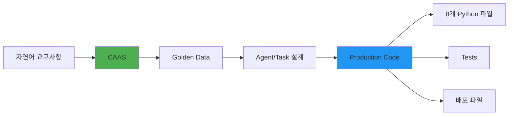
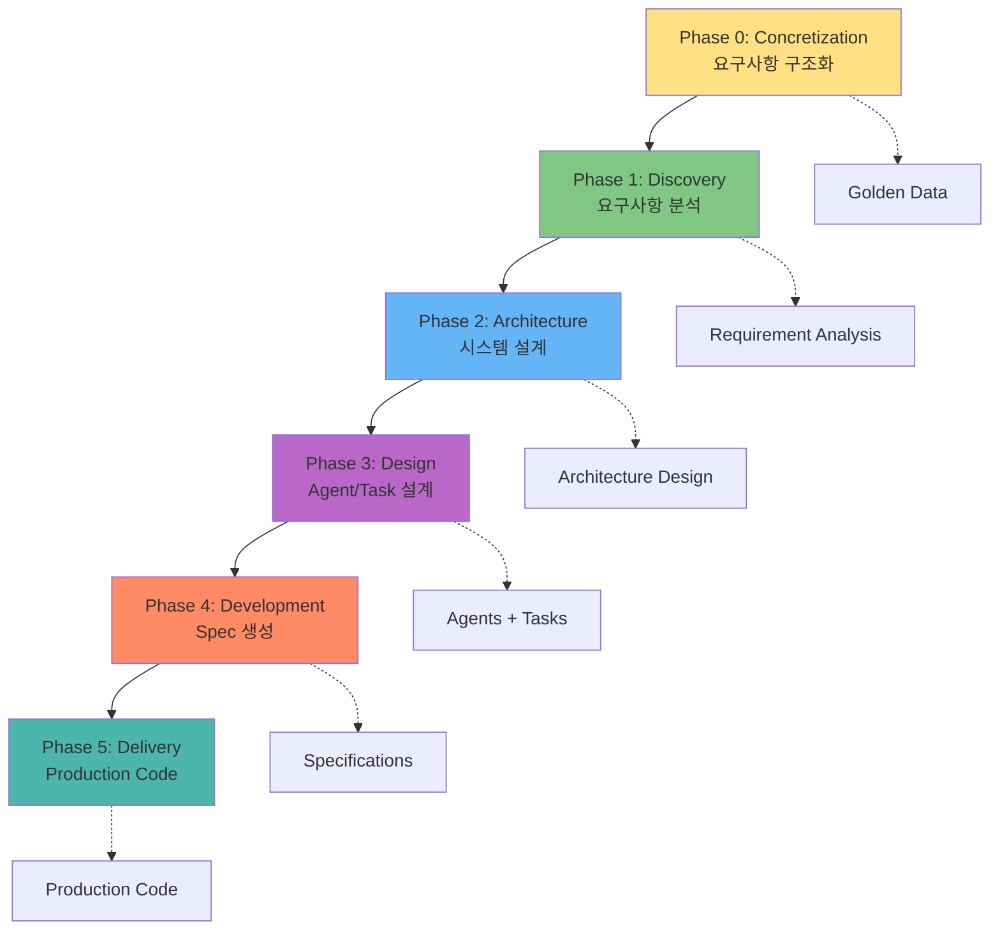
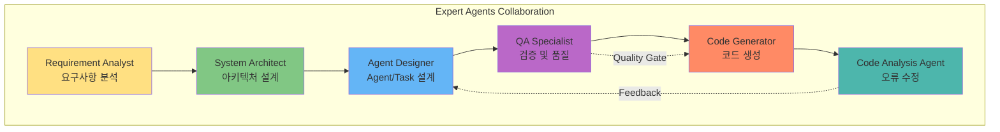
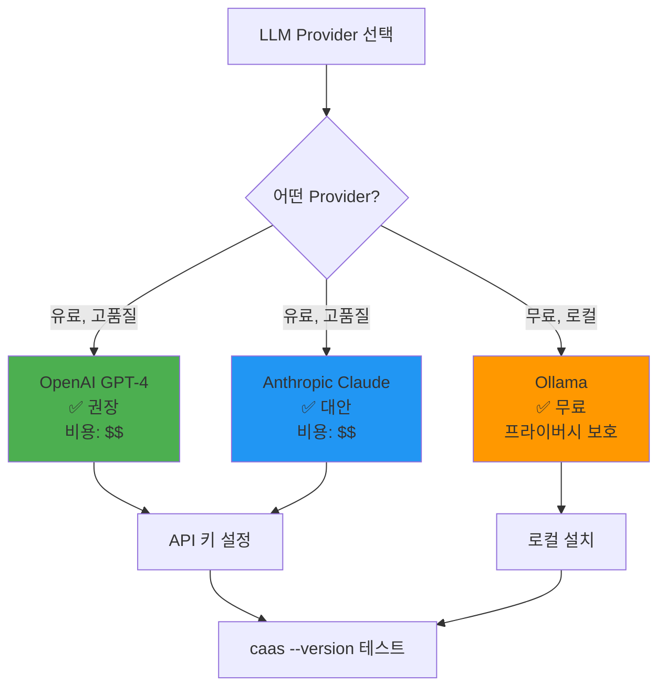

# CAAS 소개 및 설치

## 🎯 이 문서에서 배울 것
- [ ] CAAS가 무엇이고 왜 필요한지 이해
- [ ] CAAS 설치 및 환경 설정 완료
- [ ] 첫 명령어 실행 성공

⏱️ **예상 시간**: 10분

---

## 📖 CAAS란?

**CAAS (CrewAI Agent Auto-generation System)**는 자연어 요구사항을 입력받아 **프로덕션 레디 멀티 AI 에이전트 시스템 코드**를 자동으로 생성하는 통합 개발 도구입니다.



### 🎯 핵심 가치

| 항목 | 전통적 개발 | CAAS 기반 개발 |
|------|------------|---------------|
| **개발 시간** | 2-3주 | **5-10분** ⚡ |
| **요구사항 분석** | 수동 (2-3일) | **자동** (30초) |
| **코드 품질** | 개발자 역량 의존 | **8.4/10 평균** ✅ |
| **테스트 작성** | 수동 작성 | **자동 생성** |
| **문서 산출물** | 수동 작성 (1-2주) | **10가지 자동 생성** |
| **보안 검증** | 수동 리뷰 | **OWASP Top 10 자동 스캔** |

### 💡 주요 특징

#### 1. CAAS 6-Phase Methodology


#### 2. 6개 Expert Agents 협업


#### 3. 지원 도메인 (17개)
- **대화 & 커뮤니케이션**: 챗봇, 고객 지원
- **작업 & 워크플로우**: 할일 관리, 업무 자동화
- **데이터 & 분석**: 데이터 분석, 리포트 생성 ⭐ (98.3% 구현률)
- **콘텐츠 & 문서**: 콘텐츠 생성, 문서 처리
- **통합 & API**: API 통합, Webhook 처리
- **도메인 특화**: 전자상거래, 교육, 헬스케어, 금융

---

## 🚀 설치 (5분)

### 1. 전제 조건 확인

```bash
# Python 버전 확인 (3.11 이상 필요)
python --version
# Python 3.11.0 이상이어야 함

# pip 확인
pip --version
```

**Python 3.11 미만인 경우**:
```bash
# Ubuntu/Debian
sudo apt-get update
sudo apt-get install python3.11 python3.11-venv python3.11-pip

# macOS (Homebrew)
brew install python@3.11
```

### 2. CAAS 설치

**방법 1: PyPI에서 설치 (권장)**
```bash
pip install caas
```

**방법 2: 소스에서 설치 (개발자용)**
```bash
# 1. 저장소 클론
git clone https://github.com/bullpeng72/CAAS.git
cd CAAS

# 2. 가상 환경 생성 (권장)
python -m venv venv
source venv/bin/activate  # Windows: venv\Scripts\activate

# 3. 설치
pip install -e ".[cli]"
```

### 3. 설치 확인

```bash
# CAAS 버전 확인
caas --version
# 출력: CAAS v0.5.1 (Core) + v0.6.3 (CAAS-E)

# 도움말 확인
caas --help
```

**예상 출력**:
```
Usage: caas [OPTIONS] COMMAND [ARGS]...

  CAAS - CrewAI Agent Auto-generation System

Options:
  --version  Show version
  --help     Show this message and exit

Commands:
  init       Initialize CAAS configuration
  generate   Generate multi-agent system from requirement
  ...
```

---

## ⚙️ 환경 설정 (5분)

### 1. 대화형 초기 설정

```bash
caas init
```

**대화형 질문**:
```
Welcome to CAAS! Let's set up your environment.

? Select LLM Provider:
  > OpenAI (GPT-4, GPT-3.5)
    Anthropic (Claude)
    Ollama (Local LLM, Free)

? Do you have an API key ready? (y/n): y
? Enter your API key: sk-...
? Default output directory: ./generated
? Enable auto-save sessions? (y/n): y

✅ Configuration saved to ~/.caas/config.yaml
```

### 2. 환경 변수 설정

```bash
# .env 파일 생성
caas env --create
```

**생성된 `.env` 파일 편집**:
```bash
# LLM Provider 설정 (하나만 선택)
OPENAI_API_KEY=sk-your-openai-key-here          # OpenAI 사용 시
# ANTHROPIC_API_KEY=sk-ant-your-key-here        # Anthropic 사용 시
# LLM_PROVIDER=ollama                            # Ollama 사용 시 (무료)

# 선택적 설정
NEO4J_URI=bolt://localhost:7687                  # Neo4j 사용 시
NEO4J_USER=neo4j
NEO4J_PASSWORD=password
```

### 3. LLM Provider 설정 확인



**OpenAI 설정 (권장)**:
```bash
# API 키 발급: https://platform.openai.com/api-keys
export OPENAI_API_KEY=sk-your-key-here
```

**Ollama 설정 (무료, 로컬)**:
```bash
# 1. Ollama 설치 (https://ollama.ai)
curl -fsSL https://ollama.ai/install.sh | sh

# 2. 모델 다운로드
ollama pull llama3.1

# 3. .env 설정
echo "LLM_PROVIDER=ollama" >> .env
echo "OLLAMA_API_BASE=http://localhost:11434/v1" >> .env
```

### 4. 설정 확인

```bash
# 설정 확인
caas config list

# 출력 예시:
# llm_provider: openai
# default_output_dir: ./generated
# auto_save_sessions: true
# openai_api_key: sk-***...***
```

---

## ✅ 설치 완료 체크리스트

- [ ] Python 3.11+ 설치 완료
- [ ] CAAS 설치 완료 (`caas --version` 성공)
- [ ] `caas init` 실행 완료
- [ ] `.env` 파일 생성 및 API 키 설정 완료
- [ ] `caas config list` 확인 완료

---

## 🐛 설치 중 흔한 오류

### 오류 1: Python 버전 문제
```
ERROR: Python 3.11+ required
```

**해결**:
```bash
# Python 3.11 설치 후 가상 환경 사용
python3.11 -m venv venv
source venv/bin/activate
pip install caas
```

### 오류 2: pip 설치 실패
```
ERROR: Could not find a version that satisfies the requirement caas
```

**해결**:
```bash
# pip 업그레이드
pip install --upgrade pip

# 다시 설치
pip install caas
```

### 오류 3: API 키 오류
```
ERROR: OpenAI API key not found
```

**해결**:
```bash
# .env 파일 확인
cat .env

# API 키 설정
export OPENAI_API_KEY=sk-your-key-here

# 또는 .env 파일 재생성
caas env --create
```

### 오류 4: 권한 오류 (Linux/Mac)
```
ERROR: Permission denied
```

**해결**:
```bash
# 사용자 레벨 설치
pip install --user caas

# 또는 가상 환경 사용 (권장)
python -m venv venv
source venv/bin/activate
pip install caas
```

---

## 🎓 다음 단계

설치가 완료되었습니다! 이제 첫 프로젝트를 생성해보세요.

➡️ **다음 문서**: [02_5분_빠른_시작.md](./02_5분_빠른_시작.md)

---

## 📚 관련 문서

### 시작하기
- **[02_5분_빠른_시작.md](./02_5분_빠른_시작.md)** - 5분 안에 첫 프로젝트 생성
- **[03_주요_개념_이해.md](./03_주요_개념_이해.md)** - Domain, Golden Data, Agent, Task 개념
- **[04_첫_프로젝트_생성.md](./04_첫_프로젝트_생성.md)** - 상세한 첫 프로젝트 튜토리얼

### 개발 가이드
- **[10_CAAS_6Phase_개발_프로세스.md](../2_개발_실무_가이드/10_CAAS_6Phase_개발_프로세스.md)** - 6-Phase 개발 방법론
- **[20_CLI_명령어_레퍼런스.md](../2_개발_실무_가이드/20_CLI_명령어_레퍼런스.md)** - 모든 CLI 명령어 상세
- **[22_트러블슈팅_가이드.md](../2_개발_실무_가이드/22_트러블슈팅_가이드.md)** - 설치 및 실행 오류 해결

### 추가 리소스
- **GitHub**: https://github.com/bullpeng72/CAAS
- **Ollama 로컬 LLM**: 무료로 CAAS 사용하기 (API 비용 절감)

---

**작성일**: 2026-02-14
**버전**: v0.5.1 (Core) + v0.6.3 (CAAS-E)
**대상**: 주니어/시니어 개발자, PM
