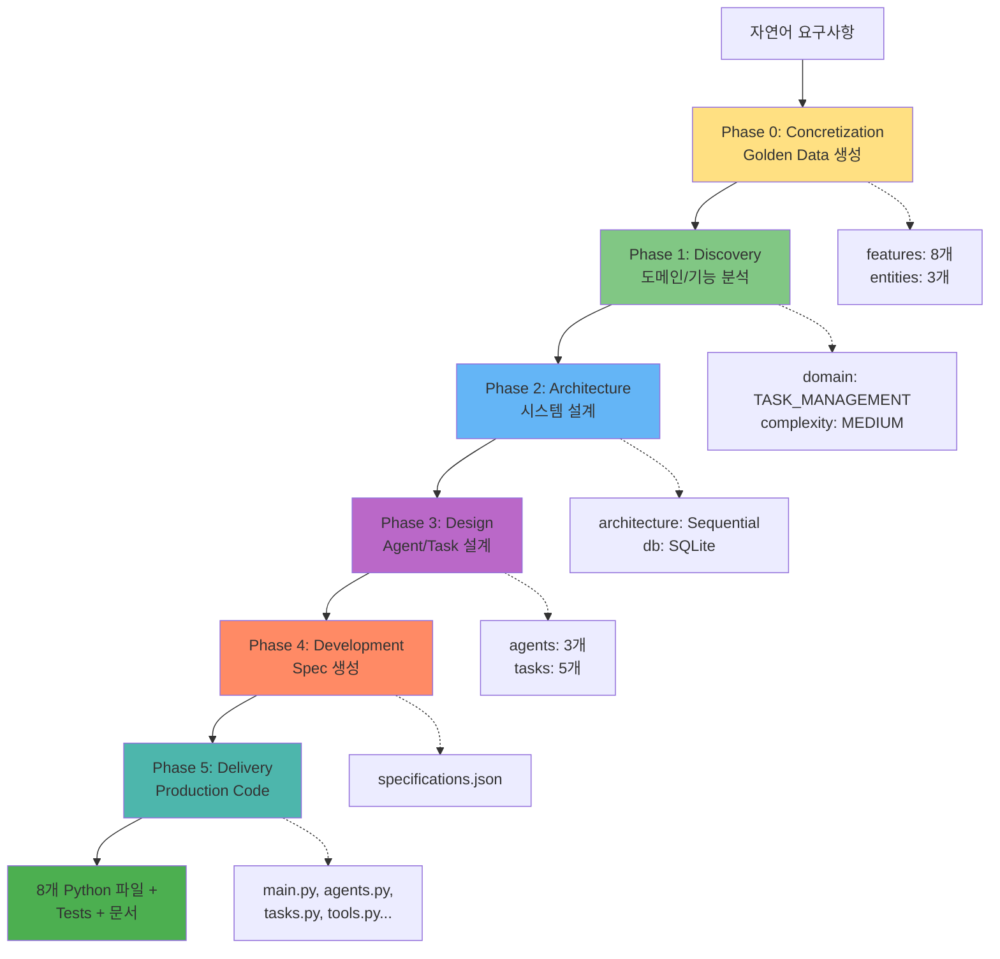
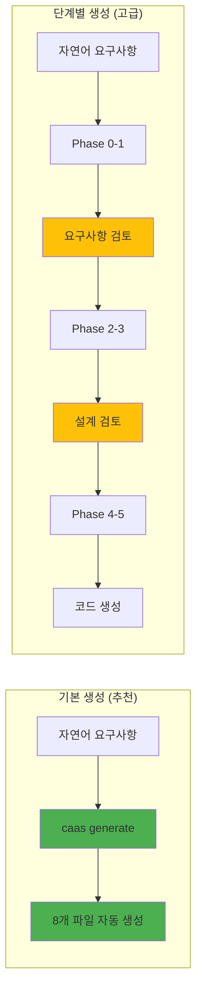

# 5분 빠른 시작

## 🎯 이 문서에서 배울 것
- [ ] 첫 번째 프로젝트 생성 (5분 이내)
- [ ] 생성된 코드 실행 및 검증
- [ ] CAAS 핵심 워크플로우 이해

⏱️ **예상 시간**: 5분

---

## 📋 사전 준비

다음이 완료되어 있어야 합니다:
- ✅ CAAS 설치 완료 ([01_CAAS_소개_및_설치.md](./01_CAAS_소개_및_설치.md) 참고)
- ✅ API 키 설정 완료 (OpenAI/Anthropic/Ollama)
- ✅ `caas --version` 명령 성공

---

## 🚀 첫 프로젝트 생성 (3가지 예시)

### 예시 1: 할일 관리 시스템 (추천) ⭐

#### 1단계: 프로젝트 생성 (2분)

```bash
# 간단한 명령으로 전체 시스템 생성
caas generate "할일 관리 시스템을 만들어줘. 할일 추가, 조회, 완료 처리 기능이 필요해" \
  --output ./my-todo-system
```

**실행 중 화면**:
```
🎯 CAAS v0.6.4 - Starting Generation...

Phase 0: Concretization ━━━━━━━━━━━━━━━━━━━━ 100% (30s)
  ✅ Golden Data generated: 8 features, 3 entities

Phase 1: Discovery ━━━━━━━━━━━━━━━━━━━━━━━━ 100% (25s)
  ✅ Domain: TASK_MANAGEMENT
  ✅ Features analyzed: 8

Phase 2: Architecture ━━━━━━━━━━━━━━━━━━━━━ 100% (20s)
  ✅ System design complete

Phase 3: Design ━━━━━━━━━━━━━━━━━━━━━━━━━━ 100% (35s)
  ✅ 3 Agents, 5 Tasks designed

Phase 4: Development ━━━━━━━━━━━━━━━━━━━━━ 100% (15s)
  ✅ Specifications generated

Phase 5: Delivery ━━━━━━━━━━━━━━━━━━━━━━━━ 100% (40s)
  ✅ Production code generated: 8 files

✅ Generation complete! Output: ./my-todo-system
⏱️ Total time: 2m 45s
```

#### 2단계: 생성된 파일 확인

```bash
cd my-todo-system
ls -la
```

**생성된 파일 (8개)**:
```
my-todo-system/
├── main.py              # 🎯 메인 실행 파일
├── agents.py            # 🤖 3개 Agent 정의
├── tasks.py             # 📋 5개 Task 정의
├── tools.py             # 🛠️ 커스텀 도구
├── requirements.txt     # 📦 의존성
├── .env.example         # ⚙️ 환경 설정 템플릿
├── README.md            # 📖 프로젝트 문서
└── tests/
    └── test_crew.py     # ✅ 자동 생성된 테스트
```

#### 3단계: 실행 (1분)

```bash
# 의존성 설치
pip install -r requirements.txt

# API 키 설정
cp .env.example .env
# .env 파일 편집: OPENAI_API_KEY=sk-your-key-here

# 실행!
python main.py
```

**실행 결과**:
```
## Welcome to Todo Management Crew
-------------------------------

할일: 프로젝트 계획 작성
상태: 진행 중

🤖 Agent 1 (할일 수집 담당자) starting...
  ✅ Task: 사용자 입력 수집

🤖 Agent 2 (할일 처리 담당자) starting...
  ✅ Task: 할일 데이터베이스 저장
  ✅ Task: 할일 우선순위 분석

🤖 Agent 3 (결과 보고 담당자) starting...
  ✅ Task: 처리 결과 요약
  ✅ Task: 사용자에게 보고

━━━━━━━━━━━━━━━━━━━━━━━━━━━━━━━━━━━━━━━━
📊 최종 결과:

할일 "프로젝트 계획 작성"이 성공적으로 추가되었습니다.
- ID: todo_001
- 우선순위: 높음
- 예상 소요 시간: 2시간
- 다음 단계: 세부 항목 작성
━━━━━━━━━━━━━━━━━━━━━━━━━━━━━━━━━━━━━━━━
```

#### 4단계: 코드 검증 (1분)

```bash
# 테스트 실행
pytest tests/ -v

# 출력:
# tests/test_crew.py::test_agents_created PASSED
# tests/test_crew.py::test_tasks_created PASSED
# tests/test_crew.py::test_crew_execution PASSED
# ======================== 3 passed in 1.2s =========================
```

---

### 예시 2: AI 챗봇 시스템

#### 1단계: 생성

```bash
caas generate "고객 지원 챗봇을 만들어줘. FAQ 검색, 제품 추천, 문의 접수 기능" \
  --output ./chatbot-system \
  --domain conversational_ai
```

**생성 시간**: 약 3분

**생성 결과**:
- 3개 Agent (FAQ 검색, 추천 엔진, 문의 처리)
- 6개 Task (의도 분석, FAQ 매칭, 제품 필터링, 추천 생성, 문의 저장, 응답 생성)
- tools.py: FAQSearchTool, ProductRecommendationTool
- Streamlit UI 자동 생성 (app.py) ⭐

#### 2단계: 실행

```bash
cd chatbot-system
pip install -r requirements.txt
cp .env.example .env
# .env 편집

# CLI 실행
python main.py

# 또는 Web UI 실행
streamlit run app.py
```

---

### 예시 3: 데이터 분석 워크플로우

#### 1단계: 생성

```bash
caas generate "판매 데이터 분석 시스템. CSV 파일 읽기, 통계 분석, 시각화 리포트 생성" \
  --output ./data-analysis \
  --domain data_analysis
```

**생성 시간**: 약 3-4분

**생성 결과**:
- 4개 Agent (데이터 수집, 전처리, 분석, 시각화)
- 8개 Task (파일 읽기, 정제, 기술통계, 상관분석, 차트 생성, 리포트 작성)
- tools.py: CSVReaderTool, DataCleaningTool, VisualizationTool
- requirements.txt: pandas, matplotlib, seaborn 포함

#### 2단계: 실행

```bash
cd data-analysis
pip install -r requirements.txt

# 샘플 데이터로 실행
python main.py --input sales_data.csv
```

---

## 🎓 생성 워크플로우 이해하기



---

## 📊 생성 옵션 비교

### 기본 생성 vs 고급 생성



| 방식 | 속도 | 제어 | 권장 대상 |
|------|------|------|-----------|
| **기본 생성** | ⚡ 2-4분 | 자동 | 주니어, 빠른 프로토타입 |
| **단계별 생성** | 🐢 5-10분 | 수동 | 시니어, 엔터프라이즈 |

---

## 🛠️ 주요 CLI 옵션

### 1. 도메인 지정

```bash
# 도메인 자동 감지 (기본)
caas generate "챗봇 만들기"

# 도메인 명시 (더 정확)
caas generate "챗봇 만들기" --domain conversational_ai
```

**지원 도메인 (17개)**:
- `conversational_ai` - 대화형 AI
- `task_management` - 작업 관리
- `data_analysis` - 데이터 분석 ⭐ (98.3% 구현률)
- `customer_support` - 고객 지원
- `content_creation` - 콘텐츠 생성
- `workflow_automation` - 워크플로우 자동화
- 기타 11개 (docs/20_CLI_명령어_레퍼런스.md 참고)

### 2. UI 자동 생성

```bash
# Streamlit UI 포함
caas generate "챗봇" --enable-frontend --frontend-framework streamlit

# React UI 포함 (또는 Streamlit 선택 가능)
caas generate "이미지 분류기" --enable-frontend --frontend-framework streamlit

# UI 없음 (CLI만) - 요구사항에 UI 관련 내용 제외
caas generate "데이터 처리 파이프라인. CLI 전용 백엔드 시스템"
```

> **참고**: `--enable-frontend` 플래그는 선택적입니다. CAAS는 요구사항에서 "UI", "화면", "대시보드" 등의 키워드를 자동으로 감지하여 프론트엔드를 생성합니다.

### 3. 출력 디렉토리

```bash
# 기본: ./generated
caas generate "요구사항"

# 커스텀 경로
caas generate "요구사항" --output /path/to/project

# 타임스탬프 추가
caas generate "요구사항" --timestamp
# 출력: ./generated/project_20260214_153045
```

### 4. 품질 설정

```bash
# 엄격한 품질 검증 (권장) - 기본 활성화됨
caas generate "요구사항" --enable-validation

# 상세한 진행 상황 출력
caas generate "요구사항" --verbosity verbose

# 검증 비활성화 (빠른 생성, 권장하지 않음)
caas generate "요구사항" --no-validation
```

---

## ✅ 성공 확인 체크리스트

### 생성 완료 후

- [ ] `ls ./my-todo-system` 실행 시 8개 파일 확인
- [ ] `cat main.py` 실행 시 Python 코드 확인 (구문 오류 없음)
- [ ] `cat agents.py` 실행 시 3개 이상 Agent 정의 확인
- [ ] `cat tasks.py` 실행 시 5개 이상 Task 정의 확인
- [ ] `cat requirements.txt` 실행 시 crewai, langchain 등 의존성 확인
- [ ] `cat README.md` 실행 시 프로젝트 설명 확인

### 실행 완료 후

- [ ] `pip install -r requirements.txt` 성공 (Exit Code 0)
- [ ] `python main.py` 실행 성공 (에러 없음)
- [ ] `pytest tests/` 실행 시 모든 테스트 통과 (3/3 passed)
- [ ] 터미널에 최종 결과 출력 확인

---

## 🐛 빠른 시작 중 흔한 오류

### 오류 1: 생성 중 멈춤 (Phase 진행 안 됨)

**증상**:
```
Phase 1: Discovery ━━━━━━━━━━━━━━━━━━━━━━━━ 0% (0s)
  (멈춤, 30초 이상 진행 없음)
```

**원인**: API 키 오류 또는 LLM 연결 실패

**해결**:
```bash
# API 키 확인
echo $OPENAI_API_KEY
# 또는
cat .env | grep OPENAI_API_KEY

# API 키 재설정
export OPENAI_API_KEY=sk-your-correct-key

# 재시도
caas generate "요구사항" --output ./project
```

---

### 오류 2: 생성된 파일이 비어있음

**증상**:
```bash
$ cat main.py
# (빈 파일 또는 매우 짧은 코드)
```

**원인**: Phase 5 (Delivery) 실패 또는 LLM 응답 파싱 오류

**해결**:
```bash
# 로그 확인
caas generate "요구사항" --output ./project --verbose

# 재생성 (동일 경로 지정 시 자동으로 덮어쓰기)
caas generate "요구사항" --output ./project
```

---

### 오류 3: pip install 실패

**증상**:
```
ERROR: Could not find a version that satisfies the requirement crewai
```

**원인**: Python 버전 호환성 (3.11+ 필요)

**해결**:
```bash
# Python 버전 확인
python --version
# Python 3.11.0 이상이어야 함

# Python 3.11 가상 환경 사용
python3.11 -m venv venv
source venv/bin/activate
pip install -r requirements.txt
```

---

### 오류 4: main.py 실행 시 Import 오류

**증상**:
```python
ImportError: cannot import name 'Agent' from 'crewai'
```

**원인**: crewai 버전 불일치

**해결**:
```bash
# crewai 재설치
pip uninstall crewai -y
pip install crewai --upgrade

# 또는 requirements.txt에 명시된 버전 사용
pip install -r requirements.txt --force-reinstall
```

---

### 오류 5: tools.py에서 도구 실행 실패

**증상**:
```
Error: Tool 'TodoSearchTool' not found
```

**원인**: 도구 클래스명 불일치 또는 import 경로 오류

**해결**:
```bash
# tools.py 확인
cat tools.py | grep "class.*Tool"

# agents.py에서 도구 사용 확인
cat agents.py | grep "tools="

# 수동 수정 또는 재생성
caas fix-runtime-error --project ./project --error-log error.log --apply
```

---

## 🎯 다음 단계

5분 빠른 시작을 완료했습니다! 이제 다음 단계로 진행하세요:

### 초보자 (주니어 개발자)
1. ➡️ **[10_CAAS_6Phase_개발_프로세스.md](../2_개발_실무_가이드/10_CAAS_6Phase_개발_프로세스.md)** - 각 Phase가 무엇을 하는지 이해
2. **[11_Phase별_요구사항_작성법.md](../2_개발_실무_가이드/11_Phase별_요구사항_작성법.md)** - 좋은 요구사항 작성 방법
3. **[40_할일관리_실습.md](../4_도메인별_실습/40_할일관리_실습.md)** - 실전 프로젝트 따라하기

### 중급자 (시니어 개발자)
1. ➡️ **[12_Golden_Data_활용법.md](../2_개발_실무_가이드/12_Golden_Data_활용법.md)** - Golden Data 커스터마이징
2. **[13_Agent_Task_설계_가이드.md](../2_개발_실무_가이드/13_Agent_Task_설계_가이드.md)** - Agent/Task 최적화
3. **[14_도구(Tools)_개발_가이드.md](../2_개발_실무_가이드/14_도구(Tools)_개발_가이드.md)** - 커스텀 도구 개발

### PM (프로젝트 관리자)
1. ➡️ **[30_프로젝트_생성_워크플로우.md](../3_프로젝트_관리_PM/30_프로젝트_생성_워크플로우.md)** - 프로젝트 관리 개요
2. **[31_Phase별_산출물_관리.md](../3_프로젝트_관리_PM/31_Phase별_산출물_관리.md)** - 산출물 검수 및 품질 관리

---

## 📚 추가 리소스

### 예제 프로젝트
- **GitHub**: https://github.com/bullpeng72/CAAS/tree/main/examples
- **Golden Data 예시**: [data/golden_examples/](../../data/golden_examples/)
- **E2E 테스트**: [tests/test_e2e_*.py](../../tests/) - 실전 코드 참고

### 커뮤니티
- **GitHub Issues**: 질문 및 버그 리포트
- **Discord**: CAAS 개발자 커뮤니티 (준비 중)

### 도움말
```bash
# 전체 명령어 목록
caas --help

# 특정 명령어 도움말
caas generate --help

# 버전 확인
caas --version
```

---

## 💡 Pro Tips

### Tip 1: 요구사항 작성 꿀팁
```bash
# ❌ 나쁜 예
caas generate "시스템 만들기"

# ✅ 좋은 예
caas generate "사용자 인증 시스템. 로그인, 회원가입, 비밀번호 재설정 기능. JWT 토큰 사용"
```

**핵심**: 기능을 구체적으로 나열 (3-5개 기능 명시)

### Tip 2: 생성 시간 단축
```bash
# 병렬 실행 활성화 (30-50% 빠름)
caas generate "요구사항" --distributed --workers 4

# 검증 비활성화 (빠르지만 품질 낮음, 권장하지 않음)
caas generate "요구사항" --no-validation
```

### Tip 3: 단계별 검토 (엔터프라이즈)
```bash
# Phase 0-1만 실행 (요구사항 분석)
caas generate-phase --phase 0 "요구사항" --output ./project
caas generate-phase --phase 1 "요구사항" --output ./project

# Golden Data 확인
cat ./project/golden_data.json

# 이상 없으면 나머지 Phase 계속
caas generate-phase --phase 2 "요구사항" --output ./project
# ... Phase 3-5
```

### Tip 4: 생성 속도 vs 품질 트레이드오프

| 설정 | 속도 | 품질 | 용도 |
|------|------|------|------|
| `--no-validation` | ⚡⚡⚡ | ⭐⭐ | 프로토타입, 빠른 테스트 (권장하지 않음) |
| 기본 (`--enable-validation`) | ⚡⚡ | ⭐⭐⭐⭐ | 일반 프로젝트 (권장) |
| `--distributed` | ⚡⚡⚡ | ⭐⭐⭐⭐ | 대규모 프로젝트, 병렬 처리 |

---

## 📚 관련 문서

### 시작하기
- **[01_CAAS_소개_및_설치.md](./01_CAAS_소개_및_설치.md)** - CAAS 개요 및 설치
- **[03_주요_개념_이해.md](./03_주요_개념_이해.md)** - Domain, Agent, Task 핵심 개념
- **[04_첫_프로젝트_생성.md](./04_첫_프로젝트_생성.md)** - 더 상세한 프로젝트 생성 가이드
- **[05_생성_코드_이해.md](./05_생성_코드_이해.md)** - 생성된 파일 구조 완전 분석
- **[06_다음_단계.md](./06_다음_단계.md)** - 학습 로드맵 및 다음 단계

### 개발 가이드
- **[10_CAAS_6Phase_개발_프로세스.md](../2_개발_실무_가이드/10_CAAS_6Phase_개발_프로세스.md)** - 6-Phase 개발 방법론 상세
- **[11_Phase별_요구사항_작성법.md](../2_개발_실무_가이드/11_Phase별_요구사항_작성법.md)** - 효과적인 요구사항 작성법
- **[12_Golden_Data_활용법.md](../2_개발_실무_가이드/12_Golden_Data_활용법.md)** - Golden Data 작성 및 활용
- **[20_CLI_명령어_레퍼런스.md](../2_개발_실무_가이드/20_CLI_명령어_레퍼런스.md)** - 모든 CLI 명령어 레퍼런스

### 실습
- **[40_할일관리_실습.md](../4_도메인별_실습/40_할일관리_실습.md)** - TASK_MANAGEMENT 도메인 실습
- **[41_챗봇_실습.md](../4_도메인별_실습/41_챗봇_실습.md)** - CONVERSATIONAL_AI 도메인 실습
- **[42_데이터분석_실습.md](../4_도메인별_실습/42_데이터분석_실습.md)** - DATA_ANALYSIS 도메인 실습

### 레퍼런스
- **[60_프레임워크_데이터구조.md](../6_부록/60_프레임워크_데이터구조.md)** - 17개 도메인 상세 설명
- **[62_용어집.md](../6_부록/62_용어집.md)** - CAAS 용어 사전
- **[63_FAQ.md](../6_부록/63_FAQ.md)** - 자주 묻는 질문

---

**작성일**: 2026-02-14
**버전**: v0.6.6
**대상**: 주니어/시니어 개발자, PM
**난이도**: ⭐ 입문
