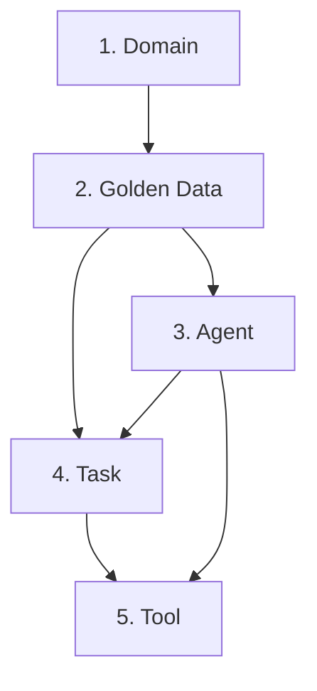
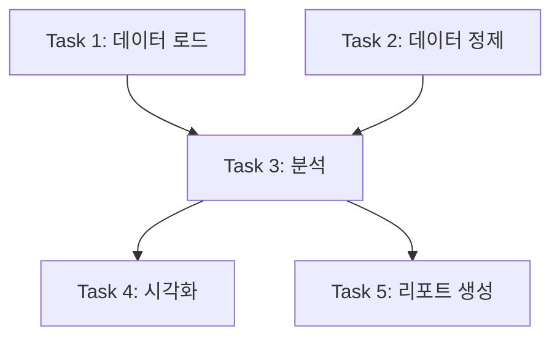
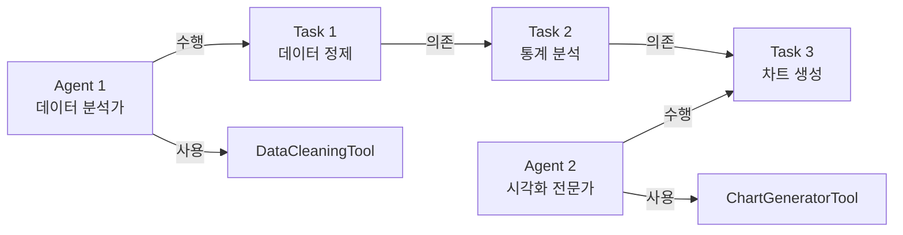
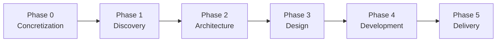

# 주요 개념 이해

## 🎯 학습 목표
- [ ] CAAS의 핵심 개념 5가지 이해
- [ ] Agent, Task, Tool의 관계 파악
- [ ] Golden Data 구조 이해
- [ ] CAAS 6-Phase Methodology 개요
- [ ] Domain의 역할 이해

⏱️ **예상 시간**: 15분

---

## CAAS 핵심 개념 5가지



---

## 1. Domain (도메인)

### 정의
프로젝트의 **분야 또는 영역**. CAAS는 17개 도메인을 지원하며, 도메인에 따라 최적화된 Agent/Task/Tool이 자동 생성됩니다.

### 17개 도메인 분류

**대화 & 커뮤니케이션 (2개)**
- `conversational_ai` - 챗봇, 대화형 AI (98.7% 구현률 ⭐⭐⭐⭐⭐)
- `customer_support` - 고객 지원 자동화

**작업 & 워크플로우 (2개)**
- `task_management` - 할일 관리, 프로젝트 관리
- `workflow_automation` - 업무 자동화, RPA

**데이터 & 분석 (3개)**
- `data_analysis` - 데이터 분석, 시각화 (98.3% 구현률 ⭐⭐⭐⭐⭐)
- `report_generation` - 자동 리포트 생성
- `dashboard` - 실시간 대시보드

**콘텐츠 & 문서 (3개)**
- `content_creation` - 콘텐츠 자동 생성 (98.7% 구현률 ⭐⭐⭐⭐⭐)
- `document_processing` - 문서 처리, OCR
- `knowledge_base` - 지식베이스, RAG

**통합 & API (2개)**
- `api_integration` - 외부 API 연동
- `webhook_handler` - Webhook 처리

**도메인 특화 (5개)**
- `e_commerce` - 전자상거래
- `education` - 교육
- `healthcare` - 헬스케어
- `finance` - 금융
- `custom` - 커스텀/기타

### 도메인 선택 방법

**자동 감지** (권장):
```bash
caas generate "고객 문의 챗봇"
# → Domain: conversational_ai (자동 분류)
```

**수동 지정**:
```bash
caas generate "챗봇" --domain conversational_ai
```

**영향**:
- 도메인에 따라 Agent/Task 구성이 달라짐
- 도메인별 최적화된 Tool 자동 선택
- 코드 품질 및 구현률에 영향

---

## 2. Golden Data (황금 데이터)

### 정의
자연어 요구사항을 **구조화한 데이터**. CAAS의 모든 후속 Phase의 기반이 되는 핵심 산출물입니다.

### 구조

```json
{
  "domain": "task_management",
  "features": [
    {
      "id": "f1",
      "name": "할일 생성",
      "description": "새로운 할일을 추가하는 기능",
      "priority": "HIGH",
      "inputs": ["title", "description", "due_date"],
      "outputs": ["todo_id", "success"]
    }
  ],
  "entities": [
    {
      "name": "todo",
      "attributes": ["id", "title", "description", "status", "priority", "due_date"]
    }
  ],
  "constraints": [
    {
      "type": "validation",
      "description": "할일 제목은 1-200자",
      "rule": "len(title) >= 1 and len(title) <= 200"
    }
  ],
  "business_rules": [
    {
      "id": "br1",
      "description": "HIGH 우선순위 할일은 72시간 이내 완료 권장"
    }
  ]
}
```

### 4가지 핵심 요소

**1. Features (기능)**
- 시스템이 제공하는 기능 목록
- 각 Feature는 Agent/Task로 매핑됨
- **중요**: Traceability 100%, Completeness 100% 검증

**2. Entities (엔티티)**
- 도메인 객체 및 속성 정의
- 데이터베이스 스키마 생성 기반

**3. Constraints (제약사항)**
- 기술적 제약 (문자 길이, 데이터 타입 등)

**4. Business Rules (비즈니스 규칙)**
- 도메인 고유 정책 및 규칙

### 생성 방법

**자동 생성** (Phase 0):
```bash
caas generate "할일 관리 시스템"
# → golden_data.json 자동 생성
```

**수동 편집**:
```bash
vim ./project/golden_data.json
# Feature 추가/수정 → Phase 2-5 재실행
```

---

## 3. Agent (에이전트)

### 정의
**특정 역할을 수행하는 AI 워커**. 각 Agent는 고유한 역할, 목표, 도구를 가집니다.

### Agent 구조

```python
{
  "id": "agent_1",
  "role": "데이터 분석가",
  "goal": "사용자가 제공한 데이터를 분석하여 인사이트 도출",
  "backstory": "10년 경력의 데이터 분석 전문가. 통계 분석 및 시각화에 능숙함.",
  "tools": ["DataCleaningTool", "StatisticalAnalysisTool", "ChartGeneratorTool"],
  "llm": "gpt-4"
}
```

### 4가지 핵심 속성

**1. Role (역할)**
- Agent의 정체성
- 예: "데이터 분석가", "FAQ 검색 담당자", "보고서 작성자"

**2. Goal (목표)**
- Agent가 달성해야 할 목표
- 예: "데이터를 분석하여 인사이트 도출"

**3. Backstory (배경)**
- Agent의 전문성 및 경험
- LLM이 역할에 몰입하도록 도움

**4. Tools (도구)**
- Agent가 사용할 수 있는 도구 목록
- 예: `DataCleaningTool`, `FAQSearchTool`

### Agent 개수

**권장**: 3-7개
- **너무 적으면** (1-2개): 역할 과부하
- **적당함** (3-7개): 최적
- **너무 많으면** (8+개): 조율 복잡

---

## 4. Task (작업)

### 정의
**Agent가 수행할 작업**. 각 Task는 하나의 Agent에 할당되며, 다른 Task의 결과를 입력으로 사용할 수 있습니다.

### Task 구조

```python
{
  "id": "task_1",
  "description": "사용자가 업로드한 CSV 파일 {file_path}를 읽고 결측값 처리",
  "expected_output": "정제된 데이터프레임 (결측값 제거 또는 대체)",
  "agent": "agent_1",
  "context": [],  # 선행 Task ID 리스트
  "async_execution": False
}
```

### 5가지 핵심 속성

**1. Description (설명)**
- Task의 목적 및 수행 내용
- **중요**: `{변수명}` 플레이스홀더 사용 (사용자 입력)
- 예: `"사용자 질문 {user_query}를 분석"`

**2. Expected Output (기대 출력)**
- Task가 반환해야 할 결과
- 예: "FAQ 검색 결과 3건 (제목, 내용, 신뢰도)"

**3. Agent (담당 Agent)**
- 이 Task를 수행할 Agent ID
- 예: `"agent_1"`

**4. Context (선행 Task)**
- 이 Task가 의존하는 다른 Task들
- **DAG (Directed Acyclic Graph)** 구조
- 예: `["task_1", "task_2"]` → task_1, task_2 완료 후 실행

**5. Async Execution (비동기 실행)**
- `true`: 병렬 실행 가능
- `false`: 순차 실행 (기본값)

### Task 의존성 (DAG)



**규칙**: 순환 의존성 금지 (무한 루프 방지)

---

## 5. Tool (도구)

### 정의
**Agent가 사용하는 기능**. CrewAI의 `BaseTool`을 상속하여 구현합니다.

### Tool 구조

```python
from crewai.tools import BaseTool

class TodoCRUDTool(BaseTool):
    name: str = "Todo CRUD Tool"
    description: str = "할일 생성, 조회, 수정, 삭제 기능을 제공하는 도구"

    def _run(self, operation: str, **kwargs) -> dict:
        """도구 실행 로직"""
        if operation == "create":
            # 할일 생성
            return {"success": True, "todo_id": 1}
        elif operation == "read":
            # 할일 조회
            return {"todos": [...]}
        # ... 나머지 CRUD 작업
```

### 3가지 핵심 요소

**1. Name (이름)**
- 도구의 고유 이름
- 예: "Todo CRUD Tool", "FAQ Search Tool"

**2. Description (설명)**
- 도구가 제공하는 기능 설명
- **중요**: LLM이 도구를 선택할 때 사용

**3. _run() 메서드**
- 실제 도구 실행 로직
- 파라미터와 반환값 명확히 정의

### Tool 종류

**데이터베이스 도구**
- `CRUDTool` - Create, Read, Update, Delete

**검색 도구**
- `SemanticSearchTool` - 벡터 검색
- `FAQSearchTool` - FAQ 검색

**API 도구**
- `HTTPClientTool` - REST API 호출
- `WebhookHandlerTool` - Webhook 처리

**분석 도구**
- `StatisticalAnalysisTool` - 통계 분석
- `ChartGeneratorTool` - 차트 생성

**자동 생성**:
```bash
caas generate "할일 관리"
# → tools.py에 TodoCRUDTool 자동 생성
```

---

## Agent-Task-Tool 관계



**실행 흐름**:
1. **Agent 1**이 **Task 1**을 수행하며 **DataCleaningTool** 사용
2. Task 1 완료 후 → **Task 2** 실행
3. Task 2 완료 후 → **Agent 2**가 **Task 3** 수행하며 **ChartGeneratorTool** 사용

---

## CAAS 6-Phase Methodology 개요

CAAS는 **6단계 방법론**으로 자연어 요구사항을 프로덕션 코드로 변환합니다.



### 각 Phase 설명

**Phase 0: Concretization (구체화)**
- 입력: 자연어 요구사항
- 출력: Golden Data
- 역할: 요구사항을 구조화

**Phase 1: Discovery (발견)**
- 입력: Golden Data
- 출력: Requirement Analysis (도메인 분류, 패턴 분석)
- 역할: 도메인 및 기능 분석

**Phase 2: Architecture (설계)**
- 입력: Golden Data, Requirement Analysis
- 출력: Architecture Design (컴포넌트, DB 스키마, Tool 목록)
- 역할: 시스템 아키텍처 설계
- **Quality Gate**: Traceability 100% (모든 Feature가 Component로 매핑)

**Phase 3: Design (상세 설계)**
- 입력: Architecture Design
- 출력: Agent/Task 설계
- 역할: CrewAI Agent 및 Task 설계
- **Quality Gate**: Completeness 100% (모든 Feature가 Agent/Task로 구현)

**Phase 4: Development (명세 생성)**
- 입력: Agent/Task 설계
- 출력: Specifications (CrewAI 실행 명세)
- 역할: CrewAI 실행에 필요한 최종 명세 생성

**Phase 5: Delivery (코드 생성)**
- 입력: Specifications
- 출력: Production Code (main.py, agents.py, tasks.py, tools.py, app.py, tests/)
- 역할: 프로덕션 레디 코드 생성
- **Quality Gate**: Code Quality ≥8.5, Security 0 Critical

---

## CrewAI 기본 개념

CAAS가 생성하는 코드는 **CrewAI 프레임워크** 기반입니다.

### CrewAI란?
멀티 에이전트 협업 프레임워크. 여러 AI Agent가 협력하여 복잡한 작업 수행.

**공식 사이트**: https://crewai.com

### 실행 방식

**Sequential (순차)**
```python
process: "sequential"
# Task 1 → Task 2 → Task 3 (순차 실행)
```

**Hierarchical (계층)**
```python
process: "hierarchical"
# Manager Agent가 다른 Agent들을 조율
```

### 예시 코드

```python
from crewai import Agent, Task, Crew

# Agent 생성
agent_1 = Agent(
    role="데이터 분석가",
    goal="데이터 분석",
    tools=[DataCleaningTool()]
)

# Task 생성
task_1 = Task(
    description="CSV 파일 분석",
    expected_output="분석 결과",
    agent=agent_1
)

# Crew 생성 (Agent + Task)
crew = Crew(
    agents=[agent_1],
    tasks=[task_1],
    process="sequential"
)

# 실행
result = crew.kickoff()
print(result)
```

---

## 핵심 개념 요약표

| 개념 | 설명 | 예시 | 중요도 |
|------|------|------|--------|
| **Domain** | 프로젝트 분야 | `conversational_ai` | ⭐⭐⭐ |
| **Golden Data** | 구조화된 요구사항 | features, entities, constraints | ⭐⭐⭐⭐⭐ |
| **Agent** | AI 워커 (역할 수행) | "데이터 분석가" | ⭐⭐⭐⭐ |
| **Task** | Agent가 수행할 작업 | "데이터 정제" | ⭐⭐⭐⭐ |
| **Tool** | Agent가 사용하는 기능 | `DataCleaningTool` | ⭐⭐⭐ |

---

## 다음 단계

개념을 이해했다면 다음 문서로 진행하세요:

1. **실습**: [04_첫_프로젝트_생성.md](./04_첫_프로젝트_생성.md) - 첫 프로젝트 생성 실습
2. **코드 이해**: [05_생성_코드_이해.md](./05_생성_코드_이해.md) - 생성된 코드 구조 파악
3. **심화**: [10_CAAS_6Phase_개발_프로세스.md](../2_개발_실무_가이드/10_CAAS_6Phase_개발_프로세스.md) - 전체 프로세스 상세

---

## 📚 관련 문서
- **[02_5분_빠른_시작.md](./02_5분_빠른_시작.md)** - 빠른 시작 예제
- **[12_Golden_Data_활용법.md](../2_개발_실무_가이드/12_Golden_Data_활용법.md)** - Golden Data 상세
- **[13_Agent_Task_설계_가이드.md](../2_개발_실무_가이드/13_Agent_Task_설계_가이드.md)** - Agent/Task 설계 패턴

---

**작성일**: 2026-02-14
**버전**: v0.6.4
**대상**: 초보자
**난이도**: ⭐ 입문
