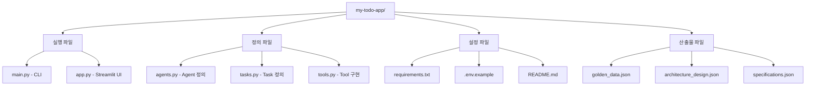

# 생성 코드 이해

## 🎯 학습 목표
- [ ] 생성된 파일 구조 이해
- [ ] main.py, agents.py, tasks.py, tools.py 코드 분석
- [ ] app.py (Streamlit UI) 이해
- [ ] 코드 수정 방법 익히기

⏱️ **예상 시간**: 25분

---

## 생성된 파일 구조



### 파일 분류

| 분류 | 파일 | 역할 | 수정 가능 |
|------|------|------|-----------|
| **실행 파일** | main.py | CLI 진입점 | ✅ 가능 |
|  | app.py | Streamlit UI | ✅ 가능 |
| **정의 파일** | agents.py | Agent 정의 | ✅ 가능 |
|  | tasks.py | Task 정의 | ✅ 가능 |
|  | tools.py | Tool 구현 | ✅ 가능 |
| **설정 파일** | requirements.txt | 의존성 | ✅ 가능 |
|  | .env.example | 환경 변수 예시 | ✅ 가능 |
|  | README.md | 프로젝트 설명 | ✅ 가능 |
| **산출물** | golden_data.json | Phase 0 | ⚠️ 재생성 시 사용 |
|  | architecture_design.json | Phase 2 | ⚠️ 재생성 시 사용 |
|  | specifications.json | Phase 4 | ⚠️ 재생성 시 사용 |

---

## main.py - CLI 진입점

### 전체 구조

```python
# main.py
import os
from crewai import Crew
from agents import create_agents
from tasks import create_tasks

def main():
    """CLI 진입점"""
    # 1. 사용자 입력 수집
    print("## Welcome to Todo Management Crew")
    todo_title = input("할일을 입력하세요: ")
    priority = input("우선순위 (HIGH/MEDIUM/LOW): ")
    due_date = input("마감일 (YYYY-MM-DD): ")

    # 2. Agent 생성
    agents = create_agents()

    # 3. Task 생성
    tasks = create_tasks(agents)

    # 4. Crew 생성
    crew = Crew(
        agents=list(agents.values()),
        tasks=list(tasks.values()),
        process="sequential"  # 순차 실행
    )

    # 5. 실행
    result = crew.kickoff(inputs={
        "todo_title": todo_title,
        "priority": priority,
        "due_date": due_date
    })

    # 6. 결과 출력
    print("\n📊 최종 결과:")
    print(result)

if __name__ == "__main__":
    main()
```

### 핵심 로직

**1. 사용자 입력 수집**
```python
todo_title = input("할일을 입력하세요: ")
```
- CLI에서 사용자 입력 받기
- **수정 가능**: 입력 형식 변경, 검증 추가

**2. Crew 생성**
```python
crew = Crew(
    agents=list(agents.values()),
    tasks=list(tasks.values()),
    process="sequential"
)
```
- `process="sequential"`: 순차 실행
- `process="hierarchical"`: 계층형 실행 (Manager 필요)

**3. 실행**
```python
result = crew.kickoff(inputs={...})
```
- `inputs`: Task description의 `{변수명}` 플레이스홀더에 값 전달

---

## agents.py - Agent 정의

### 전체 구조

```python
# agents.py
from crewai import Agent
from tools import TodoCRUDTool, PriorityAnalysisTool

def create_agents():
    """Agent 생성 함수"""

    # Agent 1: 입력 분석 담당자
    agent_1 = Agent(
        role="입력 검증 담당자",
        goal="사용자 입력을 검증하고 유효성 확인",
        backstory="데이터 검증 전문가. 입력값의 형식과 범위를 철저히 검사함.",
        tools=[],  # 도구 없음 (단순 검증)
        llm="gpt-4",
        verbose=True
    )

    # Agent 2: 할일 관리 담당자
    agent_2 = Agent(
        role="할일 관리자",
        goal="할일 생성, 조회, 수정, 삭제 작업 수행",
        backstory="10년 경력의 작업 관리 전문가. 효율적인 할일 관리 노하우 보유.",
        tools=[
            TodoCRUDTool(),  # CRUD 도구
            PriorityAnalysisTool()  # 우선순위 분석 도구
        ],
        llm="gpt-4",
        verbose=True
    )

    # Agent 3: 결과 보고 담당자
    agent_3 = Agent(
        role="결과 보고자",
        goal="작업 결과를 사용자에게 명확히 전달",
        backstory="커뮤니케이션 전문가. 복잡한 정보를 간결하게 정리함.",
        tools=[],
        llm="gpt-4",
        verbose=True
    )

    return {
        "agent_1": agent_1,
        "agent_2": agent_2,
        "agent_3": agent_3
    }
```

### Agent 속성 설명

**role (역할)**
```python
role="할일 관리자"
```
- Agent의 정체성
- 한국어 지원 (v0.6.4+)

**goal (목표)**
```python
goal="할일 생성, 조회, 수정, 삭제 작업 수행"
```
- Agent가 달성해야 할 목표
- LLM이 작업 방향을 이해하는 데 사용

**backstory (배경)**
```python
backstory="10년 경력의 작업 관리 전문가..."
```
- Agent의 전문성 설명
- LLM이 역할에 몰입하도록 도움

**tools (도구)**
```python
tools=[TodoCRUDTool(), PriorityAnalysisTool()]
```
- Agent가 사용할 수 있는 도구 목록
- `[]`: 도구 없음 (LLM만 사용)

**llm (모델)**
```python
llm="gpt-4"
```
- 사용할 LLM 모델
- 기본값: "gpt-4"

**verbose (상세 로그)**
```python
verbose=True
```
- `True`: 실행 과정 출력
- `False`: 결과만 출력

---

## tasks.py - Task 정의

### 전체 구조

```python
# tasks.py
from crewai import Task

def create_tasks(agents):
    """Task 생성 함수"""

    # Task 1: 입력 검증
    task_1 = Task(
        description="""
        사용자 입력을 검증하세요.
        - 할일 제목: {todo_title}
        - 우선순위: {priority}
        - 마감일: {due_date}

        검증 규칙:
        - 제목: 1-200자
        - 우선순위: HIGH, MEDIUM, LOW 중 하나
        - 마감일: YYYY-MM-DD 형식, 오늘 이후 날짜
        """,
        expected_output="검증 결과 (성공/실패, 오류 메시지)",
        agent=agents["agent_1"],
        context=[]  # 선행 Task 없음
    )

    # Task 2: 할일 생성
    task_2 = Task(
        description="""
        검증된 입력으로 할일을 생성하세요.
        - 제목: {todo_title}
        - 우선순위: {priority}
        - 마감일: {due_date}

        TodoCRUDTool을 사용하여 데이터베이스에 저장하세요.
        """,
        expected_output="생성된 할일 ID 및 전체 정보",
        agent=agents["agent_2"],
        context=[task_1]  # Task 1 완료 후 실행
    )

    # Task 3: 우선순위 분석
    task_3 = Task(
        description="""
        생성된 할일의 우선순위를 분석하세요.
        마감일까지 남은 시간을 기반으로 권장 일정을 제시하세요.
        """,
        expected_output="권장 시작 날짜 및 일정 계획",
        agent=agents["agent_2"],
        context=[task_2]  # Task 2 완료 후 실행
    )

    # Task 4: 결과 보고
    task_4 = Task(
        description="""
        모든 작업 결과를 사용자에게 보고하세요.
        - 생성된 할일 정보
        - 우선순위 분석 결과
        - 권장 일정

        명확하고 간결하게 정리하세요.
        """,
        expected_output="최종 보고서 (마크다운 형식)",
        agent=agents["agent_3"],
        context=[task_2, task_3]  # Task 2, 3 완료 후 실행
    )

    return {
        "task_1": task_1,
        "task_2": task_2,
        "task_3": task_3,
        "task_4": task_4
    }
```

### Task 속성 설명

**description (설명)**
```python
description="""
사용자 입력 {todo_title}을 검증하세요.
"""
```
- Task의 목적 및 수행 내용
- **중요**: `{변수명}` 플레이스홀더 사용
- `crew.kickoff(inputs={...})`에서 값 전달

**expected_output (기대 출력)**
```python
expected_output="검증 결과 (성공/실패, 오류 메시지)"
```
- Task가 반환해야 할 결과 형식
- LLM이 출력 형식을 이해하는 데 사용

**agent (담당 Agent)**
```python
agent=agents["agent_1"]
```
- 이 Task를 수행할 Agent

**context (선행 Task)**
```python
context=[task_1, task_2]
```
- 이 Task가 의존하는 다른 Task들
- 선행 Task의 결과를 입력으로 사용
- **순환 의존 금지** (DAG 구조)

---

## tools.py - Tool 구현

### 전체 구조

```python
# tools.py
from crewai.tools import BaseTool
import sqlite3
from datetime import datetime

class TodoCRUDTool(BaseTool):
    """할일 CRUD 작업 도구"""

    name: str = "Todo CRUD Tool"
    description: str = """
    할일 생성, 조회, 수정, 삭제 기능을 제공하는 도구.
    operation: create, read, update, delete
    """

    def _run(self, operation: str, **kwargs) -> dict:
        """도구 실행"""
        # 데이터베이스 연결
        conn = sqlite3.connect("todos.db")
        cursor = conn.cursor()

        # 테이블 생성 (최초 실행 시)
        cursor.execute("""
            CREATE TABLE IF NOT EXISTS todos (
                id INTEGER PRIMARY KEY AUTOINCREMENT,
                title TEXT NOT NULL,
                description TEXT,
                priority TEXT,
                due_date TEXT,
                status TEXT DEFAULT 'pending',
                created_at TIMESTAMP DEFAULT CURRENT_TIMESTAMP
            )
        """)

        if operation == "create":
            # 할일 생성
            title = kwargs.get("title")
            priority = kwargs.get("priority", "MEDIUM")
            due_date = kwargs.get("due_date")

            cursor.execute(
                "INSERT INTO todos (title, priority, due_date) VALUES (?, ?, ?)",
                (title, priority, due_date)
            )
            conn.commit()
            todo_id = cursor.lastrowid

            return {
                "success": True,
                "todo_id": todo_id,
                "title": title,
                "priority": priority,
                "due_date": due_date
            }

        elif operation == "read":
            # 할일 조회
            cursor.execute("SELECT * FROM todos WHERE status = 'pending'")
            rows = cursor.fetchall()

            todos = []
            for row in rows:
                todos.append({
                    "id": row[0],
                    "title": row[1],
                    "priority": row[3],
                    "due_date": row[4],
                    "status": row[5]
                })

            return {"success": True, "todos": todos}

        elif operation == "update":
            # 할일 수정
            todo_id = kwargs.get("todo_id")
            status = kwargs.get("status", "completed")

            cursor.execute(
                "UPDATE todos SET status = ? WHERE id = ?",
                (status, todo_id)
            )
            conn.commit()

            return {"success": True, "todo_id": todo_id, "status": status}

        elif operation == "delete":
            # 할일 삭제
            todo_id = kwargs.get("todo_id")

            cursor.execute("DELETE FROM todos WHERE id = ?", (todo_id,))
            conn.commit()

            return {"success": True, "todo_id": todo_id}

        else:
            return {"success": False, "error": f"Unknown operation: {operation}"}

        conn.close()


class PriorityAnalysisTool(BaseTool):
    """우선순위 분석 도구"""

    name: str = "Priority Analysis Tool"
    description: str = "마감일 기반 우선순위 및 권장 일정 분석"

    def _run(self, todo_id: int, due_date: str) -> dict:
        """도구 실행"""
        # 마감일까지 남은 일수 계산
        due = datetime.strptime(due_date, "%Y-%m-%d")
        today = datetime.now()
        days_left = (due - today).days

        # 권장 시작 날짜 계산
        if days_left > 7:
            start_recommend = (today + timedelta(days=days_left - 5)).strftime("%Y-%m-%d")
            urgency = "낮음"
        elif days_left > 3:
            start_recommend = today.strftime("%Y-%m-%d")
            urgency = "보통"
        else:
            start_recommend = today.strftime("%Y-%m-%d")
            urgency = "높음"

        return {
            "todo_id": todo_id,
            "days_left": days_left,
            "urgency": urgency,
            "start_recommend": start_recommend
        }
```

### Tool 개발 패턴

**1. BaseTool 상속**
```python
class TodoCRUDTool(BaseTool):
```

**2. name, description 정의**
```python
name: str = "Todo CRUD Tool"
description: str = "할일 CRUD 작업 도구"
```

**3. _run() 메서드 구현**
```python
def _run(self, operation: str, **kwargs) -> dict:
    # 도구 로직
    return {"success": True, ...}
```

---

## app.py - Streamlit UI

### 전체 구조

```python
# app.py
import streamlit as st
from crewai import Crew
from agents import create_agents
from tasks import create_tasks

st.title("📝 할일 관리 시스템")

# 사이드바
with st.sidebar:
    st.subheader("설정")
    show_completed = st.checkbox("완료된 할일 표시")

# 새 할일 추가
st.subheader("새 할일 추가")
with st.form("add_todo"):
    title = st.text_input("제목")
    priority = st.selectbox("우선순위", ["HIGH", "MEDIUM", "LOW"])
    due_date = st.date_input("마감일")

    submitted = st.form_submit_button("추가하기")

    if submitted:
        # Crew 실행
        agents = create_agents()
        tasks = create_tasks(agents)
        crew = Crew(
            agents=list(agents.values()),
            tasks=list(tasks.values())
        )

        with st.spinner("할일 생성 중..."):
            result = crew.kickoff(inputs={
                "todo_title": title,
                "priority": priority,
                "due_date": str(due_date)
            })

        st.success(f"✅ 할일 '{title}'이 추가되었습니다!")

# 할일 목록
st.subheader("할일 목록")
# ... TodoCRUDTool로 조회하여 표시
```

### Streamlit 핵심 요소

**1. 제목/텍스트**
```python
st.title("📝 할일 관리 시스템")
st.subheader("새 할일 추가")
```

**2. 입력 위젯**
```python
title = st.text_input("제목")
priority = st.selectbox("우선순위", ["HIGH", "MEDIUM", "LOW"])
due_date = st.date_input("마감일")
```

**3. 폼**
```python
with st.form("add_todo"):
    # 입력 위젯들
    submitted = st.form_submit_button("추가하기")
```

**4. 스피너**
```python
with st.spinner("할일 생성 중..."):
    result = crew.kickoff(...)
```

---

## 코드 수정 방법

### 시나리오 1: Agent 추가

```python
# agents.py
def create_agents():
    # ... 기존 Agent들

    # 새 Agent 추가
    agent_4 = Agent(
        role="통계 분석가",
        goal="할일 통계 분석 및 인사이트 도출",
        tools=[StatisticalAnalysisTool()],
        llm="gpt-4"
    )

    return {
        "agent_1": agent_1,
        "agent_2": agent_2,
        "agent_3": agent_3,
        "agent_4": agent_4  # ✅ 추가
    }
```

### 시나리오 2: Tool 추가

```python
# tools.py
class NotificationTool(BaseTool):
    """알림 도구"""

    name: str = "Notification Tool"
    description: str = "이메일 또는 Slack 알림 전송"

    def _run(self, message: str, channel: str = "email") -> dict:
        if channel == "email":
            # 이메일 발송 로직
            send_email(message)
        elif channel == "slack":
            # Slack 메시지 전송
            send_slack(message)

        return {"success": True}
```

### 시나리오 3: UI 개선

```python
# app.py
# 차트 추가
import plotly.express as px

# 우선순위별 통계
priority_counts = df['priority'].value_counts()
fig = px.pie(values=priority_counts.values, names=priority_counts.index)
st.plotly_chart(fig)
```

---

## 📚 관련 문서
- **[03_주요_개념_이해.md](./03_주요_개념_이해.md)** - 핵심 개념 복습
- **[14_도구(Tools)_개발_가이드.md](../2_개발_실무_가이드/14_도구(Tools)_개발_가이드.md)** - Tool 개발 상세
- **[13_Agent_Task_설계_가이드.md](../2_개발_실무_가이드/13_Agent_Task_설계_가이드.md)** - Agent/Task 설계 패턴

---

**작성일**: 2026-02-14
**버전**: v0.6.4
**대상**: 초보자
**난이도**: ⭐⭐ 중급
