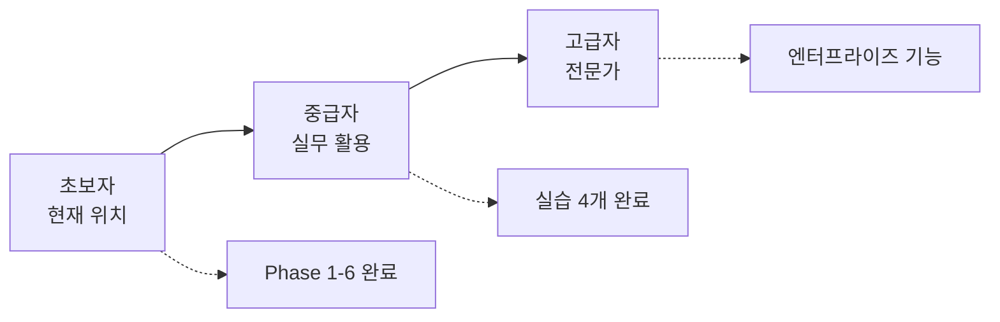

# 다음 단계

## 🎯 학습 목표
- [ ] 학습 경로 이해 (초보자 → 중급자 → 고급자)
- [ ] 실무 적용 방법 익히기
- [ ] 커뮤니티 및 리소스 활용
- [ ] 계속 성장하는 방법

⏱️ **예상 시간**: 10분

---

## 축하합니다! 🎉

CAAS의 기본 개념을 모두 마스터했습니다!

**지금까지 배운 것**:
- ✅ CAAS 설치 및 환경 설정
- ✅ 핵심 개념 (Domain, Golden Data, Agent, Task, Tool)
- ✅ 첫 프로젝트 생성 및 실행
- ✅ 생성된 코드 구조 이해

이제 **다음 단계**로 나아갈 준비가 되었습니다!

---

## 학습 경로



---

## 1. 초보자 → 중급자 (다음 2주)

### 목표
**실무에서 CAAS를 활용하여 프로젝트 생성 및 배포**

### 학습 순서

**Week 1: 개발 실무 가이드 (4개 문서)**

1. **Day 1-2**: [10_CAAS_6Phase_개발_프로세스.md](../2_개발_실무_가이드/10_CAAS_6Phase_개발_프로세스.md)
   - 6-Phase Methodology 완벽 이해
   - Phase별 입출력 및 Quality Gate
   - ⏱️ 50분

2. **Day 3-4**: [12_Golden_Data_활용법.md](../2_개발_실무_가이드/12_Golden_Data_활용법.md)
   - Golden Data 수동 편집
   - Feature 추가/수정
   - 재사용 및 버전 관리
   - ⏱️ 30분

3. **Day 5-6**: [13_Agent_Task_설계_가이드.md](../2_개발_실무_가이드/13_Agent_Task_설계_가이드.md)
   - Agent/Task 설계 패턴 (IPO, Hierarchical, Pipeline)
   - 안티 패턴 피하기
   - ⏱️ 30분

4. **Day 7**: [15_코드_품질_가이드.md](../2_개발_실무_가이드/15_코드_품질_가이드.md)
   - 코드 품질 기준 (8.5/10.0)
   - 자동 품질 개선
   - ⏱️ 25분

**Week 2: 도메인별 실습 (4개 실습)**

1. **Day 8-9**: [40_할일관리_실습.md](../4_도메인별_실습/40_할일관리_실습.md)
   - TASK_MANAGEMENT 도메인 마스터
   - 기능 추가 (할일 공유)
   - ⏱️ 30분

2. **Day 10-11**: [41_챗봇_실습.md](../4_도메인별_실습/41_챗봇_실습.md)
   - CONVERSATIONAL_AI 도메인 (98.7% 구현률)
   - FAQ 검색, 응답 생성, 감정 분석
   - ⏱️ 30분

3. **Day 12-13**: [42_데이터분석_실습.md](../4_도메인별_실습/42_데이터분석_실습.md)
   - DATA_ANALYSIS 도메인 (98.3% 구현률)
   - CSV 처리, 통계 분석, 시각화
   - ⏱️ 30분

4. **Day 14**: [43_API통합_실습.md](../4_도메인별_실습/43_API통합_실습.md)
   - API_INTEGRATION 도메인
   - REST API 연동, OAuth, Webhook
   - ⏱️ 30분

**체크포인트** (Week 2 종료):
- [ ] 4개 도메인 프로젝트 생성 성공
- [ ] Golden Data 수동 편집 가능
- [ ] Agent/Task 설계 패턴 이해
- [ ] Code Quality ≥8.5 달성

---

## 2. 중급자 → 고급자 (다음 4주)

### 목표
**엔터프라이즈 기능 활용 및 성능 최적화**

### 학습 순서

**Week 3: 엔터프라이즈 기능 (4개 문서)**

1. **Day 15-17**: [50_TDD_자동화_가이드.md](../5_엔터프라이즈_기능/50_TDD_자동화_가이드.md)
   - Golden Data 기반 테스트 자동 생성
   - 자동 리팩토링 (TDD 기반)
   - E2E 테스트
   - ⏱️ 35분

2. **Day 18-20**: [51_QA_자동화_가이드.md](../5_엔터프라이즈_기능/51_QA_자동화_가이드.md)
   - 보안 스캔 (OWASP Top 10)
   - 코드 품질 자동 검증
   - CI/CD 통합
   - ⏱️ 30분

3. **Day 21-23**: [52_Checkpoint_활용법.md](../5_엔터프라이즈_기능/52_Checkpoint_활용법.md)
   - Phase별 체크포인트 저장/복원
   - A/B 테스팅
   - 협업 워크플로우
   - ⏱️ 25분

4. **Day 24-26**: [53_성능_최적화_가이드.md](../5_엔터프라이즈_기능/53_성능_최적화_가이드.md)
   - 생성 시간 60% 단축
   - LLM 비용 60% 절감
   - 대규모 프로젝트 처리
   - ⏱️ 30분

**Week 4: 프로젝트 관리 (PM 관점)**

1. **Day 27-28**: [30_프로젝트_생성_워크플로우.md](../3_프로젝트_관리_PM/30_프로젝트_생성_워크플로우.md)
   - PM 관점의 프로젝트 생성 워크플로우
   - 의사결정 포인트
   - ⏱️ 30분

2. **Day 29-30**: [32_품질_검수_체크리스트.md](../3_프로젝트_관리_PM/32_품질_검수_체크리스트.md)
   - Phase별 품질 검수 항목
   - 빠른 검수 명령어
   - 합격/불합격 기준
   - ⏱️ 15분

**체크포인트** (Week 4 종료):
- [ ] TDD 자동화 활용
- [ ] QA 자동화 CI/CD 통합
- [ ] Checkpoint로 실험 비교
- [ ] 성능 최적화 (생성 시간 5분 → 2분)

---

## 실무 적용 가이드

### 시나리오 1: 신규 프로젝트 시작

**상황**: 클라이언트가 "고객 문의 챗봇" 프로젝트 의뢰

**단계**:
1. **요구사항 수집** (1시간)
   ```
   - 고객 문의 유형: 제품 문의, 배송 문의, 반품/교환
   - FAQ 데이터베이스 연동
   - 실시간 채팅 지원
   - 관리자 대시보드
   ```

2. **CAAS로 프로젝트 생성** (5분)
   ```bash
   caas generate "고객 문의 챗봇. FAQ 검색, 실시간 채팅, 관리자 대시보드" \
     --domain conversational_ai \
     --output ./customer-support-bot \
     --enable-frontend \
     --frontend-framework streamlit \
     --distributed
   ```

3. **Golden Data 검토 및 수정** (30분)
   ```bash
   vim ./customer-support-bot/golden_data.json
   # Feature 추가: "문의 내역 조회", "만족도 평가"
   ```

4. **Phase 3-5 재생성** (3분)
   ```bash
   caas generate-phase --phase 3 \
     --input ./customer-support-bot \
     --output ./customer-support-bot
   caas generate-phase --phase 4 \
     --input ./customer-support-bot \
     --output ./customer-support-bot
   caas generate-phase --phase 5 \
     --input ./customer-support-bot \
     --output ./customer-support-bot
   ```

5. **QA 및 배포** (1시간)
   ```bash
   caas qa report --project ./customer-support-bot
   # → Code Quality: 8.7, Security: 0 Critical ✅
   ```

**총 소요 시간**: 2.5시간 (기존 수동 개발 대비 **80% 시간 단축**)

---

### 시나리오 2: 기존 프로젝트 개선

**상황**: 할일 관리 앱에 "팀 협업" 기능 추가

**단계**:
1. **Checkpoint 저장** (백업)
   ```bash
   caas checkpoint save --project ./my-todo-app --name "before-team-feature"
   ```

2. **Golden Data 수정**
   ```json
   {
     "features": [
       ...기존 features,
       {
         "id": "f5",
         "name": "팀 협업",
         "description": "할일을 팀원과 공유하고 협업",
         "inputs": ["todo_id", "team_member_email"],
         "outputs": ["share_link"]
       }
     ]
   }
   ```

3. **Phase 3-5 재생성**
   ```bash
   caas generate-phase --phase 3-5 "..." --output ./my-todo-app --force
   ```

4. **비교 및 테스트**
   ```bash
   # 새 기능 테스트
   pytest tests/test_team_collaboration.py

   # 문제 발생 시 롤백
   caas checkpoint restore --checkpoint "before-team-feature"
   ```

---

## 커뮤니티 및 리소스

### 공식 리소스

**1. GitHub**
- 저장소: https://github.com/bullpeng72/CAAS
- Issues: 버그 리포트, 기능 요청
- Discussions: 질문 및 토론

**2. 문서**
- 전체 문서: `/home/fomalhaut/Projects/CAAS/docs/`
- FAQ: [63_FAQ.md](../6_부록/63_FAQ.md)
- API 레퍼런스: [61_API_레퍼런스.md](../6_부록/61_API_레퍼런스.md)

**3. CLI 도움말**
```bash
caas --help
caas generate --help
```

### 도움 받기

**문제 발생 시**:
1. **트러블슈팅 가이드**: [22_트러블슈팅_가이드.md](../2_개발_실무_가이드/22_트러블슈팅_가이드.md)
2. **FAQ**: [63_FAQ.md](../6_부록/63_FAQ.md)
3. **GitHub Issues**: https://github.com/bullpeng72/CAAS/issues

---

## 계속 성장하는 방법

### 1. 다양한 도메인 탐색

**17개 도메인** 중 아직 시도하지 않은 도메인에 도전하세요:

**추천 순서**:
1. ✅ TASK_MANAGEMENT (완료)
2. ⭐ CONVERSATIONAL_AI (98.7% 구현률)
3. ⭐ DATA_ANALYSIS (98.3% 구현률)
4. ⭐ CONTENT_CREATION (98.7% 구현률)
5. CUSTOMER_SUPPORT
6. WORKFLOW_AUTOMATION
7. ... 나머지 11개

**도메인 레퍼런스**: [60_도메인_레퍼런스.md](../6_부록/60_도메인_레퍼런스.md)

---

### 2. 실전 프로젝트 도전

**아이디어**:
- 📱 개인 비서 앱 (일정 관리 + 할일 + 메모)
- 🤖 회사 내부 챗봇 (HR 문의, IT 지원)
- 📊 데이터 분석 대시보드 (실시간 KPI 모니터링)
- 🛒 전자상거래 추천 시스템
- 📝 콘텐츠 자동 생성 (블로그, 소셜 미디어)

**팁**:
- 작게 시작 (3-5 features)
- 점진적으로 확장
- Checkpoint 활용 (실험)

---

### 3. 기여하기

**CAAS 발전에 기여**:

1. **버그 리포트**
   ```bash
   # GitHub Issues에 버그 리포트
   https://github.com/bullpeng72/CAAS/issues/new
   ```

2. **문서 개선**
   - 오탈자 수정
   - 예시 추가
   - 번역 (한국어 ↔ 영어)

3. **기능 제안**
   - 새로운 도메인 제안
   - Tool 개발 및 공유
   - 성능 최적화 아이디어

---

### 4. 최신 정보 유지

**CAAS는 지속적으로 발전합니다**:

**현재 버전**: v0.5.1 (2026-02-12)

**향후 로드맵** (v0.6.0+):
- [ ] 웹 UI (대시보드)
- [ ] 실시간 협업 (멀티 유저)
- [ ] 더 많은 도메인 (20+)
- [ ] 자동 배포 (Docker, Kubernetes)
- [ ] 성능 개선 (생성 시간 2분 이하)

**업데이트 확인**:
```bash
pip install --upgrade caas
caas --version
```

---

## 마무리

### 당신의 CAAS 여정


**지금까지의 성과**:
- ✅ CAAS 설치 완료
- ✅ 핵심 개념 이해
- ✅ 첫 프로젝트 생성 및 실행
- ✅ 생성 코드 이해

**다음 목표**:
- 📖 중급 문서 4개 학습 (Week 1-2)
- 🏗️ 실전 프로젝트 1개 완성
- 🚀 엔터프라이즈 기능 마스터 (Week 3-4)

### 성공 사례

**CAAS로 이루어낼 수 있는 것**:
- ⏱️ 개발 시간 **80% 단축** (2주 → 2일)
- 💰 개발 비용 **70% 절감**
- ✅ Code Quality **8.5+** 보장
- 🔒 Security **0 Critical** 보장
- 📈 Test Coverage **80%+**

### 행운을 빕니다! 🍀

CAAS와 함께 멋진 프로젝트를 만들어보세요!

질문이 있으면 언제든지:
- 📚 [FAQ](../6_부록/63_FAQ.md)
- 🐛 [GitHub Issues](https://github.com/bullpeng72/CAAS/issues)
- 💬 [Discussions](https://github.com/bullpeng72/CAAS/discussions)

**Happy Coding! 🚀**

---

## 📚 관련 문서

**초보자**:
- [01_CAAS_소개_및_설치.md](./01_CAAS_소개_및_설치.md)
- [02_5분_빠른_시작.md](./02_5분_빠른_시작.md)
- [03_주요_개념_이해.md](./03_주요_개념_이해.md)
- [04_첫_프로젝트_생성.md](./04_첫_프로젝트_생성.md)
- [05_생성_코드_이해.md](./05_생성_코드_이해.md)

**중급자**:
- [10_CAAS_6Phase_개발_프로세스.md](../2_개발_실무_가이드/10_CAAS_6Phase_개발_프로세스.md)
- [12_Golden_Data_활용법.md](../2_개발_실무_가이드/12_Golden_Data_활용법.md)
- [13_Agent_Task_설계_가이드.md](../2_개발_실무_가이드/13_Agent_Task_설계_가이드.md)

**고급자**:
- [50_TDD_자동화_가이드.md](../5_엔터프라이즈_기능/50_TDD_자동화_가이드.md)
- [51_QA_자동화_가이드.md](../5_엔터프라이즈_기능/51_QA_자동화_가이드.md)
- [53_성능_최적화_가이드.md](../5_엔터프라이즈_기능/53_성능_최적화_가이드.md)

---

**작성일**: 2026-02-14
**버전**: v0.5.1 (Core) + v0.6.3 (CAAS-E)
**대상**: 전체 사용자
**난이도**: ⭐ 입문
