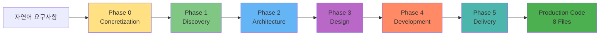
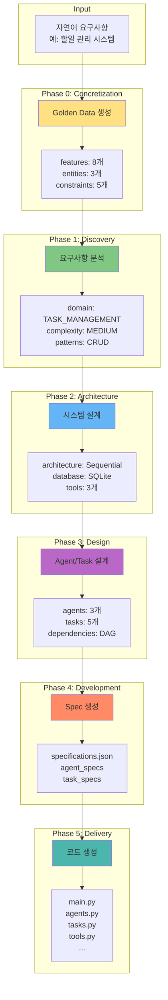
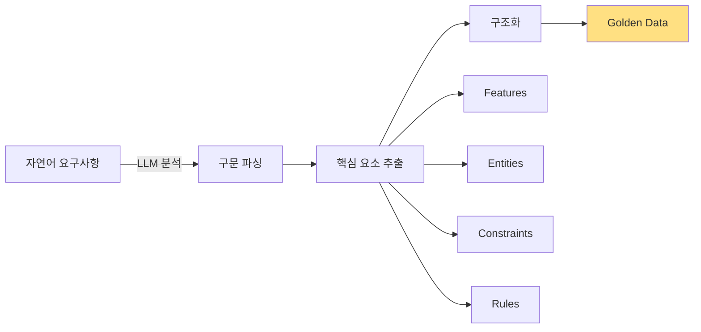
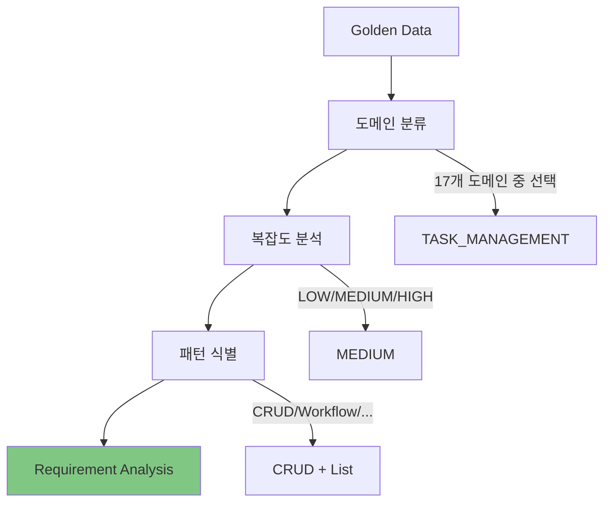
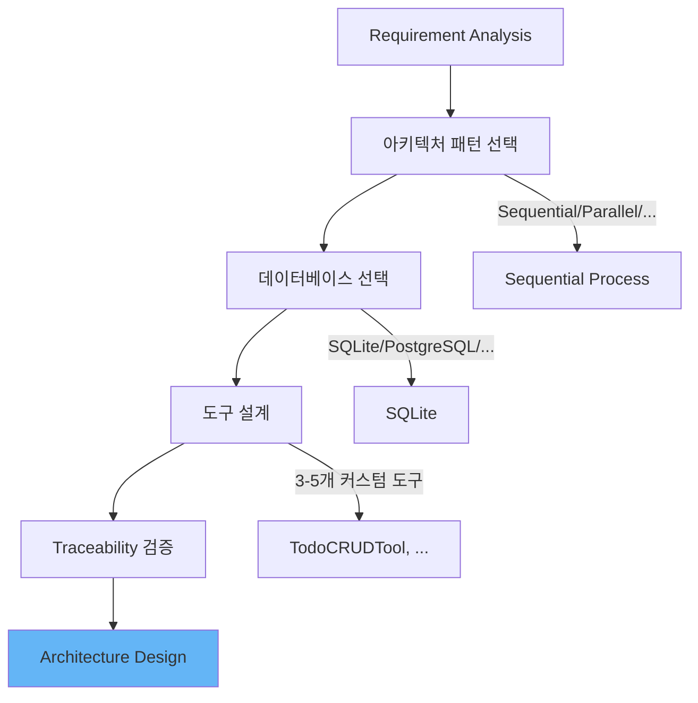
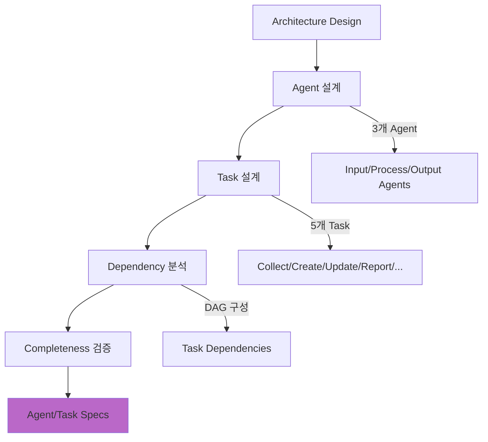
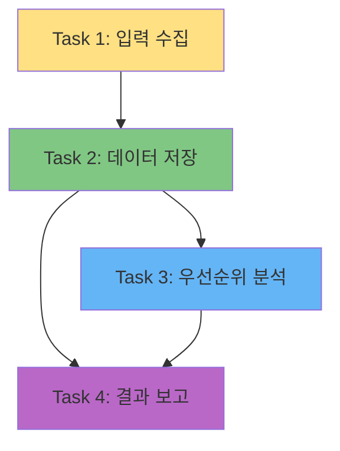
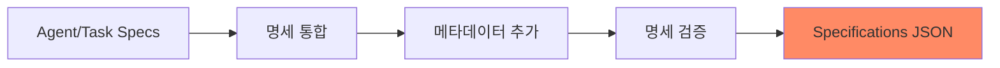
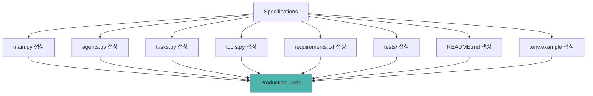
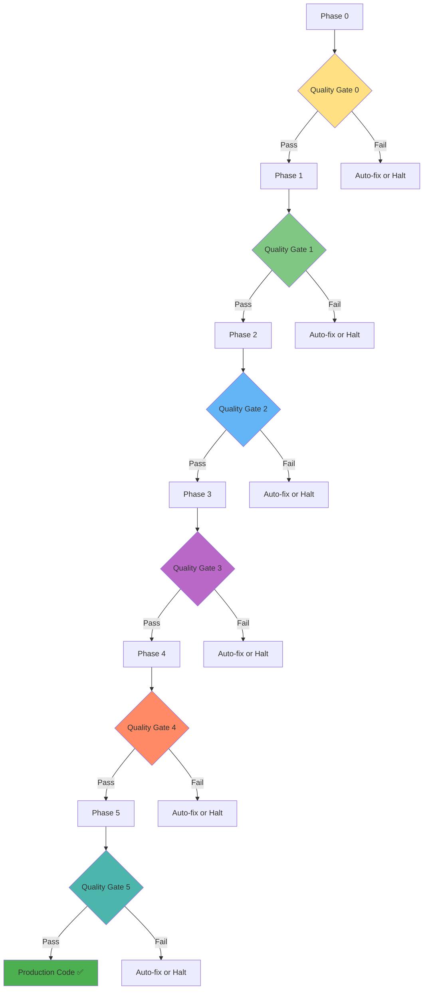

# CAAS 6-Phase 개발 프로세스 완전 가이드

## 🎯 이 문서에서 배울 것
- [ ] 6-Phase Methodology 전체 흐름 이해
- [ ] 각 Phase의 목적, 입력, 출력 파악
- [ ] Phase 간 의존성 및 데이터 흐름 이해
- [ ] Phase별 Quality Gate 및 검증 기준

⏱️ **예상 시간**: 20분

---

## 📖 CAAS 6-Phase Methodology란?

CAAS는 **자연어 요구사항**을 **프로덕션 레디 코드**로 변환하는 **6단계 체계적 방법론**을 사용합니다.



### 왜 6단계인가?

| 전통적 개발 | CAAS 6-Phase |
|------------|--------------|
| 요구사항 → 바로 코드 작성 | 요구사항 → 구조화 → 분석 → 설계 → 명세 → 코드 |
| 개발자 역량 의존 | 체계적 방법론 기반 |
| 일관성 없는 품질 | 일관된 고품질 (8.4/10.0) |
| 추적성 없음 | 완벽한 추적성 (Golden Data → Code) |

---

## 🔄 전체 프로세스 개요

### Phase 간 데이터 흐름



### Phase 요약표

| Phase | 이름 | 목적 | 소요시간 | 주요 산출물 |
|-------|------|------|----------|------------|
| **0** | Concretization | 요구사항 구조화 | 30초 | Golden Data |
| **1** | Discovery | 도메인/기능 분석 | 25초 | Requirement Analysis |
| **2** | Architecture | 시스템 설계 | 20초 | Architecture Design |
| **3** | Design | Agent/Task 설계 | 35초 | Agent/Task Specs |
| **4** | Development | 명세 생성 | 15초 | Specifications JSON |
| **5** | Delivery | 코드 생성 | 40초 | 8 Python Files |
| **합계** | - | - | **2m 45s** | **Production Code** |

---

## Phase 0: Concretization (구조화) 🌟

### 목적
자연어 요구사항을 **구조화된 Golden Data**로 변환합니다.

### 입력
```
자연어 요구사항 (사용자 입력)
예: "할일 관리 시스템을 만들어줘. 할일 추가, 조회, 완료 처리 기능이 필요해"
```

### 처리 과정


### 출력: Golden Data
```json
{
  "features": [
    {
      "id": "f1",
      "name": "할일 추가",
      "description": "사용자가 새로운 할일을 생성",
      "priority": "HIGH",
      "complexity": "LOW"
    },
    {
      "id": "f2",
      "name": "할일 조회",
      "description": "저장된 할일 목록 확인",
      "priority": "HIGH",
      "complexity": "LOW"
    },
    {
      "id": "f3",
      "name": "할일 완료 처리",
      "description": "할일 상태를 완료로 변경",
      "priority": "MEDIUM",
      "complexity": "LOW"
    }
  ],
  "entities": [
    {
      "name": "Todo",
      "attributes": ["id", "title", "description", "status", "created_at"],
      "relationships": []
    }
  ],
  "constraints": [
    "할일 ID는 고유해야 함",
    "완료된 할일은 수정 불가"
  ],
  "business_rules": [
    "할일 제목은 필수 항목",
    "상태는 'pending', 'in_progress', 'completed' 중 하나"
  ]
}
```

### Quality Gate
- ✅ Features 개수: 3개 이상
- ✅ Entities 개수: 1개 이상
- ✅ 모든 Feature에 description 존재
- ✅ 우선순위(priority) 명시

### CLI 명령어
```bash
# Phase 0만 실행
caas generate-phase --phase 0 "요구사항" --output ./project

# Golden Data 확인
cat ./project/golden_data.json
```

---

## Phase 1: Discovery (발견) 🔍

### 목적
Golden Data를 분석하여 **도메인, 복잡도, 패턴**을 식별합니다.

### 입력
- Golden Data (Phase 0 출력)

### 처리 과정


### 출력: Requirement Analysis
```json
{
  "domain": "TASK_MANAGEMENT",
  "domain_confidence": 0.95,
  "complexity": "MEDIUM",
  "estimated_agents": 3,
  "estimated_tasks": 5,
  "patterns_detected": [
    "CRUD",
    "LIST_MANAGEMENT",
    "STATE_MACHINE"
  ],
  "suggested_tools": [
    "DatabaseTool",
    "ValidationTool",
    "NotificationTool"
  ],
  "technical_requirements": {
    "database": "SQLite (lightweight)",
    "ui": "CLI (optional Streamlit)",
    "external_apis": []
  }
}
```

### Quality Gate
- ✅ Domain 분류 신뢰도 > 0.7
- ✅ Complexity 적절성 (features 개수와 일치)
- ✅ Patterns 1개 이상 식별
- ✅ Tools 제안 존재

### 도메인 분류 매트릭스

| Features | 도메인 | 신뢰도 |
|----------|--------|--------|
| 할일 추가/조회/완료 | TASK_MANAGEMENT | 0.95 |
| FAQ 검색/응답 생성 | CONVERSATIONAL_AI | 0.92 |
| CSV 읽기/통계/차트 | DATA_ANALYSIS | 0.98 |
| 주문 생성/결제 | E_COMMERCE | 0.89 |

### CLI 명령어
```bash
# Phase 1 실행
caas generate-phase --phase 1 "요구사항" --output ./project

# Requirement Analysis 확인
cat ./project/requirement_analysis.json
```

---

## Phase 2: Architecture (설계) 🏗️

### 목적
시스템 **아키텍처 및 기술 스택**을 결정합니다.

### 입력
- Golden Data (Phase 0)
- Requirement Analysis (Phase 1)

### 처리 과정


### 출력: Architecture Design
```json
{
  "architecture_pattern": "Sequential Process",
  "process_type": "sequential",
  "manager_llm_required": false,
  "database": {
    "type": "SQLite",
    "schema": {
      "todos": {
        "id": "INTEGER PRIMARY KEY",
        "title": "TEXT NOT NULL",
        "status": "TEXT DEFAULT 'pending'"
      }
    }
  },
  "tools_design": [
    {
      "name": "TodoCRUDTool",
      "purpose": "Create/Read/Update/Delete todos",
      "methods": ["create", "read", "update", "delete"]
    },
    {
      "name": "TodoStatusTool",
      "purpose": "Change todo status",
      "methods": ["mark_complete", "mark_pending"]
    }
  ],
  "agent_workflow": "Agent1 (Input) → Agent2 (Process) → Agent3 (Output)",
  "traceability": {
    "feature_f1_maps_to": "TodoCRUDTool.create",
    "feature_f2_maps_to": "TodoCRUDTool.read",
    "feature_f3_maps_to": "TodoStatusTool.mark_complete"
  }
}
```

### Quality Gate
- ✅ Architecture pattern 선택됨
- ✅ Database 스키마 정의됨
- ✅ Tools 3개 이상 설계됨
- ✅ **Traceability 100%** (모든 Feature → Tool 매핑)

### Architecture Pattern 종류

| Pattern | 설명 | 사용 시나리오 |
|---------|------|--------------|
| **Sequential Process** | Agent가 순차적으로 실행 | 단순 워크플로우, CRUD |
| **Hierarchical** | Manager Agent가 조율 | 복잡한 협업, 의사결정 |
| **Parallel** | Agent가 병렬 실행 | 독립적 작업, 데이터 분석 |
| **Pipeline** | 데이터가 파이프라인 흐름 | ETL, 데이터 처리 |

### CLI 명령어
```bash
# Phase 2 실행
caas generate-phase --phase 2 "요구사항" --output ./project

# Architecture Design 확인
cat ./project/architecture_design.json

# Traceability 검증
caas validate --validator traceability --arch ./project/architecture_design.json
```

---

## Phase 3: Design (상세 설계) 🎨

### 목적
**Agent와 Task를 구체적으로 설계**합니다.

### 입력
- Golden Data (Phase 0)
- Requirement Analysis (Phase 1)
- Architecture Design (Phase 2)

### 처리 과정


### 출력: Agent/Task Specs

**Agents**:
```json
{
  "agents": [
    {
      "id": "agent_1",
      "role": "할일 수집 담당자",
      "goal": "사용자로부터 할일 정보를 정확히 수집",
      "backstory": "당신은 사용자 입력을 전문적으로 처리하는 AI 에이전트입니다.",
      "tools": ["InputValidationTool"],
      "max_iter": 3,
      "verbose": true
    },
    {
      "id": "agent_2",
      "role": "할일 처리 담당자",
      "goal": "할일 데이터를 데이터베이스에 저장하고 관리",
      "backstory": "당신은 데이터베이스 작업을 전문으로 하는 AI 에이전트입니다.",
      "tools": ["TodoCRUDTool", "TodoStatusTool"],
      "max_iter": 5,
      "verbose": true
    },
    {
      "id": "agent_3",
      "role": "결과 보고 담당자",
      "goal": "처리 결과를 사용자 친화적으로 보고",
      "backstory": "당신은 결과를 명확하게 전달하는 커뮤니케이션 전문가입니다.",
      "tools": ["ReportGeneratorTool"],
      "max_iter": 2,
      "verbose": true
    }
  ]
}
```

**Tasks**:
```json
{
  "tasks": [
    {
      "id": "task_1",
      "description": "사용자로부터 할일 제목, 설명, 우선순위를 입력받습니다. 입력값을 검증하고 다음 단계로 전달합니다.",
      "expected_output": "검증된 할일 정보 (JSON 형식)",
      "agent_id": "agent_1",
      "context": [],
      "async_execution": false
    },
    {
      "id": "task_2",
      "description": "입력받은 할일을 데이터베이스에 저장합니다.",
      "expected_output": "생성된 할일 ID 및 확인 메시지",
      "agent_id": "agent_2",
      "context": ["task_1"],
      "async_execution": false
    },
    {
      "id": "task_3",
      "description": "저장된 할일의 우선순위를 분석하고 추천 일정을 제안합니다.",
      "expected_output": "우선순위 분석 결과 및 일정 추천",
      "agent_id": "agent_2",
      "context": ["task_2"],
      "async_execution": false
    },
    {
      "id": "task_4",
      "description": "처리 결과를 요약하고 사용자에게 보고합니다.",
      "expected_output": "사용자 친화적인 최종 보고서",
      "agent_id": "agent_3",
      "context": ["task_2", "task_3"],
      "async_execution": false
    }
  ]
}
```

### Task Dependency Graph (DAG)


### Quality Gate
- ✅ Agent 개수: 3-7개 (권장)
- ✅ Task 개수: Agent 개수 × 1.5배 이상
- ✅ 모든 Task에 agent_id 할당
- ✅ Task Dependencies가 순환 없는 DAG
- ✅ **Completeness 100%** (모든 Feature → Task 매핑)

### Agent/Task 설계 원칙

#### Agent 설계 원칙
1. **Single Responsibility**: 하나의 명확한 역할
2. **Clear Goal**: 측정 가능한 목표
3. **Contextual Backstory**: Agent 성격 정의
4. **Right Tools**: 필요한 도구만 할당

#### Task 설계 원칙
1. **Atomic**: 하나의 작업 단위
2. **Descriptive**: 구체적인 작업 설명
3. **Expected Output**: 명확한 출력 정의
4. **Context**: 의존성 명시

### CLI 명령어
```bash
# Phase 3 실행
caas generate-phase --phase 3 "요구사항" --output ./project

# Agent/Task 확인
cat ./project/agents.json
cat ./project/tasks.json

# Completeness 검증
caas validate --validator completeness \
  --golden ./project/golden_data.json \
  --agents ./project/agents.json \
  --tasks ./project/tasks.json
```

---

## Phase 4: Development (명세 생성) 📋

### 목적
Agent/Task 설계를 **실행 가능한 명세 (Specifications)**로 변환합니다.

### 입력
- Agent Specs (Phase 3)
- Task Specs (Phase 3)
- Architecture Design (Phase 2)

### 처리 과정


### 출력: Specifications JSON
```json
{
  "project_name": "todo_management_system",
  "version": "1.0.0",
  "crewai_version": ">=0.28.0",
  "agents": [...],  // Phase 3 Agent Specs
  "tasks": [...],   // Phase 3 Task Specs
  "tools": [
    {
      "name": "TodoCRUDTool",
      "class_name": "TodoCRUDTool",
      "methods": ["create", "read", "update", "delete"],
      "dependencies": ["sqlite3"]
    },
    ...
  ],
  "crew_config": {
    "process": "sequential",
    "verbose": true,
    "memory": false,
    "manager_llm": null
  },
  "deployment": {
    "environment": "production",
    "python_version": "3.11",
    "required_env_vars": ["OPENAI_API_KEY"]
  }
}
```

### Quality Gate
- ✅ specifications.json 유효한 JSON
- ✅ CrewAI 호환성 검증
- ✅ Python 3.11+ 호환성
- ✅ 모든 도구 의존성 명시

### CLI 명령어
```bash
# Phase 4 실행
caas generate-phase --phase 4 "요구사항" --output ./project

# Specifications 확인
cat ./project/specifications.json

# 검증
caas validate --validator crewai --spec ./project/specifications.json
```

---

## Phase 5: Delivery (코드 생성) 🚀

### 목적
Specifications를 기반으로 **프로덕션 레디 Python 코드**를 생성합니다.

### 입력
- Specifications JSON (Phase 4)
- Golden Data (Phase 0)
- Architecture Design (Phase 2)

### 처리 과정


### 출력: 8개 파일

#### 1. main.py (메인 실행 파일)
```python
#!/usr/bin/env python
# -*- coding: utf-8 -*-
"""
Todo Management System
Created by CAAS v0.5.1
"""

import sys
from crewai import Crew
from agents import create_agents
from tasks import create_tasks


def run():
    """Main execution function"""
    # Create agents and tasks
    agents = create_agents()
    tasks = create_tasks(agents)

    # Create crew
    crew = Crew(
        agents=list(agents.values()),
        tasks=list(tasks.values()),
        process="sequential",
        verbose=True,
    )

    # Run crew
    result = crew.kickoff()
    print("\n" + "="*50)
    print("📊 최종 결과:")
    print(result)
    print("="*50 + "\n")

    return result


if __name__ == "__main__":
    run()
```

#### 2. agents.py (Agent 정의)
```python
from crewai import Agent
from tools import TodoCRUDTool, TodoStatusTool, ReportGeneratorTool


def create_agents():
    """Create all agents"""
    agents = {}

    # Agent 1: 할일 수집 담당자
    agents["input_agent"] = Agent(
        role="할일 수집 담당자",
        goal="사용자로부터 할일 정보를 정확히 수집",
        backstory="당신은 사용자 입력을 전문적으로 처리하는 AI 에이전트입니다.",
        tools=[InputValidationTool()],
        max_iter=3,
        verbose=True,
    )

    # Agent 2: 할일 처리 담당자
    agents["process_agent"] = Agent(
        role="할일 처리 담당자",
        goal="할일 데이터를 데이터베이스에 저장하고 관리",
        backstory="당신은 데이터베이스 작업을 전문으로 하는 AI 에이전트입니다.",
        tools=[TodoCRUDTool(), TodoStatusTool()],
        max_iter=5,
        verbose=True,
    )

    # Agent 3: 결과 보고 담당자
    agents["report_agent"] = Agent(
        role="결과 보고 담당자",
        goal="처리 결과를 사용자 친화적으로 보고",
        backstory="당신은 결과를 명확하게 전달하는 커뮤니케이션 전문가입니다.",
        tools=[ReportGeneratorTool()],
        max_iter=2,
        verbose=True,
    )

    return agents
```

#### 3. tasks.py (Task 정의)
```python
from crewai import Task


def create_tasks(agents):
    """Create all tasks"""
    tasks = {}

    # Task 1: 입력 수집
    tasks["collect"] = Task(
        description="사용자로부터 할일 제목, 설명, 우선순위를 입력받습니다.",
        expected_output="검증된 할일 정보 (JSON 형식)",
        agent=agents["input_agent"],
    )

    # Task 2: 데이터 저장
    tasks["save"] = Task(
        description="입력받은 할일을 데이터베이스에 저장합니다.",
        expected_output="생성된 할일 ID 및 확인 메시지",
        agent=agents["process_agent"],
        context=[tasks["collect"]],
    )

    # Task 3: 우선순위 분석
    tasks["analyze"] = Task(
        description="저장된 할일의 우선순위를 분석하고 추천 일정을 제안합니다.",
        expected_output="우선순위 분석 결과 및 일정 추천",
        agent=agents["process_agent"],
        context=[tasks["save"]],
    )

    # Task 4: 결과 보고
    tasks["report"] = Task(
        description="처리 결과를 요약하고 사용자에게 보고합니다.",
        expected_output="사용자 친화적인 최종 보고서",
        agent=agents["report_agent"],
        context=[tasks["save"], tasks["analyze"]],
    )

    return tasks
```

#### 4. tools.py (커스텀 도구)
```python
from crewai_tools import BaseTool
import sqlite3


class TodoCRUDTool(BaseTool):
    """할일 CRUD 작업 도구"""

    name: str = "Todo CRUD Tool"
    description: str = "할일을 생성, 조회, 수정, 삭제합니다."

    def _run(self, operation: str, **kwargs) -> str:
        """Execute CRUD operation"""
        conn = sqlite3.connect("todos.db")
        cursor = conn.cursor()

        if operation == "create":
            cursor.execute(
                "INSERT INTO todos (title, status) VALUES (?, ?)",
                (kwargs["title"], "pending")
            )
            conn.commit()
            return f"할일 생성 완료: ID {cursor.lastrowid}"

        elif operation == "read":
            cursor.execute("SELECT * FROM todos")
            rows = cursor.fetchall()
            return f"조회된 할일: {len(rows)}개"

        # ... update, delete 구현

        conn.close()
```

#### 5. requirements.txt
```
crewai>=0.28.0
langchain>=0.1.0
openai>=1.0.0
python-dotenv>=1.0.0
```

#### 6. tests/test_crew.py
```python
import pytest
from agents import create_agents
from tasks import create_tasks


def test_agents_created():
    """Test agent creation"""
    agents = create_agents()
    assert len(agents) == 3
    assert "input_agent" in agents


def test_tasks_created():
    """Test task creation"""
    agents = create_agents()
    tasks = create_tasks(agents)
    assert len(tasks) == 4
    assert "collect" in tasks
```

#### 7. README.md
```markdown
# Todo Management System

Created by CAAS v0.5.1

## Installation
```bash
pip install -r requirements.txt
```

## Usage
```bash
python main.py
```

## Features
- ✅ 할일 추가
- ✅ 할일 조회
- ✅ 할일 완료 처리
```

#### 8. .env.example
```bash
OPENAI_API_KEY=your-key-here
```

### Quality Gate
- ✅ 8개 파일 모두 생성
- ✅ Python 구문 오류 없음 (AST 파싱 성공)
- ✅ CrewAI import 성공
- ✅ 코드 품질 > 8.0/10.0
- ✅ 보안 이슈 0개 (Bandit 스캔)

### CLI 명령어
```bash
# Phase 5 실행
caas generate-phase --phase 5 "요구사항" --output ./project

# 생성된 파일 확인
ls -la ./project/

# 코드 품질 검증
caas validate --validator code-quality --project ./project/
```

---

## 🔄 Phase 간 의존성 매트릭스

| 출력 Phase | 0 | 1 | 2 | 3 | 4 | 5 |
|-----------|---|---|---|---|---|---|
| **Phase 0** | - | ✅ | ✅ | ✅ | - | ✅ |
| **Phase 1** | - | - | ✅ | ✅ | - | - |
| **Phase 2** | - | - | - | ✅ | ✅ | ✅ |
| **Phase 3** | - | - | - | - | ✅ | ✅ |
| **Phase 4** | - | - | - | - | - | ✅ |
| **Phase 5** | - | - | - | - | - | - |

**해석**:
- Phase 5는 Phase 0, 2, 3, 4의 출력을 모두 사용
- Phase 3은 Phase 0, 1, 2의 출력을 사용
- Phase 2는 Phase 1의 출력을 사용

---

## 📊 Phase별 Quality Gates 요약



### Quality Gate 기준표

| Phase | 검증 항목 | 기준값 | 자동 수정 가능 |
|-------|---------|--------|---------------|
| **0** | Features 개수 | ≥3 | ❌ (사용자 입력 필요) |
| **0** | Entities 개수 | ≥1 | ❌ |
| **1** | Domain 신뢰도 | >0.7 | ✅ (재분류) |
| **1** | Patterns 개수 | ≥1 | ✅ |
| **2** | Traceability | 100% | ✅ (매핑 추가) |
| **2** | Tools 개수 | ≥3 | ✅ (도구 생성) |
| **3** | Agent 개수 | 3-7 | ✅ (병합/분할) |
| **3** | Task Completeness | 100% | ✅ (Task 추가) |
| **3** | DAG 순환 체크 | 순환 없음 | ✅ (재정렬) |
| **4** | JSON 유효성 | Valid | ✅ (재생성) |
| **4** | CrewAI 호환성 | 100% | ✅ |
| **5** | 파일 개수 | 8개 | ✅ (재생성) |
| **5** | 코드 품질 | >8.0 | ✅ (코드 수정) |
| **5** | 보안 이슈 | 0개 | ✅ (패턴 수정) |

---

## 🎯 실전 활용 시나리오

### 시나리오 1: 빠른 프로토타입 (전체 자동)
```bash
# 한 번에 Phase 0-5 실행
caas generate "할일 관리 시스템" --output ./todo-app

# 실행
cd todo-app
pip install -r requirements.txt
python main.py
```

**소요 시간**: 2-4분
**용도**: 주니어, 빠른 검증

---

### 시나리오 2: 단계별 검토 (엔터프라이즈)
```bash
# Phase 0: Concretization
caas generate-phase --phase 0 "복잡한 요구사항" --output ./project
cat ./project/golden_data.json  # 검토

# Phase 1: Discovery
caas generate-phase --phase 1 "복잡한 요구사항" --output ./project
cat ./project/requirement_analysis.json  # 검토

# Phase 2: Architecture
caas generate-phase --phase 2 "복잡한 요구사항" --output ./project
cat ./project/architecture_design.json  # 검토

# Phase 3: Design
caas generate-phase --phase 3 "복잡한 요구사항" --output ./project
cat ./project/agents.json
cat ./project/tasks.json  # 검토 및 수동 수정 가능

# Phase 4-5: 코드 생성
caas generate-phase --phase 4 "복잡한 요구사항" --output ./project
caas generate-phase --phase 5 "복잡한 요구사항" --output ./project
```

**소요 시간**: 10-15분 (검토 시간 포함)
**용도**: 시니어, 엔터프라이즈, 중요 프로젝트

---

### 시나리오 3: 오류 발생 시 재시도
```bash
# Phase 3에서 실패한 경우 - 동일 Phase 재실행
caas generate-phase --phase 3 \
  --input ./project \
  --output ./project

# 또는 수동 수정 후 이어서 진행
vim ./project/agents.json  # 수동 수정

# Phase 4로 이어서 진행 (이전 결과 활용)
caas generate-phase --phase 4 \
  --input ./project \
  --output ./project
```

---

## 📚 다음 단계

### 초보자 (Phase 이해 완료)
1. ➡️ **[11_Phase별_요구사항_작성법.md](./11_Phase별_요구사항_작성법.md)** - 각 Phase에 최적화된 요구사항 작성
2. **[12_Golden_Data_활용법.md](./12_Golden_Data_활용법.md)** - Phase 0 산출물 커스터마이징

### 중급자 (시니어)
1. ➡️ **[13_Agent_Task_설계_가이드.md](./13_Agent_Task_설계_가이드.md)** - Agent/Task 최적 설계 패턴
2. **[31_Phase별_산출물_관리.md](../3_프로젝트_관리_PM/31_Phase별_산출물_관리.md)** - PM을 위한 산출물 검수

### 고급 사용자
1. ➡️ **[50_TDD_자동화_가이드.md](../5_엔터프라이즈_기능/50_TDD_자동화_가이드.md)** - TDD 워크플로우 통합
2. **[51_QA_자동화_가이드.md](../5_엔터프라이즈_기능/51_QA_자동화_가이드.md)** - 품질 보증 자동화

---

## 🔗 관련 문서

- **[02_5분_빠른_시작.md](../1_시작하기/02_5분_빠른_시작.md)** - 실전 예시로 빠르게 시작
- **[20_CLI_명령어_레퍼런스.md](./20_CLI_명령어_레퍼런스.md)** - 모든 CLI 명령어 상세
- **[22_트러블슈팅_가이드.md](./22_트러블슈팅_가이드.md)** - Phase별 흔한 오류 해결

---

**작성일**: 2026-02-14
**버전**: v0.5.1 (Core) + v0.6.3 (CAAS-E)
**대상**: 주니어/시니어 개발자, PM
**난이도**: ⭐⭐ 기초-중급
