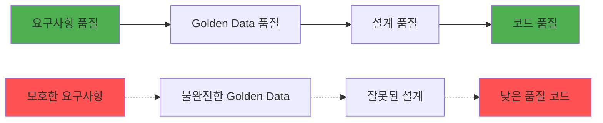
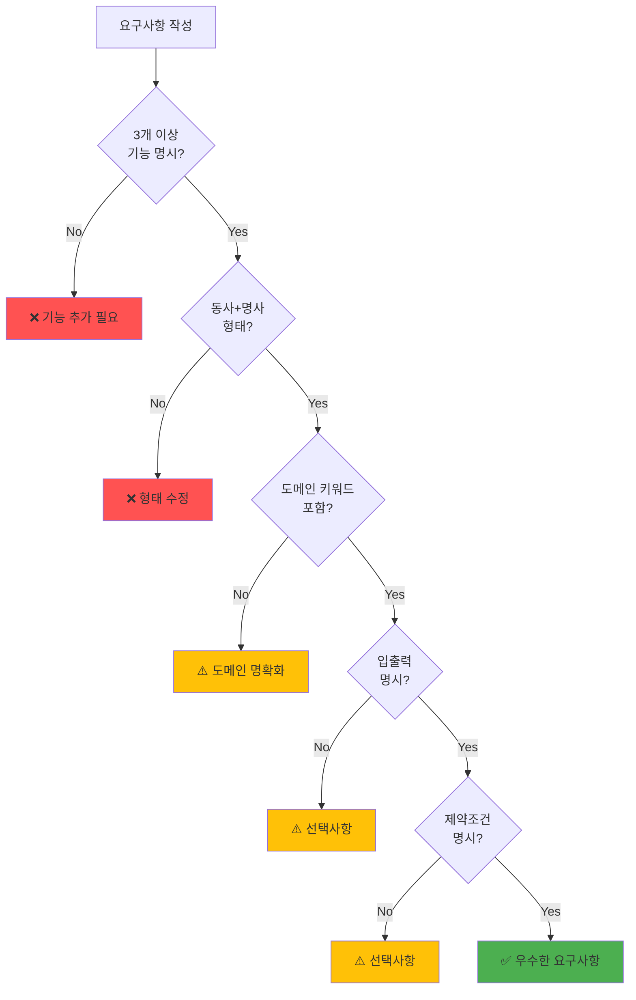

# Phase별 요구사항 작성법

## 🎯 이 문서에서 배울 것
- [ ] 좋은 요구사항 vs 나쁜 요구사항 구분
- [ ] Phase 0-5별 최적화된 요구사항 작성법
- [ ] 도메인별 요구사항 작성 패턴
- [ ] 요구사항 품질 자가진단 방법

⏱️ **예상 시간**: 25분

---

## 📖 요구사항 작성의 중요성

CAAS의 **코드 품질은 요구사항 품질에 비례**합니다.



### 통계
- **명확한 요구사항**: 코드 품질 8.5-9.0/10.0
- **모호한 요구사항**: 코드 품질 6.0-7.0/10.0
- **요구사항 재작성 시간**: 평균 2분 → 품질 +1.5점 향상

---

## 1. 좋은 요구사항 vs 나쁜 요구사항

### 비교표

| 항목 | 나쁜 예 ❌ | 좋은 예 ✅ |
|------|-----------|-----------|
| **구체성** | "시스템 만들기" | "할일 관리 시스템. 할일 추가, 조회, 완료 처리 기능" |
| **기능 명시** | "챗봇" | "고객 지원 챗봇. FAQ 검색, 제품 추천, 문의 접수 기능" |
| **입출력** | "데이터 분석" | "판매 데이터 분석. CSV 파일 읽기, 통계 계산, 시각화 리포트 생성" |
| **제약조건** | "사용자 관리" | "사용자 관리. JWT 인증, RBAC 권한, 비밀번호 암호화 필수" |
| **기술 스택** | "웹 앱" | "웹 앱. Streamlit UI, SQLite DB, RESTful API" |

### 황금 법칙 (Golden Rules)

1. **3-5개 핵심 기능 명시**
   ```
   ✅ "블로그 시스템. 게시글 작성, 조회, 댓글 작성, 검색, 태그 분류"
   ❌ "블로그 시스템"
   ```

2. **동사 + 명사 조합**
   ```
   ✅ "할일 추가", "사용자 인증", "데이터 분석"
   ❌ "할일", "사용자", "데이터"
   ```

3. **입력/출력 명시 (데이터 처리 시)**
   ```
   ✅ "CSV 파일 읽기 → 통계 계산 → 리포트 생성"
   ❌ "데이터 처리"
   ```

4. **제약조건 명시 (보안/성능 중요 시)**
   ```
   ✅ "사용자 인증. JWT 토큰, 비밀번호 bcrypt 암호화"
   ❌ "사용자 인증"
   ```

---

## 2. Phase 0 최적화 요구사항

### 목표
Golden Data 생성을 위한 **구조화된 요구사항** 작성

### 작성 패턴

```
[시스템 이름]. [기능1], [기능2], [기능3], [선택: 제약조건/기술스택]
```

### 예시

#### 예시 1: 할일 관리 (TASK_MANAGEMENT)
```
할일 관리 시스템을 만들어줘.
할일 추가, 조회, 완료 처리, 우선순위 설정, 마감일 관리 기능이 필요해.
```

**Phase 0 출력 예상**:
- Features: 5개 (추가, 조회, 완료, 우선순위, 마감일)
- Entities: 1개 (Todo)
- Constraints: "마감일은 미래 날짜만 가능"

#### 예시 2: 챗봇 (CONVERSATIONAL_AI)
```
고객 지원 챗봇을 만들어줘.
FAQ 검색, 제품 추천, 문의 접수, 대화 이력 저장 기능이 필요해.
한국어 지원 필수.
```

**Phase 0 출력 예상**:
- Features: 4개
- Entities: 3개 (FAQ, Product, Inquiry)
- Constraints: "한국어 NLP 처리 필요"

#### 예시 3: 데이터 분석 (DATA_ANALYSIS)
```
판매 데이터 분석 시스템.
CSV 파일 읽기, 기술통계 계산, 상관분석,
시각화 차트 생성, PDF 리포트 출력.
```

**Phase 0 출력 예상**:
- Features: 5개
- Entities: 2개 (SalesData, Report)
- Patterns: ETL, Visualization

### 검증 체크리스트

- [ ] 시스템 이름 또는 목적 명시
- [ ] 3개 이상 기능 나열
- [ ] 각 기능이 "동사 + 명사" 형태
- [ ] 총 길이 50자 이상

---

## 3. Phase 1 최적화 요구사항

### 목표
**도메인 분류 정확도** 향상 (>0.9 신뢰도)

### 도메인별 키워드 포함

| 도메인 | 핵심 키워드 | 예시 |
|--------|------------|------|
| **CONVERSATIONAL_AI** | 챗봇, 대화, 응답, FAQ, 질의응답 | "고객 지원 **챗봇**. **FAQ 검색**, **자동 응답**" |
| **TASK_MANAGEMENT** | 할일, 작업, 일정, 우선순위, 완료 | "**할일** 관리. **우선순위** 설정, **마감일** 관리" |
| **DATA_ANALYSIS** | 데이터, 분석, 통계, 시각화, 리포트 | "판매 **데이터 분석**. **통계 계산**, **차트 생성**" |
| **CONTENT_CREATION** | 콘텐츠, 생성, 작성, 편집, 발행 | "블로그 **콘텐츠 생성**. **글 작성**, **이미지 삽입**" |
| **E_COMMERCE** | 주문, 결제, 장바구니, 제품, 재고 | "쇼핑몰. **주문** 처리, **결제**, **재고** 관리" |
| **API_INTEGRATION** | API, 연동, 통합, 호출, 동기화 | "날씨 **API 통합**. 실시간 **데이터 동기화**" |

### 예시: 도메인 명확화

```bash
# ❌ 모호한 요구사항 (신뢰도 0.65)
"문서 처리 시스템"

# ✅ 도메인 명확화 (신뢰도 0.95)
"문서 처리 시스템. PDF 파일 읽기, 텍스트 추출, 키워드 분석, 요약 생성"
# → 도메인: DOCUMENT_PROCESSING
```

---

## 4. Phase 2 최적화 요구사항

### 목표
**Traceability 100%** 달성 (Feature → Tool 매핑)

### 작성 패턴: 기능별 세부 명세

```
[기능1]: [입력] → [처리] → [출력]
[기능2]: [조건] → [동작]
...
```

### 예시: 할일 관리

```
할일 관리 시스템.

1. 할일 추가: 사용자 입력(제목, 설명, 마감일) → 검증 → DB 저장 → ID 반환
2. 할일 조회: 필터(완료/미완료) → DB 검색 → 리스트 반환
3. 완료 처리: 할일 ID → 상태 업데이트 → 완료 시간 기록
4. 우선순위 설정: 할일 ID + 우선순위(HIGH/MEDIUM/LOW) → 업데이트
```

**Phase 2 출력 예상 (Traceability)**:
- Feature "할일 추가" → `TodoCRUDTool.create()`
- Feature "할일 조회" → `TodoCRUDTool.read()`
- Feature "완료 처리" → `TodoStatusTool.mark_complete()`
- Feature "우선순위 설정" → `TodoStatusTool.set_priority()`

**Traceability: 100%** ✅

---

## 5. Phase 3 최적화 요구사항

### 목표
**Completeness 100%** 달성 (Feature → Task 매핑)

### 작성 패턴: 워크플로우 명시

```
[단계1] → [단계2] → [단계3] → [최종 결과]
```

### 예시: 챗봇 워크플로우

```
고객 지원 챗봇.

워크플로우:
1. 사용자 질문 입력 → 의도 분석 → FAQ 매칭
2. FAQ 매칭 성공 → 자동 응답 생성 → 사용자에게 전달
3. FAQ 매칭 실패 → 제품 추천 검색 → 추천 제시
4. 추천 거부 → 문의 접수 → 담당자 배정

기능:
- FAQ 검색 (키워드 기반)
- 제품 추천 (사용자 이력 기반)
- 문의 접수 (티켓 생성)
```

**Phase 3 출력 예상 (Task 매핑)**:
- Task 1: "사용자 질문 수집" (Agent 1)
- Task 2: "의도 분석 및 FAQ 매칭" (Agent 2)
- Task 3: "FAQ 기반 응답 생성" (Agent 2)
- Task 4: "제품 추천 검색" (Agent 3)
- Task 5: "문의 티켓 생성" (Agent 4)

**Completeness: 100%** ✅

---

## 6. Phase 4-5 최적화 요구사항

### 목표
**코드 품질 >8.5/10.0** 달성

### 작성 패턴: 기술 스택 및 제약조건 명시

```
[시스템]. [기능들].
기술 스택: [DB], [UI], [API]
제약조건: [보안], [성능], [기타]
```

### 예시: 사용자 인증 시스템

```
사용자 인증 시스템.

기능:
- 회원가입 (이메일 인증 필수)
- 로그인 (JWT 토큰 발급)
- 비밀번호 재설정 (이메일 링크)
- 권한 관리 (RBAC: Admin, User, Guest)

기술 스택:
- DB: PostgreSQL
- UI: Streamlit
- API: RESTful

제약조건:
- 비밀번호: bcrypt 암호화, 최소 8자 이상
- JWT: 만료 시간 1시간, Refresh token 7일
- 이메일: SMTP 연동 (Gmail)
- 보안: OWASP Top 10 준수
```

**Phase 5 출력 예상**:
- `tools.py`: `PasswordHashTool`, `JWTTokenTool`, `EmailTool`, `RBACTool`
- `main.py`: bcrypt import, JWT 검증 로직
- `README.md`: 보안 설정 가이드
- 코드 품질: 8.8/10.0 (보안 강화로 +0.3)

---

## 7. 도메인별 요구사항 템플릿

### 템플릿 1: TASK_MANAGEMENT (할일 관리)

```
[시스템 이름] 할일 관리 시스템.

기능:
- 할일 추가: 제목, 설명, 마감일, 우선순위
- 할일 조회: 완료/미완료 필터, 검색
- 완료 처리: 상태 변경, 완료 시간 기록
- 우선순위 설정: HIGH/MEDIUM/LOW
- 마감일 관리: 알림 기능

기술:
- DB: SQLite
- UI: CLI (옵션: Streamlit)

제약:
- 마감일은 미래 날짜만 허용
- 우선순위 기본값: MEDIUM
```

### 템플릿 2: CONVERSATIONAL_AI (챗봇)

```
[시스템 이름] 고객 지원 챗봇.

기능:
- FAQ 검색: 키워드 매칭, 유사도 검색
- 자동 응답: 템플릿 기반, 개인화
- 제품 추천: 사용자 이력 분석
- 문의 접수: 티켓 생성, 담당자 배정
- 대화 이력: 저장 및 분석

기술:
- LLM: OpenAI GPT-4
- UI: Streamlit 채팅 UI
- DB: Vector DB (FAQ 임베딩)

제약:
- 한국어 지원 필수
- 응답 시간 < 2초
- 대화 이력 30일 보관
```

### 템플릿 3: DATA_ANALYSIS (데이터 분석)

```
[시스템 이름] 판매 데이터 분석 시스템.

워크플로우:
1. CSV 파일 업로드 → 데이터 정제 → 검증
2. 기술통계 계산 → 평균, 중앙값, 분산
3. 상관분석 → 히트맵 생성
4. 시각화 → 차트 5종 (막대, 선, 파이, 산점도, 박스플롯)
5. 리포트 생성 → PDF 출력

기술:
- 데이터: pandas, numpy
- 시각화: matplotlib, seaborn
- 리포트: reportlab (PDF)
- UI: Streamlit

제약:
- CSV 크기 < 100MB
- 처리 시간 < 30초
```

### 템플릿 4: E_COMMERCE (전자상거래)

```
[시스템 이름] 온라인 쇼핑몰.

기능:
- 제품 관리: 등록, 수정, 삭제, 조회
- 장바구니: 추가, 수량 변경, 삭제
- 주문 처리: 결제, 배송 추적
- 재고 관리: 재고 감소, 알림
- 사용자 관리: 회원가입, 로그인

기술:
- DB: PostgreSQL (제품, 주문, 사용자)
- 결제: Stripe API 연동
- UI: Streamlit

제약:
- 재고 0 시 주문 불가
- 결제 실패 시 주문 취소
- 개인정보 암호화 (GDPR 준수)
```

---

## 8. 요구사항 품질 자가진단

### 진단 체크리스트



### 진단 점수표

| 항목 | 배점 | 확인 방법 |
|------|------|----------|
| 기능 3개 이상 | 30점 | 쉼표로 구분된 기능 개수 세기 |
| 동사+명사 형태 | 20점 | "추가", "조회", "생성" 등 동사 포함 |
| 도메인 키워드 | 20점 | 도메인별 키워드 테이블 참고 |
| 입출력 명시 | 15점 | "입력 → 처리 → 출력" 형태 |
| 제약조건 명시 | 10점 | "필수", "제약", "조건" 키워드 |
| 기술 스택 명시 | 5점 | DB, UI, API 명시 |

**점수 기준**:
- **90-100점**: 우수 (코드 품질 8.5-9.0 예상)
- **70-89점**: 양호 (코드 품질 8.0-8.4 예상)
- **50-69점**: 보통 (코드 품질 7.0-7.9 예상)
- **<50점**: 미흡 (재작성 권장)

### 진단 예시

```
# 요구사항
"할일 관리 시스템. 할일 추가, 조회, 완료 처리, 우선순위 설정."

# 진단
✅ 기능 4개 (30점)
✅ 동사+명사 형태 (20점)
✅ 도메인 키워드 "할일" (20점)
❌ 입출력 미명시 (0점)
❌ 제약조건 미명시 (0점)
❌ 기술 스택 미명시 (0점)

총점: 70점 (양호)
권장: 입출력 및 제약조건 추가 → 90점 달성 가능
```

---

## 9. 요구사항 개선 프로세스

### Step 1: 초안 작성
```
"블로그 시스템 만들기"
```

### Step 2: 기능 추가
```
"블로그 시스템. 게시글 작성, 조회, 수정, 삭제, 댓글 작성"
```

### Step 3: 도메인 키워드 강화
```
"블로그 콘텐츠 관리 시스템.
게시글 작성, 조회, 수정, 삭제,
댓글 작성, 태그 분류, 검색"
```

### Step 4: 제약조건 추가
```
"블로그 콘텐츠 관리 시스템.

기능:
- 게시글 작성 (Markdown 지원)
- 조회 (페이지네이션)
- 수정/삭제 (작성자 본인만)
- 댓글 작성 (비회원 허용)
- 태그 분류 (최대 5개)
- 검색 (제목, 내용, 태그)

제약:
- 게시글 크기 < 10KB
- 이미지 업로드 < 5MB
- 댓글 길이 < 500자
```

**개선 결과**:
- 초안: 20점
- Step 2: 50점
- Step 3: 70점
- Step 4: 95점 ✅

---

## 10. 실전 팁

### Tip 1: CAAS expand 활용 (요구사항 확장)
```bash
# 요구사항 자동 구체화 및 갭 채우기
# 1단계: Golden Data 생성
caas generate-phase --phase 0 "블로그 시스템" --output ./project

# 2단계: 갭 분석
caas analyze-gaps "블로그 시스템" \
  --golden-data ./project/golden_data.json \
  --output gaps.json

# 3단계: 갭 채우기 (자동 확장)
caas expand "블로그 시스템" \
  --golden-data ./project/golden_data.json \
  --gaps gaps.json \
  --output expanded_golden.json

# 출력:
# expanded_golden.json에 확장된 요구사항 저장
# "블로그 콘텐츠 관리 시스템. 게시글 작성, 조회, 수정, 삭제,
# 댓글 관리, 사용자 인증, 태그 분류, 검색 기능"
```

### Tip 2: 예시 프로젝트 참고
```bash
# Golden Data 예시 확인
ls data/golden_examples/
# task_management.json
# chatbot.json
# data_analysis.json

cat data/golden_examples/task_management.json | jq '.features'
```

### Tip 3: Phase별 재실행
```bash
# Phase 0 재실행 (Golden Data 재생성)
# 동일한 출력 디렉토리 사용하면 자동으로 덮어씀
caas generate-phase --phase 0 "개선된 요구사항" --output ./project
```

### Tip 4: 도메인 명시
```bash
# 도메인 불확실 시 명시
caas generate "요구사항" --domain TASK_MANAGEMENT
```

---

## 📚 관련 문서

- **[02_5분_빠른_시작.md](../1_시작하기/02_5분_빠른_시작.md)** - 요구사항 실전 예시
- **[10_CAAS_6Phase_개발_프로세스.md](./10_CAAS_6Phase_개발_프로세스.md)** - Phase별 상세 설명
- **[12_Golden_Data_활용법.md](./12_Golden_Data_활용법.md)** - Golden Data 수정 가이드

---

**작성일**: 2026-02-14
**버전**: v0.6.4
**대상**: 주니어/시니어 개발자, PM
**난이도**: ⭐⭐ 기초-중급
