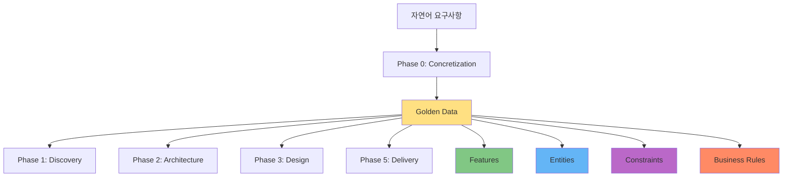
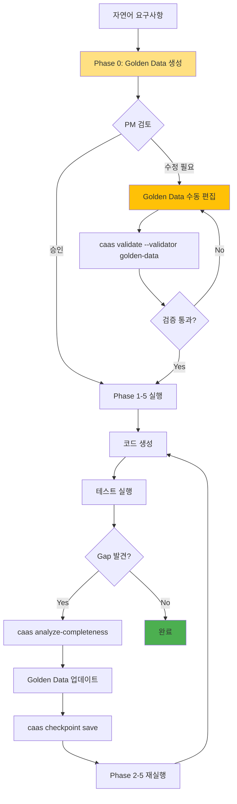

# Golden Data 활용법

## 🎯 이 문서에서 배울 것
- [ ] Golden Data 구조 및 역할 이해
- [ ] Golden Data 수동 편집 및 커스터마이징
- [ ] Golden Data 재사용 및 버전 관리
- [ ] Golden Data 품질 검증 및 최적화

⏱️ **예상 시간**: 30분

---

## 📖 Golden Data란?

**Golden Data**는 CAAS의 **핵심 데이터 구조**로, 모든 Phase의 기준이 되는 **구조화된 요구사항**입니다.



### 역할

1. **추적성 (Traceability)**: Feature → Tool → Task → Code 매핑의 기준점
2. **일관성 (Consistency)**: 모든 Phase가 동일한 요구사항 참조
3. **검증 (Validation)**: Completeness 검증의 기준
4. **재사용 (Reusability)**: 프로젝트 템플릿으로 활용

---

## 1. Golden Data 구조

### 파일 위치
```
{project}/golden_data.json
```

### 전체 구조

```json
{
  "project_name": "todo_management_system",
  "domain": "TASK_MANAGEMENT",
  "features": [...],        // 핵심 기능 목록 (3-10개)
  "entities": [...],        // 데이터 엔티티 (1-5개)
  "constraints": [...],     // 제약 조건 (0-10개)
  "business_rules": [...],  // 비즈니스 규칙 (0-10개)
  "metadata": {...}         // 메타데이터
}
```

### 1.1 Features (기능)

**구조**:
```json
{
  "id": "f1",
  "name": "할일 추가",
  "description": "사용자가 새로운 할일을 생성하고 데이터베이스에 저장",
  "priority": "HIGH",
  "complexity": "LOW",
  "acceptance_criteria": [
    "제목은 필수 입력 항목",
    "마감일은 미래 날짜만 허용",
    "우선순위 기본값은 MEDIUM"
  ],
  "inputs": [
    "title (string, required)",
    "description (string, optional)",
    "due_date (date, optional)",
    "priority (enum: HIGH|MEDIUM|LOW, optional)"
  ],
  "outputs": [
    "todo_id (integer)",
    "created_at (datetime)",
    "success_message (string)"
  ]
}
```

**필드 설명**:
- `id`: 고유 식별자 (f1, f2, ...)
- `name`: 기능 이름 (간결, 동사+명사)
- `description`: 상세 설명
- `priority`: 우선순위 (HIGH/MEDIUM/LOW)
- `complexity`: 복잡도 (LOW/MEDIUM/HIGH)
- `acceptance_criteria`: 인수 조건 (테스트 기준)
- `inputs`: 입력 파라미터
- `outputs`: 출력 결과

### 1.2 Entities (엔티티)

**구조**:
```json
{
  "name": "Todo",
  "description": "할일 항목을 나타내는 데이터 모델",
  "attributes": [
    {
      "name": "id",
      "type": "integer",
      "required": true,
      "description": "고유 식별자"
    },
    {
      "name": "title",
      "type": "string",
      "required": true,
      "max_length": 200,
      "description": "할일 제목"
    },
    {
      "name": "description",
      "type": "text",
      "required": false,
      "description": "할일 상세 설명"
    },
    {
      "name": "status",
      "type": "enum",
      "values": ["pending", "in_progress", "completed"],
      "default": "pending",
      "description": "할일 상태"
    },
    {
      "name": "priority",
      "type": "enum",
      "values": ["HIGH", "MEDIUM", "LOW"],
      "default": "MEDIUM",
      "description": "우선순위"
    },
    {
      "name": "due_date",
      "type": "date",
      "required": false,
      "description": "마감일"
    },
    {
      "name": "created_at",
      "type": "datetime",
      "auto": true,
      "description": "생성 시간"
    }
  ],
  "relationships": [
    {
      "type": "has_many",
      "target": "Comment",
      "description": "하나의 할일은 여러 댓글을 가질 수 있음"
    }
  ],
  "indexes": ["id", "status", "created_at"]
}
```

### 1.3 Constraints (제약 조건)

**구조**:
```json
[
  {
    "type": "data_validation",
    "description": "할일 제목은 1-200자 사이여야 함",
    "enforcement": "strict"
  },
  {
    "type": "business_logic",
    "description": "마감일은 현재 날짜 이후여야 함",
    "enforcement": "strict"
  },
  {
    "type": "security",
    "description": "사용자는 본인의 할일만 수정/삭제 가능",
    "enforcement": "strict"
  },
  {
    "type": "performance",
    "description": "할일 조회 응답 시간 < 500ms",
    "enforcement": "recommended"
  }
]
```

### 1.4 Business Rules (비즈니스 규칙)

```json
[
  {
    "rule_id": "br1",
    "name": "우선순위 자동 조정",
    "description": "마감일이 3일 이내인 할일은 우선순위가 자동으로 HIGH로 변경됨",
    "trigger": "on_due_date_approaching",
    "action": "update_priority"
  },
  {
    "rule_id": "br2",
    "name": "완료 할일 보관",
    "description": "완료된 할일은 30일 후 자동으로 아카이브됨",
    "trigger": "on_completion",
    "action": "archive_after_30_days"
  }
]
```

### 1.5 Metadata

```json
{
  "version": "1.0.0",
  "created_at": "2026-02-14T15:30:00Z",
  "updated_at": "2026-02-14T16:45:00Z",
  "author": "CAAS v0.5.1",
  "tags": ["task_management", "productivity", "todo"],
  "estimated_development_time": "2-3 hours"
}
```

---

## 2. Golden Data 수동 편집

### 2.1 Feature 추가

**시나리오**: "할일 공유" 기능 추가

```bash
# 1. Golden Data 열기
vim ./project/golden_data.json

# 2. features 배열에 추가
{
  "id": "f6",
  "name": "할일 공유",
  "description": "특정 할일을 다른 사용자와 공유",
  "priority": "MEDIUM",
  "complexity": "MEDIUM",
  "acceptance_criteria": [
    "공유 대상 사용자 이메일 필요",
    "공유된 할일은 읽기 전용",
    "공유 취소 가능"
  ],
  "inputs": [
    "todo_id (integer)",
    "target_email (string)"
  ],
  "outputs": [
    "share_id (integer)",
    "share_link (string)"
  ]
}

# 3. 검증
caas validate --validator golden-data --golden ./project/golden_data.json

# 4. Architecture 재생성 (Traceability 반영)
caas generate-phase --phase 2 "기존 요구사항" --output ./project --force
```

### 2.2 Entity 수정

**시나리오**: Todo 엔티티에 "assignee" 속성 추가

```json
{
  "name": "Todo",
  "attributes": [
    ...기존 속성들,
    {
      "name": "assignee",
      "type": "string",
      "required": false,
      "description": "할일 담당자 이메일"
    }
  ]
}
```

### 2.3 Constraint 추가

```json
{
  "type": "business_logic",
  "description": "하나의 사용자는 최대 100개의 활성 할일을 가질 수 있음",
  "enforcement": "strict"
}
```

---

## 3. Golden Data 재사용

### 3.1 프로젝트 템플릿 생성

```bash
# 1. Golden Data 저장
cp ./successful-project/golden_data.json \
   ~/.caas/templates/task_management_template.json

# 2. 새 프로젝트에 적용
caas generate-phase --phase 0 "할일 관리 시스템" \
  --output ./new-project \
  --template ~/.caas/templates/task_management_template.json

# 3. 커스터마이징
vim ./new-project/golden_data.json
# 일부 Feature 수정 또는 추가

# 4. 이어서 Phase 1-5 실행
caas generate-phase --phase 1 "..." --output ./new-project --continue
```

### 3.2 도메인별 베스트 프랙티스 템플릿

**TASK_MANAGEMENT 템플릿**:
```json
{
  "domain": "TASK_MANAGEMENT",
  "features": [
    {"id": "f1", "name": "항목 생성"},
    {"id": "f2", "name": "항목 조회"},
    {"id": "f3", "name": "항목 수정"},
    {"id": "f4", "name": "항목 삭제"},
    {"id": "f5", "name": "상태 변경"},
    {"id": "f6", "name": "우선순위 설정"}
  ],
  "entities": [
    {
      "name": "Task",
      "attributes": ["id", "title", "description", "status", "priority", "due_date"]
    }
  ],
  "constraints": [
    {"type": "data_validation", "description": "제목 필수"},
    {"type": "business_logic", "description": "마감일 미래 날짜"}
  ]
}
```

**CONVERSATIONAL_AI 템플릿**:
```json
{
  "domain": "CONVERSATIONAL_AI",
  "features": [
    {"id": "f1", "name": "질문 입력"},
    {"id": "f2", "name": "의도 분석"},
    {"id": "f3", "name": "FAQ 검색"},
    {"id": "f4", "name": "응답 생성"},
    {"id": "f5", "name": "대화 이력 저장"}
  ],
  "entities": [
    {"name": "Conversation", "attributes": ["id", "user_id", "messages", "timestamp"]},
    {"name": "FAQ", "attributes": ["id", "question", "answer", "keywords"]}
  ]
}
```

---

## 4. Golden Data 버전 관리

### 4.1 Git 기반 버전 관리

```bash
# 1. Git 초기화
cd ./project
git init
git add golden_data.json
git commit -m "Initial Golden Data v1.0.0"

# 2. Feature 추가
vim golden_data.json
# f6 추가
git add golden_data.json
git commit -m "Add f6: 할일 공유 기능"
git tag v1.1.0

# 3. 이전 버전으로 롤백
git checkout v1.0.0 -- golden_data.json
```

### 4.2 체크포인트 활용

```bash
# Golden Data 체크포인트 저장
caas checkpoint save \
  --name "Golden Data v1.0.0" \
  --project ./project

# 복원
caas checkpoint restore \
  --name "Golden Data v1.0.0" \
  --project ./project
```

---

## 5. Golden Data 품질 검증

### 5.1 자동 검증

```bash
# Golden Data 검증
caas validate --validator golden-data --golden ./project/golden_data.json

# 출력:
# ✅ Features: 6 (≥3)
# ✅ Entities: 1 (≥1)
# ✅ All features have description
# ✅ All features have priority
# ✅ All acceptance criteria defined
# 📊 Quality Score: 9.2/10.0
```

### 5.2 품질 기준

| 항목 | 기준 | 점수 |
|------|------|------|
| Features 개수 | 3-10개 | 10점 |
| Entities 개수 | 1-5개 | 10점 |
| Description 완전성 | 100% | 20점 |
| Priority 정의 | 100% | 15점 |
| Acceptance criteria | 50%+ features | 15점 |
| Inputs/Outputs 명시 | 50%+ features | 15점 |
| Constraints 존재 | 1개 이상 | 10점 |
| Business rules 존재 | 선택사항 | 5점 |

**점수 기준**:
- **90-100점**: 우수
- **75-89점**: 양호
- **60-74점**: 보통
- **<60점**: 미흡 (개선 필요)

---

## 6. Golden Data 최적화

### 6.1 Feature 우선순위 조정

```json
// ❌ Before: 모든 기능 HIGH
{
  "features": [
    {"id": "f1", "priority": "HIGH"},
    {"id": "f2", "priority": "HIGH"},
    {"id": "f3", "priority": "HIGH"}
  ]
}

// ✅ After: 중요도 차등화
{
  "features": [
    {"id": "f1", "name": "할일 추가", "priority": "HIGH"},
    {"id": "f2", "name": "할일 조회", "priority": "HIGH"},
    {"id": "f3", "name": "완료 처리", "priority": "MEDIUM"},
    {"id": "f4", "name": "우선순위 설정", "priority": "LOW"}
  ]
}
```

**효과**: Phase 3에서 Agent/Task 할당 시 우선순위 반영

### 6.2 Complexity 정확화

```json
// Feature 복잡도 평가
{
  "id": "f1",
  "name": "할일 추가",
  "complexity": "LOW",  // 단순 CRUD
  "estimated_effort": "30 minutes"
}

{
  "id": "f5",
  "name": "스마트 우선순위 추천",
  "complexity": "HIGH",  // ML 알고리즘 필요
  "estimated_effort": "8 hours",
  "dependencies": ["f1", "f2", "f3"]  // 다른 기능 의존
}
```

### 6.3 Acceptance Criteria 강화

```json
// ❌ Weak criteria
{
  "acceptance_criteria": [
    "할일 추가 가능"
  ]
}

// ✅ Strong criteria (SMART)
{
  "acceptance_criteria": [
    "제목 입력 시 1-200자 범위 검증",
    "마감일 과거 날짜 입력 시 에러 메시지 표시",
    "할일 생성 완료 시 고유 ID 반환",
    "데이터베이스에 정상 저장 확인 (pytest 검증)"
  ]
}
```

---

## 7. Golden Data 기반 개발 워크플로우



---

## 8. 고급 활용 사례

### 사례 1: Multi-Feature Grouping

```json
{
  "feature_groups": [
    {
      "group_id": "g1",
      "name": "Core CRUD",
      "features": ["f1", "f2", "f3", "f4"],
      "priority": "HIGH"
    },
    {
      "group_id": "g2",
      "name": "Advanced Features",
      "features": ["f5", "f6", "f7"],
      "priority": "MEDIUM",
      "dependencies": ["g1"]
    }
  ]
}
```

**효과**: Phase 3에서 Agent 그룹핑 시 활용

### 사례 2: A/B 테스트 변형

```json
{
  "features": [
    {
      "id": "f1_variant_a",
      "name": "할일 추가 (간소화 UI)",
      "variant": "A",
      "inputs": ["title"]
    },
    {
      "id": "f1_variant_b",
      "name": "할일 추가 (상세 UI)",
      "variant": "B",
      "inputs": ["title", "description", "due_date", "priority"]
    }
  ]
}
```

### 사례 3: Incremental Development

```json
// MVP (v1.0.0)
{
  "version": "1.0.0",
  "features": ["f1", "f2", "f3"],  // 핵심 기능만
  "roadmap": {
    "v1.1.0": ["f4", "f5"],  // 다음 버전 기능
    "v2.0.0": ["f6", "f7", "f8"]
  }
}
```

---

## 9. 실전 팁

### Tip 1: JSON 편집 도구
```bash
# jq로 Golden Data 조회
cat golden_data.json | jq '.features[] | select(.priority == "HIGH")'

# yq로 YAML 변환 (가독성)
cat golden_data.json | yq -y '.' > golden_data.yaml
vim golden_data.yaml
yq -j '.' golden_data.yaml > golden_data.json
```

### Tip 2: Feature ID 자동 증가
```bash
# 새 Feature ID 자동 생성
LAST_ID=$(cat golden_data.json | jq '.features[-1].id' -r | sed 's/f//')
NEW_ID="f$((LAST_ID + 1))"
echo "New Feature ID: $NEW_ID"
```

### Tip 3: Golden Data Diff
```bash
# 버전 간 차이 확인
git diff v1.0.0:golden_data.json v1.1.0:golden_data.json

# jq로 Feature 변경 추적
diff <(cat v1.0.0/golden_data.json | jq '.features') \
     <(cat v1.1.0/golden_data.json | jq '.features')
```

---

## 📚 관련 문서

- **[11_Phase별_요구사항_작성법.md](./11_Phase별_요구사항_작성법.md)** - 요구사항 작성 가이드
- **[10_CAAS_6Phase_개발_프로세스.md](./10_CAAS_6Phase_개발_프로세스.md)** - Phase 0 상세 설명
- **[31_Phase별_산출물_관리.md](../3_프로젝트_관리_PM/31_Phase별_산출물_관리.md)** - Golden Data 검수 기준

---

**작성일**: 2026-02-14
**버전**: v0.5.1 (Core) + v0.6.3 (CAAS-E)
**대상**: 주니어/시니어 개발자, PM
**난이도**: ⭐⭐⭐ 중급-고급
