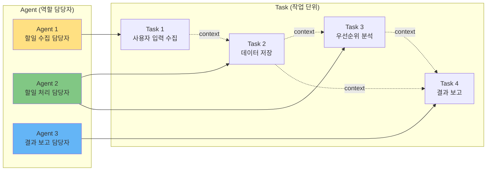

# Agent/Task 설계 가이드

## 🎯 이 문서에서 배울 것
- [ ] 효과적인 Agent 설계 원칙
- [ ] Task 설계 및 의존성 관리
- [ ] Agent-Task 매핑 최적화
- [ ] 설계 패턴 및 안티패턴

⏱️ **예상 시간**: 35분

---

## 📖 Agent와 Task의 관계



- **Agent**: "누가" 작업을 수행하는지 정의 (역할, 전문성, 도구)
- **Task**: "무엇을" 수행하는지 정의 (목표, 입출력, 의존성)

---

## 1. Agent 설계 원칙

### 1.1 Single Responsibility Principle (SRP)

**원칙**: 하나의 Agent는 하나의 명확한 역할만 담당

```json
// ❌ Bad: 너무 많은 역할
{
  "role": "전체 시스템 관리자",
  "goal": "모든 작업 수행",
  "tools": ["DatabaseTool", "EmailTool", "PaymentTool", "ReportTool"]
}

// ✅ Good: 단일 역할
{
  "role": "데이터 저장 담당자",
  "goal": "사용자 입력 데이터를 검증하고 데이터베이스에 안전하게 저장",
  "tools": ["DatabaseTool", "ValidationTool"]
}
```

### 1.2 Clear Goal & Backstory

**원칙**: 측정 가능한 목표 + 구체적인 배경

```json
// ❌ Weak
{
  "goal": "데이터 처리",
  "backstory": "AI 에이전트"
}

// ✅ Strong
{
  "goal": "사용자 입력 데이터를 검증하고 데이터베이스에 저장하며, 검증 실패 시 명확한 오류 메시지를 반환",
  "backstory": "당신은 데이터베이스 작업을 10년 경험한 전문가입니다. 데이터 무결성을 최우선으로 하며, 항상 트랜잭션 안전성을 보장합니다. 검증 실패 시 사용자 친화적인 오류 메시지를 제공합니다."
}
```

### 1.3 Right Tools for the Job

**원칙**: 역할에 필요한 도구만 할당

| Agent 역할 | 필요 도구 | 불필요 도구 |
|-----------|---------|-----------|
| 데이터 수집 | InputValidationTool | DatabaseTool ❌ |
| 데이터 저장 | DatabaseTool, ValidationTool | EmailTool ❌ |
| 알림 발송 | EmailTool, NotificationTool | DatabaseTool ❌ |

```json
// Agent 별 도구 할당 예시
{
  "agents": [
    {
      "role": "데이터 수집 담당자",
      "tools": ["InputValidationTool"]  // 수집만
    },
    {
      "role": "데이터 저장 담당자",
      "tools": ["DatabaseTool", "ValidationTool"]  // 저장+검증
    },
    {
      "role": "알림 발송 담당자",
      "tools": ["EmailTool"]  // 알림만
    }
  ]
}
```

---

## 2. Task 설계 원칙

### 2.1 Atomic Tasks (원자성)

**원칙**: 하나의 Task는 하나의 작업 단위

```json
// ❌ Bad: 여러 작업 혼합
{
  "description": "사용자 입력을 받고, 검증하고, 데이터베이스에 저장하고, 이메일 발송"
}

// ✅ Good: 단일 작업
{
  "tasks": [
    {
      "id": "task_1",
      "description": "사용자로부터 할일 정보를 입력받습니다"
    },
    {
      "id": "task_2",
      "description": "입력받은 할일을 검증합니다"
    },
    {
      "id": "task_3",
      "description": "검증된 할일을 데이터베이스에 저장합니다"
    },
    {
      "id": "task_4",
      "description": "저장 완료 이메일을 발송합니다"
    }
  ]
}
```

### 2.2 Clear Expected Output

**원칙**: 구체적이고 검증 가능한 출력 정의

```json
// ❌ Vague
{
  "expected_output": "결과"
}

// ✅ Specific
{
  "expected_output": "JSON 형식: {\"todo_id\": 123, \"title\": \"...\", \"created_at\": \"2026-02-14T15:30:00Z\", \"success\": true}"
}

// ✅ Even Better (with validation criteria)
{
  "expected_output": "JSON 형식의 할일 객체",
  "output_schema": {
    "todo_id": "integer (required)",
    "title": "string (required, 1-200 chars)",
    "created_at": "datetime (ISO 8601)",
    "success": "boolean"
  },
  "validation": "todo_id > 0 and success == true"
}
```

### 2.3 Explicit Dependencies (명시적 의존성)

**원칙**: Task 간 의존성을 context로 명확히 정의

```json
{
  "tasks": [
    {
      "id": "task_1",
      "description": "사용자 입력 수집",
      "context": []  // 의존성 없음 (첫 Task)
    },
    {
      "id": "task_2",
      "description": "데이터 검증",
      "context": ["task_1"]  // task_1의 출력 사용
    },
    {
      "id": "task_3",
      "description": "데이터 저장",
      "context": ["task_2"]  // task_2의 출력 사용
    },
    {
      "id": "task_4",
      "description": "결과 보고",
      "context": ["task_2", "task_3"]  // task_2와 task_3의 출력 모두 사용
    }
  ]
}
```

---

## 3. Agent-Task 매핑 전략

### 3.1 1-Agent-1-Task (Simple)

**적합**: 간단한 Linear 워크플로우

```
Agent 1 → Task 1
Agent 2 → Task 2
Agent 3 → Task 3
```

**예시**: 할일 관리 (3 Agent, 3 Task)
- Agent 1 (수집) → Task 1 (입력 수집)
- Agent 2 (저장) → Task 2 (DB 저장)
- Agent 3 (보고) → Task 3 (결과 보고)

**장점**: 단순, 이해하기 쉬움
**단점**: Agent 전문성 활용 제한

### 3.2 1-Agent-N-Tasks (Specialist)

**적합**: Agent 전문성 활용

```
Agent 1 → Task 1, Task 2, Task 3 (모두 동일 도메인)
Agent 2 → Task 4, Task 5 (다른 도메인)
```

**예시**: 데이터 분석 (2 Agent, 5 Task)
- Agent 1 (데이터 처리 전문가) → Task 1 (데이터 읽기), Task 2 (정제), Task 3 (통계 계산)
- Agent 2 (시각화 전문가) → Task 4 (차트 생성), Task 5 (리포트 작성)

**장점**: 전문성 극대화, Agent 수 감소
**단점**: Agent 부하 불균형 가능

### 3.3 N-Agents-1-Task (Collaboration)

**적합**: 복잡한 Task에 여러 Agent 협업

```
Agent 1, Agent 2, Agent 3 → Task 1 (협업)
```

**예시**: 코드 리뷰
- Agent 1 (보안 전문가), Agent 2 (성능 전문가), Agent 3 (코드 품질 전문가) → Task 1 (코드 리뷰)

**장점**: 다각도 검증
**단점**: 복잡도 증가, Hierarchical process 필요

---

## 4. Task Dependency Patterns

### 4.1 Sequential (순차)

```
Task 1 → Task 2 → Task 3 → Task 4
```

**사용 시기**: 각 Task가 이전 Task의 출력에 의존

**예시**:
```json
{
  "tasks": [
    {"id": "task_1", "description": "데이터 읽기", "context": []},
    {"id": "task_2", "description": "데이터 정제", "context": ["task_1"]},
    {"id": "task_3", "description": "통계 계산", "context": ["task_2"]},
    {"id": "task_4", "description": "리포트 생성", "context": ["task_3"]}
  ]
}
```

### 4.2 Parallel (병렬)

```
        ┌─ Task 2
Task 1 ─┼─ Task 3  ─┐
        └─ Task 4   ├─ Task 5
```

**사용 시기**: Task들이 독립적으로 실행 가능

**예시**:
```json
{
  "tasks": [
    {"id": "task_1", "description": "데이터 읽기", "context": []},
    {"id": "task_2", "description": "통계 A 계산", "context": ["task_1"], "async": true},
    {"id": "task_3", "description": "통계 B 계산", "context": ["task_1"], "async": true},
    {"id": "task_4", "description": "통계 C 계산", "context": ["task_1"], "async": true},
    {"id": "task_5", "description": "결과 통합", "context": ["task_2", "task_3", "task_4"]}
  ]
}
```

### 4.3 DAG (Directed Acyclic Graph)

```
Task 1 ┬─ Task 2 ─┐
       └─ Task 3 ─┼─ Task 5
Task 4 ───────────┘
```

**사용 시기**: 복잡한 의존성, 병렬+순차 혼합

**예시**:
```json
{
  "tasks": [
    {"id": "task_1", "description": "사용자 입력", "context": []},
    {"id": "task_2", "description": "데이터 검증", "context": ["task_1"]},
    {"id": "task_3", "description": "우선순위 분석", "context": ["task_1"]},
    {"id": "task_4", "description": "알림 설정", "context": []},
    {"id": "task_5", "description": "최종 저장", "context": ["task_2", "task_3", "task_4"]}
  ]
}
```

**검증**:
```bash
caas validate --validator dependency --tasks ./project/tasks.json
# 순환 체크: ✅ No cycles detected
```

---

## 5. 설계 패턴

### 패턴 1: Input-Process-Output (IPO)

**구조**:
```
Agent 1 (Input) → Agent 2 (Process) → Agent 3 (Output)
```

**적용**:
```json
{
  "agents": [
    {
      "id": "agent_1",
      "role": "입력 수집 담당자",
      "goal": "사용자로부터 정확한 입력 데이터 수집",
      "tools": ["InputValidationTool"]
    },
    {
      "id": "agent_2",
      "role": "데이터 처리 담당자",
      "goal": "입력 데이터를 처리하고 비즈니스 로직 적용",
      "tools": ["DatabaseTool", "BusinessLogicTool"]
    },
    {
      "id": "agent_3",
      "role": "결과 출력 담당자",
      "goal": "처리 결과를 사용자 친화적으로 출력",
      "tools": ["ReportGeneratorTool"]
    }
  ]
}
```

**장점**: 명확한 역할 분리, 테스트 용이

### 패턴 2: Hierarchical (계층적)

**구조**:
```
Manager Agent
  ├─ Worker Agent 1
  ├─ Worker Agent 2
  └─ Worker Agent 3
```

**적용**:
```json
{
  "process": "hierarchical",
  "manager_llm": "gpt-4",
  "agents": [
    {
      "id": "manager",
      "role": "프로젝트 관리자",
      "goal": "작업 할당 및 조율",
      "allow_delegation": true
    },
    {
      "id": "worker_1",
      "role": "데이터 수집 작업자",
      "goal": "데이터 수집"
    },
    {
      "id": "worker_2",
      "role": "데이터 분석 작업자",
      "goal": "데이터 분석"
    },
    {
      "id": "worker_3",
      "role": "리포트 작성 작업자",
      "goal": "리포트 작성"
    }
  ]
}
```

**장점**: 복잡한 작업 조율, 동적 할당
**단점**: Manager LLM 비용, 복잡도 증가

### 패턴 3: Pipeline (파이프라인)

**구조**:
```
Data → Agent 1 (Transform) → Agent 2 (Transform) → Agent 3 (Transform) → Result
```

**적용**:
```json
{
  "agents": [
    {
      "id": "agent_1",
      "role": "데이터 정제 담당자",
      "input": "raw_data",
      "output": "cleaned_data"
    },
    {
      "id": "agent_2",
      "role": "데이터 변환 담당자",
      "input": "cleaned_data",
      "output": "transformed_data"
    },
    {
      "id": "agent_3",
      "role": "데이터 집계 담당자",
      "input": "transformed_data",
      "output": "aggregated_data"
    }
  ],
  "tasks": [
    {
      "id": "task_1",
      "description": "데이터 정제: null 제거, 타입 변환",
      "agent_id": "agent_1"
    },
    {
      "id": "task_2",
      "description": "데이터 변환: 정규화, 인코딩",
      "agent_id": "agent_2",
      "context": ["task_1"]
    },
    {
      "id": "task_3",
      "description": "데이터 집계: 그룹화, 통계 계산",
      "agent_id": "agent_3",
      "context": ["task_2"]
    }
  ]
}
```

**장점**: ETL 워크플로우에 적합, 확장 용이

---

## 6. 안티패턴 (피해야 할 설계)

### 안티패턴 1: God Agent

```json
// ❌ Bad
{
  "role": "모든 작업 담당자",
  "goal": "시스템의 모든 기능 수행",
  "tools": ["Tool1", "Tool2", "Tool3", "Tool4", "Tool5", "Tool6"],
  "tasks": ["task_1", "task_2", "task_3", "task_4", "task_5"]
}

// ✅ Solution: Agent 분할
{
  "agents": [
    {"role": "입력 담당자", "tools": ["Tool1"], "tasks": ["task_1"]},
    {"role": "처리 담당자", "tools": ["Tool2", "Tool3"], "tasks": ["task_2", "task_3"]},
    {"role": "출력 담당자", "tools": ["Tool4"], "tasks": ["task_4", "task_5"]}
  ]
}
```

### 안티패턴 2: Circular Dependency

```json
// ❌ Bad: 순환 의존성
{
  "tasks": [
    {"id": "task_1", "context": ["task_3"]},
    {"id": "task_2", "context": ["task_1"]},
    {"id": "task_3", "context": ["task_2"]}
  ]
}
// task_1 → task_2 → task_3 → task_1 (순환!)

// ✅ Solution: DAG로 재설계
{
  "tasks": [
    {"id": "task_1", "context": []},
    {"id": "task_2", "context": ["task_1"]},
    {"id": "task_3", "context": ["task_2"]}
  ]
}
```

### 안티패턴 3: Orphan Task

```json
// ❌ Bad: Agent가 없는 Task
{
  "tasks": [
    {"id": "task_1", "agent_id": "agent_1"},
    {"id": "task_2", "agent_id": null}  // ❌ 담당 Agent 없음
  ]
}

// ✅ Solution: 모든 Task에 Agent 할당
{
  "tasks": [
    {"id": "task_1", "agent_id": "agent_1"},
    {"id": "task_2", "agent_id": "agent_2"}
  ]
}
```

### 안티패턴 4: Overlapping Responsibilities

```json
// ❌ Bad: 역할 중복
{
  "agents": [
    {"role": "데이터 저장 담당자", "tools": ["DatabaseTool"]},
    {"role": "데이터베이스 관리자", "tools": ["DatabaseTool"]}  // 중복!
  ]
}

// ✅ Solution: 명확한 역할 분리
{
  "agents": [
    {"role": "데이터 저장 담당자", "tools": ["DatabaseTool"]},
    {"role": "데이터 검증 담당자", "tools": ["ValidationTool"]}
  ]
}
```

---

## 7. 실전 예시: 챗봇 시스템

### 요구사항
```
고객 지원 챗봇. FAQ 검색, 제품 추천, 문의 접수 기능.
```

### Agent 설계

```json
{
  "agents": [
    {
      "id": "agent_1",
      "role": "질문 분석 담당자",
      "goal": "사용자 질문의 의도를 정확히 파악하고 분류",
      "backstory": "당신은 자연어 처리 전문가입니다. 사용자 질문을 FAQ, 제품 추천, 문의로 분류합니다.",
      "tools": ["NLPTool", "IntentClassifierTool"],
      "max_iter": 3,
      "verbose": true
    },
    {
      "id": "agent_2",
      "role": "FAQ 검색 담당자",
      "goal": "질문과 가장 관련 있는 FAQ를 검색하고 응답 생성",
      "backstory": "당신은 FAQ 데이터베이스 전문가입니다. 키워드 매칭과 유사도 검색으로 최적의 답변을 찾습니다.",
      "tools": ["FAQSearchTool", "SimilarityTool"],
      "max_iter": 5,
      "verbose": true
    },
    {
      "id": "agent_3",
      "role": "제품 추천 담당자",
      "goal": "사용자 이력과 선호도를 분석하여 적합한 제품 추천",
      "backstory": "당신은 추천 시스템 전문가입니다. 사용자 행동 패턴을 분석하여 개인화된 제품을 제안합니다.",
      "tools": ["RecommendationTool", "UserProfileTool"],
      "max_iter": 5,
      "verbose": true
    },
    {
      "id": "agent_4",
      "role": "문의 접수 담당자",
      "goal": "문의 내용을 티켓으로 생성하고 담당자 배정",
      "backstory": "당신은 고객 지원 티켓 관리 전문가입니다. 문의를 분류하고 적절한 담당자에게 배정합니다.",
      "tools": ["TicketTool", "AssignmentTool"],
      "max_iter": 3,
      "verbose": true
    }
  ]
}
```

### Task 설계

```json
{
  "tasks": [
    {
      "id": "task_1",
      "description": "사용자로부터 질문을 입력받고 의도를 분석합니다. 의도를 FAQ/제품추천/문의로 분류합니다.",
      "expected_output": "JSON 형식: {\"intent\": \"faq|product|inquiry\", \"question\": \"...\", \"confidence\": 0.95}",
      "agent_id": "agent_1",
      "context": [],
      "async_execution": false
    },
    {
      "id": "task_2",
      "description": "FAQ 의도인 경우, 질문과 가장 관련 있는 FAQ를 검색하고 응답을 생성합니다.",
      "expected_output": "JSON 형식: {\"faq_id\": 123, \"answer\": \"...\", \"confidence\": 0.9}",
      "agent_id": "agent_2",
      "context": ["task_1"],
      "async_execution": false
    },
    {
      "id": "task_3",
      "description": "제품 추천 의도인 경우, 사용자 이력을 분석하여 제품을 추천합니다.",
      "expected_output": "JSON 형식: {\"products\": [{\"id\": 1, \"name\": \"...\", \"score\": 0.8}]}",
      "agent_id": "agent_3",
      "context": ["task_1"],
      "async_execution": false
    },
    {
      "id": "task_4",
      "description": "문의 의도인 경우, 문의 티켓을 생성하고 담당자를 배정합니다.",
      "expected_output": "JSON 형식: {\"ticket_id\": 456, \"assignee\": \"support@company.com\", \"status\": \"pending\"}",
      "agent_id": "agent_4",
      "context": ["task_1"],
      "async_execution": false
    }
  ]
}
```

### Dependency Graph

```
Task 1 (의도 분석)
  ├─ Task 2 (FAQ 검색)
  ├─ Task 3 (제품 추천)
  └─ Task 4 (문의 접수)
```

**검증**:
- ✅ Agent 개수: 4 (3-7 범위)
- ✅ Task 개수: 4 (≥ Agent 수 × 1)
- ✅ 모든 Task에 agent_id 할당
- ✅ DAG 순환 없음
- ✅ Completeness: 100% (3 features → 3 tasks)

---

## 📚 관련 문서

- **[10_CAAS_6Phase_개발_프로세스.md](./10_CAAS_6Phase_개발_프로세스.md)** - Phase 3 상세 설명
- **[12_Golden_Data_활용법.md](./12_Golden_Data_활용법.md)** - Feature 기반 설계
- **[31_Phase별_산출물_관리.md](../3_프로젝트_관리_PM/31_Phase별_산출물_관리.md)** - Agent/Task 검수 기준

---

**작성일**: 2026-02-14
**버전**: v0.6.6
**대상**: 시니어 개발자, 아키텍트
**난이도**: ⭐⭐⭐ 고급
