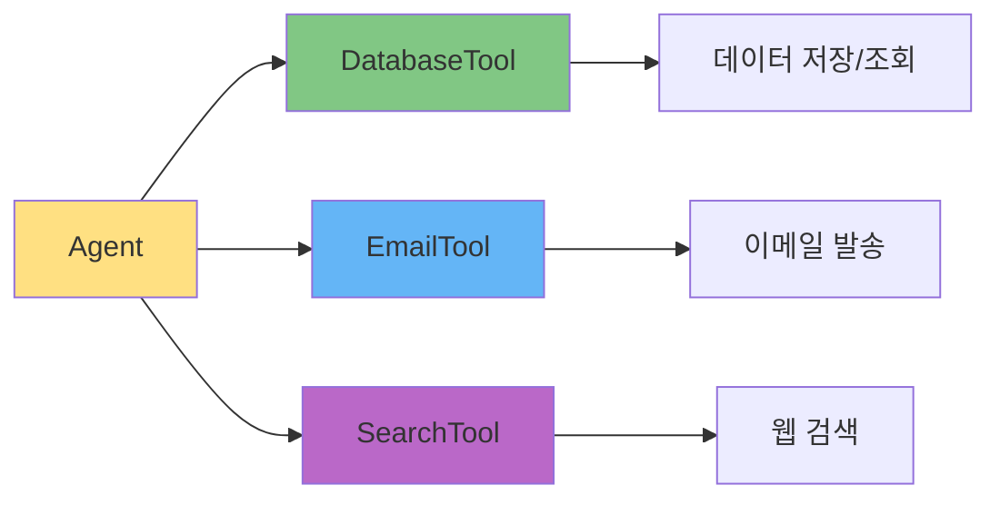

# 도구(Tools) 개발 가이드

## 🎯 이 문서에서 배울 것
- [ ] CrewAI Tool 개발 기초
- [ ] 커스텀 도구 작성 패턴
- [ ] 도구 테스트 및 디버깅
- [ ] 도구 재사용 및 배포

⏱️ **예상 시간**: 30분

---

## 📖 Tool이란?

**Tool**은 Agent가 작업을 수행하기 위해 사용하는 **실행 가능한 함수**입니다.



---

## 1. Tool 기본 구조

### 1.1 BaseTool 상속

```python
from crewai_tools import BaseTool
from typing import Optional, Type
from pydantic import BaseModel, Field


class TodoCRUDToolInput(BaseModel):
    """Input schema for TodoCRUDTool"""
    operation: str = Field(..., description="Operation: create|read|update|delete")
    todo_id: Optional[int] = Field(None, description="Todo ID (for read/update/delete)")
    title: Optional[str] = Field(None, description="Todo title (for create/update)")
    description: Optional[str] = Field(None, description="Todo description")


class TodoCRUDTool(BaseTool):
    name: str = "Todo CRUD Tool"
    description: str = "Create, read, update, delete todo items in the database."
    args_schema: Type[BaseModel] = TodoCRUDToolInput

    def _run(self, operation: str, todo_id: Optional[int] = None,
             title: Optional[str] = None, description: Optional[str] = None) -> str:
        """Execute CRUD operation"""
        if operation == "create":
            return self._create(title, description)
        elif operation == "read":
            return self._read(todo_id)
        elif operation == "update":
            return self._update(todo_id, title, description)
        elif operation == "delete":
            return self._delete(todo_id)
        else:
            return f"Unknown operation: {operation}"

    def _create(self, title: str, description: str) -> str:
        # 실제 구현
        return f"Created todo: {title}"

    def _read(self, todo_id: int) -> str:
        # 실제 구현
        return f"Todo {todo_id}: ..."

    def _update(self, todo_id: int, title: str, description: str) -> str:
        # 실제 구현
        return f"Updated todo {todo_id}"

    def _delete(self, todo_id: int) -> str:
        # 실제 구현
        return f"Deleted todo {todo_id}"
```

### 1.2 필수 속성

| 속성 | 타입 | 설명 |
|------|------|------|
| `name` | str | 도구 이름 (Agent가 참조) |
| `description` | str | 도구 설명 (LLM이 이해할 용도) |
| `args_schema` | BaseModel | 입력 파라미터 스키마 |

### 1.3 필수 메서드

| 메서드 | 설명 |
|--------|------|
| `_run()` | 동기 실행 메서드 (필수) |
| `_arun()` | 비동기 실행 메서드 (선택) |

---

## 2. 도구 개발 패턴

### 패턴 1: Database Tool

```python
import sqlite3
from crewai_tools import BaseTool
from pydantic import BaseModel, Field


class DatabaseToolInput(BaseModel):
    query: str = Field(..., description="SQL query to execute")
    params: list = Field(default=[], description="Query parameters")


class DatabaseTool(BaseTool):
    name: str = "Database Tool"
    description: str = "Execute SQL queries on SQLite database."
    args_schema: Type[BaseModel] = DatabaseToolInput
    db_path: str = "app.db"

    def _run(self, query: str, params: list = []) -> str:
        try:
            conn = sqlite3.connect(self.db_path)
            cursor = conn.cursor()
            cursor.execute(query, params)

            # SELECT 쿼리
            if query.strip().upper().startswith("SELECT"):
                results = cursor.fetchall()
                conn.close()
                return f"Results: {results}"

            # INSERT/UPDATE/DELETE
            else:
                conn.commit()
                affected = cursor.rowcount
                conn.close()
                return f"Success: {affected} rows affected"

        except sqlite3.Error as e:
            return f"Database error: {e}"
```

### 패턴 2: API Integration Tool

```python
import requests
from crewai_tools import BaseTool
from pydantic import BaseModel, Field


class WeatherAPIToolInput(BaseModel):
    city: str = Field(..., description="City name")
    units: str = Field(default="metric", description="Units: metric|imperial")


class WeatherAPITool(BaseTool):
    name: str = "Weather API Tool"
    description: str = "Get current weather information for a city."
    args_schema: Type[BaseModel] = WeatherAPIToolInput
    api_key: str = "YOUR_API_KEY"

    def _run(self, city: str, units: str = "metric") -> str:
        try:
            url = f"https://api.openweathermap.org/data/2.5/weather"
            params = {
                "q": city,
                "units": units,
                "appid": self.api_key
            }
            response = requests.get(url, params=params, timeout=10)
            response.raise_for_status()
            data = response.json()

            return f"Weather in {city}: {data['main']['temp']}°, {data['weather'][0]['description']}"

        except requests.RequestException as e:
            return f"API error: {e}"
```

### 패턴 3: File Processing Tool

```python
import pandas as pd
from crewai_tools import BaseTool
from pydantic import BaseModel, Field


class CSVReaderToolInput(BaseModel):
    file_path: str = Field(..., description="Path to CSV file")
    operation: str = Field(..., description="Operation: read|statistics|head")
    rows: int = Field(default=5, description="Number of rows (for head)")


class CSVReaderTool(BaseTool):
    name: str = "CSV Reader Tool"
    description: str = "Read and analyze CSV files."
    args_schema: Type[BaseModel] = CSVReaderToolInput

    def _run(self, file_path: str, operation: str, rows: int = 5) -> str:
        try:
            df = pd.read_csv(file_path)

            if operation == "read":
                return f"Loaded {len(df)} rows, {len(df.columns)} columns"

            elif operation == "statistics":
                stats = df.describe().to_string()
                return f"Statistics:\n{stats}"

            elif operation == "head":
                head = df.head(rows).to_string()
                return f"First {rows} rows:\n{head}"

            else:
                return f"Unknown operation: {operation}"

        except Exception as e:
            return f"File error: {e}"
```

---

## 3. 에러 처리 Best Practices

### 3.1 Try-Except 패턴

```python
def _run(self, ...):
    try:
        # 실제 로직
        result = self._do_operation(...)
        return f"Success: {result}"

    except ValueError as e:
        # 입력 검증 오류
        return f"Invalid input: {e}"

    except ConnectionError as e:
        # 네트워크 오류
        return f"Connection failed: {e}"

    except Exception as e:
        # 예상치 못한 오류
        return f"Unexpected error: {e}"
```

### 3.2 입력 검증

```python
def _run(self, operation: str, todo_id: Optional[int] = None, ...):
    # Validation
    if operation not in ["create", "read", "update", "delete"]:
        return f"Error: Invalid operation '{operation}'. Must be create|read|update|delete"

    if operation in ["read", "update", "delete"] and todo_id is None:
        return f"Error: todo_id required for {operation} operation"

    if operation == "create" and not title:
        return f"Error: title required for create operation"

    # Main logic
    ...
```

### 3.3 로깅

```python
import logging
from crewai_tools import BaseTool


logger = logging.getLogger(__name__)


class MyTool(BaseTool):
    ...

    def _run(self, ...):
        logger.info(f"Tool {self.name} called with args: ...")

        try:
            result = ...
            logger.info(f"Tool {self.name} succeeded: {result}")
            return result

        except Exception as e:
            logger.error(f"Tool {self.name} failed: {e}")
            return f"Error: {e}"
```

---

## 4. 도구 테스트

### 4.1 단위 테스트

```python
# test_tools.py
import pytest
from tools import TodoCRUDTool


def test_todo_crud_tool_create():
    tool = TodoCRUDTool()
    result = tool._run(operation="create", title="Test Todo", description="Test")
    assert "Created todo" in result


def test_todo_crud_tool_read():
    tool = TodoCRUDTool()
    result = tool._run(operation="read", todo_id=1)
    assert "Todo 1" in result


def test_todo_crud_tool_invalid_operation():
    tool = TodoCRUDTool()
    result = tool._run(operation="invalid")
    assert "Unknown operation" in result


def test_todo_crud_tool_missing_todo_id():
    tool = TodoCRUDTool()
    # read 작업에 todo_id 누락
    result = tool._run(operation="read")
    assert "Error" in result or "required" in result.lower()
```

### 4.2 통합 테스트

```python
# test_agent_with_tool.py
from crewai import Agent, Task, Crew
from tools import TodoCRUDTool


def test_agent_uses_tool():
    # Tool 생성
    tool = TodoCRUDTool()

    # Agent 생성
    agent = Agent(
        role="할일 관리자",
        goal="할일 추가",
        backstory="...",
        tools=[tool],
        verbose=True
    )

    # Task 생성
    task = Task(
        description="새로운 할일 '프로젝트 계획'을 추가하세요",
        expected_output="할일 ID와 생성 확인 메시지",
        agent=agent
    )

    # Crew 실행
    crew = Crew(agents=[agent], tasks=[task], verbose=True)
    result = crew.kickoff()

    # 검증
    assert "Created" in result or "추가" in result
```

---

## 5. 도구 재사용

### 5.1 도구 라이브러리 구성

```
project/
├── tools/
│   ├── __init__.py
│   ├── database.py      # DatabaseTool
│   ├── api.py           # API 관련 도구들
│   ├── file.py          # 파일 처리 도구들
│   └── notification.py  # 알림 도구들
├── agents.py
├── tasks.py
└── main.py
```

```python
# tools/__init__.py
from .database import DatabaseTool, TodoCRUDTool
from .api import WeatherAPITool, EmailTool
from .file import CSVReaderTool, PDFGeneratorTool

__all__ = [
    "DatabaseTool",
    "TodoCRUDTool",
    "WeatherAPITool",
    "EmailTool",
    "CSVReaderTool",
    "PDFGeneratorTool",
]
```

```python
# agents.py
from tools import TodoCRUDTool, EmailTool


agent = Agent(
    role="...",
    tools=[TodoCRUDTool(), EmailTool()],
    ...
)
```

### 5.2 설정 파일 활용

```python
# config.yaml
database:
  path: "app.db"
  timeout: 30

email:
  smtp_server: "smtp.gmail.com"
  smtp_port: 587

weather_api:
  api_key: "YOUR_API_KEY"
  base_url: "https://api.openweathermap.org"
```

```python
# tools/database.py
import yaml
from crewai_tools import BaseTool


class DatabaseTool(BaseTool):
    ...

    def __init__(self):
        super().__init__()
        with open("config.yaml") as f:
            config = yaml.safe_load(f)
        self.db_path = config["database"]["path"]
        self.timeout = config["database"]["timeout"]
```

---

## 6. 고급 패턴

### 패턴 4: Async Tool (비동기)

```python
import asyncio
import aiohttp
from crewai_tools import BaseTool


class AsyncAPITool(BaseTool):
    name: str = "Async API Tool"
    description: str = "Make async API calls."

    def _run(self, url: str) -> str:
        # Sync wrapper for async operation
        return asyncio.run(self._arun(url))

    async def _arun(self, url: str) -> str:
        async with aiohttp.ClientSession() as session:
            async with session.get(url) as response:
                data = await response.json()
                return f"Response: {data}"
```

### 패턴 5: Stateful Tool (상태 유지)

```python
from crewai_tools import BaseTool


class CachingTool(BaseTool):
    name: str = "Caching Tool"
    description: str = "Tool with caching capability."

    def __init__(self):
        super().__init__()
        self.cache = {}  # 상태 유지

    def _run(self, key: str, operation: str, value: str = None) -> str:
        if operation == "get":
            return self.cache.get(key, "Not found")

        elif operation == "set":
            self.cache[key] = value
            return f"Cached: {key} = {value}"

        elif operation == "clear":
            self.cache.clear()
            return "Cache cleared"
```

### 패턴 6: Chaining Tool (도구 체인)

```python
class DataProcessingPipeline(BaseTool):
    name: str = "Data Processing Pipeline"
    description: str = "Multi-step data processing."

    def _run(self, data: str) -> str:
        # Step 1: Clean
        cleaned = self._clean(data)

        # Step 2: Transform
        transformed = self._transform(cleaned)

        # Step 3: Validate
        validated = self._validate(transformed)

        return validated

    def _clean(self, data: str) -> str:
        # 데이터 정제
        return data.strip().lower()

    def _transform(self, data: str) -> str:
        # 데이터 변환
        return data.replace(" ", "_")

    def _validate(self, data: str) -> str:
        # 검증
        if len(data) > 100:
            raise ValueError("Data too long")
        return data
```

---

## 7. 보안 고려사항

### 7.1 SQL Injection 방지

```python
# ❌ Bad: SQL Injection 취약
def _run(self, table: str, id: int):
    query = f"SELECT * FROM {table} WHERE id={id}"
    cursor.execute(query)  # 위험!

# ✅ Good: 파라미터 바인딩
def _run(self, table: str, id: int):
    # 테이블명은 화이트리스트로 검증
    allowed_tables = ["todos", "users", "comments"]
    if table not in allowed_tables:
        return f"Error: Invalid table {table}"

    query = "SELECT * FROM todos WHERE id=?"
    cursor.execute(query, (id,))  # 안전
```

### 7.2 API 키 보호

```python
import os
from crewai_tools import BaseTool


class SecureAPITool(BaseTool):
    ...

    def __init__(self):
        super().__init__()
        # 환경 변수에서 API 키 로드
        self.api_key = os.getenv("API_KEY")
        if not self.api_key:
            raise ValueError("API_KEY environment variable not set")
```

### 7.3 파일 경로 검증

```python
import os
from pathlib import Path


def _run(self, file_path: str):
    # Path Traversal 공격 방지
    safe_path = Path(file_path).resolve()
    allowed_dir = Path("/allowed/directory").resolve()

    if not str(safe_path).startswith(str(allowed_dir)):
        return "Error: Access denied"

    # 파일 읽기
    with open(safe_path) as f:
        return f.read()
```

---

## 📚 관련 문서

- **[13_Agent_Task_설계_가이드.md](./13_Agent_Task_설계_가이드.md)** - Agent와 Tool 통합
- **[10_CAAS_6Phase_개발_프로세스.md](./10_CAAS_6Phase_개발_프로세스.md)** - Phase 2 Tools 설계
- **[22_트러블슈팅_가이드.md](./22_트러블슈팅_가이드.md)** - Tool 관련 오류 해결

---

**작성일**: 2026-02-14
**버전**: v0.6.4
**대상**: 시니어 개발자
**난이도**: ⭐⭐⭐ 고급
