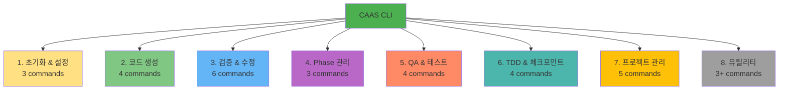

# CLI 명령어 레퍼런스

## 🎯 이 문서에서 배울 것
- [ ] CAAS CLI 전체 명령어 (32+ 명령어)
- [ ] 각 명령어의 옵션 및 사용법
- [ ] 실전 활용 예시 및 조합

⏱️ **예상 시간**: 30분 (레퍼런스)

---

## 📚 명령어 카테고리

CAAS CLI는 **32개 이상의 명령어**를 8개 카테고리로 제공합니다.



---

## 1. 초기화 & 설정 (3 commands)

### `caas init`
**목적**: CAAS 환경 초기 설정

```bash
caas init [OPTIONS]
```

**옵션**:
| 옵션 | 설명 | 기본값 |
|------|------|--------|
| `--provider TEXT` | LLM Provider (openai/anthropic/ollama) | `openai` |
| `--api-key TEXT` | API 키 직접 입력 | - |
| `--output-dir PATH` | 기본 출력 디렉토리 | `./generated` |
| `--auto-save / --no-auto-save` | 세션 자동 저장 | `True` |
| `--interactive / --no-interactive` | 대화형 설정 | `True` |

**사용 예시**:
```bash
# 대화형 초기 설정 (권장)
caas init

# OpenAI로 설정
caas init --provider openai --api-key sk-your-key-here

# Ollama (로컬 LLM)로 설정
caas init --provider ollama --no-interactive

# 커스텀 출력 디렉토리
caas init --output-dir /home/projects/caas-output
```

**실행 결과**:
```
Welcome to CAAS! Let's set up your environment.

? Select LLM Provider: OpenAI (GPT-4, GPT-3.5)
? Do you have an API key ready? (y/n): y
? Enter your API key: sk-...
? Default output directory: ./generated
? Enable auto-save sessions? (y/n): y

✅ Configuration saved to ~/.caas/config.yaml
```

---

### `caas config`
**목적**: 설정 조회 및 수정

```bash
caas config [COMMAND] [OPTIONS]
```

**서브커맨드**:
- `list`: 현재 설정 조회
- `set`: 설정 변경
- `reset`: 기본값으로 초기화

**사용 예시**:
```bash
# 설정 조회
caas config list

# 출력:
# llm_provider: openai
# default_output_dir: ./generated
# auto_save_sessions: true
# openai_api_key: sk-***...***

# 설정 변경
caas config set llm_provider anthropic
caas config set default_output_dir /path/to/output

# 초기화
caas config reset
```

---

### `caas env`
**목적**: 환경 변수 관리

```bash
caas env [COMMAND] [OPTIONS]
```

**서브커맨드**:
- `--create`: .env 파일 생성
- `--validate`: 환경 변수 검증
- `--show`: 현재 환경 변수 표시 (마스킹됨)

**사용 예시**:
```bash
# .env 파일 생성
caas env --create
# 생성됨: .env

# 환경 변수 검증
caas env --validate
# ✅ OPENAI_API_KEY: valid
# ❌ NEO4J_URI: not set (optional)

# 환경 변수 표시
caas env --show
# OPENAI_API_KEY=sk-***...***
# NEO4J_URI=(not set)
```

---

## 2. 코드 생성 (4 commands)

### `caas generate`
**목적**: 자연어 요구사항에서 전체 시스템 생성 (Phase 0-5 자동)

```bash
caas generate REQUIREMENT [OPTIONS]
```

**필수 인자**:
| 인자 | 설명 |
|------|------|
| `REQUIREMENT` | 자연어 요구사항 (문자열) |

**주요 옵션**:
| 옵션 | 설명 | 기본값 |
|------|------|--------|
| `-o, --output PATH` | 출력 디렉토리 | `./generated` |
| `-d, --domain TEXT` | 도메인 명시 (17개 중) | 자동 감지 |
| `--ui TEXT` | UI 프레임워크 (streamlit/gradio/none) | `none` |
| `--strict-quality` | 엄격한 품질 검증 | `False` |
| `--fast` | 빠른 생성 (품질 검증 최소화) | `False` |
| `--model TEXT` | LLM 모델 (opus/sonnet/haiku) | `sonnet` |
| `--cache / --no-cache` | LLM 응답 캐싱 | `True` |
| `--force` | 기존 디렉토리 덮어쓰기 | `False` |
| `--timestamp` | 출력 디렉토리에 타임스탬프 추가 | `False` |
| `--coverage INT` | 테스트 커버리지 목표 (0-100) | `80` |
| `-v, --verbose` | 상세 로그 출력 | `False` |

**사용 예시**:
```bash
# 기본 생성
caas generate "할일 관리 시스템을 만들어줘"

# 도메인 명시 + Streamlit UI
caas generate "고객 지원 챗봇" \
  --domain conversational_ai \
  --ui streamlit \
  --output ./chatbot-project

# 엄격한 품질 검증 (엔터프라이즈)
caas generate "판매 데이터 분석 시스템" \
  --domain data_analysis \
  --strict-quality \
  --coverage 90 \
  --output ./analysis-system

# 빠른 프로토타입
caas generate "블로그 시스템" \
  --fast \
  --model haiku \
  --output ./blog-prototype

# 타임스탬프 출력
caas generate "예약 시스템" --timestamp
# 출력: ./generated/booking_system_20260214_153045

# 기존 디렉토리 덮어쓰기
caas generate "요구사항" --output ./project --force
```

**실행 흐름**:
```
🎯 CAAS v0.5.1 - Starting Generation...

Phase 0: Concretization ━━━━━━━━━━━━━━━━━━━━ 100% (30s)
Phase 1: Discovery ━━━━━━━━━━━━━━━━━━━━━━━━ 100% (25s)
Phase 2: Architecture ━━━━━━━━━━━━━━━━━━━━━ 100% (20s)
Phase 3: Design ━━━━━━━━━━━━━━━━━━━━━━━━━━ 100% (35s)
Phase 4: Development ━━━━━━━━━━━━━━━━━━━━━ 100% (15s)
Phase 5: Delivery ━━━━━━━━━━━━━━━━━━━━━━━━ 100% (40s)

✅ Generation complete! Output: ./generated
⏱️ Total time: 2m 45s
📊 Quality score: 8.6/10.0
🔒 Security issues: 0
```

---

### `caas generate-phase`
**목적**: 특정 Phase만 실행 (단계별 생성)

```bash
caas generate-phase --phase PHASE_NUMBER REQUIREMENT [OPTIONS]
```

**필수 옵션**:
| 옵션 | 설명 |
|------|------|
| `--phase INT` | Phase 번호 (0-5) |

**사용 예시**:
```bash
# Phase 0: Golden Data 생성
caas generate-phase --phase 0 "할일 관리 시스템" --output ./project

# Phase 1: 요구사항 분석
caas generate-phase --phase 1 "할일 관리 시스템" --output ./project

# Phase 2: 아키텍처 설계
caas generate-phase --phase 2 "할일 관리 시스템" --output ./project

# Phase 3: Agent/Task 설계
caas generate-phase --phase 3 "할일 관리 시스템" --output ./project

# Phase 4: 명세 생성
caas generate-phase --phase 4 "할일 관리 시스템" --output ./project

# Phase 5: 코드 생성
caas generate-phase --phase 5 "할일 관리 시스템" --output ./project
```

**고급 옵션**:
```bash
# 특정 Phase부터 재시작
caas generate-phase --phase 3 "요구사항" \
  --output ./project \
  --continue  # 기존 Phase 0-2 결과 사용

# Phase 재시도
caas generate-phase --phase 3 "요구사항" \
  --output ./project \
  --retry  # Phase 3 다시 실행
```

---

### `caas regenerate`
**목적**: 특정 파일만 재생성

```bash
caas regenerate [FILES...] [OPTIONS]
```

**사용 예시**:
```bash
# tools.py만 재생성
caas regenerate tools.py --project ./my-project

# agents.py + tasks.py 재생성
caas regenerate agents.py tasks.py --project ./my-project

# 테스트 재생성
caas regenerate tests/ --project ./my-project
```

---

### `caas expand`
**목적**: 기존 프로젝트에 기능 추가

```bash
caas expand FEATURE_DESCRIPTION [OPTIONS]
```

**사용 예시**:
```bash
# 기능 추가
caas expand "사용자 인증 기능 추가" \
  --project ./my-project

# Golden Data 확장 모드
caas expand "데이터 내보내기 기능" \
  --project ./my-project \
  --incremental  # 기존 Golden Data에 추가
```

---

## 3. 검증 & 수정 (6 commands)

### `caas validate`
**목적**: 설계 및 코드 검증

```bash
caas validate [OPTIONS]
```

**주요 옵션**:
| 옵션 | 설명 |
|------|------|
| `--validator TEXT` | 검증기 선택 (all/code-quality/crewai/...) |
| `--agents PATH` | agents.json 경로 |
| `--tasks PATH` | tasks.json 경로 |
| `--project PATH` | 프로젝트 디렉토리 |
| `--golden PATH` | golden_data.json 경로 |
| `--arch PATH` | architecture_design.json 경로 |
| `--spec PATH` | specifications.json 경로 |

**검증기 종류 (7개)**:
1. `code-quality`: 코드 품질 (AST 분석, docstring, type hints)
2. `crewai`: CrewAI 호환성
3. `dependency`: Task 의존성 (DAG 순환 체크)
4. `golden-data`: Golden Data 완전성
5. `ontology`: 온톨로지 검증
6. `python311`: Python 3.11+ 호환성
7. `task`: Task 설계 검증

**사용 예시**:
```bash
# 전체 검증
caas validate --validator all --project ./my-project

# 코드 품질 검증
caas validate --validator code-quality --project ./my-project

# Agent/Task 설계 검증
caas validate \
  --validator task \
  --agents ./project/agents.json \
  --tasks ./project/tasks.json

# Completeness 검증 (Golden Data ↔ Code)
caas validate \
  --validator completeness \
  --golden ./project/golden_data.json \
  --agents ./project/agents.json \
  --tasks ./project/tasks.json

# Traceability 검증 (Feature ↔ Tool)
caas validate \
  --validator traceability \
  --arch ./project/architecture_design.json
```

**출력 예시**:
```
🔍 Validator: code-quality

✅ AST Parsing: Success (8 files)
✅ Docstring Coverage: 85% (>80%)
✅ Type Hints Coverage: 72% (>70%)
✅ Naming Conventions: 100%
⚠️  Function Complexity: 3 functions >50 lines

📊 Overall Score: 8.4/10.0
```

---

### `caas fix`
**목적**: 자동 수정 (3-Level Auto-Fixing)

```bash
caas fix [OPTIONS]
```

**주요 옵션**:
| 옵션 | 설명 | 기본값 |
|------|------|--------|
| `--level INT` | 수정 레벨 (1-3) | `3` |
| `--agents PATH` | agents.json 경로 | - |
| `--tasks PATH` | tasks.json 경로 | - |
| `--project PATH` | 프로젝트 디렉토리 | - |
| `--apply` | 수정 적용 (기본은 미리보기만) | `False` |
| `--backup` | 백업 생성 | `True` |

**수정 레벨**:
1. **Level 1**: Template-based (빠름, 결정론적)
2. **Level 2**: Rule-based (중간)
3. **Level 3**: LLM-based (느림, 지능적)

**사용 예시**:
```bash
# Agent 설계 수정 (Level 3)
caas fix --level 3 \
  --agents ./project/agents.json \
  --tasks ./project/tasks.json \
  --apply

# 코드 수정 (Level 2)
caas fix --level 2 --project ./my-project --apply

# 미리보기만 (적용 안 함)
caas fix --level 3 --project ./my-project
```

---

### `caas analyze-completeness`
**목적**: 구현 완전성 분석 (Golden Data vs 실제 구현)

```bash
caas analyze-completeness [OPTIONS]
```

**사용 예시**:
```bash
# 기본 분석
caas analyze-completeness \
  --project ./my-project \
  --golden-data ./project/golden_data.json

# 상세 분석 (추적성 포함)
caas analyze-completeness \
  --project ./my-project \
  --golden-data ./project/golden_data.json \
  --detailed
```

**출력 예시**:
```
📊 Completeness Analysis Report

Golden Data Features: 8
Implemented Features: 7 (87.5%)

Missing Features:
  - f8: 데이터 내보내기 (Excel)

Partially Implemented:
  - f3: 할일 완료 처리 (알림 기능 누락)

✅ Implemented: 6 features (75.0%)
⚠️  Partial: 1 feature (12.5%)
❌ Missing: 1 feature (12.5%)
```

---

### `caas fix-runtime-error`
**목적**: 런타임 오류 자동 수정

```bash
caas fix-runtime-error [OPTIONS]
```

**사용 예시**:
```bash
# 오류 로그에서 자동 수정
caas fix-runtime-error \
  --project ./my-project \
  --error-log ./error.log \
  --apply

# 특정 오류 타입만 수정
caas fix-runtime-error \
  --project ./my-project \
  --error-type import_error \
  --apply
```

**지원 오류 타입 (8+)**:
1. `import_error`: Import 오류
2. `name_error`: 이름 오류 (변수/함수 미정의)
3. `attribute_error`: 속성 오류
4. `type_error`: 타입 오류
5. `value_error`: 값 오류
6. `key_error`: 키 오류 (dict)
7. `index_error`: 인덱스 오류 (list)
8. `syntax_error`: 구문 오류

---

### `caas gap-analysis`
**목적**: Golden Data vs 실제 구현 갭 분석

```bash
caas gap-analysis [OPTIONS]
```

**사용 예시**:
```bash
# 갭 분석
caas gap-analysis \
  --golden ./project/golden_data.json \
  --project ./my-project

# 갭 보고서 생성
caas gap-analysis \
  --golden ./project/golden_data.json \
  --project ./my-project \
  --report gap_report.md
```

---

### `caas refine`
**목적**: 요구사항 구체화 및 명확화

```bash
caas refine REQUIREMENT [OPTIONS]
```

**사용 예시**:
```bash
# 요구사항 구체화
caas refine "사용자 관리 시스템"
# 출력: 구체화된 요구사항 제안

# Golden Data 생성 후 구체화
caas refine "사용자 관리 시스템" --with-golden
```

---

## 4. Phase 관리 (3 commands)

### `caas phase status`
**목적**: Phase 진행 상태 확인

```bash
caas phase status --project PATH
```

**사용 예시**:
```bash
caas phase status --project ./my-project
```

**출력 예시**:
```
📊 Phase Status: my-project

Phase 0: Concretization     ✅ Complete
Phase 1: Discovery          ✅ Complete
Phase 2: Architecture       ✅ Complete
Phase 3: Design             ✅ Complete
Phase 4: Development        ✅ Complete
Phase 5: Delivery           🔄 In Progress (60%)

Last Updated: 2026-02-14 15:30:45
```

---

### `caas phase rollback`
**목적**: 특정 Phase로 롤백

```bash
caas phase rollback --phase PHASE_NUMBER --project PATH
```

**사용 예시**:
```bash
# Phase 2로 롤백
caas phase rollback --phase 2 --project ./my-project
```

---

### `caas phase export`
**목적**: Phase 산출물 내보내기

```bash
caas phase export --phase PHASE_NUMBER --project PATH --output PATH
```

**사용 예시**:
```bash
# Phase 3 산출물 내보내기
caas phase export \
  --phase 3 \
  --project ./my-project \
  --output ./exports/phase3.zip
```

---

## 5. QA & 테스트 (4 commands)

### `caas qa compliance`
**목적**: 규정 준수 검사 (GDPR, HIPAA, PCI-DSS 등)

```bash
caas qa compliance [OPTIONS]
```

**사용 예시**:
```bash
# GDPR 준수 검사
caas qa compliance \
  --project ./my-project \
  --standard gdpr

# 여러 표준 동시 검사
caas qa compliance \
  --project ./my-project \
  --standard gdpr,hipaa,pci-dss

# 상세 보고서 생성
caas qa compliance \
  --project ./my-project \
  --standard gdpr \
  --report ./compliance_report.html
```

**지원 표준**:
- `gdpr`: GDPR (유럽 개인정보 보호)
- `hipaa`: HIPAA (미국 의료 정보)
- `pci-dss`: PCI-DSS (결제 카드 보안)
- `sox`: SOX (재무 보고)
- `iso27001`: ISO 27001 (정보 보안)

---

### `caas qa performance`
**목적**: 성능 테스트 및 부하 테스트

```bash
caas qa performance [OPTIONS]
```

**사용 예시**:
```bash
# 기본 성능 테스트
caas qa performance --project ./my-project

# 부하 테스트 (동시 사용자 100명)
caas qa performance \
  --project ./my-project \
  --load-test \
  --users 100

# 메모리 프로파일링
caas qa performance \
  --project ./my-project \
  --profile memory

# 벤치마크 생성
caas qa performance \
  --project ./my-project \
  --benchmark \
  --output ./benchmark_report.json
```

**측정 항목**:
- Response time (응답 시간)
- Throughput (처리량)
- Memory usage (메모리 사용량)
- CPU usage (CPU 사용률)
- Concurrency (동시성)

---

### `caas qa security-scan`
**목적**: 고급 보안 스캔 (OWASP Top 10, CWE, CVE)

```bash
caas qa security-scan [OPTIONS]
```

**사용 예시**:
```bash
# OWASP Top 10 스캔
caas qa security-scan \
  --project ./my-project \
  --owasp

# 전체 보안 스캔 (OWASP + CWE + CVE)
caas qa security-scan \
  --project ./my-project \
  --full

# 보고서 생성
caas qa security-scan \
  --project ./my-project \
  --full \
  --report ./security_report.html
```

**검사 항목 (OWASP Top 10)**:
1. Injection (SQL, Command, etc.)
2. Broken Authentication
3. Sensitive Data Exposure
4. XML External Entities (XXE)
5. Broken Access Control
6. Security Misconfiguration
7. Cross-Site Scripting (XSS)
8. Insecure Deserialization
9. Using Components with Known Vulnerabilities
10. Insufficient Logging & Monitoring

---

### `caas qa report`
**목적**: 통합 QA 보고서 생성

```bash
caas qa report [OPTIONS]
```

**사용 예시**:
```bash
# 통합 QA 보고서
caas qa report \
  --project ./my-project \
  --output ./qa_report.html

# PDF 보고서
caas qa report \
  --project ./my-project \
  --format pdf \
  --output ./qa_report.pdf
```

---

## 6. TDD & 체크포인트 (4 commands)

### `caas tdd generate`
**목적**: 테스트 자동 생성 (TDD 방식)

```bash
caas tdd generate [OPTIONS]
```

**사용 예시**:
```bash
# 전체 테스트 생성
caas tdd generate --project ./my-project

# 특정 파일 테스트 생성
caas tdd generate \
  --project ./my-project \
  --target agents.py

# 커버리지 목표 설정
caas tdd generate \
  --project ./my-project \
  --coverage 90
```

---

### `caas tdd refactor`
**목적**: 테스트 기반 리팩토링

```bash
caas tdd refactor [OPTIONS]
```

**사용 예시**:
```bash
# 테스트 실행 후 리팩토링
caas tdd refactor --project ./my-project --apply
```

---

### `caas checkpoint save`
**목적**: 개발 체크포인트 저장

```bash
caas checkpoint save --name NAME --project PATH
```

**사용 예시**:
```bash
# 체크포인트 저장
caas checkpoint save \
  --name "Phase 3 완료" \
  --project ./my-project

# 메타데이터 포함
caas checkpoint save \
  --name "Agent 설계 완료" \
  --project ./my-project \
  --metadata "agents:3,tasks:5"
```

---

### `caas checkpoint restore`
**목적**: 체크포인트 복원

```bash
caas checkpoint restore --name NAME --project PATH
```

**사용 예시**:
```bash
# 체크포인트 복원
caas checkpoint restore \
  --name "Phase 3 완료" \
  --project ./my-project

# 목록 조회
caas checkpoint list --project ./my-project
```

---

## 7. 프로젝트 관리 (5 commands)

### `caas list`
**목적**: 생성된 프로젝트 목록 조회

```bash
caas list [OPTIONS]
```

**사용 예시**:
```bash
# 전체 프로젝트 목록
caas list

# 출력:
# ID       Name              Domain            Status      Updated
# -------  ----------------  ---------------   ---------   -------------------
# proj_1   todo-system       TASK_MANAGEMENT   Complete    2026-02-14 15:30:45
# proj_2   chatbot          CONVERSATIONAL_AI  Phase 3     2026-02-14 14:20:12
# proj_3   data-analysis    DATA_ANALYSIS      Complete    2026-02-13 09:15:33

# 도메인별 필터
caas list --domain TASK_MANAGEMENT

# 상태별 필터
caas list --status Complete
```

---

### `caas status`
**목적**: 특정 프로젝트 상태 상세 조회

```bash
caas status PROJECT_ID [OPTIONS]
```

**사용 예시**:
```bash
caas status proj_1
```

**출력 예시**:
```
📊 Project Status: todo-system (proj_1)

Domain: TASK_MANAGEMENT
Complexity: MEDIUM
Status: Complete

Phases:
  Phase 0: ✅ Complete (30s)
  Phase 1: ✅ Complete (25s)
  Phase 2: ✅ Complete (20s)
  Phase 3: ✅ Complete (35s)
  Phase 4: ✅ Complete (15s)
  Phase 5: ✅ Complete (40s)

Artifacts:
  - Golden Data: 8 features, 3 entities
  - Agents: 3
  - Tasks: 5
  - Generated Files: 8
  - Tests: 3 (100% passing)

Quality Metrics:
  - Code Quality: 8.6/10.0
  - Security Score: 10.0/10.0
  - Test Coverage: 82%

Created: 2026-02-14 15:00:00
Updated: 2026-02-14 15:30:45
Output: ./generated/todo-system
```

---

### `caas download`
**목적**: 프로젝트 다운로드 (아카이브)

```bash
caas download PROJECT_ID OUTPUT_PATH
```

**사용 예시**:
```bash
# ZIP으로 다운로드
caas download proj_1 ./todo-system.zip

# 디렉토리로 복사
caas download proj_1 ./my-todo-project --extract
```

---

### `caas delete`
**목적**: 프로젝트 삭제

```bash
caas delete PROJECT_ID [OPTIONS]
```

**사용 예시**:
```bash
# 삭제 (확인 요청)
caas delete proj_1

# 강제 삭제
caas delete proj_1 --force

# 여러 프로젝트 삭제
caas delete proj_1 proj_2 proj_3
```

---

### `caas export`
**목적**: 프로젝트 메타데이터 내보내기

```bash
caas export PROJECT_ID --format FORMAT --output PATH
```

**사용 예시**:
```bash
# JSON 내보내기
caas export proj_1 --format json --output ./metadata.json

# 마크다운 보고서
caas export proj_1 --format markdown --output ./report.md
```

---

## 8. 유틸리티 (3+ commands)

### `caas --version`
**목적**: 버전 정보 확인

```bash
caas --version
```

**출력**:
```
CAAS v0.5.1 (Core) + v0.6.3 (CAAS-E)
```

---

### `caas --help`
**목적**: 도움말 표시

```bash
# 전체 도움말
caas --help

# 특정 명령어 도움말
caas generate --help
caas validate --help
```

---

### `caas doctor`
**목적**: 시스템 진단 및 환경 검증

```bash
caas doctor [OPTIONS]
```

**사용 예시**:
```bash
# 시스템 진단
caas doctor
```

**출력 예시**:
```
🩺 CAAS System Diagnostic

✅ Python Version: 3.11.5 (OK)
✅ CAAS Version: 0.5.1
✅ Dependencies:
   - crewai: 0.28.8 (OK)
   - langchain: 0.1.12 (OK)
   - openai: 1.12.0 (OK)

✅ Configuration:
   - Config file: ~/.caas/config.yaml (exists)
   - LLM Provider: openai (configured)
   - API Key: ✅ Valid

✅ Environment:
   - OPENAI_API_KEY: ✅ Set
   - NEO4J_URI: ⚠️  Not set (optional)

⚠️  Warnings:
   - Neo4j not configured (using embedded graph DB)

✅ System Status: Healthy
```

---

## 🎯 명령어 조합 실전 예시

### 시나리오 1: 완전 자동 워크플로우
```bash
# 1단계: 프로젝트 생성
caas generate "사용자 인증 시스템" \
  --domain custom \
  --output ./auth-system \
  --strict-quality

# 2단계: QA 실행
caas qa security-scan --project ./auth-system
caas qa performance --project ./auth-system

# 3단계: 테스트 생성
caas tdd generate --project ./auth-system --coverage 90

# 4단계: 체크포인트 저장
caas checkpoint save --name "Initial Release" --project ./auth-system
```

---

### 시나리오 2: 단계별 개발 + 검증
```bash
# Phase 0-1: 요구사항 분석
caas generate-phase --phase 0 "복잡한 요구사항" --output ./project
caas generate-phase --phase 1 "복잡한 요구사항" --output ./project

# 검증
caas validate --validator golden-data --golden ./project/golden_data.json

# Phase 2-3: 설계
caas generate-phase --phase 2 "복잡한 요구사항" --output ./project
caas generate-phase --phase 3 "복잡한 요구사항" --output ./project

# Agent/Task 검증
caas validate --validator task \
  --agents ./project/agents.json \
  --tasks ./project/tasks.json

# 수정 (필요 시)
caas fix --level 3 \
  --agents ./project/agents.json \
  --tasks ./project/tasks.json \
  --apply

# Phase 4-5: 코드 생성
caas generate-phase --phase 4 "복잡한 요구사항" --output ./project
caas generate-phase --phase 5 "복잡한 요구사항" --output ./project

# 최종 검증
caas validate --validator all --project ./project
```

---

### 시나리오 3: 오류 발생 시 복구
```bash
# Phase 3에서 오류 발생
caas generate-phase --phase 3 "요구사항" --output ./project
# ❌ Error: Task dependency cycle detected

# 자동 수정
caas fix --level 3 \
  --agents ./project/agents.json \
  --tasks ./project/tasks.json \
  --apply

# 재검증
caas validate --validator dependency \
  --tasks ./project/tasks.json

# 이어서 진행
caas generate-phase --phase 4 "요구사항" --output ./project --continue
```

---

### 시나리오 4: 기능 추가 (Incremental Development)
```bash
# 기존 프로젝트에 기능 추가
caas expand "사용자 알림 기능 추가" --project ./my-project

# Completeness 분석
caas analyze-completeness \
  --project ./my-project \
  --golden-data ./my-project/golden_data.json

# 누락 기능 확인 후 수정
caas fix-runtime-error --project ./my-project --apply

# 재검증
caas validate --validator all --project ./my-project
```

---

## 📊 명령어 치트시트

### 빠른 참조표

```bash
# === 초기 설정 ===
caas init                                    # 대화형 설정
caas env --create                            # .env 생성

# === 코드 생성 ===
caas generate "요구사항" -o ./project        # 전체 생성
caas generate-phase --phase 0 "..." -o ./p  # 단계별 생성

# === 검증 & 수정 ===
caas validate --validator all --project ./p  # 전체 검증
caas fix --level 3 --project ./p --apply    # 자동 수정

# === QA ===
caas qa compliance --project ./p --standard gdpr
caas qa performance --project ./p --load-test
caas qa security-scan --project ./p --full

# === TDD ===
caas tdd generate --project ./p --coverage 90
caas checkpoint save --name "v1.0" --project ./p

# === 프로젝트 관리 ===
caas list                                    # 프로젝트 목록
caas status proj_1                           # 상태 확인

# === 유틸리티 ===
caas doctor                                  # 시스템 진단
caas --version                               # 버전 확인
```

---

## 🔗 관련 문서

- **[02_5분_빠른_시작.md](../1_시작하기/02_5분_빠른_시작.md)** - 실전 CLI 사용 예시
- **[10_CAAS_6Phase_개발_프로세스.md](./10_CAAS_6Phase_개발_프로세스.md)** - Phase별 상세 설명
- **[22_트러블슈팅_가이드.md](./22_트러블슈팅_가이드.md)** - 명령어 오류 해결

---

**작성일**: 2026-02-14
**버전**: v0.5.1 (Core) + v0.6.3 (CAAS-E)
**대상**: 주니어/시니어 개발자, PM
**난이도**: ⭐⭐ 중급 (레퍼런스)
