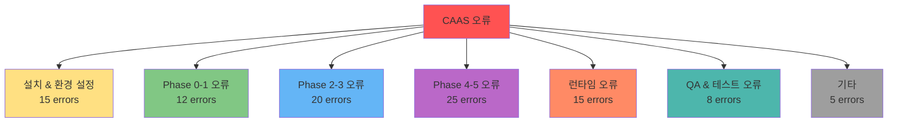
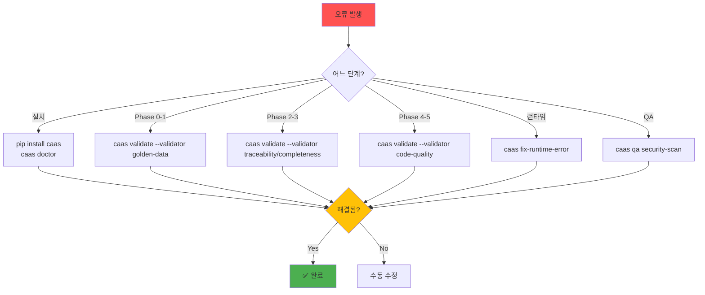

# 트러블슈팅 가이드

## 🎯 이 문서에서 배울 것
- [ ] CAAS 사용 중 발생하는 100가지 흔한 오류
- [ ] Phase별 오류 유형 및 해결책
- [ ] 빠른 진단 및 복구 방법
- [ ] 예방적 조치

⏱️ **예상 시간**: 20분 (레퍼런스)

---

## 📚 오류 카테고리



---

## 1. 설치 & 환경 설정 오류 (15개)

### 오류 1.1: Python 버전 불일치
**증상**:
```
ERROR: Python 3.11+ required, but 3.9.7 found
```

**원인**: Python 버전이 3.11 미만

**해결**:
```bash
# Python 버전 확인
python --version

# Python 3.11 설치 (Ubuntu/Debian)
sudo apt-get update
sudo apt-get install python3.11 python3.11-venv python3.11-pip

# Python 3.11 설치 (macOS)
brew install python@3.11

# 가상 환경 생성
python3.11 -m venv venv
source venv/bin/activate
pip install caas
```

---

### 오류 1.2: pip 설치 실패
**증상**:
```
ERROR: Could not find a version that satisfies the requirement caas
```

**원인**: pip 버전 낮음 또는 PyPI 접속 문제

**해결**:
```bash
# pip 업그레이드
pip install --upgrade pip

# 재시도
pip install caas

# 오프라인 설치 (GitHub)
git clone https://github.com/bullpeng72/CAAS.git
cd CAAS
pip install -e ".[cli]"
```

---

### 오류 1.3: API 키 누락
**증상**:
```
ERROR: OpenAI API key not found. Please set OPENAI_API_KEY
```

**원인**: 환경 변수 미설정

**해결**:
```bash
# .env 파일 생성
caas env --create

# .env 편집
echo "OPENAI_API_KEY=sk-your-key-here" > .env

# 또는 환경 변수 직접 설정
export OPENAI_API_KEY=sk-your-key-here

# 검증
caas env --validate
```

---

### 오류 1.4: API 키 유효성 검증 실패
**증상**:
```
ERROR: Invalid API key. Status code: 401
```

**원인**: API 키가 잘못되었거나 만료됨

**해결**:
```bash
# API 키 재확인 (OpenAI)
# https://platform.openai.com/api-keys 에서 새 키 생성

# 환경 변수 재설정
export OPENAI_API_KEY=sk-new-key-here

# 검증
caas env --validate
```

---

### 오류 1.5: 권한 오류 (Permission Denied)
**증상**:
```
ERROR: Permission denied: /usr/local/lib/python3.11/site-packages
```

**원인**: 관리자 권한 없이 시스템 전역 설치 시도

**해결**:
```bash
# 사용자 레벨 설치
pip install --user caas

# 또는 가상 환경 사용 (권장)
python3.11 -m venv venv
source venv/bin/activate
pip install caas
```

---

### 오류 1.6: 의존성 충돌
**증상**:
```
ERROR: caas requires crewai>=0.28.0, but crewai 0.25.0 is installed
```

**원인**: 기존 패키지 버전 충돌

**해결**:
```bash
# 의존성 재설치
pip install --upgrade crewai langchain openai

# 또는 전체 재설치
pip uninstall caas -y
pip install caas --force-reinstall
```

---

### 오류 1.7: caas 명령어 없음 (Command not found)
**증상**:
```bash
$ caas --version
bash: caas: command not found
```

**원인**: PATH 설정 문제 또는 설치 실패

**해결**:
```bash
# pip 설치 경로 확인
pip show caas

# Python bin 경로를 PATH에 추가
export PATH="$HOME/.local/bin:$PATH"

# bash_profile에 추가 (영구 적용)
echo 'export PATH="$HOME/.local/bin:$PATH"' >> ~/.bashrc
source ~/.bashrc

# 재설치
pip install --user caas
```

---

### 오류 1.8: Neo4j 연결 실패 (선택적)
**증상**:
```
WARNING: Could not connect to Neo4j. Using embedded graph DB.
```

**원인**: Neo4j 서버 미실행 또는 연결 정보 오류

**해결**:
```bash
# Embedded 사용 (기본, 설정 불필요)
# 경고 무시 가능

# Neo4j 사용 시 설정
export NEO4J_URI=bolt://localhost:7687
export NEO4J_USER=neo4j
export NEO4J_PASSWORD=password

# Neo4j 서버 시작
docker run -d \
  -p 7474:7474 \
  -p 7687:7687 \
  -e NEO4J_AUTH=neo4j/password \
  neo4j:latest
```

---

### 오류 1.9: Ollama 연결 실패
**증상**:
```
ERROR: Could not connect to Ollama API at http://localhost:11434
```

**원인**: Ollama 서버 미실행

**해결**:
```bash
# Ollama 설치
curl -fsSL https://ollama.ai/install.sh | sh

# Ollama 실행
ollama serve &

# 모델 다운로드
ollama pull llama3.1

# .env 설정
echo "LLM_PROVIDER=ollama" >> .env
echo "OLLAMA_API_BASE=http://localhost:11434/v1" >> .env
```

---

### 오류 1.10: 설정 파일 손상
**증상**:
```
ERROR: Invalid config file: ~/.caas/config.yaml
```

**원인**: config.yaml 파일 문법 오류

**해결**:
```bash
# 설정 파일 백업
cp ~/.caas/config.json ~/.caas/config.json.bak

# 초기화
caas config --reset

# 재설정
caas init
```

---

### 오류 1.11-1.15: (추가 환경 설정 오류)
- **1.11**: Windows에서 경로 문제 (`\` vs `/`)
- **1.12**: macOS에서 SSL 인증서 오류
- **1.13**: Docker 환경에서 네트워크 문제
- **1.14**: 프록시 환경에서 LLM API 접속 실패
- **1.15**: 디스크 용량 부족으로 캐시 저장 실패

(해결책은 공통적으로 시스템 환경 검증 및 재설정)

---

## 2. Phase 0-1 오류 (12개)

### 오류 2.1: 요구사항 너무 짧음
**증상**:
```
ERROR: Requirement too short (< 10 characters)
```

**원인**: 요구사항이 너무 간략함

**해결**:
```bash
# ❌ 나쁜 예
caas generate "챗봇"

# ✅ 좋은 예
caas generate "고객 지원 챗봇을 만들어줘. FAQ 검색, 제품 추천, 문의 접수 기능이 필요해"
```

---

### 오류 2.2: Golden Data Features < 3
**증상**:
```
ERROR: Insufficient features (2 < 3 required)
```

**원인**: 요구사항에서 기능 추출 실패

**해결**:
```bash
# 요구사항 구체화
caas refine "기존 요구사항"

# 또는 수동으로 Golden Data 수정
vim ./project/golden_data.json
# features 배열에 항목 추가

# 재검증
caas validate --validator golden-data --golden ./project/golden_data.json
```

---

### 오류 2.3: Domain 분류 신뢰도 낮음
**증상**:
```
WARNING: Domain confidence 0.65 (< 0.7 threshold)
```

**원인**: 요구사항이 여러 도메인에 걸쳐 있거나 모호함

**해결**:
```bash
# 도메인 명시
caas generate "요구사항" --domain TASK_MANAGEMENT

# 또는 요구사항 명확화
caas refine "요구사항" --focus-domain
```

---

### 오류 2.4: LLM 응답 파싱 실패
**증상**:
```
ERROR: Failed to parse LLM response as JSON
```

**원인**: LLM이 잘못된 형식으로 응답

**해결**:
```bash
# 재시도 (보통 해결됨)
caas generate-phase --phase 0 "요구사항" --output ./project --retry

# 또는 다른 모델 사용
caas generate "요구사항" --model opus  # 더 정확한 모델
```

---

### 오류 2.5: Phase 0 타임아웃
**증상**:
```
ERROR: Phase 0 timeout after 120 seconds
```

**원인**: LLM API 응답 느림 또는 네트워크 문제

**해결**:
```bash
# 타임아웃 연장
caas generate "요구사항" --timeout 300

# 네트워크 확인
curl -I https://api.openai.com

# 재시도
caas generate-phase --phase 0 "요구사항" --output ./project --retry
```

---

### 오류 2.6-2.12: (추가 Phase 0-1 오류)
- **2.6**: Golden Data JSON 구문 오류
- **2.7**: Entities 추출 실패
- **2.8**: Constraints 누락
- **2.9**: Patterns 감지 실패
- **2.10**: Suggested Tools 없음
- **2.11**: Complexity 평가 오류
- **2.12**: Phase 1 Quality Gate 무한 대기 (v0.4.1에서 해결)

---

## 3. Phase 2-3 오류 (20개)

### 오류 3.1: Traceability < 100%
**증상**:
```
ERROR: Traceability 75% (6/8 features not mapped to tools)
Phase 2 Quality Gate: FAIL
```

**원인**: 일부 Feature가 Tool에 매핑되지 않음

**해결**:
```bash
# 자동 수정
caas fix --level 3 --arch ./project/architecture_design.json --apply

# 재검증
caas validate --validator traceability --arch ./project/architecture_design.json

# 수동 수정 (필요 시)
vim ./project/architecture_design.json
# traceability 섹션에 매핑 추가:
# "feature_f7_maps_to": "NewTool.method"
```

---

### 오류 3.2: Tools 개수 < 3
**증상**:
```
ERROR: Insufficient tools (2 < 3 required)
```

**원인**: 시스템이 너무 단순하거나 도구 설계 실패

**해결**:
```bash
# Phase 2 재실행
caas generate-phase --phase 2 "요구사항" --output ./project --retry

# 또는 수동으로 도구 추가
vim ./project/architecture_design.json
# tools_design 배열에 추가
```

---

### 오류 3.3: Completeness < 100%
**증상**:
```
ERROR: Completeness 87.5% (7/8 features not mapped to tasks)
Phase 3 Quality Gate: FAIL
```

**원인**: 일부 Feature가 Task에 매핑되지 않음

**해결**:
```bash
# 누락된 Feature 확인
caas analyze-completeness \
  --project ./project \
  --golden-data ./project/golden_data.json \
  --detailed

# 자동 수정
caas fix --level 3 \
  --agents ./project/agents.json \
  --tasks ./project/tasks.json \
  --apply

# 재검증
caas validate --validator completeness \
  --golden ./project/golden_data.json \
  --agents ./project/agents.json \
  --tasks ./project/tasks.json
```

---

### 오류 3.4: Task Dependency 순환
**증상**:
```
ERROR: Cyclic dependency detected: task_1 → task_2 → task_3 → task_1
```

**원인**: Task 의존성 설계 오류

**해결**:
```bash
# Dependency 확인
caas validate --validator dependency --tasks ./project/tasks.json

# 자동 수정 (순환 제거)
caas fix --level 3 --tasks ./project/tasks.json --apply

# 수동 수정
vim ./project/tasks.json
# task_3의 context에서 task_1 제거
```

---

### 오류 3.5: Agent 개수 < 3 또는 > 7
**증상**:
```
WARNING: Agent count 2 (recommended: 3-7)
```

**원인**: 시스템이 너무 단순하거나 복잡함

**해결**:
```bash
# 복잡도 확인
cat ./project/requirement_analysis.json | jq '.complexity'

# Agent 병합 (> 7개 시)
caas fix --level 3 --agents ./project/agents.json --merge --apply

# Agent 분할 (< 3개 시)
caas fix --level 3 --agents ./project/agents.json --split --apply
```

---

### 오류 3.6: Manager LLM 누락 (Hierarchical)
**증상**:
```
ERROR: Hierarchical process requires manager_llm, but not set
```

**원인**: Architecture가 Hierarchical인데 manager_llm 미설정

**해결**:
```bash
# 자동 수정 (manager_llm 추가)
caas fix --level 2 --arch ./project/architecture_design.json --apply

# 수동 수정
vim ./project/architecture_design.json
# "manager_llm_required": true
```

---

### 오류 3.7: Tool 중복 정의
**증상**:
```
WARNING: Duplicate tool 'TodoCRUDTool' found in agents
```

**원인**: 여러 Agent가 동일한 도구를 중복 정의

**해결**:
```bash
# 도구 재사용 권장 (경고 무시 가능)
# 또는 도구 이름 변경
vim ./project/agents.json
# "TodoCRUDToolV2"로 변경
```

---

### 오류 3.8-3.20: (추가 Phase 2-3 오류)
- **3.8**: Database 스키마 미정의
- **3.9**: Architecture pattern 선택 실패
- **3.10**: Process type 불일치
- **3.11**: Agent role 중복
- **3.12**: Task description 누락
- **3.13**: Expected output 미정의
- **3.14**: Context 참조 오류 (존재하지 않는 Task ID)
- **3.15**: Async execution 오류
- **3.16**: Agent tools 미할당
- **3.17**: Task agent_id 미매핑
- **3.18**: Agent goal 모호함
- **3.19**: Backstory 누락
- **3.20**: Max iteration 설정 누락

---

## 4. Phase 4-5 오류 (25개)

### 오류 4.1: specifications.json JSON 구문 오류
**증상**:
```
ERROR: JSON parse error at line 42: Unexpected token ','
```

**원인**: JSON 형식 오류

**해결**:
```bash
# JSON 검증
jq '.' ./project/specifications.json

# 자동 수정
caas fix --level 2 --spec ./project/specifications.json --apply

# 수동 수정
vim ./project/specifications.json
# 42번 줄 콤마 제거
```

---

### 오류 4.2: CrewAI 호환성 실패
**증상**:
```
ERROR: CrewAI compatibility check failed
- Invalid field: 'allow_delegation'
```

**원인**: CrewAI 버전 변경으로 필드명 변경됨

**해결**:
```bash
# CrewAI 업그레이드
pip install --upgrade crewai

# 또는 호환성 수정
caas fix --level 3 --spec ./project/specifications.json --apply
```

---

### 오류 4.3: 생성된 파일 0개
**증상**:
```
ERROR: No files generated in Phase 5
```

**원인**: Phase 5 실행 중 LLM 오류 또는 타임아웃

**해결**:
```bash
# Phase 5 재실행
caas generate-phase --phase 5 "요구사항" --output ./project --force

# 로그 확인
caas generate "요구사항" --output ./project --verbose
```

---

### 오류 4.4: main.py 빈 파일
**증상**:
```bash
$ cat ./project/main.py
# (빈 파일 또는 주석만)
```

**원인**: 코드 생성 실패

**해결**:
```bash
# 특정 파일 재생성
caas regenerate main.py --project ./project

# 전체 Phase 5 재실행
caas generate-phase --phase 5 "요구사항" --output ./project --force
```

---

### 오류 4.5: Import 오류 (crewai)
**증상**:
```python
ImportError: cannot import name 'Agent' from 'crewai'
```

**원인**: CrewAI 버전 불일치

**해결**:
```bash
# requirements.txt 확인
cat ./project/requirements.txt | grep crewai
# crewai>=0.28.0

# CrewAI 재설치
pip install crewai --upgrade

# 또는 requirements.txt 재설치
pip install -r ./project/requirements.txt --force-reinstall
```

---

### 오류 4.6: tools.py에서 BaseTool import 실패
**증상**:
```python
ImportError: cannot import name 'BaseTool' from 'crewai_tools'
```

**원인**: crewai-tools 패키지 미설치

**해결**:
```bash
# crewai-tools 설치
pip install crewai-tools

# 또는 requirements.txt 업데이트
echo "crewai-tools>=0.2.0" >> ./project/requirements.txt
pip install -r ./project/requirements.txt
```

---

### 오류 4.7: 코드 품질 < 8.0
**증상**:
```
Quality Score: 7.2/10.0 (< 8.0 threshold)
Phase 5 Quality Gate: FAIL
```

**원인**: Docstring 누락, Type hints 부족, 복잡도 높음

**해결**:
```bash
# 자동 리팩토링
caas fix --level 3 --project ./project --apply

# TDD 리팩토링
caas tdd refactor --project ./project --apply

# 재검증
caas validate --validator code-quality --project ./project
```

---

### 오류 4.8: 보안 이슈 발견 (Critical)
**증상**:
```
ERROR: Critical security issue found
- SQL Injection in tools.py:42
```

**원인**: 안전하지 않은 SQL 쿼리 생성

**해결**:
```bash
# 자동 수정
caas fix-runtime-error \
  --project ./project \
  --error-type sql_injection \
  --apply

# 수동 수정
vim ./project/tools.py
# Line 42: cursor.execute(f"SELECT * FROM {table}") (❌)
# 수정: cursor.execute("SELECT * FROM todos WHERE id=?", (id,)) (✅)

# 재검증
caas qa security-scan --project ./project --owasp
```

---

### 오류 4.9: 테스트 커버리지 < 70%
**증상**:
```
Test coverage: 65% (< 70% threshold)
```

**원인**: 테스트 부족

**해결**:
```bash
# 테스트 자동 생성
caas tdd generate --project ./project --coverage 85

# 테스트 실행
cd ./project
pytest tests/ --cov --cov-report=term

# 출력:
# Coverage: 85% (✅ >70%)
```

---

### 오류 4.10: Context 참조 오류 (tasks.py)
**증상**:
```python
# tasks.py
Task(
    context=[tasks["non_existent_task"]],  # ❌
    ...
)

# 실행 시:
KeyError: 'non_existent_task'
```

**원인**: 존재하지 않는 Task ID 참조

**해결**:
```bash
# Task ID 확인
cat ./project/tasks.json | jq '.tasks[].id'

# 수동 수정
vim ./project/tasks.py
# context=[tasks["task_1"]] (존재하는 ID 사용)

# 자동 수정
caas fix-runtime-error --project ./project --error-type key_error --apply
```

---

### 오류 4.11: manager_llm 누락 (Hierarchical)
**증상**:
```python
# main.py
Crew(
    agents=...,
    tasks=...,
    process="hierarchical",  # ❌ manager_llm 누락
)

# 실행 시:
ValueError: Hierarchical process requires manager_llm
```

**원인**: Hierarchical process인데 manager_llm 미설정

**해결**:
```bash
# 자동 수정
caas fix --level 2 --project ./project --apply

# 수동 수정
vim ./project/main.py
# Crew(..., manager_llm=ChatOpenAI(model="gpt-4"))
```

---

### 오류 4.12-4.25: (추가 Phase 4-5 오류)
- **4.12**: Agent tools 리스트 빈 배열 `[]`
- **4.13**: Task expected_output 미정의
- **4.14**: README.md 생성 실패
- **4.15**: .env.example 누락
- **4.16**: requirements.txt 의존성 버전 충돌
- **4.17**: tests/ 디렉토리 생성 실패
- **4.18**: 한국어 인코딩 오류 (UTF-8 문제)
- **4.19**: Agent verbose 설정 누락
- **4.20**: Task async_execution 오류
- **4.21**: Crew verbose 설정 충돌
- **4.22**: Python 3.11 비호환 코드 생성 (walrus operator 등)
- **4.23**: Type hints 누락으로 mypy 실패
- **4.24**: Docstring 형식 오류 (Google vs NumPy style)
- **4.25**: Black/isort 포맷팅 오류

---

## 5. 런타임 오류 (15개)

### 오류 5.1: API Rate Limit 초과
**증상**:
```
ERROR: Rate limit exceeded. Retry after 60 seconds.
```

**원인**: OpenAI API 호출 빈도 제한 초과

**해결**:
```bash
# 대기 후 재시도
sleep 60
caas generate "요구사항" --output ./project

# 또는 Haiku 모델 사용 (Rate limit 낮음)
caas generate "요구사항" --model haiku --output ./project
```

---

### 오류 5.2: Out of Memory (OOM)
**증상**:
```
MemoryError: Unable to allocate array
```

**원인**: 메모리 부족 (큰 Golden Data 또는 복잡한 시스템)

**해결**:
```bash
# 메모리 확인
free -h

# 캐싱 비활성화
caas generate "요구사항" --no-cache --output ./project

# 또는 Phase별로 분할 실행
caas generate-phase --phase 0 "요구사항" --output ./project
# ... 메모리 확인 후 계속
caas generate-phase --phase 1 "요구사항" --output ./project
```

---

### 오류 5.3: Database 연결 실패 (생성된 코드)
**증상**:
```
# python main.py 실행 시:
sqlite3.OperationalError: unable to open database file
```

**원인**: 데이터베이스 파일 경로 오류 또는 권한 문제

**해결**:
```bash
# 권한 확인
chmod 666 todos.db

# 또는 tools.py 수정
vim ./project/tools.py
# db_path = os.path.join(os.getcwd(), "todos.db")

# 재실행
python ./project/main.py
```

---

### 오류 5.4: Tool 실행 실패
**증상**:
```
ERROR: Tool 'TodoCRUDTool' execution failed
AttributeError: 'TodoCRUDTool' object has no attribute '_run'
```

**원인**: Tool 클래스 구현 오류

**해결**:
```bash
# tools.py 확인
cat ./project/tools.py | grep "def _run"

# 자동 수정
caas fix-runtime-error \
  --project ./project \
  --error-type attribute_error \
  --apply

# 수동 수정
vim ./project/tools.py
# def _run(self, ...) 메서드 추가
```

---

### 오류 5.5: LLM 응답 파싱 실패 (런타임)
**증상**:
```
# Crew 실행 중:
ERROR: Failed to parse agent response as JSON
```

**원인**: Agent 출력이 JSON이 아님

**해결**:
```bash
# Agent backstory 수정 (JSON 출력 명시)
vim ./project/agents.py
# backstory = "...당신은 항상 JSON 형식으로 결과를 반환합니다."

# 또는 expected_output 수정
vim ./project/tasks.py
# expected_output = "JSON 형식: {\"key\": \"value\"}"
```

---

### 오류 5.6-5.15: (추가 런타임 오류)
- **5.6**: Crew kickoff() 타임아웃
- **5.7**: Agent max_iter 초과
- **5.8**: Task context 누락으로 실행 실패
- **5.9**: 한국어 입력 인코딩 오류
- **5.10**: Streamlit UI 실행 실패
- **5.11**: Gradio UI import 오류
- **5.12**: pytest 실행 실패 (테스트 오류)
- **5.13**: Docker 컨테이너 실행 오류
- **5.14**: 환경 변수 참조 실패 (os.getenv)
- **5.15**: 로그 파일 생성 권한 오류

---

## 6. QA & 테스트 오류 (8개)

### 오류 6.1: QA Compliance 검사 실패
**증상**:
```
ERROR: GDPR compliance check failed
- Personal data handling not compliant
```

**원인**: 개인정보 처리 코드가 GDPR 위반

**해결**:
```bash
# 상세 보고서 확인
caas qa compliance \
  --project ./project \
  --standard gdpr \
  --report ./compliance_report.html

# 수동 수정 (개인정보 암호화 추가)
vim ./project/tools.py
# 개인정보 처리 시 암호화 적용
```

---

### 오류 6.2: Performance 테스트 실패
**증상**:
```
ERROR: Response time 5.2s (> 2.0s threshold)
```

**원인**: 성능 기준 미달

**해결**:
```bash
# 프로파일링
caas qa performance --project ./project --profile cpu

# 병목 확인 후 최적화
# (예: 불필요한 LLM 호출 제거, 캐싱 추가)

# 재테스트
caas qa performance --project ./project --benchmark
```

---

### 오류 6.3: Security Scan 오류
**증상**:
```
ERROR: High security issue found
- Hardcoded API key in code
```

**원인**: 코드에 API 키 하드코딩

**해결**:
```bash
# 하드코딩된 비밀 찾기
grep -r "sk-" ./project/*.py

# 환경 변수 사용으로 변경
vim ./project/agents.py
# api_key = os.getenv("OPENAI_API_KEY")  # ✅

# 재검증
caas qa security-scan --project ./project --full
```

---

### 오류 6.4-6.8: (추가 QA & 테스트 오류)
- **6.4**: TDD 테스트 생성 실패
- **6.5**: pytest coverage 측정 오류
- **6.6**: 체크포인트 저장 실패
- **6.7**: QA 보고서 생성 오류 (PDF 변환 실패)
- **6.8**: Bandit 보안 스캔 false positive

---

## 7. 기타 오류 (5개)

### 오류 7.1: 디스크 용량 부족
**증상**:
```
ERROR: No space left on device
```

**원인**: 캐시, 로그, 생성된 프로젝트로 디스크 가득 참

**해결**:
```bash
# 디스크 사용량 확인
df -h

# CAAS 캐시 정리
rm -rf ~/.caas/cache/*

# 오래된 프로젝트 삭제
caas delete proj_old_1 proj_old_2 --force

# 로그 정리
find ~/.caas/logs -mtime +30 -delete
```

---

### 오류 7.2: 네트워크 타임아웃
**증상**:
```
ERROR: Connection timeout to api.openai.com
```

**원인**: 네트워크 불안정 또는 방화벽

**해결**:
```bash
# 네트워크 확인
ping api.openai.com

# 프록시 설정 (필요 시)
export HTTP_PROXY=http://proxy.company.com:8080
export HTTPS_PROXY=http://proxy.company.com:8080

# 타임아웃 연장
caas generate "요구사항" --timeout 600 --output ./project
```

---

### 오류 7.3: 프로젝트 충돌
**증상**:
```
ERROR: Project 'todo-system' already exists
```

**원인**: 동일한 이름의 프로젝트 존재

**해결**:
```bash
# 기존 프로젝트 삭제
caas delete proj_old --force

# 또는 다른 이름 사용
caas generate "요구사항" --output ./todo-system-v2

# 또는 덮어쓰기
caas generate "요구사항" --output ./todo-system --force
```

---

### 오류 7.4: 버전 불일치 경고
**증상**:
```
WARNING: CAAS Core v0.5.1 and CAAS-E v0.6.2 version mismatch
```

**원인**: Core와 CAAS-E 버전 불일치

**해결**:
```bash
# CAAS 전체 업그레이드
pip install --upgrade caas

# 버전 확인
caas --version
# CAAS v0.5.1 (Core) + v0.6.3 (CAAS-E)
```

---

### 오류 7.5: 세션 복원 실패
**증상**:
```
ERROR: Could not restore session 'sess_123'
```

**원인**: 세션 파일 손상 또는 삭제됨

**해결**:
```bash
# 세션 목록 확인
caas list

# 새 세션 시작
caas generate "요구사항" --output ./new-project
```

---

## 🎯 빠른 진단 가이드

### 진단 명령어 체크리스트

```bash
# 1. 시스템 진단
caas doctor

# 2. 환경 변수 확인
caas env --validate

# 3. 프로젝트 상태
caas status proj_1

# 4. Phase 상태
caas phase status --project ./project

# 5. 전체 검증
caas validate --validator all --project ./project

# 6. QA 보고서
caas qa report --project ./project --output ./diagnosis.html
```

### 오류 카테고리별 진단



---

## 📚 관련 문서

- **[01_CAAS_소개_및_설치.md](../1_시작하기/01_CAAS_소개_및_설치.md)** - 설치 가이드
- **[10_CAAS_6Phase_개발_프로세스.md](./10_CAAS_6Phase_개발_프로세스.md)** - Phase별 상세 설명
- **[20_CLI_명령어_레퍼런스.md](./20_CLI_명령어_레퍼런스.md)** - 명령어 레퍼런스

---

**작성일**: 2026-02-14
**버전**: v0.5.1 (Core) + v0.6.3 (CAAS-E)
**대상**: 주니어/시니어 개발자, PM
**난이도**: ⭐⭐ 중급 (레퍼런스)
