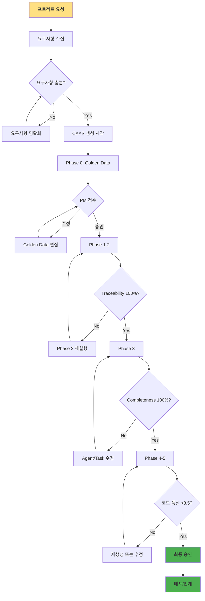

# 프로젝트 생성 워크플로우 (PM용)

## 🎯 이 문서에서 배울 것
- [ ] PM 관점의 프로젝트 생성 전체 프로세스
- [ ] 각 단계별 의사결정 포인트
- [ ] 팀 협업 및 커뮤니케이션 방법
- [ ] 프로젝트 진행 상태 관리

⏱️ **예상 시간**: 20분

**대상**: 프로젝트 관리자 (PM), 개발 팀장

---

## 📖 PM 워크플로우 개요



---

## 1. 프로젝트 시작 전

### 1.1 요구사항 수집 회의

**참석자**: PM, 고객/요청자, 개발 리더

**체크리스트**:
- [ ] 프로젝트 목적 명확화
- [ ] 핵심 기능 3-5개 식별
- [ ] 기술 스택 제약사항 확인
- [ ] 일정 및 마일스톤 합의
- [ ] 예산 및 리소스 확인

**산출물**: 초기 요구사항 문서

```markdown
# 프로젝트 요청서

## 프로젝트명
할일 관리 시스템

## 목적
팀원들의 할일을 효율적으로 관리하고 우선순위를 자동으로 추천

## 핵심 기능
1. 할일 추가, 조회, 수정, 삭제
2. 우선순위 자동 분석 (마감일 기반)
3. 팀원 간 할일 공유
4. 마감일 알림
5. 통계 및 리포트

## 제약사항
- 기술: Python, SQLite, Streamlit UI
- 일정: 2주 이내
- 예산: 개발 비용 없음 (자동화)

## 이해관계자
- 요청자: 팀장 (user@company.com)
- PM: (your@company.com)
- 개발 리더: (dev@company.com)
```

### 1.2 요구사항 명확화

**도구**: `caas analyze-gaps` + `caas expand`

```bash
# 1단계: Golden Data 생성
caas generate-phase --phase 0 "팀 할일 관리 시스템. 할일 추가, 우선순위 자동 추천, 공유 기능" \
  --output ./project

# 2단계: 갭 분석
caas analyze-gaps "팀 할일 관리 시스템" \
  --golden-data ./project/golden_data.json \
  --output gaps.json

# 3단계: 갭 채우기 (구체화)
caas expand "팀 할일 관리 시스템" \
  --golden-data ./project/golden_data.json \
  --gaps gaps.json \
  --output expanded_golden.json

# 출력 예시 (expanded_golden.json):
# {
#   "features": [
#     {"id": "f1", "name": "할일 추가", "description": "제목, 설명, 마감일, 담당자 입력"},
#     {"id": "f2", "name": "할일 조회", "description": "팀원별/우선순위별 필터"},
#     {"id": "f3", "name": "우선순위 자동 분석", "description": "마감일, 의존성, 작업량 기반"},
#     {"id": "f4", "name": "할일 공유", "description": "읽기 전용 공유"},
#     {"id": "f5", "name": "마감일 알림", "description": "이메일/Slack 알림"},
#     {"id": "f6", "name": "통계 리포트", "description": "완료율, 지연율, 팀원별 현황"}
#   ],
#   "constraints": [
#     "마감일 필수 입력",
#     "공유 할일은 수정 불가",
#     "알림은 하루 1회"
#   ]
# }
```

---

## 2. Phase 0-1: 요구사항 분석

### 2.1 Golden Data 생성 및 검수

**실행**:
```bash
caas generate-phase --phase 0 "구체화된 요구사항" --output ./team-todo-project
```

**PM 검수 항목**:
```bash
# 1. Golden Data 확인
cat ./team-todo-project/golden_data.json | jq '.'

# 2. Features 개수 확인
cat ./team-todo-project/golden_data.json | jq '.features | length'
# 출력: 6 (✅ ≥3)

# 3. Entities 확인
cat ./team-todo-project/golden_data.json | jq '.entities[].name'
# 출력: "Todo", "User", "ShareLink"

# 4. 검증
caas validate --validator golden \
  --golden-data ./team-todo-project/golden_data.json \
  --agents ./team-todo-project/agents.json \
  --tasks ./team-todo-project/tasks.json
# ✅ Quality Score: 9.0/10.0
```

**의사결정**:
- ✅ **승인**: Features 충분, Entities 적절 → Phase 1 진행
- ⚠️ **수정**: Feature 누락 발견 → Golden Data 수동 편집
- ❌ **거부**: 요구사항 재작성 필요 → Phase 0 재실행

### 2.2 도메인 분류 확인

```bash
# Phase 1 실행
caas generate-phase --phase 1 "요구사항" --output ./team-todo-project

# Domain 확인
cat ./team-todo-project/requirement_analysis.json | jq '.domain, .domain_confidence'
# 출력: "TASK_MANAGEMENT", 0.95

# 신뢰도 확인
# >0.9: 매우 확실 ✅
# 0.7-0.9: 확실 ✅
# <0.7: 재검토 필요 ⚠️
```

---

## 3. Phase 2: 아키텍처 설계

### 3.1 Traceability 검증 (Critical!)

```bash
# Phase 2 실행
caas generate-phase --phase 2 "요구사항" --output ./team-todo-project

# Traceability 검증
caas traceability \
  --golden-data ./team-todo-project/golden_data.json \
  --agents ./team-todo-project/agents.json \
  --tasks ./team-todo-project/tasks.json
```

**출력 분석**:
```
Feature f1 (할일 추가) → TodoCRUDTool.create ✅
Feature f2 (할일 조회) → TodoCRUDTool.read ✅
Feature f3 (우선순위 분석) → PriorityAnalysisTool.analyze ✅
Feature f4 (할일 공유) → ShareTool.create_share_link ✅
Feature f5 (마감일 알림) → NotificationTool.send_email ✅
Feature f6 (통계 리포트) → ReportTool.generate ✅

Traceability: 100% (6/6 features mapped) ✅
```

**의사결정**:
- ✅ **100% Traceability**: 즉시 승인 → Phase 3 진행
- ❌ **<100% Traceability**: 자동 수정 또는 Phase 2 재실행

```bash
# Traceability < 100% 시 자동 수정
caas fix --level 3 \
  --arch ./team-todo-project/architecture_design.json \
  --apply

# 재검증
caas traceability \
  --golden-data ./team-todo-project/golden_data.json \
  --agents ./team-todo-project/agents.json \
  --tasks ./team-todo-project/tasks.json
```

### 3.2 PM 검토 회의

**참석자**: PM, 개발 리더, 아키텍트

**검토 항목**:
- [ ] Tools 개수 적절한가? (3-7개)
- [ ] Architecture pattern 타당한가? (Sequential/Hierarchical/...)
- [ ] Database 선택 적절한가? (SQLite/PostgreSQL/...)
- [ ] Traceability 100% 확인

**산출물**: Architecture 승인 문서

---

## 4. Phase 3: Agent/Task 설계

### 4.1 Completeness 검증 (Critical!)

```bash
# Phase 3 실행
caas generate-phase --phase 3 "요구사항" --output ./team-todo-project

# Completeness 검증
caas analyze-completeness \
  --project ./team-todo-project \
  --golden-data ./team-todo-project/golden_data.json \
  --detailed
```

**출력 분석**:
```
📊 Completeness Analysis Report

Golden Data Features: 6
Implemented in Tasks: 6 (100.0%)

Feature Mapping:
✅ f1 (할일 추가) → task_1 (입력 수집), task_2 (데이터 저장)
✅ f2 (할일 조회) → task_3 (데이터 조회)
✅ f3 (우선순위 분석) → task_4 (우선순위 계산)
✅ f4 (할일 공유) → task_5 (공유 링크 생성)
✅ f5 (마감일 알림) → task_6 (알림 발송)
✅ f6 (통계 리포트) → task_7 (리포트 생성)

Completeness: 100% ✅
```

**의사결정**:
- ✅ **100% Completeness**: 승인 → Phase 4-5 진행
- ❌ **<100% Completeness**: Task 추가 필요

### 4.2 Agent/Task 균형 검토

```bash
# Agent 개수 확인
cat ./team-todo-project/agents.json | jq '.agents | length'
# 출력: 4 (✅ 3-7 범위)

# Task 개수 확인
cat ./team-todo-project/tasks.json | jq '.tasks | length'
# 출력: 7 (✅ ≥ Agent 수 × 1.5)

# Dependency 순환 체크
caas validate --validator dependency --tasks ./team-todo-project/tasks.json
# ✅ No cycles detected
```

---

## 5. Phase 4-5: 코드 생성 및 검수

### 5.1 코드 생성

```bash
# Phase 4-5 실행 (한 번에)
caas generate-phase --phase 4 "요구사항" --output ./team-todo-project
caas generate-phase --phase 5 "요구사항" --output ./team-todo-project

# 또는 전체 자동 실행
caas generate "구체화된 요구사항" --output ./team-todo-project
```

### 5.2 코드 품질 검증

```bash
# 전체 검증
caas validate --validator all \
  --agents ./team-todo-project/agents.json \
  --tasks ./team-todo-project/tasks.json \
  --golden-data ./team-todo-project/golden_data.json
```

**출력**:
```
🔍 Code Quality Validator

✅ Files: 8/8
✅ AST Parsing: Success
✅ Code Quality: 8.7/10.0
✅ Security Issues: 0 (Critical/High)
⚠️  Test Coverage: 78% (<80%)

📊 Overall: CONDITIONAL PASS (테스트 커버리지 보완 필요)
```

**의사결정**:
- ✅ **Code Quality >8.5, Security 0**: 조건부 승인 → 테스트 보완 후 배포
- ⚠️ **Code Quality 8.0-8.4**: 리팩토링 권장 → 자동 수정 시도
- ❌ **Code Quality <8.0**: 재생성 필요

### 5.3 테스트 보완

```bash
# 테스트 자동 생성
caas tdd generate --project ./team-todo-project --coverage 85

# 재검증
pytest ./team-todo-project/tests/ --cov --cov-report=term
# Coverage: 85% ✅
```

---

## 6. 최종 승인 및 인계

### 6.1 PM 최종 체크리스트

```bash
# 통합 QA 보고서 생성
caas qa report \
  --project ./team-todo-project \
  --output ./team-todo-final-qa-report.html
```

**체크리스트**:
- [ ] Golden Data: Features 6개, Entities 3개 ✅
- [ ] Traceability: 100% ✅
- [ ] Completeness: 100% ✅
- [ ] Code Quality: 8.7/10.0 ✅
- [ ] Security: 0 Critical/High ✅
- [ ] Test Coverage: 85% ✅
- [ ] 모든 테스트 통과: 15/15 ✅

**승인 등급**: **A (우수)** → 프로덕션 배포 승인

### 6.2 프로젝트 인계

**인계 패키지**:
```bash
# 프로젝트 다운로드
caas download proj_123 ./team-todo-release-v1.0
```

**인계 문서**:
```markdown
# 프로젝트 인계서

## 프로젝트 정보
- 이름: 팀 할일 관리 시스템
- 버전: v1.0.0
- 생성일: 2026-02-14
- PM: (your@company.com)

## 산출물
- 코드: ./team-todo-release-v1.0.zip
- QA 보고서: ./team-todo-final-qa-report.pdf
- 메타데이터: ./metadata.json

## 품질 지표
- Code Quality: 8.7/10.0
- Test Coverage: 85%
- Security Score: 10.0/10.0

## 배포 가이드
1. 압축 해제: `unzip team-todo-release-v1.0.zip`
2. 의존성 설치: `pip install -r requirements.txt`
3. 환경 설정: `.env` 파일 편집
4. 실행: `python main.py` 또는 `streamlit run app.py`

## 운영 담당자
- 개발: (dev@company.com)
- QA: (qa@company.com)
```

---

## 7. 프로젝트 진행 상태 관리

### 7.1 일일 모니터링

```bash
# 프로젝트 상태 확인
caas status proj_123
```

**출력**:
```
📊 Project Status: team-todo-system (proj_123)

Domain: TASK_MANAGEMENT
Status: In Progress (Phase 3)

Current Phase: Phase 3 (Design)
Progress: 60%

Phases:
  Phase 0: ✅ Complete (35s)
  Phase 1: ✅ Complete (28s)
  Phase 2: ✅ Complete (22s)
  Phase 3: 🔄 In Progress (60%)
  Phase 4: ⏸️  Pending
  Phase 5: ⏸️  Pending

Last Updated: 2026-02-14 16:30:00
```

### 7.2 팀 커뮤니케이션

**일일 스탠드업 보고**:
```markdown
## 2026-02-14 진행 상황

### 완료
- ✅ Phase 0-2 완료 (Traceability 100%)
- ✅ Architecture 승인 완료

### 진행 중
- 🔄 Phase 3 Agent/Task 설계 (60%)
- 현재 Agent 4개, Task 7개 설계됨

### 예정
- Phase 3 Completeness 검증 (오늘 완료 목표)
- Phase 4-5 코드 생성 (내일 시작)

### 이슈
- 없음

### 다음 마일스톤
- 2026-02-16: 최종 코드 생성 완료
- 2026-02-17: QA 및 승인
- 2026-02-18: 배포
```

---

## 8. 트러블슈팅 (PM 관점)

### 문제 1: Traceability < 100%

**증상**: Phase 2에서 일부 Feature가 Tool에 매핑되지 않음

**원인 분석**:
```bash
caas traceability \
  --golden-data ./project/golden_data.json \
  --agents ./project/agents.json \
  --tasks ./project/tasks.json
# Feature f4 (할일 공유) → ❌ No mapping
```

**해결**:
1. 자동 수정 시도
   ```bash
   caas fix --level 3 --arch ./project/architecture_design.json --apply
   ```
2. 재검증
   ```bash
   caas validate --validator traceability --arch ./project/architecture_design.json
   # Traceability: 100% ✅
   ```
3. 팀 보고: "Feature f4 Tool 매핑 자동 추가 완료"

### 문제 2: 일정 지연 (Phase 3 장기화)

**증상**: Phase 3가 예상보다 오래 걸림 (2시간 → 5시간)

**원인**: Completeness 반복 수정

**대응**:
1. **단기**: 수동 개입
   ```bash
   # Golden Data에서 복잡한 Feature 제거
   vim ./project/golden_data.json
   # Feature f6 (통계 리포트) 제거 → v2.0 이동
   ```
2. **장기**: 요구사항 간소화 제안
   - 고객과 재협의: "통계 리포트는 Phase 2 (v2.0)로 연기"
   - Golden Data 재생성
   - Phase 2-3 재실행

### 문제 3: 코드 품질 미달

**증상**: Code Quality 7.5/10.0 (<8.0 기준)

**원인**: Docstring 부족 (55%), 복잡도 높음

**해결**:
```bash
# 코드 분석 및 리팩토링 제안
caas tdd analyze-code --project ./project

# 재검증
caas validate --validator all \
  --agents ./project/agents.json \
  --tasks ./project/tasks.json \
  --golden-data ./project/golden_data.json
# Code Quality: 8.6/10.0 ✅
```

**팀 보고**: "자동 리팩토링으로 품질 기준 달성"

---

## 📚 관련 문서

- **[31_Phase별_산출물_관리.md](./31_Phase별_산출물_관리.md)** - 산출물 검수 상세 가이드
- **[10_CAAS_6Phase_개발_프로세스.md](../2_개발_실무_가이드/10_CAAS_6Phase_개발_프로세스.md)** - Phase별 상세 설명
- **[32_품질_검수_체크리스트.md](./32_품질_검수_체크리스트.md)** - 품질 검수 체크리스트

---

**작성일**: 2026-02-14
**버전**: v0.5.1 (Core) + v0.6.3 (CAAS-E)
**대상**: 프로젝트 관리자 (PM), 개발 팀장
**난이도**: ⭐⭐ 중급
