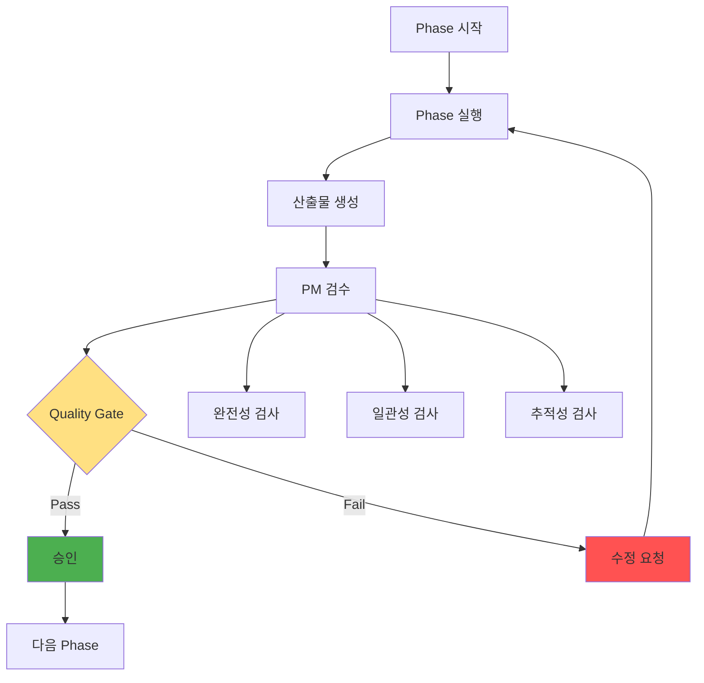
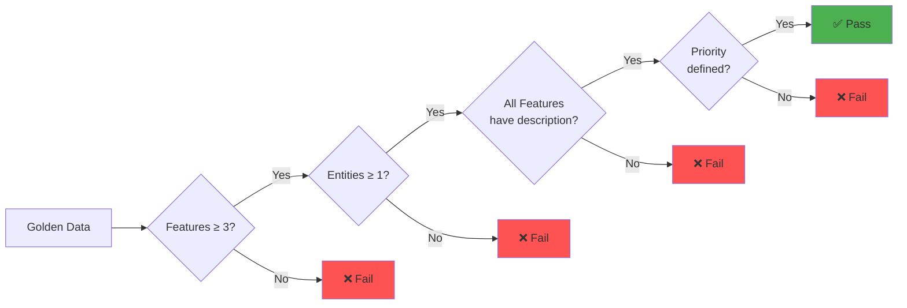
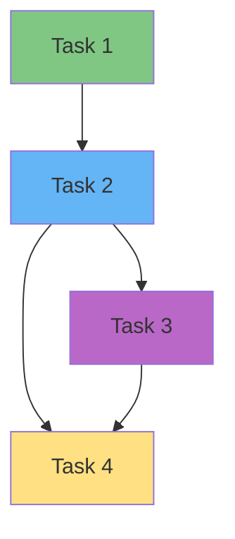
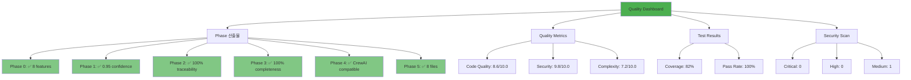
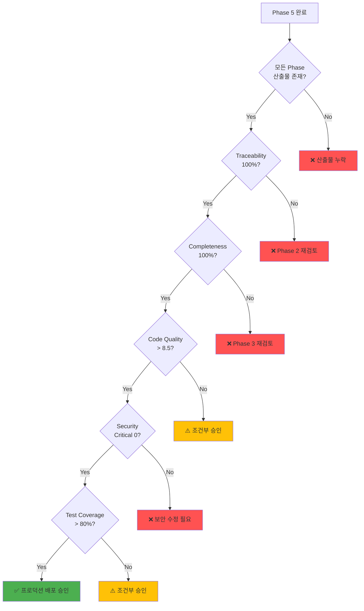

# Phase별 산출물 관리 가이드 (PM용)

## 🎯 이 문서에서 배울 것
- [ ] 각 Phase의 산출물 목록 및 검수 기준
- [ ] Quality Gate 통과 조건 및 점검 방법
- [ ] 산출물 품질 평가 및 승인 프로세스
- [ ] 프로젝트 진행 상태 모니터링 방법

⏱️ **예상 시간**: 25분

**대상**: 프로젝트 관리자 (PM), QA 리더, 개발 팀장

---

## 📖 개요

CAAS 6-Phase Methodology는 각 Phase마다 **명확한 산출물**과 **Quality Gate**를 정의합니다. PM은 이를 기준으로 프로젝트 진행 상태를 모니터링하고 품질을 보증합니다.

### 산출물 관리 프로세스



---

## Phase 0: Concretization (구조화)

### 산출물 목록

#### 1. Golden Data (golden_data.json)
**파일 위치**: `{project}/golden_data.json`

**구조**:
```json
{
  "features": [...],      // 기능 목록 (3개 이상)
  "entities": [...],      // 엔티티 목록 (1개 이상)
  "constraints": [...],   // 제약 조건
  "business_rules": [...] // 비즈니스 규칙
}
```

### PM 검수 체크리스트



- [ ] **완전성**: Features 개수 ≥ 3
- [ ] **완전성**: Entities 개수 ≥ 1
- [ ] **품질**: 모든 Feature에 description 존재
- [ ] **품질**: 모든 Feature에 priority 정의 (HIGH/MEDIUM/LOW)
- [ ] **일관성**: Entity attributes가 Feature와 연관됨
- [ ] **일관성**: Constraints가 구체적이고 측정 가능

### Quality Gate 기준

| 항목 | 기준 | 확인 방법 |
|------|------|----------|
| Features 개수 | ≥ 3 | `jq '.features | length' golden_data.json` |
| Entities 개수 | ≥ 1 | `jq '.entities | length' golden_data.json` |
| Description 누락 | 0개 | `jq '.features[] | select(.description == null)' golden_data.json` |
| Priority 미정의 | 0개 | `jq '.features[] | select(.priority == null)' golden_data.json` |

### 검수 명령어

```bash
# Golden Data 검증
caas validate --validator golden-data --golden ./project/golden_data.json

# 출력 예시:
# ✅ Features: 8 (≥3)
# ✅ Entities: 3 (≥1)
# ✅ All features have description
# ✅ All features have priority
# 📊 Overall: PASS
```

### 불합격 시 조치

**문제**: Features 개수 < 3
```bash
# 해결: 요구사항 추가 입력
caas refine "기존 요구사항" --with-golden
```

**문제**: Description 누락
```bash
# 해결: 자동 수정
caas fix --level 2 --golden ./project/golden_data.json --apply
```

---

## Phase 1: Discovery (발견)

### 산출물 목록

#### 1. Requirement Analysis (requirement_analysis.json)
**파일 위치**: `{project}/requirement_analysis.json`

**구조**:
```json
{
  "domain": "TASK_MANAGEMENT",          // 도메인 분류
  "domain_confidence": 0.95,            // 신뢰도 (>0.7)
  "complexity": "MEDIUM",               // 복잡도 (LOW/MEDIUM/HIGH)
  "estimated_agents": 3,                // 예상 Agent 수
  "estimated_tasks": 5,                 // 예상 Task 수
  "patterns_detected": [...],           // 감지된 패턴
  "suggested_tools": [...],             // 제안 도구
  "technical_requirements": {...}       // 기술 요구사항
}
```

### PM 검수 체크리스트

- [ ] **정확성**: Domain 분류 신뢰도 > 0.7
- [ ] **완전성**: Patterns 1개 이상 감지
- [ ] **완전성**: Suggested Tools 존재
- [ ] **일관성**: Complexity가 Features 개수와 부합
  - LOW: Features 1-3개
  - MEDIUM: Features 4-7개
  - HIGH: Features 8개 이상
- [ ] **추적성**: Domain이 Golden Data Features와 일치

### Quality Gate 기준

| 항목 | 기준 | 확인 방법 |
|------|------|----------|
| Domain 신뢰도 | > 0.7 | `jq '.domain_confidence' requirement_analysis.json` |
| Patterns 개수 | ≥ 1 | `jq '.patterns_detected | length' requirement_analysis.json` |
| Tools 제안 | ≥ 1 | `jq '.suggested_tools | length' requirement_analysis.json` |

### 검수 명령어

```bash
# Requirement Analysis 확인
cat ./project/requirement_analysis.json | jq '.'

# Domain 신뢰도 확인
cat ./project/requirement_analysis.json | jq '.domain_confidence'
# 출력: 0.95 (✅ >0.7)
```

### 승인 기준

**✅ 승인 조건**:
- Domain 신뢰도 > 0.7
- Complexity가 적절함 (Features 개수와 일치)
- Patterns가 1개 이상 감지됨

**❌ 거부 조건**:
- Domain 신뢰도 ≤ 0.7 → Phase 1 재실행 필요
- Patterns가 0개 → 요구사항이 너무 모호함

---

## Phase 2: Architecture (설계)

### 산출물 목록

#### 1. Architecture Design (architecture_design.json)
**파일 위치**: `{project}/architecture_design.json`

**구조**:
```json
{
  "architecture_pattern": "Sequential Process",  // 아키텍처 패턴
  "process_type": "sequential",                  // 프로세스 타입
  "manager_llm_required": false,                 // Manager LLM 필요 여부
  "database": {...},                             // DB 설계
  "tools_design": [...],                         // 도구 설계
  "agent_workflow": "...",                       // Agent 워크플로우
  "traceability": {...}                          // 추적성 매핑
}
```

### PM 검수 체크리스트

- [ ] **완전성**: Architecture pattern 선택됨
- [ ] **완전성**: Database 스키마 정의됨
- [ ] **완전성**: Tools 3개 이상 설계됨
- [ ] **일관성**: Process type과 pattern 일치
- [ ] **추적성**: **100% Traceability** (모든 Feature → Tool 매핑)
- [ ] **품질**: Agent workflow가 논리적으로 타당함

### Quality Gate 기준 ⭐ 중요

| 항목 | 기준 | 확인 방법 |
|------|------|----------|
| Architecture pattern | 정의됨 | `jq '.architecture_pattern' architecture_design.json` |
| Database 스키마 | 정의됨 | `jq '.database.schema' architecture_design.json` |
| Tools 개수 | ≥ 3 | `jq '.tools_design | length' architecture_design.json` |
| **Traceability** | **100%** | `caas validate --validator traceability` |

### 검수 명령어

```bash
# Traceability 검증 (가장 중요!)
caas validate --validator traceability \
  --arch ./project/architecture_design.json

# 출력 예시:
# Feature f1 (할일 추가) → TodoCRUDTool.create ✅
# Feature f2 (할일 조회) → TodoCRUDTool.read ✅
# Feature f3 (할일 완료) → TodoStatusTool.mark_complete ✅
# Feature f4 (알림) → ❌ No mapping
#
# Traceability: 75% (3/4 features mapped)
# ❌ FAIL: Traceability < 100%
```

### 승인 기준

**✅ 승인 조건**:
- **Traceability = 100%** (필수)
- Tools ≥ 3개
- Database 스키마 정의됨

**❌ 거부 조건**:
- **Traceability < 100%** → 즉시 수정 필요
- Tools < 3개 → 도구 추가 설계 필요

### Traceability 미달 시 조치

```bash
# 자동 수정 시도
caas fix --level 3 --arch ./project/architecture_design.json --apply

# 수동 검토 필요한 경우
cat ./project/architecture_design.json | jq '.traceability'
# 누락된 Feature 확인 후 수동 매핑 추가
```

---

## Phase 3: Design (상세 설계)

### 산출물 목록

#### 1. Agent Specifications (agents.json)
**파일 위치**: `{project}/agents.json`

**구조**:
```json
{
  "agents": [
    {
      "id": "agent_1",
      "role": "할일 수집 담당자",
      "goal": "...",
      "backstory": "...",
      "tools": ["InputValidationTool"],
      "max_iter": 3,
      "verbose": true
    },
    ...
  ]
}
```

#### 2. Task Specifications (tasks.json)
**파일 위치**: `{project}/tasks.json`

**구조**:
```json
{
  "tasks": [
    {
      "id": "task_1",
      "description": "...",
      "expected_output": "...",
      "agent_id": "agent_1",
      "context": [],
      "async_execution": false
    },
    ...
  ]
}
```

### PM 검수 체크리스트

#### Agent 검수
- [ ] **완전성**: Agent 개수 3-7개 (권장)
- [ ] **품질**: 모든 Agent에 role, goal, backstory 존재
- [ ] **일관성**: 각 Agent의 tools가 Architecture Design의 tools_design과 일치
- [ ] **품질**: Agent 역할이 명확하고 중복 없음

#### Task 검수
- [ ] **완전성**: Task 개수 ≥ Agent 개수 × 1.5
- [ ] **완전성**: 모든 Task에 agent_id 할당
- [ ] **품질**: 모든 Task에 description, expected_output 존재
- [ ] **일관성**: Task dependencies가 순환 없는 DAG
- [ ] **추적성**: **100% Completeness** (모든 Feature → Task 매핑)

### Quality Gate 기준 ⭐ 중요

| 항목 | 기준 | 확인 방법 |
|------|------|----------|
| Agent 개수 | 3-7 | `jq '.agents | length' agents.json` |
| Task 개수 | ≥ Agent 수 × 1.5 | 수동 계산 |
| Task DAG | 순환 없음 | `caas validate --validator dependency` |
| **Completeness** | **100%** | `caas validate --validator completeness` |

### 검수 명령어

```bash
# Task Dependency 검증 (순환 체크)
caas validate --validator dependency --tasks ./project/tasks.json

# Completeness 검증 (가장 중요!)
caas validate --validator completeness \
  --golden ./project/golden_data.json \
  --agents ./project/agents.json \
  --tasks ./project/tasks.json

# 출력 예시:
# Feature f1 (할일 추가) → task_1 (입력 수집) ✅
# Feature f1 (할일 추가) → task_2 (데이터 저장) ✅
# Feature f2 (할일 조회) → task_3 (조회) ✅
# Feature f3 (할일 완료) → task_4 (상태 변경) ✅
#
# Completeness: 100% (4/4 features mapped)
# ✅ PASS
```

### Task Dependency Graph 검증



**검증 항목**:
- ✅ 순환 없음 (No cycles)
- ✅ 모든 Task가 연결됨 (All tasks reachable)
- ✅ 시작 노드 1개 (Single entry point)

### 승인 기준

**✅ 승인 조건**:
- Agent 개수 3-7개
- Task 개수 ≥ Agent 개수 × 1.5
- Task DAG 순환 없음
- **Completeness = 100%** (필수)

**❌ 거부 조건**:
- **Completeness < 100%** → 즉시 수정 필요
- Task DAG 순환 있음 → 재설계 필요
- Agent 개수 < 3 또는 > 7 → 검토 필요

---

## Phase 4: Development (명세 생성)

### 산출물 목록

#### 1. Specifications (specifications.json)
**파일 위치**: `{project}/specifications.json`

**구조**:
```json
{
  "project_name": "todo_management_system",
  "version": "1.0.0",
  "crewai_version": ">=0.28.0",
  "agents": [...],
  "tasks": [...],
  "tools": [...],
  "crew_config": {...},
  "deployment": {...}
}
```

### PM 검수 체크리스트

- [ ] **완전성**: specifications.json 유효한 JSON
- [ ] **품질**: CrewAI 호환성 검증 통과
- [ ] **품질**: Python 3.11+ 호환성
- [ ] **완전성**: 모든 도구 의존성 명시
- [ ] **일관성**: crew_config가 Architecture Design과 일치
- [ ] **품질**: 버전 정보 명시 (project_name, version, crewai_version)

### Quality Gate 기준

| 항목 | 기준 | 확인 방법 |
|------|------|----------|
| JSON 유효성 | Valid | `jq '.' specifications.json` |
| CrewAI 호환성 | 100% | `caas validate --validator crewai` |
| Python 호환성 | 3.11+ | `caas validate --validator python311` |

### 검수 명령어

```bash
# JSON 유효성 검증
jq '.' ./project/specifications.json > /dev/null
echo $?  # 0이면 valid

# CrewAI 호환성 검증
caas validate --validator crewai --spec ./project/specifications.json

# Python 3.11 호환성 검증
caas validate --validator python311 --spec ./project/specifications.json
```

### 승인 기준

**✅ 승인 조건**:
- JSON 유효성 검증 통과
- CrewAI 호환성 100%
- Python 3.11+ 호환성

**❌ 거부 조건**:
- JSON 파싱 오류 → Phase 4 재실행
- CrewAI 호환성 < 100% → 수정 필요

---

## Phase 5: Delivery (코드 생성)

### 산출물 목록 (8개 파일)

#### 필수 파일
1. **main.py** - 메인 실행 파일
2. **agents.py** - Agent 정의
3. **tasks.py** - Task 정의
4. **tools.py** - 커스텀 도구
5. **requirements.txt** - 의존성
6. **.env.example** - 환경 변수 템플릿
7. **README.md** - 프로젝트 문서
8. **tests/** - 테스트 코드

### PM 검수 체크리스트

#### 파일 존재 검사
```bash
# 8개 파일 확인
ls -1 ./project/ | grep -E '(main|agents|tasks|tools|requirements|README|\.env)' | wc -l
# 출력: 7 (tests/ 제외)

ls -d ./project/tests/
# 출력: ./project/tests/ (존재)
```

- [ ] **완전성**: 8개 필수 파일 모두 생성
- [ ] **품질**: Python 구문 오류 없음 (AST 파싱 성공)
- [ ] **품질**: CrewAI import 성공
- [ ] **품질**: 코드 품질 > 8.0/10.0
- [ ] **품질**: 보안 이슈 0개 (Bandit 스캔)
- [ ] **품질**: 테스트 커버리지 > 80%
- [ ] **일관성**: 생성된 코드가 Specifications와 일치

### Quality Gate 기준 ⭐ 최종 관문

| 항목 | 기준 | 확인 방법 |
|------|------|----------|
| 파일 개수 | 8개 | `ls -1 \| wc -l` |
| 구문 오류 | 0개 | `caas validate --validator code-quality` |
| 코드 품질 | > 8.0/10.0 | `caas validate --validator code-quality` |
| 보안 이슈 | 0개 | `caas qa security-scan` |
| 테스트 커버리지 | > 80% | `pytest --cov` |

### 검수 명령어

```bash
# 전체 검증
caas validate --validator all --project ./project

# 출력 예시:
# ✅ Files: 8/8
# ✅ AST Parsing: Success
# ✅ Code Quality: 8.6/10.0
# ✅ Security Issues: 0
# ⚠️  Test Coverage: 75% (<80%)
#
# 📊 Overall: CONDITIONAL PASS (보완 필요)
```

### 코드 품질 상세 검증

```bash
# 코드 품질 검증
caas validate --validator code-quality --project ./project

# 출력 예시:
# 🔍 Code Quality Validator
#
# ✅ AST Parsing: 8/8 files
# ✅ Docstring Coverage: 85% (>80%)
# ✅ Type Hints Coverage: 72% (>70%)
# ✅ Naming Conventions: 100%
# ⚠️  Function Complexity: 2 functions >50 lines
#
# 📊 Overall Score: 8.6/10.0
```

### 보안 검증

```bash
# 보안 스캔
caas qa security-scan --project ./project --owasp

# 출력 예시:
# 🔒 Security Scan: OWASP Top 10
#
# ✅ Injection: No issues
# ✅ Broken Authentication: No issues
# ✅ Sensitive Data Exposure: No issues
# ✅ XXE: No issues
# ✅ Broken Access Control: No issues
# ⚠️  Security Misconfiguration: 1 warning
#    - Hardcoded secret in .env.example (INFO)
# ✅ XSS: No issues
# ✅ Insecure Deserialization: No issues
# ✅ Known Vulnerabilities: No issues
# ✅ Logging & Monitoring: OK
#
# 📊 Security Score: 9.8/10.0
```

### 승인 기준

**✅ 완전 승인 (Production Ready)**:
- 파일 8개 모두 생성
- 코드 품질 > 8.5/10.0
- 보안 이슈 0개 (Critical/High)
- 테스트 커버리지 > 80%
- 모든 테스트 통과

**⚠️ 조건부 승인 (보완 후 배포)**:
- 코드 품질 8.0-8.5/10.0
- 보안 이슈 0-2개 (Medium/Low)
- 테스트 커버리지 70-80%
- 일부 테스트 실패 (Critical 아님)

**❌ 거부 (재작업 필요)**:
- 코드 품질 < 8.0/10.0
- 보안 이슈 > 0개 (Critical)
- 테스트 커버리지 < 70%
- 구문 오류 존재

---

## 🎯 통합 Quality Dashboard

### 프로젝트 전체 품질 보고서

```bash
# 통합 QA 보고서 생성
caas qa report --project ./my-project --output ./qa_report.html
```

**보고서 내용**:



### 산출물 완전성 매트릭스

| Phase | 산출물 | 상태 | Quality Gate | 비고 |
|-------|--------|------|--------------|------|
| **0** | golden_data.json | ✅ | ✅ Pass | 8 features, 3 entities |
| **1** | requirement_analysis.json | ✅ | ✅ Pass | 0.95 confidence |
| **2** | architecture_design.json | ✅ | ✅ Pass | 100% traceability |
| **3** | agents.json | ✅ | ✅ Pass | 3 agents |
| **3** | tasks.json | ✅ | ✅ Pass | 5 tasks, 100% completeness |
| **4** | specifications.json | ✅ | ✅ Pass | CrewAI compatible |
| **5** | main.py | ✅ | ✅ Pass | No syntax errors |
| **5** | agents.py | ✅ | ✅ Pass | Quality 8.6/10.0 |
| **5** | tasks.py | ✅ | ✅ Pass | Quality 8.4/10.0 |
| **5** | tools.py | ✅ | ✅ Pass | Security 9.8/10.0 |
| **5** | requirements.txt | ✅ | ✅ Pass | 12 dependencies |
| **5** | tests/ | ⚠️ | ⚠️ Conditional | Coverage 75% (<80%) |
| **5** | README.md | ✅ | ✅ Pass | Complete |
| **5** | .env.example | ✅ | ✅ Pass | No hardcoded secrets |

---

## 📊 PM 일일 모니터링 체크리스트

### 매일 확인 항목

```bash
# 1. 프로젝트 상태 확인
caas status proj_1

# 2. Phase 진행 상황
caas phase status --project ./my-project

# 3. Quality Metrics 확인
caas validate --validator all --project ./my-project

# 4. 테스트 실행
cd ./my-project && pytest tests/ -v

# 5. 보안 스캔
caas qa security-scan --project ./my-project
```

### 주간 확인 항목

```bash
# 1. 통합 QA 보고서
caas qa report --project ./my-project --output ./weekly_report.html

# 2. Completeness 분석
caas analyze-completeness \
  --project ./my-project \
  --golden-data ./my-project/golden_data.json \
  --detailed

# 3. 성능 테스트
caas qa performance --project ./my-project --benchmark

# 4. 규정 준수 검사
caas qa compliance --project ./my-project --standard gdpr,hipaa
```

---

## 🚨 산출물 이상 징후 및 조치

### 이상 징후 체크리스트

| 징후 | 원인 | 조치 |
|------|------|------|
| **Traceability < 100%** | 일부 Feature가 Tool에 매핑 안 됨 | Architecture 재설계 필요 |
| **Completeness < 100%** | 일부 Feature가 Task에 매핑 안 됨 | Task 추가 설계 필요 |
| **Code Quality < 8.0** | 코드 복잡도 높음, Docstring 누락 | Refactoring 또는 재생성 |
| **Security Issue (Critical)** | SQL Injection, XSS 등 | 즉시 수정, Phase 5 재실행 |
| **Task DAG 순환** | Task 의존성 설계 오류 | Phase 3 재설계 |
| **Test Coverage < 70%** | 테스트 부족 | TDD 재생성 또는 수동 작성 |

### 긴급 조치 시나리오

#### 시나리오 1: Traceability 미달 (Phase 2)
```bash
# 1. 문제 확인
caas validate --validator traceability --arch ./project/architecture_design.json
# Traceability: 75% (6/8 features mapped)

# 2. 자동 수정 시도
caas fix --level 3 --arch ./project/architecture_design.json --apply

# 3. 재검증
caas validate --validator traceability --arch ./project/architecture_design.json
# Traceability: 100% (8/8 features mapped) ✅

# 4. 승인
echo "Phase 2 승인: 100% Traceability 확보"
```

#### 시나리오 2: 보안 이슈 발견 (Phase 5)
```bash
# 1. 문제 확인
caas qa security-scan --project ./project --owasp
# ❌ Critical: SQL Injection in tools.py:42

# 2. 자동 수정 시도
caas fix-runtime-error \
  --project ./project \
  --error-type sql_injection \
  --apply

# 3. 재검증
caas qa security-scan --project ./project --owasp
# ✅ Security Score: 10.0/10.0

# 4. 코드 리뷰 (수동)
cat ./project/tools.py | grep -A5 "line 42"

# 5. 승인
echo "보안 이슈 해결, Phase 5 조건부 승인"
```

#### 시나리오 3: 테스트 커버리지 미달
```bash
# 1. 문제 확인
pytest ./project/tests/ --cov --cov-report=term
# Coverage: 65% (<80%)

# 2. 테스트 자동 생성
caas tdd generate --project ./project --coverage 85

# 3. 재검증
pytest ./project/tests/ --cov --cov-report=term
# Coverage: 85% (✅ >80%)

# 4. 승인
echo "테스트 커버리지 확보, Phase 5 완전 승인"
```

---

## 🎯 최종 승인 프로세스

### 프로덕션 배포 체크리스트



### 최종 승인 명령어

```bash
# 통합 검증
caas validate --validator all --project ./my-project

# QA 보고서 생성
caas qa report \
  --project ./my-project \
  --format pdf \
  --output ./final_qa_report.pdf

# 프로젝트 아카이브
caas export proj_1 --format json --output ./metadata.json
caas download proj_1 ./production_release_v1.0.zip
```

### 승인 등급

| 등급 | 조건 | 비고 |
|------|------|------|
| **A+** (완전 승인) | 모든 Quality Gate 100% 통과 | 즉시 프로덕션 배포 가능 |
| **A** (승인) | 코드 품질 > 8.5, 보안 이슈 0 (Critical) | 프로덕션 배포 가능 |
| **B** (조건부 승인) | 코드 품질 8.0-8.5, 보안 Low/Medium | 보완 후 배포 |
| **C** (재작업 필요) | 코드 품질 < 8.0 또는 보안 Critical | Phase 5 재실행 |
| **F** (거부) | Traceability/Completeness < 100% | Phase 2-3 재설계 |

---

## 📚 관련 문서

- **[10_CAAS_6Phase_개발_프로세스.md](../2_개발_실무_가이드/10_CAAS_6Phase_개발_프로세스.md)** - Phase별 상세 설명
- **[20_CLI_명령어_레퍼런스.md](../2_개발_실무_가이드/20_CLI_명령어_레퍼런스.md)** - 검증 명령어 레퍼런스
- **[30_프로젝트_생성_워크플로우.md](./30_프로젝트_생성_워크플로우.md)** - PM 워크플로우 가이드

---

**작성일**: 2026-02-14
**버전**: v0.5.1 (Core) + v0.6.3 (CAAS-E)
**대상**: 프로젝트 관리자 (PM), QA 리더, 개발 팀장
**난이도**: ⭐⭐⭐ 중급-고급
