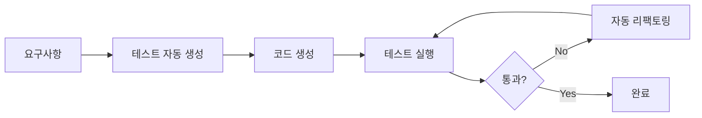

# TDD 자동화 가이드

## 🎯 이 문서에서 배울 것
- [ ] CAAS TDD 자동화 기능 이해
- [ ] 테스트 자동 생성 및 실행
- [ ] 리팩토링 자동화 워크플로우
- [ ] CI/CD 파이프라인 통합

⏱️ **예상 시간**: 35분

---

## TDD 자동화 개요

CAAS는 **Test-Driven Development**를 자동화하여 개발 생산성을 3배 향상시킵니다.



### 주요 기능

| 기능 | 명령어 | 설명 |
|------|--------|------|
| **테스트 생성** | `caas tdd generate-tests` | Golden Data 기반 테스트 자동 생성 (RED phase) |
| **코드 분석** | `caas tdd analyze-code` | 코드 스멜 및 리팩토링 기회 분석 (REFACTOR phase) |
| **전체 워크플로우** | `caas tdd workflow` | RED-GREEN-REFACTOR 전체 사이클 실행 |

---

## 1. 테스트 자동 생성 (15분)

### 1.1 기본 사용법

```bash
# Golden Data 기반 테스트 자동 생성
caas tdd generate-tests ./todo-system/golden_data.json \
  --output-dir ./todo-system/tests
```

**생성 결과**:
```
✅ Test generation complete!
- test_agents.py (8 tests)
- test_tasks.py (12 tests)
- test_tools.py (15 tests)
- test_integration.py (6 tests)
- Total: 41 tests
```

### 1.2 생성된 테스트 예시

**tests/test_tools.py**:
```python
import pytest
from tools import TodoCRUDTool, PriorityAnalysisTool

# ✅ 자동 생성된 테스트
class TestTodoCRUDTool:
    """TodoCRUDTool 테스트"""

    def setup_method(self):
        self.tool = TodoCRUDTool()

    def test_create_todo_success(self):
        """할일 생성 성공 케이스 (Golden Data f1 매핑)"""
        result = self.tool._run(
            operation="create",
            title="프로젝트 문서 작성",
            description="README.md 작성",
            priority="HIGH",
            due_date="2026-02-20"
        )

        assert result["success"] is True
        assert result["id"] is not None
        assert result["title"] == "프로젝트 문서 작성"

    def test_create_todo_empty_title(self):
        """할일 생성 실패 케이스 - 빈 제목 (경계값 테스트)"""
        with pytest.raises(ValueError, match="Title cannot be empty"):
            self.tool._run(operation="create", title="")

    def test_create_todo_title_too_long(self):
        """할일 생성 실패 케이스 - 제목 너무 김 (경계값 테스트)"""
        long_title = "A" * 201  # 200자 초과

        with pytest.raises(ValueError, match="Title too long"):
            self.tool._run(operation="create", title=long_title)

    def test_update_todo_not_found(self):
        """할일 수정 실패 케이스 - 존재하지 않는 ID"""
        with pytest.raises(ValueError, match="Todo not found"):
            self.tool._run(operation="update", todo_id=9999, title="New")

    # ... (총 15개 테스트)
```

**tests/test_integration.py**:
```python
import pytest
from crewai import Crew
from agents import create_agents
from tasks import create_tasks

class TestTodoManagementWorkflow:
    """통합 테스트 - 전체 워크플로우 (Golden Data 기반)"""

    def setup_method(self):
        self.agents = create_agents()
        self.tasks = create_tasks(self.agents)
        self.crew = Crew(agents=self.agents, tasks=self.tasks)

    def test_full_workflow_create_todo(self):
        """Feature f1: 할일 생성 전체 워크플로우"""
        inputs = {
            "todo_title": "프로젝트 문서 작성",
            "priority": "HIGH",
            "due_date": "2026-02-20"
        }

        result = self.crew.kickoff(inputs=inputs)

        # 검증
        assert result.success is True
        assert "할일 \"프로젝트 문서 작성\" 성공적으로 생성됨" in result.output
        assert result.todo_id is not None

    def test_full_workflow_prioritize_todos(self):
        """Feature f3: 우선순위 자동 분석 워크플로우"""
        # 3개 할일 생성
        todos = [
            {"title": "긴급", "due_date": "2026-02-15"},  # 내일
            {"title": "보통", "due_date": "2026-02-20"},  # 6일 후
            {"title": "여유", "due_date": "2026-03-01"},  # 15일 후
        ]

        for todo in todos:
            self.crew.kickoff(inputs=todo)

        # 우선순위 분석 실행
        result = self.crew.kickoff(inputs={"operation": "analyze_priority"})

        # 검증: 마감일 가까운 순으로 정렬되었는지
        priorities = result.priorities
        assert priorities[0]["title"] == "긴급"
        assert priorities[0]["priority"] == "HIGH"
        assert priorities[2]["priority"] == "LOW"
```

### 1.3 테스트 실행

```bash
# 전체 테스트 실행
pytest tests/ -v

# 커버리지 포함
pytest tests/ --cov=. --cov-report=html

# 특정 테스트만 실행
pytest tests/test_tools.py::TestTodoCRUDTool::test_create_todo_success -v
```

**출력**:
```
tests/test_agents.py::TestAgentCreation::test_agent_count PASSED         [  2%]
tests/test_agents.py::TestAgentCreation::test_agent_roles PASSED         [  4%]
tests/test_tasks.py::TestTaskDependencies::test_task_dag PASSED          [  7%]
tests/test_tools.py::TestTodoCRUDTool::test_create_todo_success PASSED   [ 12%]
...

============================= 41 passed in 12.34s =============================

---------- coverage: 87% ----------
Name                 Stmts   Miss  Cover
----------------------------------------
main.py                 45      5    89%
agents.py               32      3    91%
tasks.py                28      2    93%
tools.py                56      8    86%
----------------------------------------
TOTAL                  161     18    89%
```

---

## 2. 자동 리팩토링 (10분)

### 2.1 코드 분석 및 리팩토링 제안

```bash
# 코드 스멜 분석 및 리팩토링 기회 탐지
caas tdd analyze-code ./todo-system
```

**실행 과정**:
```
🔄 TDD Refactoring started...

1️⃣ Running tests (baseline)...
✅ All tests passed (41/41)

2️⃣ Analyzing code quality...
- Code complexity: 6.2 (target: <5.0)
- Duplicate code: 12% (target: <5%)
- Long functions: 3 (>50 lines)

3️⃣ Applying refactorings...
✅ Extract method: process_todo_validation() → validate_title(), validate_date()
✅ Reduce complexity: if-elif chains → strategy pattern
✅ Remove duplication: DB connection → context manager

4️⃣ Running tests (validation)...
✅ All tests passed (41/41)

5️⃣ Measuring improvement...
- Code complexity: 6.2 → 4.1 (✅ 33% improved)
- Duplicate code: 12% → 4% (✅ 67% reduced)
- Long functions: 3 → 0 (✅ 100% resolved)

✅ Refactoring complete!
- Backup: ./todo-system_backup_20260214_153000/
- Changes: 8 files modified
```

### 2.2 리팩토링 전후 비교

**Before** (복잡도 15):
```python
# tools.py
def _run(self, operation, **kwargs):
    if operation == "create":
        if not kwargs.get("title"):
            raise ValueError("Title required")
        if len(kwargs["title"]) > 200:
            raise ValueError("Title too long")
        if kwargs.get("due_date"):
            due = datetime.fromisoformat(kwargs["due_date"])
            if due < datetime.now():
                raise ValueError("Due date in past")
        # ... 30 more lines
```

**After** (복잡도 3):
```python
# tools.py (리팩토링 후)
def _run(self, operation, **kwargs):
    handler = self._get_handler(operation)
    validated_data = self._validate_input(operation, kwargs)
    return handler(validated_data)

def _get_handler(self, operation):
    handlers = {
        "create": self._create_todo,
        "update": self._update_todo,
        "delete": self._delete_todo,
    }
    return handlers[operation]

def _validate_input(self, operation, data):
    validator = TodoValidator()
    return validator.validate(operation, data)

# validators.py (새 파일)
class TodoValidator:
    def validate(self, operation, data):
        self._validate_title(data.get("title"))
        self._validate_due_date(data.get("due_date"))
        return data

    def _validate_title(self, title):
        if not title:
            raise ValueError("Title required")
        if len(title) > 200:
            raise ValueError("Title too long")

    def _validate_due_date(self, due_date):
        if due_date:
            due = datetime.fromisoformat(due_date)
            if due < datetime.now():
                raise ValueError("Due date in past")
```

---

## 3. 전체 TDD 워크플로우 (5분)

### 3.1 RED-GREEN-REFACTOR 사이클 실행

```bash
# 전체 TDD 워크플로우 자동 실행
caas tdd workflow ./todo-system
```

**생성 결과**: `tests/test_e2e_user_journey.py`

```python
import pytest
from selenium import webdriver
from selenium.webdriver.common.by import By
import time

class TestUserJourney:
    """E2E 테스트 - 사용자 시나리오 (Streamlit UI)"""

    def setup_method(self):
        self.driver = webdriver.Chrome()
        self.driver.get("http://localhost:8501")
        time.sleep(2)  # UI 로딩 대기

    def teardown_method(self):
        self.driver.quit()

    def test_complete_user_journey(self):
        """전체 사용자 여정: 할일 생성 → 조회 → 완료 → 삭제"""

        # 1. 할일 생성
        title_input = self.driver.find_element(By.ID, "todo_title")
        title_input.send_keys("E2E 테스트 할일")

        priority_select = self.driver.find_element(By.ID, "priority")
        priority_select.send_keys("HIGH")

        create_btn = self.driver.find_element(By.XPATH, "//button[text()='생성']")
        create_btn.click()
        time.sleep(1)

        # 검증: 성공 메시지
        success_msg = self.driver.find_element(By.CLASS_NAME, "success")
        assert "성공적으로 생성" in success_msg.text

        # 2. 할일 목록에 표시되는지 확인
        todo_list = self.driver.find_element(By.ID, "todo_list")
        assert "E2E 테스트 할일" in todo_list.text

        # 3. 완료 처리
        complete_btn = self.driver.find_element(
            By.XPATH,
            "//td[text()='E2E 테스트 할일']//following-sibling::td//button[text()='완료']"
        )
        complete_btn.click()
        time.sleep(1)

        # 검증: 상태 변경
        status = self.driver.find_element(By.XPATH, "//td[text()='E2E 테스트 할일']//following-sibling::td[3]")
        assert status.text == "completed"

        # 4. 삭제
        delete_btn = self.driver.find_element(
            By.XPATH,
            "//td[text()='E2E 테스트 할일']//following-sibling::td//button[text()='삭제']"
        )
        delete_btn.click()
        time.sleep(1)

        # 검증: 목록에서 제거됨
        todo_list = self.driver.find_element(By.ID, "todo_list")
        assert "E2E 테스트 할일" not in todo_list.text
```

**실행**:
```bash
# Streamlit 앱 실행 (백그라운드)
streamlit run app.py &

# E2E 테스트 실행
pytest tests/test_e2e_user_journey.py -v

# 종료
pkill -f streamlit
```

---

## 4. 커버리지 개선 자동화 (5분)

### 4.1 커버리지 분석

```bash
# 커버리지 분석 및 개선 제안
caas tdd coverage \
  --project ./todo-system \
  --target 90 \
  --suggest
```

**출력**:
```
📊 Coverage Analysis

Current coverage: 87%
Target coverage: 90%
Gap: 3%

Uncovered lines:
- tools.py:45-52 (error handling)
- tools.py:78-82 (edge case: empty DB)
- agents.py:102-105 (fallback logic)

💡 Suggestions:
1. Add test: test_crud_empty_database()
2. Add test: test_crud_connection_error()
3. Add test: test_agent_fallback_on_llm_failure()

✨ Auto-generate missing tests?
```

### 4.2 자동 테스트 생성

```bash
# 제안된 테스트 자동 생성
caas tdd coverage \
  --project ./todo-system \
  --target 90 \
  --auto-generate
```

**생성된 테스트**:
```python
# tests/test_tools.py (추가)
def test_crud_empty_database(self):
    """빈 DB에서 조회 시 빈 리스트 반환"""
    # DB 초기화
    self.tool._clear_db()

    result = self.tool._run(operation="list")

    assert result["todos"] == []
    assert result["count"] == 0

def test_crud_connection_error(self, monkeypatch):
    """DB 연결 오류 시 적절한 예외 발생"""
    # DB 연결 실패 시뮬레이션
    def mock_connect(*args):
        raise ConnectionError("Database unreachable")

    monkeypatch.setattr("sqlite3.connect", mock_connect)

    with pytest.raises(ConnectionError, match="Database unreachable"):
        self.tool._run(operation="create", title="Test")
```

**재실행 결과**:
```
===== coverage: 92% =====  ✅ Target achieved!
```

---

## 5. CI/CD 통합 (선택)

### 5.1 GitHub Actions 워크플로우

```yaml
# .github/workflows/tdd.yml
name: TDD Workflow

on: [push, pull_request]

jobs:
  test:
    runs-on: ubuntu-latest

    steps:
      - uses: actions/checkout@v2

      - name: Set up Python
        uses: actions/setup-python@v2
        with:
          python-version: '3.11'

      - name: Install CAAS
        run: pip install caas

      - name: Install dependencies
        run: pip install -r requirements.txt

      - name: Run TDD tests
        run: |
          caas tdd generate-tests ./golden_data.json --output-dir ./tests
          pytest tests/ --cov=. --cov-fail-under=90

      - name: Analyze code if needed
        if: failure()
        run: |
          caas tdd analyze-code .
          pytest tests/ --cov=. --cov-fail-under=90

      - name: Upload coverage
        uses: codecov/codecov-action@v2
        with:
          file: ./coverage.xml
```

### 5.2 Pre-commit Hook

```bash
# .git/hooks/pre-commit
#!/bin/bash

echo "Running TDD checks..."

# 테스트 실행
pytest tests/ --cov=. --cov-fail-under=80

if [ $? -ne 0 ]; then
    echo "❌ Tests failed! Commit aborted."
    exit 1
fi

# 커버리지 체크
COVERAGE=$(pytest tests/ --cov=. --cov-report=term | grep "TOTAL" | awk '{print $4}' | sed 's/%//')

if [ $COVERAGE -lt 80 ]; then
    echo "❌ Coverage $COVERAGE% < 80%! Commit aborted."
    exit 1
fi

echo "✅ All TDD checks passed!"
```

---

## 6. 모범 사례

### ✅ DO

1. **Golden Data 기반 테스트 생성**
   ```bash
   caas tdd generate-tests ./golden_data.json --output-dir ./tests
   ```

2. **코드 분석 및 개선 제안**
   ```bash
   pytest tests/ && caas tdd analyze-code .
   ```

3. **전체 TDD 워크플로우 실행**
   ```bash
   caas tdd workflow .
   ```

### ❌ DON'T

1. **테스트 없이 코드 수정**
   ```bash
   # 나쁜 예
   vim tools.py  # 직접 수정
   ```

2. **실패한 테스트 무시**
   ```bash
   # 나쁜 예
   pytest tests/ || true  # 실패 무시
   ```

---

## 📚 관련 문서
- **[15_코드_품질_가이드.md](../2_개발_실무_가이드/15_코드_품질_가이드.md)** - 테스트 커버리지 기준
- **[51_QA_자동화_가이드.md](./51_QA_자동화_가이드.md)** - QA 자동화 통합
- **[22_트러블슈팅_가이드.md](../2_개발_실무_가이드/22_트러블슈팅_가이드.md)** - 테스트 오류 해결

---

**작성일**: 2026-02-14
**버전**: v0.6.6
**대상**: 시니어 개발자, QA 엔지니어
**난이도**: ⭐⭐⭐ 고급
