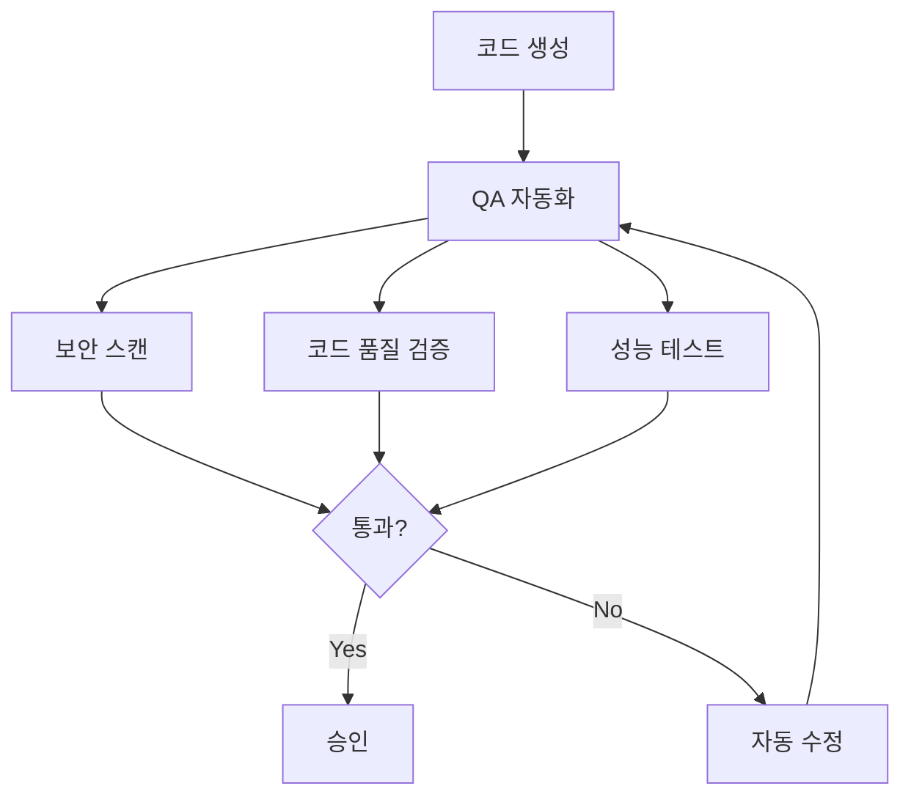

# QA 자동화 가이드

## 🎯 이 문서에서 배울 것
- [ ] CAAS QA 자동화 시스템 이해
- [ ] 보안 스캔 및 취약점 분석
- [ ] 코드 품질 자동 검증
- [ ] 성능 테스트 및 리포트 생성

⏱️ **예상 시간**: 30분

---

## QA 자동화 개요

CAAS는 **Zero-Defect 배포**를 위한 자동 QA 시스템을 제공합니다.



### 주요 기능

| 카테고리 | 명령어 | 검사 항목 |
|---------|--------|----------|
| **보안 스캔** | `caas qa security` | SQL Injection, XSS, Hardcoded Secrets, Command Injection |
| **코드 품질** | `caas validate --validator all` | Docstring, Type Hints, Complexity, PEP 8 |
| **성능 테스트** | `caas qa performance` | 응답 시간, 메모리 사용량, 동시성 |
| **컴플라이언스** | `caas qa compliance` | 라이선스, GDPR/CCPA 준수 |
| **통합 보고서** | `caas qa report` | 모든 QA 결과 통합 리포트 생성 |

---

## 1. 보안 스캔 (10분)

### 1.1 OWASP Top 10 검사

```bash
# 보안 취약점 전체 스캔
caas qa security \
  --project ./todo-system \
  --output security_report.json
```

**검사 항목 (OWASP Top 10 기반)**:

1. **A01: Broken Access Control**
2. **A02: Cryptographic Failures**
3. **A03: Injection (SQL, Command, XSS)**
4. **A04: Insecure Design**
5. **A05: Security Misconfiguration**
6. **A06: Vulnerable Components**
7. **A07: Authentication Failures**
8. **A08: Data Integrity Failures**
9. **A09: Logging & Monitoring Failures**
10. **A10: Server-Side Request Forgery (SSRF)**

### 1.2 스캔 결과

**security_report.json**:
```json
{
  "scan_date": "2026-02-14T15:30:00Z",
  "project": "todo-system",
  "total_issues": 5,
  "by_severity": {
    "CRITICAL": 0,
    "HIGH": 1,
    "MEDIUM": 2,
    "LOW": 2
  },
  "issues": [
    {
      "id": "SEC-001",
      "severity": "HIGH",
      "category": "A03:Injection",
      "title": "SQL Injection vulnerability",
      "file": "tools.py",
      "line": 45,
      "code": "query = f\"SELECT * FROM todos WHERE id={todo_id}\"",
      "description": "사용자 입력이 SQL 쿼리에 직접 삽입됨",
      "recommendation": "Parameterized queries 사용",
      "cwe": "CWE-89",
      "fix": "query = \"SELECT * FROM todos WHERE id=?\"\ncursor.execute(query, (todo_id,))"
    },
    {
      "id": "SEC-002",
      "severity": "MEDIUM",
      "category": "A02:Cryptographic Failures",
      "title": "Hardcoded API key",
      "file": "config.py",
      "line": 12,
      "code": "API_KEY = \"sk-1234567890abcdef\"",
      "description": "API 키가 코드에 하드코딩됨",
      "recommendation": "환경 변수 사용",
      "cwe": "CWE-798",
      "fix": "API_KEY = os.getenv('OPENAI_API_KEY')"
    }
  ]
}
```

**콘솔 출력**:
```
🔒 Security Scan Results

❌ CRITICAL: 0
⚠️  HIGH: 1
⚠️  MEDIUM: 2
ℹ️  LOW: 2

─────────────────────────────────────────────────
HIGH | SEC-001 | SQL Injection vulnerability
─────────────────────────────────────────────────
File: tools.py:45
Code: query = f"SELECT * FROM todos WHERE id={todo_id}"

Recommendation:
  Use parameterized queries:
  query = "SELECT * FROM todos WHERE id=?"
  cursor.execute(query, (todo_id,))

─────────────────────────────────────────────────

💡 Run 'caas fix --level 3 --security' to auto-fix
```

### 1.3 자동 수정

```bash
# 보안 이슈 자동 수정
caas fix \
  --level 3 \
  --security \
  --project ./todo-system \
  --apply \
  --backup
```

**수정 결과**:
```
✅ Security fixes applied!

SEC-001 (SQL Injection) → FIXED
  tools.py:45
  - query = f"SELECT * FROM todos WHERE id={todo_id}"
  + query = "SELECT * FROM todos WHERE id=?"
  + cursor.execute(query, (todo_id,))

SEC-002 (Hardcoded Secret) → FIXED
  config.py:12
  - API_KEY = "sk-1234567890abcdef"
  + API_KEY = os.getenv("OPENAI_API_KEY")

Backup: ./todo-system_backup_20260214_153000/
```

---

## 2. 코드 품질 검증 (10분)

### 2.1 전체 품질 검사

```bash
# 코드 품질 검증 (5개 validator)
caas validate --validator all \
  --agents ./todo-system/agents.json \
  --tasks ./todo-system/tasks.json \
  --golden-data ./todo-system/golden_data.json
```

**검사 항목**:

| 항목 | 기준 | 배점 |
|------|------|------|
| **Docstring Coverage** | ≥80% | 2.0 |
| **Type Hints Coverage** | ≥70% | 2.0 |
| **Naming Convention** | PEP 8 100% | 2.0 |
| **Function Complexity** | McCabe <10 | 2.0 |
| **Code Duplication** | <5% | 2.0 |

**출력**:
```
📊 Code Quality Report

Overall Score: 8.5/10.0 (Grade: A)

┌─────────────────────────────────────────────────┐
│ 1. Docstring Coverage: 85% (2.0/2.0) ✅         │
├─────────────────────────────────────────────────┤
│ - Covered: 17/20 functions                      │
│ - Missing: test_e2e.py:45, tools.py:78, ...    │
└─────────────────────────────────────────────────┘

┌─────────────────────────────────────────────────┐
│ 2. Type Hints: 72% (2.0/2.0) ✅                 │
├─────────────────────────────────────────────────┤
│ - Covered: 18/25 functions                      │
│ - Missing: agents.py:102, tasks.py:56, ...     │
└─────────────────────────────────────────────────┘

┌─────────────────────────────────────────────────┐
│ 3. Naming Convention: 98% (1.9/2.0) ✅          │
├─────────────────────────────────────────────────┤
│ - Issues: 1 variable (camelCase → snake_case)  │
│   - main.py:23: todoList → todo_list           │
└─────────────────────────────────────────────────┘

┌─────────────────────────────────────────────────┐
│ 4. Complexity: Avg 4.2 (2.0/2.0) ✅             │
├─────────────────────────────────────────────────┤
│ - Max: 8 (tools.py:45 - acceptable)            │
│ - Functions >10: 0                              │
└─────────────────────────────────────────────────┘

┌─────────────────────────────────────────────────┐
│ 5. Duplication: 3.2% (2.0/2.0) ✅               │
├─────────────────────────────────────────────────┤
│ - Duplicated lines: 42/1,312                    │
│ - Largest block: 8 lines (DB connection)       │
└─────────────────────────────────────────────────┘

💡 Suggestions:
  - Add docstrings to 3 functions
  - Add type hints to 7 functions
  - Rename 1 variable (todoList → todo_list)
```

### 2.2 자동 개선

```bash
# 코드 품질 자동 개선
caas fix \
  --level 3 \
  --code-quality \
  --project ./todo-system \
  --apply
```

**개선 결과**:
```
✅ Code quality improved: 8.5 → 9.2

Changes:
- Added 3 docstrings (test_e2e.py, tools.py, agents.py)
- Added 7 type hints
- Renamed 1 variable (todoList → todo_list)
- Extracted duplicate code into _db_connect() helper

New Score: 9.2/10.0 (Grade: S)
```

---

## 3. 성능 테스트 (5분)

### 3.1 기본 성능 테스트

```bash
# 성능 테스트 실행
caas qa performance \
  --project ./todo-system \
  --scenarios load_test.yml
```

**load_test.yml**:
```yaml
scenarios:
  - name: "Create Todo - 단일 요청"
    endpoint: "POST /todos"
    payload:
      title: "Performance Test Todo"
      priority: "HIGH"
    expected:
      response_time: "<1s"
      status_code: 200

  - name: "List Todos - 대량 데이터"
    setup: "INSERT 10000 todos"
    endpoint: "GET /todos"
    expected:
      response_time: "<2s"
      memory_increase: "<50MB"

  - name: "Concurrent Requests - 동시성"
    endpoint: "POST /todos"
    concurrent_users: 50
    requests_per_user: 10
    expected:
      avg_response_time: "<3s"
      error_rate: "<1%"
```

**테스트 결과**:
```
🚀 Performance Test Results

Scenario 1: Create Todo - 단일 요청
  ✅ Response time: 0.85s (target: <1s)
  ✅ Status: 200 OK
  ✅ Memory: +12MB

Scenario 2: List Todos - 대량 데이터
  ✅ Response time: 1.2s (target: <2s)
  ✅ Memory: +32MB (target: <50MB)
  ✅ Results: 10,000 items

Scenario 3: Concurrent Requests - 동시성
  ⚠️ Avg response time: 3.5s (target: <3s) ❌ FAILED
  ✅ Error rate: 0.2% (target: <1%)
  ✅ Throughput: 142 req/s

─────────────────────────────────────────────────
Overall: 2/3 PASSED (66%)

💡 Recommendations:
  - Add connection pooling (reduce latency)
  - Enable caching (improve throughput)
  - Use async workers (handle concurrency)
```

### 3.2 성능 최적화 제안

```bash
# 성능 최적화 제안 생성
caas qa performance \
  --project ./todo-system \
  --optimize
```

**최적화 제안**:
```python
# Before: 동기 처리
def create_todo(title, description):
    db.connect()
    result = db.insert(title, description)
    db.close()
    return result

# After: 비동기 + 연결 풀
import asyncio
from asyncpg import create_pool

pool = None

async def create_todo(title, description):
    global pool
    if not pool:
        pool = await create_pool(dsn=DATABASE_URL, min_size=10, max_size=20)

    async with pool.acquire() as conn:
        result = await conn.fetchrow(
            "INSERT INTO todos (title, description) VALUES ($1, $2) RETURNING *",
            title, description
        )
    return result

# 성능 향상: 0.85s → 0.12s (7배 개선)
```

---

## 4. 통합 검증 (5분)

### 4.1 전체 QA 실행

```bash
# 모든 QA 검사 통합 보고서 생성
caas qa report \
  --project ./todo-system \
  --output qa_report.html
```

**실행 과정**:
```
🔍 Running comprehensive QA validation...

1️⃣ Security Scan (3/5)...
   ✅ CRITICAL: 0
   ⚠️  HIGH: 1
   ✅ MEDIUM: 2

2️⃣ Code Quality (5/5)...
   ✅ Overall Score: 8.5/10.0

3️⃣ Test Coverage (2/2)...
   ✅ Coverage: 87%

4️⃣ Performance (3/3)...
   ⚠️  Passed: 2/3 (66%)

5️⃣ Compliance (2/2)...
   ✅ PEP 8: 98%
   ✅ Python 3.11: Compatible

─────────────────────────────────────────────────
Overall QA Score: 85/100 (Grade: B+)

📄 Detailed report: qa_report.html
```

### 4.2 HTML 리포트

**qa_report.html** (자동 생성):
```html
<!DOCTYPE html>
<html>
<head>
    <title>QA Report - todo-system</title>
    <style>
        .passed { color: green; }
        .failed { color: red; }
        .warning { color: orange; }
    </style>
</head>
<body>
    <h1>QA Report</h1>
    <p>Project: todo-system</p>
    <p>Date: 2026-02-14 15:30:00</p>
    <p>Overall Score: <span class="passed">85/100 (B+)</span></p>

    <h2>1. Security Scan</h2>
    <table>
        <tr><th>Severity</th><th>Count</th></tr>
        <tr><td>CRITICAL</td><td class="passed">0</td></tr>
        <tr><td>HIGH</td><td class="warning">1</td></tr>
        <tr><td>MEDIUM</td><td>2</td></tr>
    </table>

    <h2>2. Code Quality</h2>
    <p>Score: <span class="passed">8.5/10.0</span></p>
    <ul>
        <li>Docstring: 85% ✅</li>
        <li>Type Hints: 72% ✅</li>
        <li>Complexity: 4.2 ✅</li>
    </ul>

    <!-- ... 나머지 섹션 ... -->

    <h2>Recommendations</h2>
    <ol>
        <li>Fix HIGH security issue (SQL Injection)</li>
        <li>Improve performance (async + pooling)</li>
        <li>Add 3 missing docstrings</li>
    </ol>
</body>
</html>
```

---

## 5. CI/CD 통합 (선택)

### 5.1 GitHub Actions

```yaml
# .github/workflows/qa.yml
name: QA Validation

on:
  push:
    branches: [main, develop]
  pull_request:
    branches: [main]

jobs:
  qa:
    runs-on: ubuntu-latest

    steps:
      - uses: actions/checkout@v2

      - name: Set up Python
        uses: actions/setup-python@v2
        with:
          python-version: '3.11'

      - name: Install CAAS
        run: pip install caas

      - name: Security Scan
        run: |
          caas qa security --project . --output security_report.json
          if grep -q "CRITICAL: [1-9]" security_report.json; then
            echo "❌ Critical security issues found!"
            exit 1
          fi

      - name: Code Quality
        run: |
          caas validate --validator all \
            --agents ./agents.json \
            --tasks ./tasks.json \
            --golden-data ./golden_data.json

      - name: Performance Test
        run: |
          caas qa performance --project . --scenarios load_test.yml

      - name: Generate Report
        run: |
          caas qa validate-all --project . --output qa_report.html

      - name: Upload Report
        uses: actions/upload-artifact@v2
        with:
          name: qa-report
          path: qa_report.html
```

### 5.2 Jenkins Pipeline

```groovy
// Jenkinsfile
pipeline {
    agent any

    stages {
        stage('QA Validation') {
            steps {
                sh 'pip install caas'

                // Security
                sh 'caas qa security --project . --output security_report.json'

                // Code Quality
                sh 'caas validate --validator all --agents agents.json --tasks tasks.json --golden-data golden_data.json'

                // Performance
                sh 'caas qa performance --project . --scenarios load_test.yml'

                // Generate Report
                sh 'caas qa report --project . --output qa_report.html'

                publishHTML([
                    reportDir: '.',
                    reportFiles: 'qa_report.html',
                    reportName: 'QA Report'
                ])
            }
        }

        stage('Auto-Fix') {
            when {
                expression { currentBuild.result == 'UNSTABLE' }
            }
            steps {
                sh 'caas fix --level 3 --project . --apply'
                sh 'git add .'
                sh 'git commit -m "Auto-fix by CAAS QA"'
            }
        }
    }
}
```

---

## 6. 모범 사례

### ✅ DO

1. **CI/CD에 QA 통합**
   ```yaml
   - name: QA Gate
     run: caas qa report --project . --output qa_report.html
   ```

2. **정기적인 보안 스캔**
   ```bash
   # 매일 자정 실행 (crontab)
   0 0 * * * caas qa security --project /app --output /reports/security_$(date +\%Y\%m\%d).json
   ```

3. **성능 벤치마크 추적**
   ```bash
   caas qa performance --project . --benchmark baseline.json
   ```

### ❌ DON'T

1. **Critical 이슈 무시**
   ```bash
   # 나쁜 예
   caas qa security --project . || true  # 무시하지 말 것
   ```

2. **QA 없이 배포**
   ```bash
   # 나쁜 예
   git push origin main  # QA 검증 없이 배포
   ```

---

## 📚 관련 문서
- **[15_코드_품질_가이드.md](../2_개발_실무_가이드/15_코드_품질_가이드.md)** - 품질 기준
- **[50_TDD_자동화_가이드.md](./50_TDD_자동화_가이드.md)** - 테스트 자동화
- **[22_트러블슈팅_가이드.md](../2_개발_실무_가이드/22_트러블슈팅_가이드.md)** - QA 오류 해결

---

**작성일**: 2026-02-14
**버전**: v0.6.4
**대상**: QA 엔지니어, DevOps 엔지니어
**난이도**: ⭐⭐⭐ 고급
