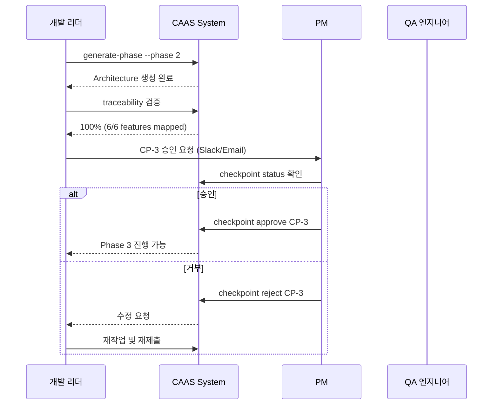

# Checkpoint 활용법 (Human Approval Workflow)

## 🎯 이 문서에서 배울 것
- [ ] CAAS-E Human Checkpoint 시스템 이해
- [ ] 7개 체크포인트 승인 워크플로우
- [ ] PM 검수 및 승인 프로세스
- [ ] 팀 협업 및 품질 관리

⏱️ **예상 시간**: 20분

**CAAS-E 버전**: v0.6.2+

---

## Human Checkpoint 시스템 개요

CAAS-E **Human Checkpoint**는 6-Phase 개발 프로세스에서 **PM 승인이 필요한 7개의 주요 검수 지점**을 정의합니다.

```mermaid
graph LR
    A[Phase 0] --> CP1{CP-1: Golden Data}
    CP1 -->|승인| B[Phase 1-2]
    CP1 -->|거부| A

    B --> CP2{CP-2: Discovery}
    CP2 -->|승인| C[Phase 2]
    CP2 -->|거부| B

    C --> CP3{CP-3: Architecture}
    CP3 -->|승인| D[Phase 3]
    CP3 -->|거부| C

    D --> CP4{CP-4: Design}
    CP4 -->|승인| E[Phase 4-5]
    CP4 -->|거부| D

    E --> CP5{CP-5: Spec}
    CP5 -->|승인| F[Phase 5]
    CP5 -->|거부| E

    F --> CP6{CP-6: Code}
    CP6 -->|승인| G[Phase 6]
    CP6 -->|거부| F

    G --> CP7{CP-7: QA}
    CP7 -->|승인| H[배포]
    CP7 -->|거부| G

    style CP1 fill:#FFE082
    style CP3 fill:#FFE082
    style CP4 fill:#FFE082
    style CP7 fill:#4CAF50
```



### 7개 Human Checkpoint

| ID | 이름 | Phase | 검수 항목 | 중요도 |
|----|------|-------|----------|--------|
| **CP-1** | Golden Data 검수 | Phase 0 | Features ≥3, Entities ≥1, Description 100% | ⭐⭐⭐ |
| **CP-2** | Discovery 검수 | Phase 1 | Domain 신뢰도 >0.7, Patterns 감지 | ⭐⭐ |
| **CP-3** | Architecture 검수 | Phase 2 | **Traceability 100%** (Critical!) | ⭐⭐⭐ |
| **CP-4** | Design 검수 | Phase 3 | **Completeness 100%** (Critical!) | ⭐⭐⭐ |
| **CP-5** | Spec 검수 | Phase 4 | CrewAI 호환성, Python 3.11+ | ⭐⭐ |
| **CP-6** | Code 검수 | Phase 5 | Code Quality >8.5, Security 0 Critical | ⭐⭐⭐ |
| **CP-7** | QA 최종 검수 | Phase 6 | Test Coverage >80%, 모든 테스트 통과 | ⭐⭐⭐ |

---

## 1. 체크포인트 상태 조회 (5분)

### 1.1 전체 상태 확인

```bash
# 현재 프로젝트의 모든 체크포인트 상태 조회
caas checkpoint status
```

**출력 예시**:
```
📋 Checkpoint Status

Project: todo-management-system
Current Phase: 3 (Design)

Checkpoints:
┌────────┬─────────────────────────┬─────────┬──────────────────────┐
│ ID     │ Name                    │ Status  │ Last Updated         │
├────────┼─────────────────────────┼─────────┼──────────────────────┤
│ CP-1   │ Golden Data 검수        │ ✅ PASS │ 2026-02-17 09:15:00  │
│ CP-2   │ Discovery 검수          │ ✅ PASS │ 2026-02-17 09:30:00  │
│ CP-3   │ Architecture 검수       │ ✅ PASS │ 2026-02-17 10:00:00  │
│ CP-4   │ Design 검수             │ ⏸️  PENDING │ -                │
│ CP-5   │ Spec 검수               │ ⏸️  PENDING │ -                │
│ CP-6   │ Code 검수               │ ⏸️  PENDING │ -                │
│ CP-7   │ QA 최종 검수            │ ⏸️  PENDING │ -                │
└────────┴─────────────────────────┴─────────┴──────────────────────┘

✅ 3/7 checkpoints passed
⏸️  Next: CP-4 (Design 검수) - Phase 3 완료 후 승인 필요
```

### 1.2 체크포인트 목록 조회

```bash
# 7개 체크포인트 목록 및 설명
caas checkpoint list
```

**출력 예시**:
```
📚 CAAS-E Human Checkpoints (7 total)

1️⃣  CP-1: Golden Data 검수
   Phase: 0 (Concretization)
   검수 항목:
   - Features 개수 ≥ 3
   - Entities 개수 ≥ 1
   - All features have description
   - All features have priority

2️⃣  CP-2: Discovery 검수
   Phase: 1 (Discovery)
   검수 항목:
   - Domain 신뢰도 > 0.7
   - Patterns 1개 이상 감지
   - Suggested tools 존재

3️⃣  CP-3: Architecture 검수 ⭐ CRITICAL
   Phase: 2 (Architecture)
   검수 항목:
   - Traceability: 100% (모든 Feature → Tool 매핑)
   - Tools ≥ 3개
   - Database 스키마 정의

[... 나머지 체크포인트 ...]

💡 Use 'caas checkpoint status' to see current progress
```

---

## 2. 체크포인트 승인 (5분)

### 2.1 Phase 완료 후 승인

**시나리오**: Phase 2 완료 후 CP-3 (Architecture 검수) 승인

```bash
# 1단계: Phase 2 실행
caas generate-phase --phase 2 "할일 관리 시스템" --output ./todo-system

# 2단계: Traceability 검증 (CP-3 필수 조건)
caas traceability \
  --golden-data ./todo-system/golden_data.json \
  --agents ./todo-system/agents.json \
  --tasks ./todo-system/tasks.json

# 출력: Traceability: 100% (6/6 features mapped) ✅
```

**PM 검수**:
```bash
# Architecture 설계 파일 확인
cat ./todo-system/architecture_design.json | jq '.'

# Traceability 매핑 확인
cat ./todo-system/architecture_design.json | jq '.traceability'
```

**승인 실행**:
```bash
# CP-3 승인
caas checkpoint approve CP-3 \
  --comment "Traceability 100% 확인. 모든 Feature가 Tool에 매핑됨. 승인합니다."
```

**출력**:
```
✅ Checkpoint CP-3 (Architecture 검수) approved!

Approved by: PM (user@company.com)
Comment: Traceability 100% 확인. 모든 Feature가 Tool에 매핑됨. 승인합니다.
Timestamp: 2026-02-17 10:00:00

Next checkpoint: CP-4 (Design 검수)
Next action: Run 'caas generate-phase --phase 3 ...'
```

### 2.2 승인 없이 다음 Phase 진행 시

```bash
# CP-3 승인 없이 Phase 3 실행 시도
caas generate-phase --phase 3 "..." --output ./todo-system
```

**출력 (오류)**:
```
❌ Error: Checkpoint CP-3 (Architecture 검수) not approved!

Current status: PENDING
Required action: PM approval required

To approve:
  caas checkpoint approve CP-3 --comment "승인 사유"

To check status:
  caas checkpoint status
```

---

## 3. 체크포인트 거부 (5분)

### 3.1 품질 미달 시 거부

**시나리오**: Phase 3 완료 후 CP-4 (Design 검수) 거부

```bash
# 1단계: Phase 3 실행
caas generate-phase --phase 3 "..." --output ./todo-system

# 2단계: Completeness 검증 (CP-4 필수 조건)
caas analyze-completeness \
  --project ./todo-system \
  --golden-data ./todo-system/golden_data.json \
  --detailed
```

**출력 (문제 발견)**:
```
📊 Completeness Analysis Report

Golden Data Features: 6
Implemented in Tasks: 5 (83.3%)

Feature Mapping:
✅ f1 (할일 추가) → task_1, task_2
✅ f2 (할일 조회) → task_3
✅ f3 (우선순위 분석) → task_4
✅ f4 (할일 공유) → task_5
❌ f5 (마감일 알림) → NO MAPPING
✅ f6 (통계 리포트) → task_6

Completeness: 83% ❌ (Target: 100%)
```

**PM 거부**:
```bash
# CP-4 거부 (Feature f5 누락)
caas checkpoint reject CP-4 \
  --reason "Feature f5 (마감일 알림)가 Task에 매핑되지 않음. Task 추가 필요."
```

**출력**:
```
❌ Checkpoint CP-4 (Design 검수) rejected!

Rejected by: PM (user@company.com)
Reason: Feature f5 (마감일 알림)가 Task에 매핑되지 않음. Task 추가 필요.
Timestamp: 2026-02-17 10:30:00

Required actions:
1. Golden Data 수정 또는 Task 설계 보완
2. Phase 3 재실행
3. Completeness 재검증 (목표: 100%)

To retry:
  # Golden Data 수정 후
  caas generate-phase --phase 3 "..." --output ./todo-system
  caas analyze-completeness --project ./todo-system
  caas checkpoint approve CP-4 --comment "재검증 완료"
```

### 3.2 거부 후 재작업

```bash
# 1단계: Golden Data 수정 (Feature f5 명확화)
vim ./todo-system/golden_data.json
# Feature f5에 상세 설명 추가

# 2단계: Phase 3 재실행
caas generate-phase --phase 3 "..." \
  --input ./todo-system \
  --output ./todo-system

# 3단계: 재검증
caas analyze-completeness \
  --project ./todo-system \
  --golden-data ./todo-system/golden_data.json

# 출력: Completeness: 100% (6/6 features mapped) ✅

# 4단계: 재승인
caas checkpoint approve CP-4 \
  --comment "Feature f5 Task 추가 완료. Completeness 100% 달성."
```

---

## 4. PM 워크플로우 (5분)

### 4.1 일일 검수 루틴

```bash
#!/bin/bash
# daily_checkpoint_review.sh

echo "=== CAAS-E Checkpoint Daily Review ==="

# 1. 현재 상태 확인
caas checkpoint status

# 2. 대기 중인 체크포인트 확인
PENDING=$(caas checkpoint status | grep "PENDING" | head -1)

if [ -z "$PENDING" ]; then
    echo "✅ No pending checkpoints"
    exit 0
fi

echo "⏸️  Pending checkpoint found: $PENDING"

# 3. PM에게 알림 (예: Slack)
# slack-cli send "#pm-channel" "체크포인트 승인 대기 중: $PENDING"

echo "💡 Review required. Use 'caas checkpoint approve/reject <ID>'"
```

### 4.2 주간 품질 리포트 생성

```bash
#!/bin/bash
# weekly_quality_report.sh

echo "=== CAAS-E Weekly Quality Report ==="

# 1. 이번 주 승인된 체크포인트 통계
APPROVED_COUNT=$(caas checkpoint status | grep "✅ PASS" | wc -l)
TOTAL_COUNT=7

echo "체크포인트 진행률: $APPROVED_COUNT/$TOTAL_COUNT ($(($APPROVED_COUNT * 100 / $TOTAL_COUNT))%)"

# 2. 평균 승인 소요 시간 분석
# (checkpoint 로그 파일에서 추출)

# 3. 거부 사유 통계
# (checkpoint 로그 파일에서 추출)

echo "보고서 생성 완료: weekly_report_$(date +%Y%m%d).txt"
```

---

## 5. 팀 협업 워크플로우 (선택)

### 5.1 역할 분담

**PM (프로젝트 관리자)**:
- 모든 체크포인트 승인/거부 권한
- 품질 기준 설정 및 검수
- 팀 커뮤니케이션

**개발 리더 (Tech Lead)**:
- Phase 실행 및 산출물 생성
- 검증 명령어 실행 (traceability, completeness 등)
- 거부 시 수정 작업 수행

**QA 엔지니어**:
- CP-7 (QA 최종 검수) 상세 검증
- 테스트 커버리지 및 보안 스캔 수행
- QA 리포트 생성

### 5.2 체크포인트 승인 프로세스



### 5.3 Slack 통합 (예시)

**.github/workflows/checkpoint_notify.yml**:
```yaml
name: Checkpoint Notification

on:
  workflow_dispatch:
    inputs:
      checkpoint_id:
        description: 'Checkpoint ID (e.g., CP-3)'
        required: true

jobs:
  notify:
    runs-on: ubuntu-latest

    steps:
      - name: Get checkpoint status
        run: |
          STATUS=$(caas checkpoint status | grep "${{ github.event.inputs.checkpoint_id }}")
          echo "STATUS=$STATUS" >> $GITHUB_ENV

      - name: Send Slack notification
        uses: slackapi/slack-github-action@v1
        with:
          payload: |
            {
              "text": "🔔 Checkpoint 승인 요청",
              "blocks": [
                {
                  "type": "section",
                  "text": {
                    "type": "mrkdwn",
                    "text": "*Checkpoint*: ${{ github.event.inputs.checkpoint_id }}\n*Status*: ${{ env.STATUS }}\n*Project*: ${{ github.repository }}"
                  }
                },
                {
                  "type": "actions",
                  "elements": [
                    {
                      "type": "button",
                      "text": { "type": "plain_text", "text": "승인" },
                      "style": "primary",
                      "url": "${{ github.server_url }}/${{ github.repository }}/actions"
                    },
                    {
                      "type": "button",
                      "text": { "type": "plain_text", "text": "거부" },
                      "style": "danger",
                      "url": "${{ github.server_url }}/${{ github.repository }}/actions"
                    }
                  ]
                }
              ]
            }
        env:
          SLACK_WEBHOOK_URL: ${{ secrets.SLACK_WEBHOOK_URL }}
```

---

## 6. 모범 사례

### ✅ DO

1. **Phase 완료 후 즉시 검증**
   ```bash
   # Phase 완료 → 검증 → 체크포인트 승인 (순차 실행)
   caas generate-phase --phase 2 "..." && \
   caas traceability --project . && \
   caas checkpoint status
   ```

2. **승인/거부 시 명확한 코멘트**
   ```bash
   # ✅ Good: 구체적인 승인 사유
   caas checkpoint approve CP-3 \
     --comment "Traceability 100% (6/6), Tools 5개 설계 완료, DB 스키마 검토 완료"

   # ✅ Good: 구체적인 거부 사유
   caas checkpoint reject CP-4 \
     --reason "Feature f5 누락, Agent 수 7개 (목표: 3-5), Task DAG 순환 발견"
   ```

3. **정기적인 상태 확인**
   ```bash
   # 매일 아침 체크포인트 상태 확인
   caas checkpoint status
   ```

### ❌ DON'T

1. **체크포인트 없이 Phase 건너뛰기**
   ```bash
   # ❌ Bad: CP-3 승인 없이 Phase 4 실행
   caas generate-phase --phase 4 "..."  # 오류 발생!
   ```

2. **승인 없이 배포**
   ```bash
   # ❌ Bad: CP-7 (QA 최종 검수) 없이 배포
   docker build -t my-app .  # 위험!
   ```

3. **거부 사유 없이 거부**
   ```bash
   # ❌ Bad: 이유 없는 거부
   caas checkpoint reject CP-4  # 개발자가 무엇을 수정해야 할지 모름
   ```

---

## 7. 트러블슈팅

### 문제 1: 체크포인트 상태가 업데이트되지 않음

```bash
# 증상:
caas checkpoint approve CP-3
# 하지만 'caas checkpoint status'에서 여전히 PENDING 표시

# 원인: 캐시 문제
# 해결:
caas cache clear
caas checkpoint status  # 재조회
```

### 문제 2: 잘못된 체크포인트 승인 (되돌리기)

```bash
# 증상: CP-4를 실수로 승인했지만, 실제로는 Completeness < 100%

# 해결 1: 거부로 변경 (재검수 필요 표시)
caas checkpoint reject CP-4 \
  --reason "재검토 필요: Completeness 재검증 요청"

# 해결 2: Phase 3 재실행
caas generate-phase --phase 3 "..." \
  --input ./project \
  --output ./project

# 해결 3: 재승인
caas analyze-completeness --project ./project
caas checkpoint approve CP-4 --comment "재검증 완료"
```

### 문제 3: 모든 체크포인트 초기화

```bash
# 증상: 프로젝트를 처음부터 다시 시작하고 싶음

# 해결: 새 프로젝트로 시작
caas generate "요구사항" --output ./new-project

# 기존 체크포인트는 이전 프로젝트에만 연결됨
# 새 프로젝트는 모든 체크포인트가 PENDING 상태로 시작
```

---

## 8. 체크포인트별 상세 가이드

### CP-1: Golden Data 검수

**검수 명령어**:
```bash
caas validate --validator golden \
  --golden-data ./project/golden_data.json \
  --agents ./project/agents.json \
  --tasks ./project/tasks.json
```

**승인 기준**:
- ✅ Features ≥ 3개
- ✅ Entities ≥ 1개
- ✅ 모든 Feature에 description 존재
- ✅ 모든 Feature에 priority 정의

### CP-3: Architecture 검수 (⭐ Critical)

**검수 명령어**:
```bash
caas traceability \
  --golden-data ./project/golden_data.json \
  --agents ./project/agents.json \
  --tasks ./project/tasks.json
```

**승인 기준**:
- ✅ **Traceability: 100%** (모든 Feature → Tool 매핑)
- ✅ Tools ≥ 3개
- ✅ Database 스키마 정의

**주의**: Traceability < 100% 시 **절대 승인 불가** (프로젝트 실패 원인 1위)

### CP-4: Design 검수 (⭐ Critical)

**검수 명령어**:
```bash
caas analyze-completeness \
  --project ./project \
  --golden-data ./project/golden_data.json \
  --detailed
```

**승인 기준**:
- ✅ **Completeness: 100%** (모든 Feature → Task 매핑)
- ✅ Agent 개수: 3-7개
- ✅ Task 개수: ≥ Agent 수 × 1.5
- ✅ Task DAG 순환 없음

### CP-7: QA 최종 검수 (⭐ Critical)

**검수 명령어**:
```bash
# 통합 QA 리포트
caas qa report --project ./project --output qa_report.html

# 개별 검증
caas qa security --project ./project
caas qa performance --project ./project
caas qa compliance --project ./project

# 테스트
pytest ./project/tests/ --cov=. --cov-report=term
```

**승인 기준**:
- ✅ Code Quality > 8.5/10.0
- ✅ Security: 0 Critical issues
- ✅ Test Coverage > 80%
- ✅ 모든 테스트 통과 (100%)

---

## 📚 관련 문서

- **[30_프로젝트_생성_워크플로우.md](../3_프로젝트_관리_PM/30_프로젝트_생성_워크플로우.md)** - PM 워크플로우
- **[31_Phase별_산출물_관리.md](../3_프로젝트_관리_PM/31_Phase별_산출물_관리.md)** - Phase별 검수 기준
- **[32_품질_검수_체크리스트.md](../3_프로젝트_관리_PM/32_품질_검수_체크리스트.md)** - 품질 검수 체크리스트
- **[10_CAAS_6Phase_개발_프로세스.md](../2_개발_실무_가이드/10_CAAS_6Phase_개발_프로세스.md)** - 6-Phase 방법론

---

**작성일**: 2026-02-17
**버전**: v0.6.6
**대상**: 프로젝트 관리자 (PM), Tech Lead, QA 엔지니어
**난이도**: ⭐⭐ 중급

---

## ⚠️ 중요 알림

이 문서는 **CAAS-E v0.6.2에서 구현된 Human Approval Checkpoint**를 설명합니다.

**구현되지 않은 기능** (향후 버전에서 구현 예정):
- ❌ Git-like Version Control (`caas checkpoint save/restore`)
- ❌ A/B 테스팅 (`caas checkpoint diff`)
- ❌ 협업 워크플로우 (`caas checkpoint export/import/merge`)
- ❌ 원격 동기화 (`caas checkpoint sync`)

위 기능들은 **v0.7.0+ 로드맵**에 포함되어 있습니다.
