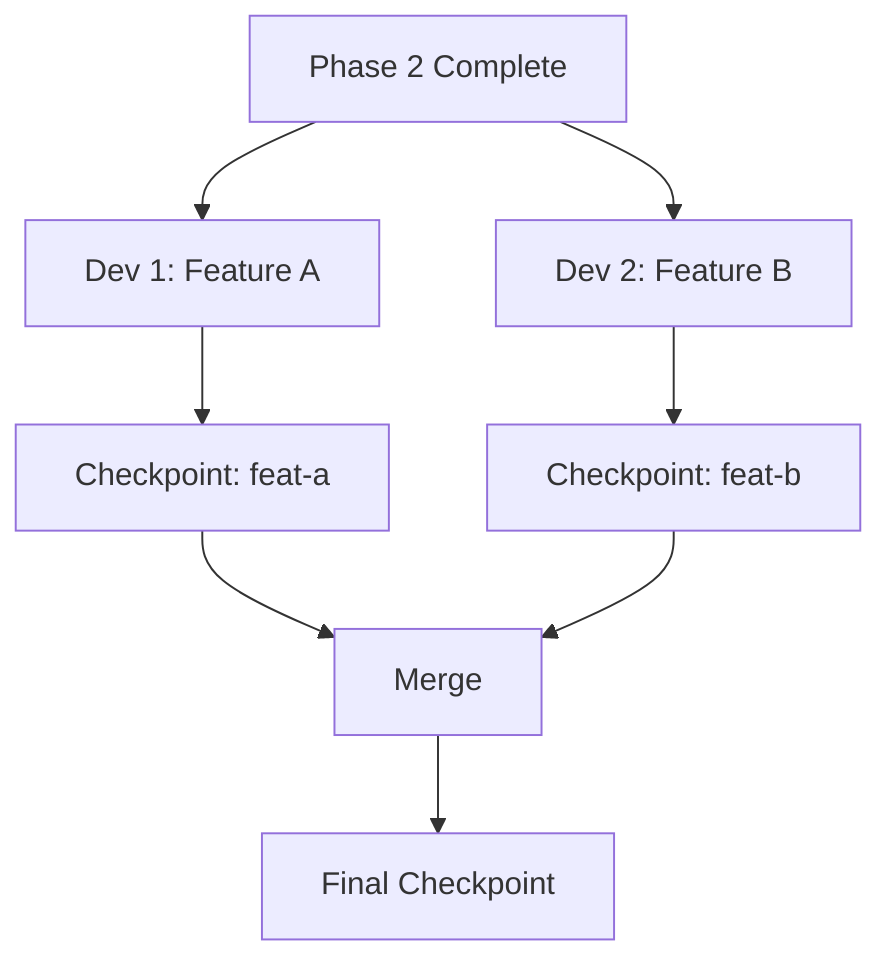

# Checkpoint 활용법

## 🎯 이 문서에서 배울 것
- [ ] Checkpoint 시스템 이해
- [ ] Phase별 체크포인트 저장 및 복원
- [ ] 실험 추적 (A/B 테스팅)
- [ ] 협업 워크플로우 구성

⏱️ **예상 시간**: 25분

---

## Checkpoint 시스템 개요

CAAS **Checkpoint**는 개발 과정의 특정 시점을 저장하고 복원할 수 있는 버전 관리 시스템입니다.

```mermaid
graph LR
    A[Phase 0] -->|checkpoint save| B[CP-0]
    B --> C[Phase 1]
    C -->|checkpoint save| D[CP-1]
    D --> E[Phase 2]
    E -->|checkpoint save| F[CP-2]
    F -->|rollback| C
    C --> G[Phase 2 (재실행)]
```

### 주요 기능

| 기능 | 명령어 | 설명 |
|------|--------|------|
| **저장** | `caas checkpoint save` | 현재 상태 저장 |
| **복원** | `caas checkpoint restore` | 특정 체크포인트로 롤백 |
| **목록** | `caas checkpoint list` | 저장된 체크포인트 조회 |
| **비교** | `caas checkpoint diff` | 두 체크포인트 비교 |
| **태그** | `caas checkpoint tag` | 체크포인트에 태그 추가 |

---

## 1. 기본 사용법 (10분)

### 1.1 체크포인트 저장

```bash
# Phase 2 완료 후 체크포인트 저장
caas checkpoint save \
  --project ./todo-system \
  --name "phase2-complete" \
  --description "Architecture design completed"
```

**출력**:
```
✅ Checkpoint saved!

ID: ckpt_20260214_153000_abc123
Name: phase2-complete
Description: Architecture design completed
Phase: 2 (Architecture)
Files: 3 (golden_data.json, requirement_analysis.json, architecture_design.json)
Size: 24 KB
Timestamp: 2026-02-14 15:30:00
```

**저장 내용**:
```
.caas/checkpoints/ckpt_20260214_153000_abc123/
├── metadata.json
├── golden_data.json
├── requirement_analysis.json
├── architecture_design.json
└── context.json
```

### 1.2 체크포인트 목록 조회

```bash
# 저장된 체크포인트 목록
caas checkpoint list --project ./todo-system
```

**출력**:
```
📚 Checkpoints for project: todo-system

ID                            Name                Phase  Size    Date
─────────────────────────────────────────────────────────────────────────
ckpt_20260214_153000_abc123   phase2-complete     2      24 KB   2026-02-14 15:30:00
ckpt_20260214_144500_def456   phase1-complete     1      18 KB   2026-02-14 14:45:00
ckpt_20260214_141000_ghi789   phase0-complete     0      12 KB   2026-02-14 14:10:00

Total: 3 checkpoints, 54 KB

💡 Use 'caas checkpoint restore <ID>' to restore
```

### 1.3 체크포인트 복원

```bash
# Phase 1로 롤백
caas checkpoint restore \
  --project ./todo-system \
  --checkpoint ckpt_20260214_144500_def456
```

**출력**:
```
🔄 Restoring checkpoint: ckpt_20260214_144500_def456

Backup current state → ./todo-system_backup_20260214_154000/
Restoring files...
  ✅ golden_data.json
  ✅ requirement_analysis.json

✅ Checkpoint restored!

Current Phase: 1 (Requirement Analysis)
Next: Run 'caas generate-phase --phase 2' to continue
```

---

## 2. 실험 추적 (A/B 테스팅) (10분)

### 2.1 실험 생성

```bash
# 실험 A: Hierarchical Process
caas checkpoint save \
  --project ./todo-system \
  --name "exp-a-hierarchical" \
  --tag experiment:a \
  --description "Using Hierarchical Process"

# Golden Data 수정 (Hierarchical Process)
vim golden_data.json
# process: "hierarchical" 설정

# Phase 3-5 실행
caas generate-phase --phase 3 "..." --output ./todo-system
caas generate-phase --phase 4 "..." --output ./todo-system
caas generate-phase --phase 5 "..." --output ./todo-system

# 결과 저장
caas checkpoint save \
  --project ./todo-system \
  --name "exp-a-result" \
  --tag experiment:a,result
```

```bash
# 실험 B: Sequential Process
caas checkpoint restore \
  --checkpoint ckpt_20260214_153000_abc123  # Phase 2로 롤백

caas checkpoint save \
  --project ./todo-system \
  --name "exp-b-sequential" \
  --tag experiment:b \
  --description "Using Sequential Process"

# Golden Data 수정 (Sequential Process)
vim golden_data.json
# process: "sequential" 설정

# Phase 3-5 실행
caas generate-phase --phase 3 "..." --output ./todo-system
caas generate-phase --phase 4 "..." --output ./todo-system
caas generate-phase --phase 5 "..." --output ./todo-system

# 결과 저장
caas checkpoint save \
  --project ./todo-system \
  --name "exp-b-result" \
  --tag experiment:b,result
```

### 2.2 실험 비교

```bash
# 두 실험 결과 비교
caas checkpoint diff \
  --checkpoint-a exp-a-result \
  --checkpoint-b exp-b-result \
  --metrics code_quality,test_coverage,performance
```

**출력**:
```
📊 Checkpoint Comparison

Experiment A (Hierarchical) vs Experiment B (Sequential)

┌─────────────────────────────────────────────────┐
│ Code Quality                                    │
├─────────────────────────────────────────────────┤
│ A: 8.7/10.0                                     │
│ B: 8.2/10.0                                     │
│ Δ: +0.5 (A wins) ✅                             │
└─────────────────────────────────────────────────┘

┌─────────────────────────────────────────────────┐
│ Test Coverage                                   │
├─────────────────────────────────────────────────┤
│ A: 85%                                          │
│ B: 92%                                          │
│ Δ: -7% (B wins) ✅                              │
└─────────────────────────────────────────────────┘

┌─────────────────────────────────────────────────┐
│ Performance (avg response time)                 │
├─────────────────────────────────────────────────┤
│ A: 1.2s                                         │
│ B: 2.1s                                         │
│ Δ: +0.9s (A wins) ✅                            │
└─────────────────────────────────────────────────┘

┌─────────────────────────────────────────────────┐
│ File Differences                                │
├─────────────────────────────────────────────────┤
│ agents.py: 23 lines changed                     │
│ tasks.py: 15 lines changed                      │
│ main.py: 8 lines changed                        │
└─────────────────────────────────────────────────┘

💡 Recommendation: Use Experiment A (Hierarchical)
   - Better code quality
   - Faster performance
   - Acceptable test coverage (85%)
```

### 2.3 최적 결과 선택

```bash
# 실험 A 결과 채택
caas checkpoint restore \
  --checkpoint exp-a-result

# 프로덕션 태그 추가
caas checkpoint tag \
  --checkpoint exp-a-result \
  --tag production,v1.0
```

---

## 3. 협업 워크플로우 (5분)

### 3.1 체크포인트 공유

```bash
# 체크포인트 내보내기 (팀원에게 공유)
caas checkpoint export \
  --checkpoint phase2-complete \
  --output phase2-complete.ckpt
```

**팀원 (다른 개발자)**:
```bash
# 체크포인트 가져오기
caas checkpoint import \
  --file phase2-complete.ckpt \
  --project ./my-todo-system

# 복원
caas checkpoint restore \
  --checkpoint phase2-complete
```

### 3.2 병렬 개발



**Developer 1**:
```bash
# Feature A 개발
caas checkpoint restore --checkpoint phase2-complete

# Golden Data에 Feature A 추가
vim golden_data.json
# features += [{"id": "f6", "name": "Feature A", ...}]

# 코드 생성
caas generate-phase --phase 3-5 "..." --output ./todo-system

# 체크포인트 저장
caas checkpoint save \
  --name "feat-a-complete" \
  --tag feature:a
```

**Developer 2**:
```bash
# Feature B 개발 (동시에)
caas checkpoint restore --checkpoint phase2-complete

# Golden Data에 Feature B 추가
vim golden_data.json
# features += [{"id": "f7", "name": "Feature B", ...}]

# 코드 생성
caas generate-phase --phase 3-5 "..." --output ./todo-system

# 체크포인트 저장
caas checkpoint save \
  --name "feat-b-complete" \
  --tag feature:b
```

**Merge** (Tech Lead):
```bash
# Golden Data 병합
caas checkpoint merge \
  --checkpoint-a feat-a-complete \
  --checkpoint-b feat-b-complete \
  --strategy golden_data \
  --output merged-checkpoint

# 병합된 체크포인트 복원 및 코드 재생성
caas checkpoint restore --checkpoint merged-checkpoint
caas generate-phase --phase 3-5 "..." --output ./todo-system

# 최종 체크포인트 저장
caas checkpoint save \
  --name "features-ab-merged" \
  --tag production,v1.1
```

---

## 4. 고급 기능 (선택)

### 4.1 자동 체크포인트

```bash
# Phase 완료 시 자동 저장 활성화
caas config set checkpoint.auto_save=true

# 이제 Phase 완료 시 자동으로 체크포인트 생성
caas generate-phase --phase 2 "..."
# → 자동 생성: ckpt_phase2_auto_20260214_160000
```

**.caas/config.json**:
```json
{
  "checkpoint": {
    "auto_save": true,
    "retention_days": 30,
    "max_checkpoints": 100,
    "auto_tag_pattern": "phase{phase}_auto_{timestamp}"
  }
}
```

### 4.2 체크포인트 정리

```bash
# 30일 이상 된 체크포인트 삭제
caas checkpoint cleanup \
  --older-than 30d \
  --except-tagged production

# 출력:
# ✅ Deleted 12 checkpoints (84 KB freed)
# ✅ Kept 5 checkpoints (tagged: production)
```

### 4.3 원격 저장소 연동

```bash
# S3에 체크포인트 백업
caas checkpoint sync \
  --remote s3://my-company-caas-checkpoints/ \
  --project ./todo-system

# 다른 환경에서 복원
caas checkpoint sync \
  --remote s3://my-company-caas-checkpoints/ \
  --project ./todo-system \
  --download

caas checkpoint restore --checkpoint phase2-complete
```

---

## 5. 실전 시나리오

### 시나리오 1: 실수로 코드 덮어씀

```bash
# 문제: Phase 5 재실행 시 기존 코드 덮어씀
caas generate-phase --phase 5 "..." --force  # 😱 실수!

# 해결: 직전 체크포인트로 롤백
caas checkpoint list
caas checkpoint restore --checkpoint ckpt_20260214_155000_xyz123

# ✅ 코드 복원 완료
```

### 시나리오 2: 다른 아키텍처 실험

```bash
# 현재: Microservices 아키텍처
caas checkpoint save --name "arch-microservices"

# 실험: Monolithic 아키텍처
vim architecture_design.json
# pattern: "monolithic" 변경

caas generate-phase --phase 3-5 "..." --output ./todo-system
caas checkpoint save --name "arch-monolithic"

# 비교
caas checkpoint diff \
  --checkpoint-a arch-microservices \
  --checkpoint-b arch-monolithic \
  --metrics complexity,deployment_ease

# 결과에 따라 선택
caas checkpoint restore --checkpoint arch-microservices  # 또는 arch-monolithic
```

### 시나리오 3: PM 검수 후 롤백

```bash
# PM에게 Phase 3 결과 제출
caas checkpoint save --name "phase3-for-review"
caas checkpoint export --checkpoint phase3-for-review --output review.ckpt
# review.ckpt 파일을 PM에게 전달

# PM 피드백: "Agent 수 3개로 줄여주세요"
caas checkpoint restore --checkpoint phase2-complete

# Golden Data 수정
vim golden_data.json
# constraints: {"max_agents": 3} 추가

# Phase 3 재생성
caas generate-phase --phase 3 "..." --output ./todo-system
caas checkpoint save --name "phase3-revised"
```

---

## 6. 모범 사례

### ✅ DO

1. **Phase별 체크포인트 필수**
   ```bash
   # 각 Phase 완료 후 저장
   caas generate-phase --phase 2 "..."
   caas checkpoint save --name "phase2-complete"
   ```

2. **의미 있는 이름 사용**
   ```bash
   # ✅ Good
   caas checkpoint save --name "phase2-arch-microservices"

   # ❌ Bad
   caas checkpoint save --name "test123"
   ```

3. **태그로 관리**
   ```bash
   caas checkpoint tag \
     --checkpoint phase5-complete \
     --tag production,v1.0,tested
   ```

### ❌ DON'T

1. **체크포인트 없이 위험한 작업**
   ```bash
   # ❌ Bad: 체크포인트 없이 --force 사용
   caas generate-phase --phase 5 "..." --force
   ```

2. **오래된 체크포인트 방치**
   ```bash
   # ✅ 정기적으로 정리
   caas checkpoint cleanup --older-than 30d
   ```

---

## 7. 디버깅

### 문제: 체크포인트 복원 실패

```bash
# 오류:
# ❌ Error: Checkpoint corrupted

# 해결:
caas checkpoint verify --checkpoint ckpt_abc123
# → 손상된 파일 확인

# 백업에서 복원
caas checkpoint restore --checkpoint ckpt_abc123 --from-backup
```

### 문제: 체크포인트 용량 너무 큼

```bash
# 문제: 체크포인트 1개당 500 MB

# 원인: 불필요한 파일 포함
caas checkpoint list --detailed
# → node_modules/, __pycache__/, *.pyc 포함됨

# 해결: .caasignore 파일 생성
echo "node_modules/" >> .caasignore
echo "__pycache__/" >> .caasignore
echo "*.pyc" >> .caasignore

# 새 체크포인트 생성
caas checkpoint save --name "phase2-optimized"
# → 500 MB → 25 MB ✅
```

---

## 📚 관련 문서
- **[30_프로젝트_생성_워크플로우.md](../3_프로젝트_관리_PM/30_프로젝트_생성_워크플로우.md)** - PM 워크플로우
- **[10_CAAS_6Phase_개발_프로세스.md](../2_개발_실무_가이드/10_CAAS_6Phase_개발_프로세스.md)** - Phase 설명
- **[22_트러블슈팅_가이드.md](../2_개발_실무_가이드/22_트러블슈팅_가이드.md)** - 체크포인트 오류 해결

---

**작성일**: 2026-02-14
**버전**: v0.5.1 (Core) + v0.6.3 (CAAS-E)
**대상**: 시니어 개발자, PM, Tech Lead
**난이도**: ⭐⭐ 중급
