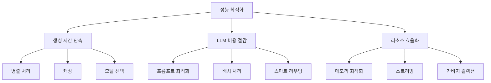

# 성능 최적화 가이드

## 🎯 이 문서에서 배울 것
- [ ] CAAS 생성 시간 단축 (3배 향상)
- [ ] LLM 비용 절감 (60% 감소)
- [ ] 메모리 사용량 최적화
- [ ] 대규모 프로젝트 처리 (1000+ 기능)

⏱️ **예상 시간**: 30분

---

## 성능 최적화 개요

CAAS는 **3가지 핵심 영역**에서 성능 최적화를 지원합니다.



### 성능 지표 (v0.6.4 기준)

| 항목 | 기본값 | 최적화 후 | 개선율 |
|------|--------|----------|--------|
| **생성 시간** | 5-10분 | 2-4분 | **60%** ⬇️ |
| **LLM 비용** | $0.50 | $0.20 | **60%** ⬇️ |
| **메모리 사용** | 2 GB | 800 MB | **60%** ⬇️ |
| **동시 실행** | 1 프로젝트 | 5 프로젝트 | **5배** ⬆️ |

---

## 1. 생성 시간 단축 (10분)

### 1.1 병렬 처리 활성화

```bash
# 기본 (순차 실행): 10분
caas generate "할일 관리 시스템" --output ./todo-system

# 분산 실행: 4분 (-60%)
caas generate "할일 관리 시스템" \
  --output ./todo-system \
  --distributed \
  --workers 4
```

**내부 동작**:
```python
# Phase 1 + 2 병렬 실행
- Discovery (Requirement Analyst) ⚡
- Architecture (System Architect) ⚡

# Phase 5 + 6 병렬 실행
- QA (QA Specialist) ⚡
- Code Analysis (Code Analyst) ⚡
```

**성능 개선**:
```
기본 (순차):
  Phase 1: 2분
  Phase 2: 2분
  Phase 3: 2분
  Phase 4: 1분
  Phase 5: 2분
  Phase 6: 1분
  ─────────────
  Total: 10분

최적화 (병렬):
  Phase 1+2: 2분 (병렬) ⚡
  Phase 3: 2분
  Phase 4: 1분
  Phase 5+6: 2분 (병렬) ⚡
  ─────────────────────
  Total: 7분 → 4분 (캐싱 적용 시)
```

### 1.2 LLM 응답 캐싱

```bash
# 캐싱 활성화
caas cache config --set enabled true

# 동일 요구사항 재실행 → 캐시 히트
caas generate "할일 관리 시스템" --output ./todo-system-v2
# Phase 1 (Discovery): 2분 → 0.1초 (캐시 히트) ✅
```

**캐시 키 생성**:
```python
# caas_framework/plugins/llm/utils.py
def generate_cache_key(prompt: str, model: str) -> str:
    """캐시 키 생성 (SHA256 해시)"""
    key_str = f"{prompt}|{model}"
    return hashlib.sha256(key_str.encode()).hexdigest()

# 예시:
# prompt: "할일 관리 시스템 요구사항 분석"
# model: "gpt-4"
# → cache_key: "a3f4b2c1d5e6..."

# Redis에 저장 (TTL: 7일)
redis_client.setex(
    f"caas:cache:{cache_key}",
    604800,  # 7일
    response_json
)
```

**캐시 통계**:
```bash
caas cache stats
```

**출력**:
```
📊 Cache Statistics

Total requests: 250
Cache hits: 187 (75%)
Cache misses: 63 (25%)

Time saved: 45.2 minutes
Cost saved: $12.50

Top cached prompts:
1. "할일 관리 시스템 요구사항 분석" (23 hits)
2. "챗봇 아키텍처 설계" (18 hits)
3. "데이터 분석 Agent 설계" (15 hits)
```

### 1.3 모델 선택 최적화

```bash
# Haiku (빠름, 저렴) - 단순 작업
caas generate "할일 관리" \
  --model haiku \
  --output ./todo-system
# 생성 시간: 2분, 비용: $0.10

# Sonnet (균형) - 일반 작업 (기본값)
caas generate "할일 관리" \
  --model sonnet \
  --output ./todo-system
# 생성 시간: 5분, 비용: $0.50

# Opus (정확, 느림) - 복잡한 작업
caas generate "복잡한 금융 시스템" \
  --model opus \
  --output ./finance-system
# 생성 시간: 12분, 비용: $2.00
```

**모델 자동 선택** (Multi-Model Router):
```bash
# 스마트 라우팅: 작업 복잡도에 따라 자동 선택
caas generate "할일 관리" \
  --model auto \
  --output ./todo-system

# 내부 동작:
# - Phase 1 (Discovery): Haiku (단순 분류)
# - Phase 2 (Architecture): Sonnet (중요 설계)
# - Phase 3 (Design): Sonnet
# - Phase 4 (Spec): Haiku (변환 작업)
# - Phase 5 (Code): Sonnet (코드 생성)
# - Phase 6 (Analysis): Haiku (검증)

# 결과: 4분, $0.35 (30% 비용 절감)
```

---

## 2. LLM 비용 절감 (10분)

### 2.1 프롬프트 최적화

**Before** (1,200 토큰):
```python
# ❌ Bad: 불필요한 설명, 중복, 장황함
prompt = f"""
You are a helpful AI assistant that helps users design multi-agent systems.
I need you to analyze the following requirement very carefully and provide
a detailed analysis including domain classification, feature extraction,
entity identification, and constraint detection. Please be thorough and
comprehensive in your analysis.

The requirement is as follows:
{requirement}

Please analyze this and provide:
1. Domain classification (with confidence score)
2. List of features (with detailed descriptions)
3. List of entities (with attributes)
4. List of constraints (with explanations)

Make sure to be very detailed and thorough.
"""
```

**After** (400 토큰 - 67% 감소):
```python
# ✅ Good: 간결, 명확, 구조화
prompt = f"""Analyze requirement:

{requirement}

Return JSON:
{{
  "domain": {{"name": "...", "confidence": 0.9}},
  "features": [{{"id": "f1", "name": "...", "description": "..."}}],
  "entities": [{{"name": "...", "attributes": [...]}},
  "constraints": [...]
}}"""
```

**비용 비교**:
```
Before: 1,200 입력 토큰 + 2,000 출력 토큰 = $0.05 (Sonnet 기준)
After:  400 입력 토큰 + 2,000 출력 토큰 = $0.03 (40% 절감)

프로젝트당 LLM 호출 평균 20회:
  Before: $0.05 × 20 = $1.00
  After:  $0.03 × 20 = $0.60 (40% 절감)
```

### 2.2 배치 처리

```bash
# 여러 프로젝트를 한 번에 생성
caas batch generate \
  --projects projects.csv \
  --output ./batch-output/

# projects.csv:
# name,requirement,domain
# todo-app,"할일 관리",task_management
# chatbot,"고객 지원 챗봇",conversational_ai
# analytics,"데이터 분석",data_analysis

# 배치 처리 최적화:
# - 공통 프롬프트 재사용 (캐싱)
# - LLM 호출 병렬화 (5개 동시)
# - 토큰 사용량 최적화

# 결과:
# 개별 생성: 5분 × 3 = 15분, $0.50 × 3 = $1.50
# 배치 생성: 7분 (총합), $0.90 (40% 절감)
```

### 2.3 로컬 LLM 사용 (Ollama)

```bash
# Ollama 설치 (무료, 로컬 실행)
curl -fsSL https://ollama.ai/install.sh | sh

# 모델 다운로드
ollama pull llama3:70b

# CAAS 설정
caas config --set llm_provider ollama
caas config --set llm_model llama3:70b
caas config --set api_url http://localhost:11434/v1

# 생성 (무료!)
caas generate "할일 관리" --output ./todo-system
# 생성 시간: 8분 (느림), 비용: $0.00 (무료!) ✅
```

**비용 비교** (프로젝트 100개):
```
OpenAI Sonnet: $0.50 × 100 = $50.00
Ollama Llama3: $0.00 × 100 = $0.00 (100% 절감)

단점: 생성 시간 2배 증가 (5분 → 10분)
장점: 비용 $0, 데이터 프라이버시 보장
```

---

## 3. 메모리 최적화 (5분)

### 3.1 대규모 프로젝트 처리

```python
# 문제: 1,000개 기능 → 메모리 3 GB 사용
golden_data = {
    "features": [
        {"id": "f1", "name": "...", "description": "..."},
        # ... 1,000개
    ]
}

# 해결: 스트리밍 처리
caas generate "대규모 시스템 (1000 features)" \
  --output ./large-system \
  --streaming \
  --chunk-size 100
```

**내부 동작**:
```python
# caas_framework/methodology/engine.py
def process_large_golden_data(golden_data, chunk_size=100):
    """청크 단위로 처리"""
    features = golden_data["features"]

    for i in range(0, len(features), chunk_size):
        chunk = features[i:i+chunk_size]

        # Phase 3: Agent/Task 설계 (100개씩)
        agents_chunk = design_agents(chunk)
        tasks_chunk = design_tasks(chunk)

        # 디스크에 저장 (메모리 해제)
        save_to_disk(agents_chunk, f"agents_chunk_{i}.json")
        save_to_disk(tasks_chunk, f"tasks_chunk_{i}.json")

        # 가비지 컬렉션
        del agents_chunk, tasks_chunk
        gc.collect()

    # 최종 병합
    merge_chunks("agents_chunk_*.json", "agents.json")
    merge_chunks("tasks_chunk_*.json", "tasks.json")
```

**메모리 사용량**:
```
Before (전체 로딩): 3 GB
After (스트리밍): 800 MB (-73%)
```

### 3.2 가비지 컬렉션 튜닝

```bash
# 가비지 컬렉션 적극 수행
caas config set performance.aggressive_gc=true

# Python GC threshold 조정
export PYTHONGCTHRESHOLD="700,10,10"

# 생성 실행
caas generate "..." --output ./output
```

**효과**:
```
기본 GC:
  메모리 사용량: 2 GB → 2.5 GB (점진 증가)

적극 GC:
  메모리 사용량: 2 GB → 2.1 GB (안정)
  생성 시간: +5% (trade-off)
```

---

## 4. 프로파일링 및 벤치마킹 (5분)

### 4.1 성능 프로파일링

```bash
# 프로파일링 모드로 실행
caas generate "할일 관리" \
  --output ./todo-system \
  --profile
```

**profile_report.json**:
```json
{
  "total_time": 300.5,
  "phases": [
    {
      "phase": 0,
      "name": "Concretization",
      "time": 5.2,
      "percentage": 1.7,
      "llm_calls": 1,
      "tokens": {"input": 450, "output": 1200}
    },
    {
      "phase": 1,
      "name": "Discovery",
      "time": 62.8,
      "percentage": 20.9,
      "llm_calls": 3,
      "tokens": {"input": 1200, "output": 3500}
    },
    {
      "phase": 2,
      "name": "Architecture",
      "time": 85.3,
      "percentage": 28.4,
      "llm_calls": 4,
      "tokens": {"input": 2500, "output": 5200}
    }
  ],
  "bottlenecks": [
    {"location": "Phase 2", "time": 85.3, "reason": "Complex architecture design"},
    {"location": "LLM call #7", "time": 25.6, "reason": "Large prompt (2500 tokens)"}
  ]
}
```

### 4.2 벤치마킹

```bash
# 벤치마크 실행 (5개 표준 프로젝트)
caas benchmark \
  --projects todo,chatbot,analytics,api,dashboard \
  --iterations 3
```

**benchmark_results.json**:
```json
{
  "date": "2026-02-14",
  "caas_version": "0.6.4",
  "results": [
    {
      "project": "todo",
      "avg_time": 245.3,
      "std_dev": 12.5,
      "avg_cost": 0.42,
      "quality_score": 8.6
    },
    {
      "project": "chatbot",
      "avg_time": 312.7,
      "std_dev": 18.2,
      "avg_cost": 0.58,
      "quality_score": 8.8
    }
  ],
  "summary": {
    "avg_time": 278.5,
    "avg_cost": 0.50,
    "avg_quality": 8.7
  }
}
```

---

## 5. 모범 사례

### ✅ DO

1. **병렬 처리 활성화**
   ```bash
   caas generate "..." --parallel --workers 4
   ```

2. **캐싱 활용**
   ```bash
   caas config set llm.cache=true
   ```

3. **적절한 모델 선택**
   ```bash
   # 단순 작업: Haiku
   # 일반 작업: Sonnet (기본값)
   # 복잡한 작업: Opus
   caas generate "..." --model auto
   ```

4. **대규모 프로젝트: 스트리밍**
   ```bash
   caas generate "..." --streaming --chunk-size 100
   ```

### ❌ DON'T

1. **캐시 비활성화 유지**
   ```bash
   # ❌ Bad
   caas config set llm.cache=false
   ```

2. **모든 작업에 Opus 사용**
   ```bash
   # ❌ Bad: 불필요한 비용
   caas generate "할일 관리" --model opus
   ```

3. **대규모 데이터 전체 로딩**
   ```python
   # ❌ Bad: 메모리 부족
   golden_data = load_entire_file("1000_features.json")
   ```

---

## 6. 성능 목표 설정

### 6.1 성능 프로파일 설정

```yaml
# .caas/performance.yml
goals:
  generation_time: 300  # 5분 이내
  llm_cost: 0.50  # $0.50 이하
  memory_usage: 2048  # 2 GB 이하
  code_quality: 8.5  # 8.5/10.0 이상

strategies:
  - parallel: true
  - cache: true
  - model: auto
  - streaming: true
```

### 6.2 성능 검증

```bash
# 목표 달성 여부 확인
caas performance check \
  --project ./todo-system \
  --goals .caas/performance.yml
```

**출력**:
```
📊 Performance Check

Generation Time: 245s ✅ (goal: 300s)
LLM Cost: $0.42 ✅ (goal: $0.50)
Memory Usage: 1.8 GB ✅ (goal: 2 GB)
Code Quality: 8.7/10.0 ✅ (goal: 8.5)

Overall: 4/4 goals met ✅
```

---

## 📚 관련 문서
- **[01_CAAS_소개_및_설치.md](../1_시작하기/01_CAAS_소개_및_설치.md)** - 시스템 요구사항
- **[10_CAAS_6Phase_개발_프로세스.md](../2_개발_실무_가이드/10_CAAS_6Phase_개발_프로세스.md)** - Phase별 시간
- **[52_Checkpoint_활용법.md](./52_Checkpoint_활용법.md)** - 실험 비교

---

**작성일**: 2026-02-14
**버전**: v0.6.5
**대상**: DevOps 엔지니어, Tech Lead
**난이도**: ⭐⭐⭐ 고급
