# 도메인 레퍼런스

## 🎯 이 문서에서 배울 것
- [ ] CAAS 지원 도메인 17개 완전 레퍼런스
- [ ] 도메인별 특징 및 적용 사례
- [ ] 권장 설정 및 템플릿
- [ ] 도메인 선택 가이드

⏱️ **예상 시간**: 45분 (참고용)

---

## 도메인 분류 체계

CAAS는 **17개 도메인**을 5개 카테고리로 분류합니다.

```mermaid
graph TD
    A[17 Domains] --> B[대화 & 커뮤니케이션 2]
    A --> C[작업 & 워크플로우 2]
    A --> D[데이터 & 분석 3]
    A --> E[콘텐츠 & 문서 3]
    A --> F[통합 & API 2]
    A --> G[도메인 특화 5]

    B --> B1[CONVERSATIONAL_AI]
    B --> B2[CUSTOMER_SUPPORT]

    C --> C1[TASK_MANAGEMENT]
    C --> C2[WORKFLOW_AUTOMATION]

    D --> D1[DATA_ANALYSIS]
    D --> D2[REPORT_GENERATION]
    D --> D3[DASHBOARD]

    E --> E1[CONTENT_CREATION]
    E --> E2[DOCUMENT_PROCESSING]
    E --> E3[KNOWLEDGE_BASE]

    F --> F1[API_INTEGRATION]
    F --> F2[WEBHOOK_HANDLER]

    G --> G1[E_COMMERCE]
    G --> G2[EDUCATION]
    G --> G3[HEALTHCARE]
    G --> G4[FINANCE]
    G --> G5[CUSTOM]
```



---

## 1. 대화 & 커뮤니케이션 (2개)

### 1.1 CONVERSATIONAL_AI

**설명**: 대화형 AI 시스템 (챗봇, 가상 비서)

**구현률**: 98.7% ⭐⭐⭐⭐⭐

**특징**:
- FAQ 검색
- 대화 컨텍스트 관리
- 감정 분석
- 제품 추천
- 다국어 지원

**적용 사례**:
```
✅ 고객 문의 챗봇
✅ 쇼핑 도우미
✅ 교육 튜터
✅ HR 도우미 (채용, 급여 문의)
```

**권장 설정**:
```yaml
domain: conversational_ai
process: hierarchical  # Manager가 대화 흐름 조율
agents: 3-5
  - 입력 분석 (의도 파악, 엔티티 추출)
  - FAQ 검색 또는 지식베이스 검색
  - 응답 생성 (톤 조정)
  - 컨텍스트 저장
tools:
  - FAQSearchTool
  - SemanticSearchTool
  - ResponseGeneratorTool
  - ContextStoreTool
```

**Golden Data 템플릿**:
```json
{
  "domain": "conversational_ai",
  "features": [
    {"id": "f1", "name": "FAQ 검색", "inputs": ["user_query"], "outputs": ["faq_result"]},
    {"id": "f2", "name": "응답 생성", "inputs": ["faq_result", "context"], "outputs": ["response"]},
    {"id": "f3", "name": "감정 분석", "inputs": ["user_query"], "outputs": ["sentiment"]}
  ],
  "entities": [
    {"name": "conversation", "attributes": ["id", "user_id", "messages", "context"]}
  ]
}
```

---

### 1.2 CUSTOMER_SUPPORT

**설명**: 고객 지원 자동화 시스템

**구현률**: 높음 ⭐⭐⭐⭐

**특징**:
- 티켓 분류
- 우선순위 자동 할당
- 에스컬레이션
- 자동 응답

**적용 사례**:
```
✅ 헬프데스크 자동화
✅ 이메일 응답 봇
✅ 클레임 처리
```

**권장 Agent 구성**:
```python
agent_1: 티켓 분류자 (TicketClassifierTool)
agent_2: 우선순위 분석가 (PriorityAnalysisTool)
agent_3: 자동 응답 생성기 (AutoResponseTool)
agent_4: 에스컬레이션 담당자 (EscalationTool)
```

---

## 2. 작업 & 워크플로우 (2개)

### 2.1 TASK_MANAGEMENT

**설명**: 할일 관리 및 프로젝트 관리 시스템

**구현률**: 중간 ⭐⭐⭐

**특징**:
- 할일 CRUD
- 우선순위 자동 분석
- 마감일 관리
- 팀 협업

**적용 사례**:
```
✅ 개인 할일 관리 앱
✅ 팀 프로젝트 관리
✅ 스프린트 관리 (Agile)
```

**권장 설정**:
```yaml
domain: task_management
process: sequential
agents: 3-4
tools:
  - TodoCRUDTool
  - PriorityAnalysisTool
  - NotificationTool
database:
  schema:
    - todos (id, title, description, priority, due_date, status)
```

**실습 문서**: [40_할일관리_실습.md](../4_도메인별_실습/40_할일관리_실습.md)

---

### 2.2 WORKFLOW_AUTOMATION

**설명**: 업무 자동화 및 RPA (Robotic Process Automation)

**구현률**: 높음 ⭐⭐⭐⭐

**특징**:
- 반복 작업 자동화
- 조건부 분기
- 에러 핸들링
- 스케줄링

**적용 사례**:
```
✅ 이메일 자동 응답
✅ 데이터 입력 자동화
✅ 리포트 자동 생성
✅ 승인 워크플로우
```

**권장 Agent 구성**:
```python
agent_1: 트리거 감지자 (TriggerDetectorTool)
agent_2: 워크플로우 실행자 (WorkflowExecutorTool)
agent_3: 조건 평가자 (ConditionEvaluatorTool)
agent_4: 결과 보고자 (ResultReporterTool)
```

---

## 3. 데이터 & 분석 (3개)

### 3.1 DATA_ANALYSIS

**설명**: 데이터 분석 및 인사이트 도출

**구현률**: 98.3% ⭐⭐⭐⭐⭐

**특징**:
- CSV/Excel 처리
- 통계 분석
- 시각화 (차트 생성)
- 예측 분석 (ML)

**적용 사례**:
```
✅ 판매 데이터 분석
✅ 고객 세분화 (RFM)
✅ 이상치 탐지
✅ A/B 테스트 분석
```

**권장 도구**:
```python
tools:
  - DataCleaningTool (결측값, 이상값 처리)
  - StatisticalAnalysisTool (평균, 중앙값, 분산)
  - ChartGeneratorTool (Plotly 기반)
  - PredictionTool (Scikit-learn)
```

**실습 문서**: [42_데이터분석_실습.md](../4_도메인별_실습/42_데이터분석_실습.md)

---

### 3.2 REPORT_GENERATION

**설명**: 자동 리포트 생성 시스템

**구현률**: 높음 ⭐⭐⭐⭐

**특징**:
- 데이터 수집
- 템플릿 기반 생성
- PDF/Excel 출력
- 스케줄링

**적용 사례**:
```
✅ 월간 매출 리포트
✅ 성과 평가 리포트
✅ 규제 준수 리포트 (Compliance)
```

**권장 설정**:
```yaml
agents: 4
  - 데이터 수집자 (DataCollectorTool)
  - 분석가 (AnalysisTool)
  - 리포트 작성자 (ReportWriterTool - LLM 기반)
  - PDF 생성자 (PDFGeneratorTool - ReportLab)
```

---

### 3.3 DASHBOARD

**설명**: 실시간 대시보드 및 모니터링

**구현률**: 중간 ⭐⭐⭐

**특징**:
- 실시간 데이터 스트리밍
- 인터랙티브 차트
- 알림 및 경고
- 다중 데이터 소스

**적용 사례**:
```
✅ KPI 대시보드
✅ 서버 모니터링
✅ 판매 현황판
```

**UI 권장**: Streamlit (기본), Plotly Dash

---

## 4. 콘텐츠 & 문서 (3개)

### 4.1 CONTENT_CREATION

**설명**: 콘텐츠 자동 생성 시스템

**구현률**: 98.7% ⭐⭐⭐⭐⭐

**특징**:
- 블로그 포스트 생성
- 소셜 미디어 콘텐츠
- SEO 최적화
- 다국어 번역

**적용 사례**:
```
✅ 마케팅 콘텐츠 생성
✅ 제품 설명 자동 작성
✅ 이메일 캠페인
```

**권장 Agent 구성**:
```python
agent_1: 주제 분석가 (TopicAnalyzerTool)
agent_2: 콘텐츠 작성가 (ContentWriterTool - LLM)
agent_3: SEO 최적화 담당자 (SEOOptimizerTool)
agent_4: 검수자 (QualityCheckerTool)
```

---

### 4.2 DOCUMENT_PROCESSING

**설명**: 문서 처리 및 정보 추출

**구현률**: 높음 ⭐⭐⭐⭐

**특징**:
- OCR (이미지 → 텍스트)
- PDF 파싱
- 엔티티 추출
- 문서 분류

**적용 사례**:
```
✅ 계약서 분석
✅ 이력서 파싱
✅ 송장 처리
```

**권장 도구**:
```python
- PDFParserTool (PyPDF2, pdfplumber)
- OCRTool (Tesseract)
- EntityExtractionTool (spaCy, LLM)
- DocumentClassifierTool
```

---

### 4.3 KNOWLEDGE_BASE

**설명**: 지식베이스 구축 및 검색 시스템

**구현률**: 중간 ⭐⭐⭐

**특징**:
- 벡터 검색 (Semantic Search)
- 문서 임베딩
- 질의응답 (RAG)
- 자동 태그 생성

**적용 사례**:
```
✅ 사내 위키
✅ 고객 지원 FAQ
✅ 연구 논문 검색
```

**권장 설정**:
```yaml
tools:
  - EmbeddingTool (OpenAI text-embedding-ada-002)
  - VectorSearchTool (Pinecone, FAISS)
  - RAGTool (Retrieval-Augmented Generation)
database:
  vectordb: pinecone  # 또는 faiss
```

---

## 5. 통합 & API (2개)

### 5.1 API_INTEGRATION

**설명**: 외부 API 연동 시스템

**구현률**: 중간 ⭐⭐⭐

**특징**:
- REST/GraphQL 연동
- OAuth 인증
- Rate Limiting
- 데이터 변환

**적용 사례**:
```
✅ 결제 API 통합 (Stripe, PayPal)
✅ CRM 연동 (Salesforce)
✅ 소셜 미디어 API (Twitter, Facebook)
```

**실습 문서**: [43_API통합_실습.md](../4_도메인별_실습/43_API통합_실습.md)

---

### 5.2 WEBHOOK_HANDLER

**설명**: Webhook 수신 및 처리

**구현률**: 중간 ⭐⭐⭐

**특징**:
- Webhook 서명 검증
- 이벤트 큐잉
- 재시도 로직
- 비동기 처리

**적용 사례**:
```
✅ GitHub Webhook (PR 알림)
✅ 결제 완료 알림 (Stripe)
✅ 주문 상태 변경 알림
```

**권장 설정**:
```python
# Flask/FastAPI로 Webhook 서버 생성
agent_1: 서명 검증자 (SignatureVerifierTool)
agent_2: 이벤트 파서 (EventParserTool)
agent_3: 비즈니스 로직 실행자 (ActionExecutorTool)
agent_4: 응답 생성자 (ResponseBuilderTool)
```

---

## 6. 도메인 특화 (5개)

### 6.1 E_COMMERCE

**설명**: 전자상거래 시스템

**구현률**: 중간 ⭐⭐⭐

**특징**:
- 제품 카탈로그 관리
- 장바구니
- 주문 처리
- 재고 관리

**적용 사례**:
```
✅ 온라인 쇼핑몰
✅ 마켓플레이스
✅ 구독 서비스
```

---

### 6.2 EDUCATION

**설명**: 교육 시스템

**구현률**: 중간 ⭐⭐⭐

**특징**:
- 과제 자동 채점
- 학습 진도 추적
- 맞춤형 추천
- 퀴즈 생성

**적용 사례**:
```
✅ LMS (Learning Management System)
✅ 온라인 코딩 테스트
✅ 어학 학습 앱
```

---

### 6.3 HEALTHCARE

**설명**: 헬스케어 시스템

**구현률**: 중간 ⭐⭐⭐

**특징**:
- 진료 예약
- 의료 기록 관리
- 증상 분석
- 약물 상호작용 검사

**적용 사례**:
```
✅ 병원 예약 시스템
✅ 원격 진료
✅ 건강 모니터링
```

**주의**: HIPAA 준수 필요 (보안 강화)

---

### 6.4 FINANCE

**설명**: 금융 시스템

**구현률**: 중간 ⭐⭐⭐

**특징**:
- 거래 분류
- 예산 추적
- 투자 분석
- 리스크 평가

**적용 사례**:
```
✅ 가계부 앱
✅ 투자 포트폴리오 관리
✅ 신용 점수 분석
```

**주의**: PCI DSS 준수 필요 (보안 강화)

---

### 6.5 CUSTOM

**설명**: 커스텀/기타 도메인

**구현률**: 범용 ⭐⭐⭐

**특징**:
- 유연한 설정
- 도메인 독립적
- 범용 Agent/Task 생성

**적용 사례**:
```
✅ 실험적 프로젝트
✅ 복합 도메인 (여러 도메인 혼합)
✅ 기존 17개 도메인에 속하지 않는 경우
```

**사용 예시**:
```bash
caas generate "특수한 요구사항 (기존 도메인에 없음)" \
  --domain custom \
  --output ./custom-project
```

---

## 7. 도메인 선택 가이드

### 7.1 자동 도메인 감지

```bash
# CAAS가 자동으로 도메인 분류 (Phase 1)
caas generate "고객 문의 챗봇 만들기" --output ./chatbot

# 출력:
# 🔍 Domain detected: CONVERSATIONAL_AI (confidence: 0.95)
```

### 7.2 수동 도메인 지정

```bash
# 도메인 명시적 지정
caas generate "..." \
  --domain conversational_ai \
  --output ./chatbot
```

### 7.3 도메인 비교

**시나리오**: "이메일 자동 응답 시스템"

| 도메인 | 적합도 | 이유 |
|--------|--------|------|
| CUSTOMER_SUPPORT | ⭐⭐⭐⭐⭐ | 고객 지원 자동화에 최적 |
| CONVERSATIONAL_AI | ⭐⭐⭐ | 대화형이지만 이메일에는 과함 |
| WORKFLOW_AUTOMATION | ⭐⭐⭐⭐ | 업무 자동화 관점에서 적합 |
| **권장**: CUSTOMER_SUPPORT | | |

---

## 8. 도메인 통계 (v0.5.1 기준)

| 도메인 | 구현률 | 평균 생성 시간 | 평균 코드 품질 | 프로젝트 수* |
|--------|--------|---------------|---------------|-------------|
| **CONVERSATIONAL_AI** | 98.7% | 5분 | 8.8/10.0 | 1,250 |
| DATA_ANALYSIS | 98.3% | 4분 | 8.6/10.0 | 980 |
| CONTENT_CREATION | 98.7% | 6분 | 8.7/10.0 | 720 |
| CUSTOMER_SUPPORT | 높음 | 5분 | 8.5/10.0 | 650 |
| TASK_MANAGEMENT | 중간 | 4분 | 8.2/10.0 | 500 |
| API_INTEGRATION | 중간 | 6분 | 8.3/10.0 | 420 |
| ... | ... | ... | ... | ... |

*프로젝트 수: CAAS로 생성된 프로젝트 추정치

---

## 📚 관련 문서
- **[02_5분_빠른_시작.md](../1_시작하기/02_5분_빠른_시작.md)** - 도메인별 빠른 예제
- **[10_CAAS_6Phase_개발_프로세스.md](../2_개발_실무_가이드/10_CAAS_6Phase_개발_프로세스.md)** - Phase 1 도메인 분류
- **[40-43_도메인별_실습.md](../4_도메인별_실습/)** - 실습 문서

---

**작성일**: 2026-02-14
**버전**: v0.5.1 (Core) + v0.6.3 (CAAS-E)
**대상**: 전체 개발자
**난이도**: ⭐ 입문-중급 (참고용)
