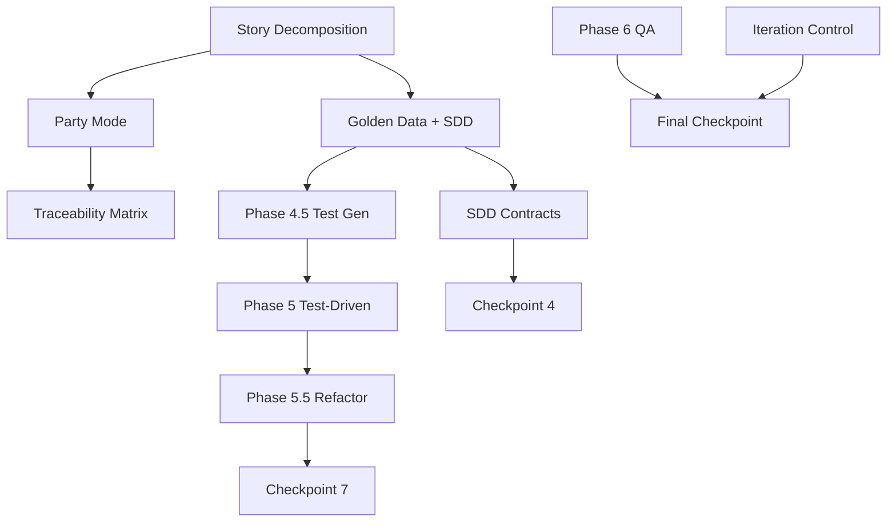

# CAAS-E Implementation Plan v1.0
## From CAAS v0.5.1 to Full CAAS-E Enterprise Support

**Date**: 2026-02-14
**Status**: Ready for Implementation
**Estimated Timeline**: 12-18 weeks (1-2 developers)
**Total Effort**: 450-670 hours

---

## Executive Summary

### Current State (CAAS v0.5.1)
- ✅ **48% CAAS-E Ready**
- ✅ Core 6-Phase Methodology implemented
- ✅ 6 Expert Agents collaboration
- ✅ 28+ CLI commands
- ✅ Code generation pipeline working
- ✅ Basic validation and testing

### Target State (CAAS-E Full Support)
- 🎯 **100% CAAS-E Methodology Support**
- 🎯 Story-based epic decomposition
- 🎯 Party Mode multi-agent review
- 🎯 Complete TDD cycle (RED-GREEN-REFACTOR)
- 🎯 7 human checkpoints with approval workflow
- 🎯 SDD specification export (YAML)
- 🎯 40+ CLI commands

### Critical Gaps (P0 - Must Fix)
1. **Story Decomposition**: Epic → Stories → Features (40-50 hrs)
2. **Party Mode**: Multi-agent collaborative review (60-80 hrs)
3. **Phase 4.5 (TDD RED)**: Test-first generation (30-40 hrs)
4. **Phase 5.5 (TDD REFACTOR)**: Safe refactoring + code review (70-90 hrs)
5. **YAML Spec Export**: agent_specs.yaml, task_specs.yaml, etc. (25-30 hrs)

---

## Implementation Roadmap

### 🔴 Phase 1: Foundation (Weeks 1-2) - P0 Critical Path

**Goal**: Enable epic-level workflows with story decomposition and begin Party Mode implementation.

#### Week 1: Story Decomposition Engine

**Deliverables**:
- Story decomposition algorithm
- CLI command for story breakdown
- Epic-to-stories conversion logic

**Tasks**:

**Task 1.1: Create Story Decomposition Module** (40-50 hrs)

File: `/caas_framework/methodology/story_decomposer.py` (500-600 lines)

```python
"""
Story Decomposition Engine for CAAS-E

Converts epics into manageable stories following BMAD methodology:
- 1 Epic = 5-10 Stories
- 1 Story = 3-7 Features
- Story dependency detection
- Complexity estimation
"""

from typing import List, Dict, Optional
from dataclasses import dataclass
from caas_framework.plugins.llm.base import BaseLLMPlugin
from caas_framework.models.specifications import FeatureSpec
import logging

logger = logging.getLogger(__name__)


@dataclass
class Story:
    """Represents a user story in BMAD methodology"""
    id: str
    name: str
    description: str
    features: List[str]  # Feature IDs
    dependencies: List[str]  # Story IDs this depends on
    estimated_complexity: str  # low, medium, high
    acceptance_criteria: List[str]
    business_value: str  # low, medium, high


@dataclass
class Epic:
    """Represents an epic (collection of stories)"""
    name: str
    description: str
    estimated_features: int
    recommended_stories: int
    stories: List[Story]
    business_value: str


class StoryDecomposer:
    """
    Decomposes large requirements (epics) into smaller stories.

    Algorithm:
    1. Estimate total feature count from requirement text
    2. If features > 15, recommend story decomposition
    3. Use LLM to identify feature clusters (related features)
    4. Group clusters into stories (3-7 features per story)
    5. Detect story dependencies based on feature relationships
    6. Estimate complexity based on feature count and type
    """

    def __init__(
        self,
        llm_plugin: BaseLLMPlugin,
        max_features_per_story: int = 5,
        max_stories_per_epic: int = 10,
    ):
        self.llm = llm_plugin
        self.max_features_per_story = max_features_per_story
        self.max_stories_per_epic = max_stories_per_epic
        self.logger = logging.getLogger(self.__class__.__name__)

    async def decompose_epic(
        self,
        requirement_text: str,
        domain_hint: Optional[str] = None
    ) -> Epic:
        """
        Main entry point for epic decomposition.

        Returns:
            Epic object with decomposed stories
        """
        # Step 1: Estimate feature count
        feature_count = await self._estimate_feature_count(requirement_text)

        self.logger.info(f"Estimated {feature_count} features in requirement")

        # Step 2: Decide if decomposition needed
        if feature_count <= self.max_features_per_story:
            # Small enough for single story
            return await self._create_single_story_epic(requirement_text, domain_hint)

        # Step 3: Extract feature list
        features = await self._extract_features(requirement_text, domain_hint)

        # Step 4: Cluster features into stories
        stories = await self._cluster_features_into_stories(features)

        # Step 5: Detect dependencies
        stories = await self._detect_story_dependencies(stories)

        # Step 6: Create epic
        epic = Epic(
            name=await self._extract_epic_name(requirement_text),
            description=requirement_text[:500],
            estimated_features=feature_count,
            recommended_stories=len(stories),
            stories=stories,
            business_value=await self._estimate_business_value(requirement_text)
        )

        return epic

    async def _estimate_feature_count(self, requirement_text: str) -> int:
        """Use LLM to estimate number of features in requirement"""
        prompt = f"""Analyze this requirement and estimate the number of distinct features it contains.

Requirement:
{requirement_text}

Count each distinct user-facing capability as one feature.
Examples of features: "user login", "product search", "payment processing", "order tracking".

Return ONLY a JSON object:
{{
  "estimated_features": <number>,
  "reasoning": "<brief explanation>"
}}"""

        response = await self.llm.ainvoke(
            messages=[{"role": "user", "content": prompt}],
            temperature=0.3,
            max_tokens=500
        )

        # Parse JSON response
        import json
        import re
        json_match = re.search(r'\{.*\}', response.content, re.DOTALL)
        if json_match:
            data = json.loads(json_match.group())
            return data.get("estimated_features", 10)

        # Fallback: heuristic estimation
        return len(requirement_text.split()) // 20  # Rough estimate

    async def _extract_features(
        self,
        requirement_text: str,
        domain_hint: Optional[str]
    ) -> List[Dict]:
        """Extract explicit feature list from requirement"""
        prompt = f"""Extract distinct features from this requirement.

Requirement:
{requirement_text}

Domain: {domain_hint or "General"}

Return a JSON array of features:
[
  {{
    "id": "feature_1",
    "name": "Feature Name",
    "description": "Brief description",
    "category": "authentication|data|ui|integration|business_logic"
  }},
  ...
]

Each feature should be a distinct user-facing capability."""

        response = await self.llm.ainvoke(
            messages=[{"role": "user", "content": prompt}],
            temperature=0.4,
            max_tokens=2000
        )

        # Parse JSON array
        import json
        import re
        json_match = re.search(r'\[.*\]', response.content, re.DOTALL)
        if json_match:
            return json.loads(json_match.group())

        return []

    async def _cluster_features_into_stories(
        self,
        features: List[Dict]
    ) -> List[Story]:
        """
        Group features into stories based on:
        - Related functionality
        - Technical dependencies
        - User workflows

        Constraints:
        - 3-7 features per story (ideal: 3-5)
        - Similar categories clustered together
        """
        prompt = f"""Group these features into user stories.

Features:
{json.dumps(features, indent=2)}

Constraints:
- Each story should have 3-7 features (ideal: 3-5)
- Group related features together
- Consider technical dependencies
- Aim for {self.max_stories_per_epic} or fewer stories

Return JSON:
{{
  "stories": [
    {{
      "id": "story_1",
      "name": "Story Name",
      "description": "What this story delivers",
      "feature_ids": ["feature_1", "feature_2", ...],
      "estimated_complexity": "low|medium|high",
      "acceptance_criteria": ["criterion 1", "criterion 2"]
    }},
    ...
  ]
}}"""

        response = await self.llm.ainvoke(
            messages=[{"role": "user", "content": prompt}],
            temperature=0.4,
            max_tokens=3000
        )

        # Parse response
        import json
        import re
        json_match = re.search(r'\{.*\}', response.content, re.DOTALL)
        if json_match:
            data = json.loads(json_match.group())
            return [
                Story(
                    id=s["id"],
                    name=s["name"],
                    description=s.get("description", ""),
                    features=s["feature_ids"],
                    dependencies=[],  # Will be filled in next step
                    estimated_complexity=s.get("estimated_complexity", "medium"),
                    acceptance_criteria=s.get("acceptance_criteria", []),
                    business_value=s.get("business_value", "medium")
                )
                for s in data["stories"]
            ]

        return []

    async def _detect_story_dependencies(
        self,
        stories: List[Story]
    ) -> List[Story]:
        """Detect which stories depend on others"""
        prompt = f"""Analyze story dependencies.

Stories:
{json.dumps([{
    "id": s.id,
    "name": s.name,
    "features": s.features
} for s in stories], indent=2)}

Identify which stories depend on others (must be implemented first).

Return JSON:
{{
  "dependencies": [
    {{"story_id": "story_3", "depends_on": ["story_1", "story_2"]}},
    ...
  ]
}}"""

        response = await self.llm.ainvoke(
            messages=[{"role": "user", "content": prompt}],
            temperature=0.3,
            max_tokens=1500
        )

        # Parse dependencies
        import json
        import re
        json_match = re.search(r'\{.*\}', response.content, re.DOTALL)
        if json_match:
            data = json.loads(json_match.group())
            dep_map = {
                dep["story_id"]: dep["depends_on"]
                for dep in data.get("dependencies", [])
            }

            # Update story objects
            for story in stories:
                story.dependencies = dep_map.get(story.id, [])

        return stories

    async def _create_single_story_epic(
        self,
        requirement_text: str,
        domain_hint: Optional[str]
    ) -> Epic:
        """For small requirements, create a single-story epic"""
        story = Story(
            id="story_1",
            name=await self._extract_epic_name(requirement_text),
            description=requirement_text,
            features=[],  # Will be filled by Phase 0
            dependencies=[],
            estimated_complexity="low",
            acceptance_criteria=[],
            business_value="medium"
        )

        return Epic(
            name=story.name,
            description=requirement_text,
            estimated_features=await self._estimate_feature_count(requirement_text),
            recommended_stories=1,
            stories=[story],
            business_value="medium"
        )

    async def _extract_epic_name(self, requirement_text: str) -> str:
        """Extract a concise epic/story name"""
        prompt = f"""Generate a concise name (3-6 words) for this requirement:

{requirement_text[:300]}

Return ONLY the name, no quotes or extra text."""

        response = await self.llm.ainvoke(
            messages=[{"role": "user", "content": prompt}],
            temperature=0.5,
            max_tokens=50
        )

        return response.content.strip().strip('"\'')

    async def _estimate_business_value(self, requirement_text: str) -> str:
        """Estimate business value (low/medium/high)"""
        # Simple heuristic for now
        keywords = ["critical", "essential", "important", "revenue", "customer"]
        text_lower = requirement_text.lower()

        count = sum(1 for kw in keywords if kw in text_lower)

        if count >= 3:
            return "high"
        elif count >= 1:
            return "medium"
        else:
            return "low"
```

**Task 1.2: Create CLI Command** (10-15 hrs)

File: `/caas_cli/commands/analyze_requirement.py` (200-250 lines)

```python
"""CLI command for requirement analysis and story decomposition"""

import click
import json
import asyncio
from pathlib import Path
from rich.console import Console
from rich.table import Table

from caas_framework.methodology.story_decomposer import StoryDecomposer
from caas_framework.plugins.llm.factory import create_llm_plugin
from caas_framework.config.manager import ConfigManager

console = Console()


@click.command("analyze-requirement")
@click.argument("requirement", type=str)
@click.option(
    "--output-format",
    type=click.Choice(["story-breakdown", "json", "summary"]),
    default="summary",
    help="Output format (story-breakdown for CAAS-E workflow)"
)
@click.option(
    "--domain",
    type=str,
    default=None,
    help="Domain hint (e.g., e_commerce, healthcare)"
)
@click.option(
    "--max-features-per-story",
    type=int,
    default=5,
    help="Maximum features per story (default: 5)"
)
@click.option(
    "--output",
    "-o",
    type=click.Path(),
    default=None,
    help="Output file path (JSON format)"
)
def analyze_requirement_cmd(
    requirement: str,
    output_format: str,
    domain: str,
    max_features_per_story: int,
    output: str
):
    """
    Analyze requirement and optionally decompose into stories.

    Examples:

    # Story breakdown for epic
    caas analyze-requirement "Build e-commerce platform" --output-format story-breakdown

    # Summary only
    caas analyze-requirement "User login system" --output-format summary

    # Save to file
    caas analyze-requirement "Complex system" --output-format json -o epic.json
    """
    asyncio.run(_analyze_requirement(
        requirement, output_format, domain, max_features_per_story, output
    ))


async def _analyze_requirement(
    requirement: str,
    output_format: str,
    domain: str,
    max_features_per_story: int,
    output: str
):
    """Async implementation"""
    # Initialize
    config = ConfigManager()
    llm = create_llm_plugin(config)

    decomposer = StoryDecomposer(
        llm_plugin=llm,
        max_features_per_story=max_features_per_story
    )

    console.print("\n[bold cyan]🔍 Analyzing Requirement...[/bold cyan]")

    # Decompose epic
    epic = await decomposer.decompose_epic(requirement, domain)

    # Output based on format
    if output_format == "story-breakdown":
        _display_story_breakdown(epic)
    elif output_format == "json":
        _display_json(epic)
    elif output_format == "summary":
        _display_summary(epic)

    # Save to file if requested
    if output:
        output_path = Path(output)
        output_path.parent.mkdir(parents=True, exist_ok=True)

        with open(output_path, 'w') as f:
            json.dump(_epic_to_dict(epic), f, indent=2)

        console.print(f"\n✅ Saved to: {output_path}")


def _display_story_breakdown(epic):
    """Display story breakdown table"""
    console.print(f"\n[bold green]Epic:[/bold green] {epic.name}")
    console.print(f"[dim]Features: {epic.estimated_features} | Stories: {epic.recommended_stories}[/dim]\n")

    # Stories table
    table = Table(title="Story Breakdown")
    table.add_column("ID", style="cyan")
    table.add_column("Name", style="green")
    table.add_column("Features", justify="center")
    table.add_column("Complexity", justify="center")
    table.add_column("Dependencies")

    for story in epic.stories:
        table.add_row(
            story.id,
            story.name,
            str(len(story.features)),
            story.estimated_complexity,
            ", ".join(story.dependencies) if story.dependencies else "-"
        )

    console.print(table)

    # Recommendation
    console.print(f"\n[bold yellow]💡 Recommendation:[/bold yellow]")
    if epic.recommended_stories == 1:
        console.print("  This requirement is small enough for a single story.")
        console.print("  You can proceed directly to Phase 0 (Golden Data generation).")
    else:
        console.print(f"  Implement stories iteratively (1 story per sprint).")
        console.print(f"  Start with stories that have no dependencies.")

        # Show suggested order
        console.print("\n[bold]Suggested Implementation Order:[/bold]")
        ordered_stories = _topological_sort(epic.stories)
        for i, story in enumerate(ordered_stories, 1):
            console.print(f"  {i}. {story.id}: {story.name}")


def _display_json(epic):
    """Display JSON output"""
    console.print_json(data=_epic_to_dict(epic))


def _display_summary(epic):
    """Display summary statistics"""
    console.print(f"\n[bold]Epic Summary:[/bold]")
    console.print(f"  Name: {epic.name}")
    console.print(f"  Estimated Features: {epic.estimated_features}")
    console.print(f"  Recommended Stories: {epic.recommended_stories}")
    console.print(f"  Business Value: {epic.business_value}")

    if epic.recommended_stories > 1:
        console.print(f"\n  Use --output-format story-breakdown for detailed story plan.")


def _epic_to_dict(epic) -> dict:
    """Convert Epic to dict"""
    return {
        "epic": {
            "name": epic.name,
            "description": epic.description,
            "estimated_features": epic.estimated_features,
            "recommended_stories": epic.recommended_stories,
            "business_value": epic.business_value
        },
        "stories": [
            {
                "id": s.id,
                "name": s.name,
                "description": s.description,
                "features": s.features,
                "dependencies": s.dependencies,
                "estimated_complexity": s.estimated_complexity,
                "acceptance_criteria": s.acceptance_criteria,
                "business_value": s.business_value
            }
            for s in epic.stories
        ]
    }


def _topological_sort(stories):
    """Sort stories by dependencies (topological order)"""
    # Simple topological sort
    from collections import deque

    in_degree = {s.id: len(s.dependencies) for s in stories}
    queue = deque([s for s in stories if in_degree[s.id] == 0])
    result = []

    while queue:
        story = queue.popleft()
        result.append(story)

        # Reduce in-degree for dependent stories
        for other in stories:
            if story.id in other.dependencies:
                in_degree[other.id] -= 1
                if in_degree[other.id] == 0:
                    queue.append(other)

    return result
```

**Task 1.3: Integration Tests** (10-15 hrs)

File: `/tests/test_story_decomposition.py` (200-250 lines)

**Validation Criteria**:
- ✅ Epic with 20 features decomposes into 4-6 stories
- ✅ Each story has 3-7 features
- ✅ Dependencies correctly detected
- ✅ CLI command produces valid JSON output

---

#### Week 2: Party Mode Foundation + Golden Data Enhancement

**Task 2.1: Party Mode Coordinator** (60-80 hrs)

File: `/caas_framework/agents/party_mode_coordinator.py` (600-700 lines)

```python
"""
Party Mode: Multi-Agent Collaborative Review

Implements BMAD Party Mode methodology:
- 5 agents review same artifact in parallel
- Each scores on 5 dimensions (0-10)
- Approval threshold: 3/5 agents must score ≥6.0
- Feedback aggregation for actionable insights
"""

from typing import List, Dict, Optional, Tuple
from dataclasses import dataclass
from enum import Enum
import asyncio
import statistics

from caas_framework.plugins.llm.base import BaseLLMPlugin
from caas_framework.agents.base import BaseExpertAgent
from caas_framework.agents.requirement_analyst import RequirementAnalyst
from caas_framework.agents.system_architect import SystemArchitect
from caas_framework.agents.agent_designer import AgentDesigner
from caas_framework.agents.qa_specialist import QASpecialist
import logging

logger = logging.getLogger(__name__)


class ReviewPerspective(Enum):
    """Different review perspectives for Party Mode"""
    REQUIREMENTS = "requirements"  # Requirement Analyst perspective
    ARCHITECTURE = "architecture"  # System Architect perspective
    DESIGN = "design"  # Agent Designer perspective
    QUALITY = "quality"  # QA Specialist perspective
    SECURITY = "security"  # Security Specialist perspective


class ReviewDimension(Enum):
    """Dimensions for multi-dimensional scoring"""
    COMPLETENESS = "completeness"
    FEASIBILITY = "feasibility"
    SCALABILITY = "scalability"
    MAINTAINABILITY = "maintainability"
    SECURITY = "security"


@dataclass
class ReviewScore:
    """Individual dimension score from one reviewer"""
    dimension: ReviewDimension
    score: float  # 0.0-10.0
    reasoning: str


@dataclass
class AgentReview:
    """Review result from one agent"""
    agent_name: str
    perspective: ReviewPerspective
    dimension_scores: List[ReviewScore]
    overall_score: float  # Average of dimension scores
    approved: bool  # True if overall_score >= approval_threshold
    feedback: str
    critical_issues: List[str]
    warnings: List[str]


@dataclass
class PartyModeResult:
    """Aggregated result from Party Mode review"""
    artifact_type: str  # "architecture", "design", etc.
    reviews: List[AgentReview]
    consensus_score: float  # Average overall score
    approval_rate: float  # Percentage of approving agents
    approved: bool  # True if approval_rate >= threshold
    aggregated_feedback: str
    critical_issues: List[str]  # Union of all critical issues
    warnings: List[str]  # Union of all warnings
    recommendations: List[str]  # Synthesized recommendations


class PartyModeCoordinator:
    """
    Coordinates Party Mode multi-agent review.

    Workflow:
    1. Select N reviewers based on review phase (default: 5)
    2. Run reviews in parallel (async)
    3. Collect scores on 5 dimensions each
    4. Calculate approval rate (% of agents scoring ≥6.0)
    5. Aggregate feedback into actionable insights
    6. Return consensus decision (approve/revise/reject)
    """

    def __init__(
        self,
        llm_plugin: BaseLLMPlugin,
        party_size: int = 5,
        approval_threshold: float = 6.0,
        consensus_threshold: float = 0.6,  # 60% = 3/5 agents
    ):
        self.llm = llm_plugin
        self.party_size = party_size
        self.approval_threshold = approval_threshold
        self.consensus_threshold = consensus_threshold
        self.logger = logging.getLogger(self.__class__.__name__)

    async def review_artifact(
        self,
        artifact: Dict,
        artifact_type: str,
        phase: str,
        perspectives: Optional[List[ReviewPerspective]] = None
    ) -> PartyModeResult:
        """
        Main entry point for Party Mode review.

        Args:
            artifact: The artifact to review (Golden Data, Architecture, etc.)
            artifact_type: Type of artifact ("golden_data", "architecture", "design")
            phase: CAAS phase ("discovery", "architecture", "design")
            perspectives: Optional list of perspectives to use

        Returns:
            PartyModeResult with consensus decision
        """
        # Step 1: Select reviewers
        if perspectives is None:
            perspectives = self._select_default_perspectives(phase)

        self.logger.info(
            f"Starting Party Mode review with {len(perspectives)} agents for {artifact_type}"
        )

        # Step 2: Run reviews in parallel
        review_tasks = [
            self._run_single_review(artifact, artifact_type, perspective)
            for perspective in perspectives
        ]

        reviews: List[AgentReview] = await asyncio.gather(*review_tasks)

        # Step 3: Calculate consensus
        result = self._calculate_consensus(reviews, artifact_type)

        # Step 4: Log result
        self.logger.info(
            f"Party Mode complete: {result.approval_rate*100:.1f}% approval "
            f"({'APPROVED' if result.approved else 'REVISE NEEDED'})"
        )

        return result

    def _select_default_perspectives(self, phase: str) -> List[ReviewPerspective]:
        """Select default reviewers based on phase"""
        if phase in ["discovery", "phase_1"]:
            return [
                ReviewPerspective.REQUIREMENTS,
                ReviewPerspective.ARCHITECTURE,
                ReviewPerspective.DESIGN,
                ReviewPerspective.QUALITY,
                ReviewPerspective.SECURITY,
            ]
        elif phase in ["architecture", "phase_2"]:
            return [
                ReviewPerspective.ARCHITECTURE,
                ReviewPerspective.DESIGN,
                ReviewPerspective.QUALITY,
                ReviewPerspective.SECURITY,
                ReviewPerspective.REQUIREMENTS,
            ]
        elif phase in ["design", "phase_3"]:
            return [
                ReviewPerspective.DESIGN,
                ReviewPerspective.ARCHITECTURE,
                ReviewPerspective.QUALITY,
                ReviewPerspective.SECURITY,
                ReviewPerspective.REQUIREMENTS,
            ]
        else:
            # Default 5 perspectives
            return list(ReviewPerspective)[:5]

    async def _run_single_review(
        self,
        artifact: Dict,
        artifact_type: str,
        perspective: ReviewPerspective
    ) -> AgentReview:
        """Run a single agent review"""
        # Build review prompt
        prompt = self._build_review_prompt(artifact, artifact_type, perspective)

        # Get LLM review
        response = await self.llm.ainvoke(
            messages=[{"role": "user", "content": prompt}],
            temperature=0.4,
            max_tokens=2000
        )

        # Parse response
        review_data = self._parse_review_response(response.content)

        # Calculate overall score
        dimension_scores = [
            ReviewScore(
                dimension=ReviewDimension[d["dimension"].upper()],
                score=d["score"],
                reasoning=d["reasoning"]
            )
            for d in review_data.get("dimension_scores", [])
        ]

        overall_score = statistics.mean([s.score for s in dimension_scores]) if dimension_scores else 0.0

        return AgentReview(
            agent_name=f"{perspective.value}_reviewer",
            perspective=perspective,
            dimension_scores=dimension_scores,
            overall_score=overall_score,
            approved=overall_score >= self.approval_threshold,
            feedback=review_data.get("feedback", ""),
            critical_issues=review_data.get("critical_issues", []),
            warnings=review_data.get("warnings", [])
        )

    def _build_review_prompt(
        self,
        artifact: Dict,
        artifact_type: str,
        perspective: ReviewPerspective
    ) -> str:
        """Build review prompt for specific perspective"""
        import json

        perspective_guidance = {
            ReviewPerspective.REQUIREMENTS: "Focus on: Requirements coverage, clarity, completeness",
            ReviewPerspective.ARCHITECTURE: "Focus on: System design, scalability, component boundaries",
            ReviewPerspective.DESIGN: "Focus on: Agent roles, task definitions, delegation patterns",
            ReviewPerspective.QUALITY: "Focus on: Testability, maintainability, code quality",
            ReviewPerspective.SECURITY: "Focus on: Security risks, data privacy, authentication"
        }

        prompt = f"""You are a {perspective.value} expert reviewing a {artifact_type} artifact.

Artifact:
```json
{json.dumps(artifact, indent=2)[:2000]}
```

Review Guidance:
{perspective_guidance.get(perspective, "")}

Score each dimension (0-10):
- completeness: All necessary elements present?
- feasibility: Can this be implemented realistically?
- scalability: Will it handle growth?
- maintainability: Easy to modify/extend?
- security: Risks mitigated?

Return JSON:
{{
  "dimension_scores": [
    {{"dimension": "completeness", "score": 8.5, "reasoning": "..."}},
    {{"dimension": "feasibility", "score": 7.0, "reasoning": "..."}},
    {{"dimension": "scalability", "score": 9.0, "reasoning": "..."}},
    {{"dimension": "maintainability", "score": 8.0, "reasoning": "..."}},
    {{"dimension": "security", "score": 7.5, "reasoning": "..."}}
  ],
  "feedback": "Overall assessment...",
  "critical_issues": ["Issue 1", "Issue 2"],
  "warnings": ["Warning 1"]
}}"""

        return prompt

    def _parse_review_response(self, response: str) -> Dict:
        """Parse JSON review response"""
        import json
        import re

        # Extract JSON
        json_match = re.search(r'\{.*\}', response, re.DOTALL)
        if json_match:
            try:
                return json.loads(json_match.group())
            except json.JSONDecodeError:
                self.logger.warning("Failed to parse review JSON")

        # Fallback: empty review
        return {
            "dimension_scores": [],
            "feedback": response[:500],
            "critical_issues": [],
            "warnings": []
        }

    def _calculate_consensus(
        self,
        reviews: List[AgentReview],
        artifact_type: str
    ) -> PartyModeResult:
        """Calculate consensus from multiple reviews"""
        # Approval rate
        approved_count = sum(1 for r in reviews if r.approved)
        approval_rate = approved_count / len(reviews) if reviews else 0.0

        # Consensus score (average of all overall scores)
        consensus_score = statistics.mean([r.overall_score for r in reviews]) if reviews else 0.0

        # Aggregate issues
        all_critical = []
        all_warnings = []
        for review in reviews:
            all_critical.extend(review.critical_issues)
            all_warnings.extend(review.warnings)

        # Deduplicate
        critical_issues = list(set(all_critical))
        warnings = list(set(all_warnings))

        # Synthesize feedback
        aggregated_feedback = self._synthesize_feedback(reviews)

        # Generate recommendations
        recommendations = self._generate_recommendations(reviews, approval_rate)

        return PartyModeResult(
            artifact_type=artifact_type,
            reviews=reviews,
            consensus_score=consensus_score,
            approval_rate=approval_rate,
            approved=approval_rate >= self.consensus_threshold,
            aggregated_feedback=aggregated_feedback,
            critical_issues=critical_issues,
            warnings=warnings,
            recommendations=recommendations
        )

    def _synthesize_feedback(self, reviews: List[AgentReview]) -> str:
        """Synthesize feedback from multiple reviews"""
        feedback_parts = []

        # Overall consensus
        approved = sum(1 for r in reviews if r.approved)
        total = len(reviews)
        feedback_parts.append(f"{approved}/{total} reviewers approved.")

        # Common themes
        all_feedback = " ".join([r.feedback for r in reviews])
        feedback_parts.append(f"\nKey Feedback:\n{all_feedback[:500]}")

        return "\n".join(feedback_parts)

    def _generate_recommendations(
        self,
        reviews: List[AgentReview],
        approval_rate: float
    ) -> List[str]:
        """Generate actionable recommendations"""
        recs = []

        if approval_rate < self.consensus_threshold:
            recs.append(f"Revise artifact to address critical issues ({1.0 - approval_rate:.0%} of reviewers flagged concerns)")

        # Dimension-specific recommendations
        dim_scores = {}
        for review in reviews:
            for score in review.dimension_scores:
                dim_name = score.dimension.value
                if dim_name not in dim_scores:
                    dim_scores[dim_name] = []
                dim_scores[dim_name].append(score.score)

        for dim, scores in dim_scores.items():
            avg_score = statistics.mean(scores)
            if avg_score < 6.0:
                recs.append(f"Improve {dim}: average score {avg_score:.1f}/10")

        return recs
```

**Task 2.2: Enhance Golden Data with SDD Fields** (30-40 hrs)

File: `/caas_framework/methodology/golden_data.py` (enhance existing, add 300-400 lines)

Add to FeatureSpec model:
```python
# Add to Golden Data generation
api_contract: Optional[Dict] = None  # API inputs/outputs/errors
data_model: Optional[Dict] = None    # Entity schema with validation
business_rules: List[str] = []       # Explicit rules
test_scenarios: List[Dict] = []      # Given-When-Then test cases
```

**Task 2.3: Integration & Testing** (15-20 hrs)

**Validation Criteria**:
- ✅ Party Mode runs 5 agents in parallel
- ✅ Approval threshold enforced (3/5 = 60%)
- ✅ Feedback aggregation produces actionable insights
- ✅ Golden Data includes API contracts, data models, business rules

---

### 🟡 Phase 2: Core Phases (Weeks 3-4) - P0 Completion

**Goal**: Implement TDD RED-GREEN phases and SDD specification export.

#### Week 3: Phase 4.5 (Test-First) + Phase 5 (Test-Driven Code Gen)

**Task 3.1: Phase 4.5 Test Generation** (30-40 hrs)

File: `/caas_framework/codegen/tdd_phase_orchestrator.py` (400-500 lines)

```python
"""
TDD Phase 4.5: Test-First Generation (RED Phase)

Generates comprehensive failing tests before implementation:
- Unit tests for agents and tasks
- Integration tests for feature workflows
- E2E tests for user scenarios
- Edge cases and error conditions

Tests should FAIL initially (RED phase).
"""

from typing import List, Dict, Optional
from pathlib import Path

from caas_framework.codegen.tdd_test_generator import TestGenerator
from caas_framework.plugins.llm.base import BaseLLMPlugin
import logging

logger = logging.getLogger(__name__)


class TDDPhaseOrchestrator:
    """
    Orchestrates TDD workflow (RED-GREEN-REFACTOR).

    Phase 4.5 (RED): Generate failing tests
    Phase 5 (GREEN): Generate code to pass tests
    Phase 5.5 (REFACTOR): Improve code while keeping tests green
    """

    def __init__(self, llm_plugin: BaseLLMPlugin):
        self.llm = llm_plugin
        self.test_generator = TestGenerator(llm_plugin)
        self.logger = logging.getLogger(self.__class__.__name__)

    async def generate_phase_4_5_tests(
        self,
        spec_dir: Path,
        golden_data: Dict,
        test_types: List[str],  # ["unit", "integration", "e2e"]
        coverage_target: float = 80.0,
        output_dir: Path = Path("./tests")
    ) -> Dict[str, str]:
        """
        Phase 4.5: Generate failing tests from specifications.

        Returns:
            Dict mapping test file names to test code
        """
        self.logger.info(f"Phase 4.5: Generating {', '.join(test_types)} tests")

        # Load specifications
        specs = self._load_specifications(spec_dir)

        # Generate tests
        test_files = {}

        if "unit" in test_types:
            test_files.update(await self._generate_unit_tests(specs, golden_data))

        if "integration" in test_types:
            test_files.update(await self._generate_integration_tests(specs, golden_data))

        if "e2e" in test_types:
            test_files.update(await self._generate_e2e_tests(specs, golden_data))

        # Validate RED phase (tests should fail)
        self.logger.info("Validating RED phase (tests should fail initially)")
        # Note: Actual test execution would happen in CLI command

        return test_files

    def _load_specifications(self, spec_dir: Path) -> Dict:
        """Load all YAML specifications"""
        import yaml

        specs = {}

        for spec_file in ["agent_specs.yaml", "task_specs.yaml", "tool_specs.yaml", "data_models.yaml", "business_rules.yaml"]:
            path = spec_dir / spec_file
            if path.exists():
                with open(path) as f:
                    specs[spec_file] = yaml.safe_load(f)

        return specs

    async def _generate_unit_tests(self, specs: Dict, golden_data: Dict) -> Dict[str, str]:
        """Generate unit tests for agents and tasks"""
        test_files = {}

        # Agent tests
        if "agent_specs.yaml" in specs:
            for agent in specs["agent_specs.yaml"].get("agents", []):
                test_code = await self._generate_agent_unit_test(agent, specs)
                test_files[f"test_{agent['id']}.py"] = test_code

        # Task tests
        if "task_specs.yaml" in specs:
            for task in specs["task_specs.yaml"].get("tasks", []):
                test_code = await self._generate_task_unit_test(task, specs)
                test_files[f"test_{task['id']}.py"] = test_code

        return test_files

    async def _generate_agent_unit_test(self, agent: Dict, specs: Dict) -> str:
        """Generate unit test for one agent"""
        prompt = f"""Generate pytest unit tests for this agent.

Agent Spec:
```yaml
id: {agent['id']}
role: {agent['role']}
goal: {agent['goal']}
interface_contract:
  inputs: {agent.get('interface_contract', {}).get('inputs', [])}
  outputs: {agent.get('interface_contract', {}).get('outputs', [])}
  errors: {agent.get('interface_contract', {}).get('errors', [])}
```

Requirements:
- Test all interface_contract scenarios
- Test error conditions
- Use pytest fixtures
- Mock external dependencies
- Tests should FAIL initially (no implementation yet)

Return complete Python test file with pytest structure."""

        response = await self.llm.ainvoke(
            messages=[{"role": "user", "content": prompt}],
            temperature=0.3,
            max_tokens=2000
        )

        return response.content

    async def _generate_integration_tests(self, specs: Dict, golden_data: Dict) -> Dict[str, str]:
        """Generate integration tests for feature workflows"""
        test_files = {}

        # Group features into workflows
        for feature in golden_data.get("features", []):
            test_code = await self._generate_feature_integration_test(feature, specs)
            test_files[f"test_{feature['id']}_integration.py"] = test_code

        return test_files

    async def _generate_e2e_tests(self, specs: Dict, golden_data: Dict) -> Dict[str, str]:
        """Generate end-to-end tests for user scenarios"""
        # E2E tests based on user stories
        test_files = {}

        test_code = await self._generate_e2e_test_suite(golden_data, specs)
        test_files["test_e2e_workflows.py"] = test_code

        return test_files
```

**Task 3.2: CLI Commands** (20-25 hrs)

- `caas generate-phase --phase 4.5 ...` (modify existing)
- `caas analyze-test-coverage ...` (new)

**Validation Criteria**:
- ✅ Phase 4.5 generates failing tests
- ✅ Test coverage ≥80% of specifications
- ✅ All test types (unit, integration, e2e) generated
- ✅ RED phase validation confirms tests fail

---

#### Week 4: SDD Spec Export + Phase 5 Test-Driven Enhancement

**Task 4.1: YAML Spec Export** (25-35 hrs)

File: `/caas_framework/sdd/yaml_exporter.py` (300-400 lines)

Export specifications to YAML files:
- `agent_specs.yaml`
- `task_specs.yaml`
- `tool_specs.yaml`
- `data_models.yaml`
- `business_rules.yaml`

**Task 4.2: Enhance Phase 5 with Test-Driven Generation** (20-25 hrs)

Modify Code Generator to:
- Accept test files as input
- Parse test expectations
- Generate code to pass tests
- Auto-fix if tests fail (max 3 iterations)

**Validation Criteria**:
- ✅ All 5 YAML spec files generated
- ✅ Specifications match CAAS-E format
- ✅ Phase 5 uses tests to guide code generation
- ✅ Quality Gate enforces all tests green

---

### 🟢 Phase 3: Advanced Features (Weeks 5-6) - P1 Focus

**Goal**: Implement Phase 5.5 (Refactor), Human Checkpoints, and Phase 6 enhancements.

#### Week 5: Phase 5.5 (Refactor) + Human Checkpoints

**Task 5.1: Refactor Engine** (70-90 hrs)

File: `/caas_framework/refactor/engine.py` (400-500 lines)

Implement safe refactorings:
- Extract method
- Rename variable/function
- Remove duplication
- Add type hints
- Extract constants

All refactorings must keep tests GREEN.

**Task 5.2: 5-Perspective Code Review Agents** (40-50 hrs)

File: `/caas_framework/agents/refactor_specialists.py` (500-750 lines)

5 specialist agents:
1. SecurityReviewAgent
2. PerformanceReviewAgent
3. MaintainabilityReviewAgent
4. ReadabilityReviewAgent
5. TestabilityReviewAgent

**Task 5.3: Human Checkpoints (7 checkpoints)** (80-100 hrs)

File: `/caas_framework/checkpoint/manager.py` (300-400 lines)

Implement approval workflow for all 7 checkpoints.

**Validation Criteria**:
- ✅ Refactorings applied without breaking tests
- ✅ Code quality score ≥8.0/10
- ✅ Party Mode review with 5 perspectives
- ✅ All 7 checkpoints functional

---

#### Week 6: Phase 6 Enhancements + Iteration Control

**Task 6.1: QA Enhancements** (25-35 hrs)

- Compliance checker (licenses, privacy)
- Performance tester (load, memory)
- Enhanced security scan

**Task 6.2: Iteration Control** (25-35 hrs)

File: `/caas_framework/iteration/controller.py` (300-400 lines)

- Macro iteration (epic-level)
- Micro iteration (story-level retry)
- Nano iteration (TDD cycle)

**Validation Criteria**:
- ✅ Compliance report generated
- ✅ Performance metrics collected
- ✅ Iteration control working (max 3 retries)

---

## Success Metrics

### Phase 1 (Weeks 1-2)

| Metric | Target | Validation |
|--------|--------|------------|
| Story Decomposition Accuracy | ≥90% | Epic with 20 features → 4-6 stories |
| Story Feature Count | 3-7 per story | Check story breakdown output |
| Party Mode Approval | 3/5 threshold working | Test with sample architecture |
| Golden Data SDD Fields | 100% coverage | API contracts, data models, rules present |

### Phase 2 (Weeks 3-4)

| Metric | Target | Validation |
|--------|--------|------------|
| Test Generation (Phase 4.5) | ≥80% coverage | Coverage report |
| RED Phase Validation | 100% tests fail | Run pytest before implementation |
| YAML Spec Export | 5 files generated | All spec files present |
| Test-Driven Code Gen | All tests pass | Run pytest after implementation |

### Phase 3 (Weeks 5-6)

| Metric | Target | Validation |
|--------|--------|------------|
| Code Quality Score | ≥8.0/10 | Metrics collector output |
| Safe Refactorings | 100% tests stay green | Re-run pytest after refactor |
| Human Checkpoint Coverage | 7/7 functional | Test each checkpoint |
| Iteration Control | Max 3 retries enforced | Test retry mechanism |

---

## Risk Mitigation

### High Risk

**Risk 1: Party Mode Consensus Logic Complexity**
- Mitigation: Start with simple voting (≥6.0 score), enhance iteratively
- Fallback: Manual review if consensus fails

**Risk 2: Safe Refactoring AST Transformation**
- Mitigation: Limit to simple refactorings initially, add constraints
- Fallback: Manual refactoring if automated fails

**Risk 3: Integration Complexity (7 Checkpoints × 6 Phases)**
- Mitigation: Implement checkpoints incrementally, test each independently
- Fallback: Optional checkpoints (can be disabled)

### Medium Risk

**Risk 4: YAML Spec Format Agreement**
- Mitigation: Provide examples early, get user feedback
- Fallback: JSON export as alternative

**Risk 5: Test Coverage Calculation Accuracy**
- Mitigation: Use pytest-cov for ground truth
- Fallback: Manual coverage review

---

## Dependencies



---

## Resource Allocation

### Team Structure (Recommended)

**Option A: 1 Senior Developer** (18 weeks)
- Weeks 1-2: Story Decomposition + Party Mode
- Weeks 3-4: TDD Phases + SDD Export
- Weeks 5-6: Refactor + Checkpoints
- Weeks 7-8: QA + Iteration Control
- Weeks 9-10: Integration Testing
- Weeks 11-12: Documentation + Polish
- Weeks 13-18: Buffer + Edge Cases

**Option B: 2 Developers** (12 weeks)
- Dev 1: Story Decomposition, Party Mode, Refactor Engine
- Dev 2: TDD Phases, SDD Export, Checkpoints
- Parallel work reduces timeline by 30%

---

## Next Steps

### Immediate (This Week)

1. **Review & Approve This Plan**
   - Confirm priorities (P0 vs P1)
   - Adjust timeline if needed

2. **Set Up Development Environment**
   - Create feature branch: `feature/caas-e-implementation`
   - Set up testing infrastructure

3. **Begin Week 1 Implementation**
   - Start: Story Decomposition Engine
   - Target: 40-50 hours (1 week)

### Short Term (2-3 Weeks)

4. **Complete Phase 1 (P0 Foundation)**
   - Story Decomposition ✅
   - Party Mode ✅
   - Golden Data + SDD ✅

5. **Validate Phase 1**
   - Integration tests
   - E2E tests with sample epic

### Long Term (4-6 Weeks)

6. **Complete P0 Features**
   - Phase 4.5, 5, 5.5
   - SDD Spec Export

7. **Move to P1 Features**
   - Human Checkpoints
   - QA Enhancements

---

## Appendix A: File Structure

```
caas_framework/
├── methodology/
│   ├── story_decomposer.py          # NEW (Week 1, 500-600 lines)
│   ├── golden_data.py                # ENHANCE (Week 2, +300-400 lines)
│   └── ...
├── agents/
│   ├── party_mode_coordinator.py     # NEW (Week 2, 600-700 lines)
│   ├── refactor_specialists.py       # NEW (Week 5, 500-750 lines)
│   └── ...
├── codegen/
│   ├── tdd_phase_orchestrator.py     # NEW (Week 3, 400-500 lines)
│   └── ...
├── sdd/
│   ├── yaml_exporter.py              # NEW (Week 4, 300-400 lines)
│   └── ...
├── refactor/
│   ├── engine.py                     # NEW (Week 5, 400-500 lines)
│   ├── safe_refactorings.py          # NEW (Week 5, 300-400 lines)
│   └── ...
├── checkpoint/
│   ├── manager.py                    # NEW (Week 5, 300-400 lines)
│   ├── approval_gate.py              # NEW (Week 5, 250-300 lines)
│   └── ...
├── iteration/
│   ├── controller.py                 # NEW (Week 6, 300-400 lines)
│   └── ...
└── qa/
    ├── compliance_checker.py         # NEW (Week 6, 200-300 lines)
    ├── performance_tester.py         # NEW (Week 6, 250-350 lines)
    └── ...

caas_cli/
└── commands/
    ├── analyze_requirement.py        # NEW (Week 1, 200-250 lines)
    ├── review_golden_data.py         # NEW (Week 2, 120-150 lines)
    ├── generate_specifications.py    # NEW (Week 4, 150-200 lines)
    ├── analyze_test_coverage.py      # NEW (Week 3, 120-150 lines)
    ├── review_code.py                # NEW (Week 5, 150-200 lines)
    ├── refactor_code.py              # NEW (Week 5, 150-200 lines)
    ├── qa_report.py                  # NEW (Week 6, 150-200 lines)
    └── ...
```

---

## Appendix B: Testing Strategy

### Unit Tests (40% coverage target)
- Test each new class in isolation
- Mock LLM responses
- Test edge cases

### Integration Tests (30% coverage target)
- Test phase-to-phase workflows
- Test Party Mode consensus logic
- Test checkpoint approval workflows

### E2E Tests (30% coverage target)
- Full epic → stories → Phase 0-6 → Production
- Test with sample e-commerce platform
- Validate all 7 checkpoints

---

**Document Version**: 1.0
**Last Updated**: 2026-02-14
**Next Review**: After Phase 1 completion (Week 2)
